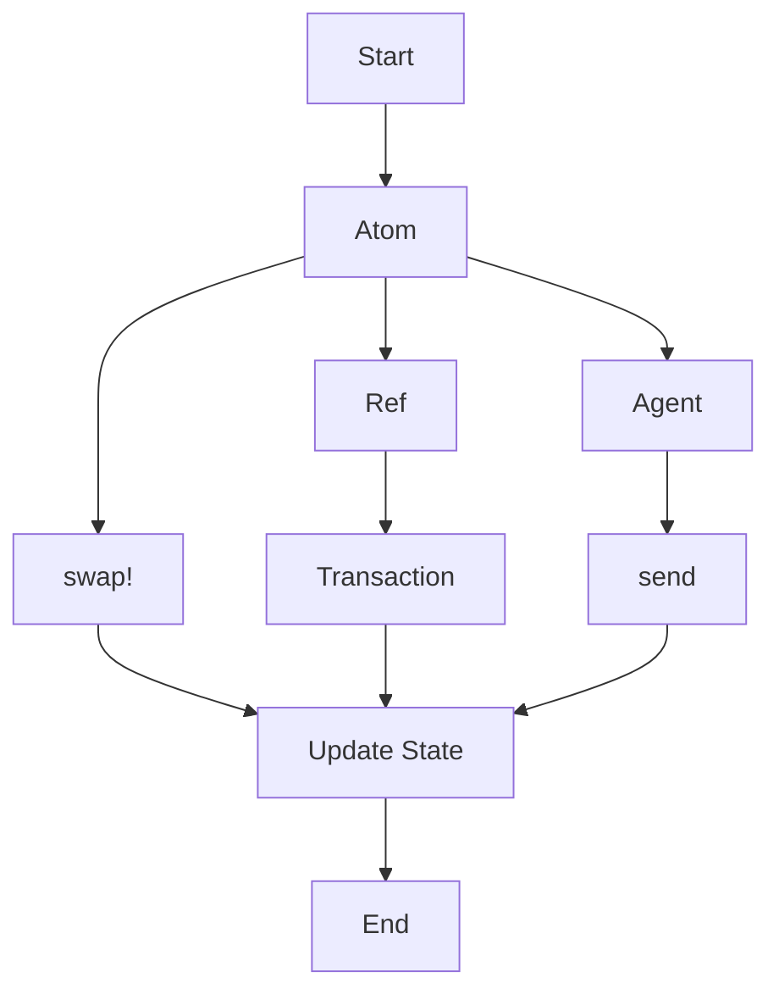

## 8.9.3 Benchmarking and Profiling Concurrency

As experienced Java developers transitioning to Clojure, understanding how to effectively benchmark and profile concurrent applications is crucial. Clojure's concurrency model, with its emphasis on immutability and functional programming, offers unique advantages and challenges. This section will guide you through the tools and techniques necessary to identify performance bottlenecks and optimize your Clojure applications.

### Understanding Concurrency in Clojure

Before diving into benchmarking and profiling, let's briefly revisit Clojure's concurrency model. Unlike Java, which relies heavily on synchronized blocks and locks, Clojure provides a set of concurrency primitives—**atoms**, **refs**, **agents**, and **vars**—that simplify state management in concurrent environments.

#### Clojure's Concurrency Primitives

- **Atoms**: Provide a way to manage shared, synchronous, independent state.
- **Refs**: Use software transactional memory (STM) to manage coordinated, synchronous state changes.
- **Agents**: Handle asynchronous state changes, suitable for tasks that can be performed independently.
- **Vars**: Allow dynamic binding of variables, useful for thread-local state.

These primitives help avoid common concurrency issues like race conditions and deadlocks, making Clojure a powerful choice for concurrent programming.

### Benchmarking Concurrency in Clojure

Benchmarking is the process of measuring the performance of your application to identify areas for improvement. In Clojure, benchmarking concurrent code requires careful consideration of both the functional and concurrent aspects of your application.

#### Tools for Benchmarking

1. **Criterium**: A popular benchmarking library in Clojure that provides accurate and reliable performance measurements.

   ```clojure
   (require '[criterium.core :as crit])

   ;; Example: Benchmarking a simple function
   (defn example-fn [x]
     (* x x))

   (crit/quick-bench (example-fn 42))
   ```

   *Comments*: The `quick-bench` function runs the provided expression multiple times to gather performance data, adjusting for JVM warm-up and garbage collection.

2. **Java Microbenchmark Harness (JMH)**: Although primarily a Java tool, JMH can be used with Clojure to perform detailed microbenchmarking.

   *Integration*: JMH can be integrated into Clojure projects using Leiningen plugins or by writing Java interop code.

#### Best Practices for Benchmarking

- **Isolate Code**: Ensure that the code being benchmarked is isolated from external factors like I/O operations.
- **Warm-Up**: Allow the JVM to warm up before collecting data to avoid skewed results.
- **Repeat Measurements**: Run benchmarks multiple times to account for variability.
- **Analyze Variability**: Look for patterns in variability to identify potential issues.

### Profiling Concurrency in Clojure

Profiling involves analyzing the runtime behavior of your application to identify performance bottlenecks. In concurrent applications, profiling helps pinpoint issues like thread contention and inefficient state management.

#### Tools for Profiling

1. **VisualVM**: A powerful tool for profiling Java applications, including Clojure programs. It provides insights into CPU usage, memory consumption, and thread activity.

   *Setup*: VisualVM can be attached to a running JVM process, allowing you to monitor and analyze your Clojure application in real-time.

2. **YourKit**: Another popular Java profiler that offers advanced features like CPU and memory profiling, thread analysis, and more.

3. **Rebel Readline**: A Clojure-specific tool that enhances the REPL experience with features like syntax highlighting and command history, useful for interactive profiling.

#### Profiling Techniques

- **Thread Analysis**: Use profilers to examine thread activity and identify contention points.
- **Memory Profiling**: Analyze memory usage to detect leaks and optimize allocation patterns.
- **CPU Profiling**: Identify hotspots in your code that consume excessive CPU resources.

### Identifying Bottlenecks

Once you've gathered benchmarking and profiling data, the next step is to identify bottlenecks in your application. Common bottlenecks in concurrent Clojure applications include:

- **Contention**: Multiple threads competing for the same resource, leading to performance degradation.
- **Inefficient State Management**: Overuse of synchronization primitives or improper use of Clojure's concurrency primitives.
- **Garbage Collection**: Excessive memory allocation leading to frequent garbage collection pauses.

### Optimizing Concurrency in Clojure

After identifying bottlenecks, you can apply various optimization techniques to improve performance.

#### Optimization Strategies

1. **Reduce Contention**: Use finer-grained locks or switch to non-blocking algorithms where possible.
2. **Optimize State Management**: Leverage Clojure's immutable data structures and concurrency primitives to manage state efficiently.
3. **Minimize Memory Allocation**: Use persistent data structures and avoid unnecessary object creation.

#### Code Example: Optimizing a Concurrent Task

Let's consider a simple example where we optimize a concurrent task using Clojure's concurrency primitives.

```clojure
(def counter (atom 0))

(defn increment-counter []
  (swap! counter inc))

;; Simulate concurrent updates
(doseq [_ (range 1000)]
  (future (increment-counter)))

;; Wait for all futures to complete
(Thread/sleep 1000)

(println "Final counter value:" @counter)
```

*Comments*: This example demonstrates the use of an atom to manage a shared counter across multiple threads. The `swap!` function ensures atomic updates, preventing race conditions.

### Try It Yourself

Experiment with the code example by:

- Increasing the number of concurrent updates and observing the impact on performance.
- Replacing the atom with a ref and using transactions to manage state changes.
- Profiling the application using VisualVM to analyze thread activity and memory usage.

### Diagrams and Visualizations

To better understand the flow of data and concurrency in Clojure, let's visualize the interaction between different concurrency primitives.



*Diagram Caption*: This flowchart illustrates the interaction between Clojure's concurrency primitives—atoms, refs, and agents—and their respective operations.

### Further Reading

For more information on benchmarking and profiling in Clojure, consider exploring the following resources:

- [Clojure Official Documentation](https://clojure.org/reference/documentation)
- [Criterium GitHub Repository](https://github.com/hugoduncan/criterium)
- [VisualVM Official Website](https://visualvm.github.io/)

### Exercises

1. **Benchmark a Function**: Use Criterium to benchmark a function of your choice and analyze the results.
2. **Profile an Application**: Profile a Clojure application using VisualVM and identify potential bottlenecks.
3. **Optimize State Management**: Refactor a piece of code to use Clojure's concurrency primitives more effectively.

### Key Takeaways

- Benchmarking and profiling are essential for optimizing concurrent Clojure applications.
- Clojure's concurrency primitives offer powerful tools for managing state in concurrent environments.
- Identifying and addressing bottlenecks can significantly improve application performance.
- Experimentation and continuous learning are key to mastering concurrency in Clojure.

Now that we've explored benchmarking and profiling concurrency in Clojure, let's apply these concepts to optimize your applications and achieve better performance.

## Quiz: Mastering Concurrency Benchmarking and Profiling in Clojure



### What is the primary purpose of benchmarking in Clojure?

- [x] To measure the performance of code and identify areas for improvement.
- [ ] To debug code and fix errors.
- [ ] To compile Clojure code into Java bytecode.
- [ ] To manage dependencies in a Clojure project.

> **Explanation:** Benchmarking is used to measure the performance of code and identify areas for improvement, particularly in concurrent applications.

### Which Clojure library is commonly used for benchmarking?

- [x] Criterium
- [ ] core.async
- [ ] clojure.test
- [ ] Leiningen

> **Explanation:** Criterium is a popular library in Clojure for accurate and reliable performance benchmarking.

### What is the role of VisualVM in profiling Clojure applications?

- [x] It provides insights into CPU usage, memory consumption, and thread activity.
- [ ] It compiles Clojure code into Java bytecode.
- [ ] It manages dependencies in a Clojure project.
- [ ] It is used for unit testing Clojure applications.

> **Explanation:** VisualVM is a profiling tool that provides insights into CPU usage, memory consumption, and thread activity in Clojure applications.

### Which Clojure concurrency primitive is used for asynchronous state changes?

- [x] Agents
- [ ] Atoms
- [ ] Refs
- [ ] Vars

> **Explanation:** Agents are used for asynchronous state changes in Clojure, suitable for tasks that can be performed independently.

### What is the purpose of the `swap!` function in Clojure?

- [x] To atomically update the state of an atom.
- [ ] To start a new thread.
- [ ] To create a new Clojure project.
- [ ] To compile Clojure code.

> **Explanation:** The `swap!` function is used to atomically update the state of an atom in Clojure.

### Which tool can be used for microbenchmarking in Java and Clojure?

- [x] Java Microbenchmark Harness (JMH)
- [ ] core.async
- [ ] clojure.test
- [ ] Leiningen

> **Explanation:** Java Microbenchmark Harness (JMH) is a tool that can be used for detailed microbenchmarking in both Java and Clojure.

### What is a common bottleneck in concurrent Clojure applications?

- [x] Contention
- [ ] Lack of dependencies
- [ ] Compilation errors
- [ ] Syntax errors

> **Explanation:** Contention, where multiple threads compete for the same resource, is a common bottleneck in concurrent Clojure applications.

### How can memory allocation be minimized in Clojure?

- [x] By using persistent data structures and avoiding unnecessary object creation.
- [ ] By using more threads.
- [ ] By increasing the heap size.
- [ ] By using dynamic typing.

> **Explanation:** Minimizing memory allocation can be achieved by using persistent data structures and avoiding unnecessary object creation in Clojure.

### What is the benefit of using Clojure's immutable data structures in concurrency?

- [x] They help avoid race conditions and deadlocks.
- [ ] They increase the speed of compilation.
- [ ] They reduce the need for unit testing.
- [ ] They simplify syntax errors.

> **Explanation:** Clojure's immutable data structures help avoid race conditions and deadlocks, making them beneficial in concurrent programming.

### True or False: Profiling is only necessary for debugging Clojure applications.

- [ ] True
- [x] False

> **Explanation:** Profiling is not only for debugging but also for analyzing runtime behavior to identify performance bottlenecks and optimize applications.


