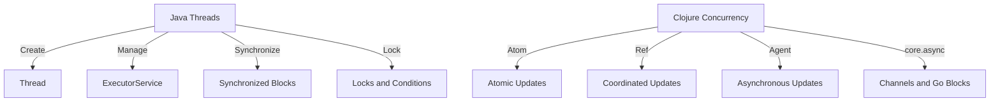

## 8.9.4 Comparing Performance with Java Threads

In this section, we will delve into the performance aspects of Clojure's concurrency mechanisms compared to Java's traditional threading models. As experienced Java developers, you are likely familiar with Java's concurrency tools such as `Thread`, `Runnable`, `ExecutorService`, and `synchronized` blocks. Clojure offers a different approach with its concurrency primitives like Atoms, Refs, Agents, and core.async channels. We'll explore how these tools compare in terms of performance, ease of use, and suitability for various scenarios.

### Understanding Java's Concurrency Model

Java's concurrency model is built around threads, which are lightweight processes that allow multiple tasks to run concurrently within a single application. Java provides several constructs to manage concurrency:

- **Threads and Runnables**: Basic units of concurrency in Java. Threads can be created by extending the `Thread` class or implementing the `Runnable` interface.
- **ExecutorService**: A higher-level API for managing thread pools and asynchronous task execution.
- **Synchronized Blocks**: Used to prevent concurrent access to shared resources, ensuring thread safety.
- **Locks and Conditions**: More flexible and powerful synchronization mechanisms than synchronized blocks.

Java's concurrency model is robust and well-suited for many applications, but it can be complex and error-prone, especially when dealing with shared mutable state.

### Clojure's Concurrency Model

Clojure, being a functional language, emphasizes immutability and provides concurrency primitives that align with this philosophy:

- **Atoms**: Provide a way to manage shared, synchronous, and independent state changes.
- **Refs and Software Transactional Memory (STM)**: Allow coordinated, synchronous updates to shared state.
- **Agents**: Facilitate asynchronous state changes, suitable for tasks that do not require immediate consistency.
- **core.async Channels**: Enable asynchronous communication and coordination between different parts of a program.

Clojure's concurrency model is designed to simplify concurrent programming by reducing the need for locks and minimizing the risk of race conditions.

### Performance Comparison

#### Thread Creation and Management

**Java Threads**: Creating and managing threads in Java can be resource-intensive. Each thread consumes system resources, and excessive thread creation can lead to performance degradation.

**Clojure Agents and core.async**: Clojure's Agents and core.async channels provide a more lightweight alternative to Java threads. Agents are backed by a thread pool, reducing the overhead of thread creation. core.async channels use lightweight processes called "go blocks" that are more efficient than traditional threads.

```clojure
;; Example of using core.async channels in Clojure
(require '[clojure.core.async :as async])

(defn process-data [data]
  (println "Processing" data))

(let [ch (async/chan)]
  (async/go
    (loop []
      (when-let [data (async/<! ch)]
        (process-data data)
        (recur))))
  (async/>!! ch "Sample Data"))
```

In this example, we use a core.async channel to process data asynchronously. The `go` block is a lightweight alternative to creating a new thread for each task.

#### Synchronization and State Management

**Java Synchronized Blocks**: Java's synchronized blocks and locks are powerful but can lead to contention and deadlocks if not used carefully.

**Clojure Atoms and Refs**: Clojure's Atoms and Refs provide a more straightforward approach to managing shared state. Atoms offer atomic updates without locks, while Refs use STM to manage coordinated state changes.

```clojure
;; Example of using Atoms in Clojure
(def counter (atom 0))

(defn increment-counter []
  (swap! counter inc))

(increment-counter)
(println @counter) ;; Output: 1
```

In this example, we use an Atom to manage a counter. The `swap!` function ensures atomic updates without the need for explicit locks.

#### Asynchronous Processing

**Java ExecutorService**: Java's `ExecutorService` provides a robust framework for managing asynchronous tasks, but it requires careful management of thread pools and task submission.

**Clojure Agents**: Clojure's Agents offer a simpler model for asynchronous processing. Agents automatically manage their thread pool, allowing developers to focus on task logic rather than thread management.

```clojure
;; Example of using Agents in Clojure
(def agent-state (agent 0))

(defn update-state [state]
  (println "Updating state to" (inc state))
  (inc state))

(send agent-state update-state)
```

In this example, we use an Agent to manage state updates asynchronously. The `send` function schedules the update without blocking the main thread.

### Scenarios and Use Cases

#### High Throughput Applications

For applications requiring high throughput, such as web servers or data processing pipelines, Clojure's core.async channels and Agents can offer significant performance advantages over Java threads. The lightweight nature of go blocks and the automatic management of thread pools by Agents reduce overhead and improve scalability.

#### Coordinated State Changes

In scenarios where multiple state changes need to be coordinated, Clojure's Refs and STM provide a more elegant solution than Java's locks and conditions. STM ensures consistency without the risk of deadlocks, making it ideal for complex state management tasks.

#### Simple Concurrent Tasks

For simple concurrent tasks, such as updating a shared counter or managing a cache, Clojure's Atoms offer a straightforward and efficient alternative to Java's synchronized blocks. The atomic nature of Atoms eliminates the need for explicit synchronization, reducing complexity and improving performance.

### Potential Overheads

While Clojure's concurrency model offers many advantages, it is not without potential overheads:

- **STM Overhead**: The transactional nature of STM can introduce overhead compared to simple lock-based synchronization, especially in scenarios with low contention.
- **Agent Latency**: Agents introduce a slight delay due to their asynchronous nature, which may not be suitable for tasks requiring immediate consistency.
- **core.async Complexity**: While core.async channels are powerful, they can introduce complexity in program design, especially for developers unfamiliar with the CSP (Communicating Sequential Processes) model.

### Try It Yourself

To better understand the performance differences between Clojure's concurrency mechanisms and Java threads, try modifying the provided code examples:

- Experiment with different data processing tasks using core.async channels and measure the impact on performance.
- Implement a simple counter using both Java's synchronized blocks and Clojure's Atoms, and compare the code complexity and execution time.
- Create a coordinated state update scenario using both Java locks and Clojure Refs, and evaluate the ease of implementation and potential for deadlocks.

### Diagrams and Visualizations

To further illustrate the differences between Clojure's concurrency model and Java threads, let's use a few diagrams.



**Diagram 1**: This diagram compares the concurrency models of Java and Clojure, highlighting the different tools and approaches each language offers.

### Summary and Key Takeaways

- **Clojure's concurrency model** emphasizes immutability and provides lightweight, efficient alternatives to Java's traditional threading model.
- **Atoms, Refs, and Agents** offer simpler and safer ways to manage shared state, reducing the risk of race conditions and deadlocks.
- **core.async channels** enable efficient asynchronous processing, suitable for high-throughput applications.
- While Clojure's model introduces some overhead, particularly with STM, it often results in cleaner, more maintainable code.

By understanding these differences, you can make informed decisions about when to use Clojure's concurrency tools and when Java's traditional threading model may be more appropriate.

### Exercises

1. **Implement a Shared Counter**: Create a shared counter using both Java's synchronized blocks and Clojure's Atoms. Compare the complexity and performance of each approach.

2. **Data Processing Pipeline**: Use core.async channels to implement a simple data processing pipeline. Measure the throughput and compare it to a similar implementation using Java threads.

3. **Coordinated State Updates**: Implement a scenario requiring coordinated state updates using both Java locks and Clojure Refs. Evaluate the ease of implementation and potential for deadlocks.

4. **Asynchronous Task Management**: Use Clojure's Agents to manage a set of asynchronous tasks. Compare the ease of use and performance to Java's ExecutorService.

5. **STM vs Locks**: Create a scenario with high contention and compare the performance of Clojure's STM with Java's lock-based synchronization.

By completing these exercises, you'll gain hands-on experience with Clojure's concurrency model and its performance characteristics compared to Java threads.

### Further Reading

For more information on Clojure's concurrency model and performance considerations, check out these resources:

- [Clojure Official Documentation](https://clojure.org/reference/concurrency)
- [ClojureDocs](https://clojuredocs.org/)
- [Java Concurrency in Practice](https://jcip.net/)
- [Clojure Programming by Chas Emerick, Brian Carper, and Christophe Grand](https://www.oreilly.com/library/view/clojure-programming/9781449310387/)

---

## Quiz: Understanding Clojure Concurrency vs Java Threads



### Which of the following is a concurrency primitive in Clojure?

- [x] Atom
- [ ] Thread
- [ ] Runnable
- [ ] ExecutorService

> **Explanation:** Atoms are a concurrency primitive in Clojure, providing a way to manage shared, synchronous, and independent state changes.


### What is a key advantage of using Clojure's Agents over Java's ExecutorService?

- [x] Automatic thread pool management
- [ ] Higher throughput
- [ ] Lower latency
- [ ] Simpler syntax

> **Explanation:** Clojure's Agents automatically manage their thread pool, allowing developers to focus on task logic rather than thread management.


### Which Clojure concurrency primitive is best suited for coordinated state changes?

- [x] Refs
- [ ] Atoms
- [ ] Agents
- [ ] core.async channels

> **Explanation:** Refs and Software Transactional Memory (STM) are best suited for coordinated state changes, ensuring consistency without the risk of deadlocks.


### What is a potential overhead of using Clojure's STM compared to Java's locks?

- [x] Transactional overhead
- [ ] Increased complexity
- [ ] Higher latency
- [ ] Reduced throughput

> **Explanation:** The transactional nature of STM can introduce overhead compared to simple lock-based synchronization, especially in scenarios with low contention.


### Which of the following is NOT a feature of Clojure's core.async channels?

- [ ] Asynchronous communication
- [ ] Lightweight processes
- [x] Synchronous updates
- [ ] Go blocks

> **Explanation:** core.async channels are designed for asynchronous communication and use lightweight processes called "go blocks".


### In which scenario might Java's traditional threading model be more appropriate than Clojure's concurrency model?

- [x] Tasks requiring immediate consistency
- [ ] High throughput applications
- [ ] Coordinated state changes
- [ ] Simple concurrent tasks

> **Explanation:** Java's traditional threading model might be more appropriate for tasks requiring immediate consistency, as Clojure's Agents introduce a slight delay due to their asynchronous nature.


### What is a benefit of using Clojure's Atoms over Java's synchronized blocks?

- [x] Atomic updates without locks
- [ ] Higher throughput
- [ ] Lower latency
- [ ] Simpler syntax

> **Explanation:** Atoms offer atomic updates without the need for explicit locks, reducing complexity and improving performance.


### Which Clojure concurrency primitive is designed for asynchronous state changes?

- [ ] Atoms
- [ ] Refs
- [x] Agents
- [ ] core.async channels

> **Explanation:** Agents facilitate asynchronous state changes, suitable for tasks that do not require immediate consistency.


### What is a potential complexity introduced by core.async channels?

- [x] CSP model complexity
- [ ] Higher latency
- [ ] Reduced throughput
- [ ] Increased resource usage

> **Explanation:** core.async channels can introduce complexity in program design, especially for developers unfamiliar with the CSP (Communicating Sequential Processes) model.


### True or False: Clojure's concurrency model eliminates the need for locks entirely.

- [ ] True
- [x] False

> **Explanation:** While Clojure's concurrency model reduces the need for locks, it does not eliminate them entirely. Some scenarios may still require explicit synchronization.


