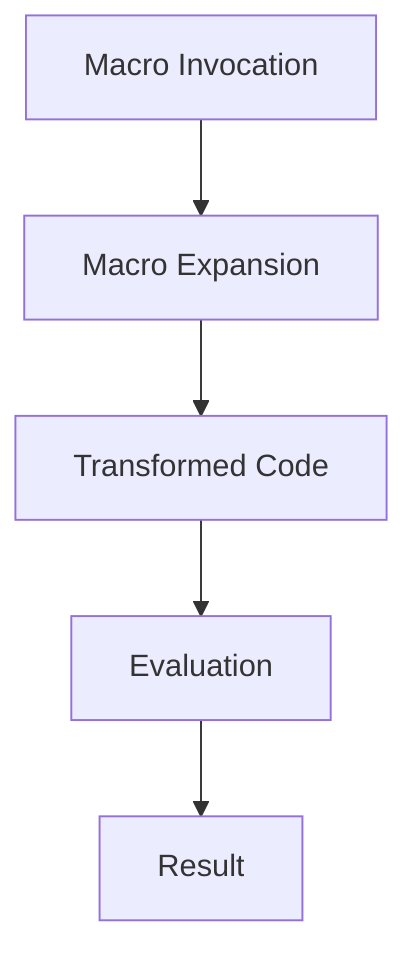

## 9.1.1 Understanding Macros in Lisp

### Introduction

In the realm of Lisp languages, macros stand out as one of the most powerful and distinctive features. For Java developers transitioning to Clojure, understanding macros is crucial to unlocking the full potential of Clojure's metaprogramming capabilities. Macros allow developers to manipulate code as data, transforming and generating new code during the compilation phase. This capability is rooted in Lisp's unique property known as **homoiconicity**, where code and data share the same structure.

### What are Macros?

Macros in Lisp, including Clojure, are constructs that enable you to extend the language by defining new syntactic constructs in terms of existing ones. Unlike functions, which operate on values, macros operate on the syntactic structure of code itself. This means that macros receive unevaluated code as input, transform it, and return new code to be evaluated.

#### Code as Data: The Homoiconicity of Lisp

The concept of **homoiconicity** is central to understanding macros. In Lisp, code is represented as data structures that the language can manipulate. This allows macros to inspect, modify, and generate code dynamically. Here's a simple example to illustrate this concept:

```clojure
;; A simple list in Clojure
(def my-list '(1 2 3))

;; A simple expression in Clojure
(def my-expression '(+ 1 2 3))

;; Both are lists, demonstrating code as data
```

In the example above, both `my-list` and `my-expression` are lists. The expression `(+ 1 2 3)` is not immediately evaluated; instead, it is treated as data that can be manipulated by macros.

### How Macros Work

Macros in Clojure are defined using the `defmacro` keyword. When a macro is invoked, it receives its arguments as unevaluated code, allowing it to perform transformations before the code is evaluated. This process is known as **macro expansion**.

#### Defining a Simple Macro

Let's define a simple macro to understand how it works:

```clojure
(defmacro my-when [condition & body]
  `(if ~condition
     (do ~@body)))

;; Usage of the macro
(my-when true
  (println "This will print because the condition is true."))
```

**Explanation:**

- **`defmacro`**: This keyword is used to define a macro.
- **`my-when`**: The name of the macro.
- **`condition` and `body`**: Parameters of the macro. `condition` is a single expression, while `body` is a sequence of expressions.
- **Backquote (`) and Unquote (~)**: The backquote is used to create a template for the code that the macro will generate. The unquote (`~`) is used to insert the value of a variable into the template.
- **Splicing Unquote (`~@`)**: Used to insert a sequence of expressions into the template.

The `my-when` macro transforms the code into an `if` expression with a `do` block, which is then evaluated.

### Comparing Macros and Functions

While both macros and functions allow code reuse, they serve different purposes. Functions operate on evaluated arguments, while macros operate on unevaluated code. This distinction allows macros to introduce new syntactic constructs and control structures that are not possible with functions alone.

#### Java Comparison

In Java, similar behavior can be achieved using design patterns or code generation tools, but these approaches lack the seamless integration and flexibility of Lisp macros. For example, Java's annotations and reflection can modify behavior at runtime, but they do not provide the same compile-time code transformation capabilities as macros.

### Advanced Macro Techniques

Macros can be used to implement complex language features and domain-specific languages (DSLs). Let's explore some advanced techniques:

#### Quoting and Unquoting

Quoting and unquoting are essential for macro writing. They allow you to construct code templates and insert dynamic content.

```clojure
(defmacro unless [condition & body]
  `(if (not ~condition)
     (do ~@body)))

;; Usage of the unless macro
(unless false
  (println "This will print because the condition is false."))
```

In this example, the `unless` macro inverts the condition using `not`, demonstrating how macros can alter control flow.

#### Macro Expansion

Understanding macro expansion is crucial for debugging and developing macros. Clojure provides tools like `macroexpand` and `macroexpand-1` to inspect the expanded code.

```clojure
;; Inspecting macro expansion
(macroexpand '(unless false (println "Hello, World!")))
```

This will show the transformed code, helping you verify that your macro behaves as expected.

### Practical Applications of Macros

Macros are powerful tools for creating concise and expressive code. Here are some practical applications:

- **Creating DSLs**: Macros can be used to create domain-specific languages tailored to specific problem domains.
- **Code Generation**: Automate repetitive code patterns, reducing boilerplate and improving maintainability.
- **Custom Control Structures**: Implement new control structures that fit your application's needs.

### Challenges and Best Practices

While macros are powerful, they come with challenges:

- **Complexity**: Macros can make code harder to understand and debug. Use them judiciously and document their behavior.
- **Hygiene**: Ensure that macros do not unintentionally capture variables from the surrounding context. Use techniques like gensym to generate unique symbols.

#### Best Practices

- **Keep Macros Simple**: Start with simple transformations and gradually build complexity.
- **Test Macro Expansions**: Use `macroexpand` to verify the generated code.
- **Document Macros**: Clearly explain the purpose and behavior of each macro.

### Try It Yourself

Experiment with the macros we've discussed. Try modifying the `unless` macro to include an `else` clause, or create a macro that logs the execution time of a block of code.

### Diagrams and Visualizations

To better understand the flow of macro expansion, let's visualize the process:



**Diagram Explanation**: This flowchart illustrates the macro expansion process, from invocation to evaluation and result.

### Further Reading

For more information on macros and metaprogramming in Clojure, consider exploring the following resources:

- [Official Clojure Documentation on Macros](https://clojure.org/reference/macros)
- [ClojureDocs: Macro Examples](https://clojuredocs.org/)

### Exercises

1. **Create a Macro**: Write a macro that repeats a block of code a specified number of times.
2. **Macro with Parameters**: Modify the `my-when` macro to accept an `else` clause.
3. **Debugging Macros**: Use `macroexpand` to debug a macro that generates incorrect code.

### Key Takeaways

- **Macros operate on code as data**, allowing for powerful code transformations.
- **Macros differ from functions** in that they manipulate unevaluated code.
- **Use macros judiciously** to avoid complexity and maintain code readability.
- **Experiment with macros** to gain a deeper understanding of their capabilities and limitations.

By mastering macros, you'll unlock new possibilities in your Clojure projects, enabling you to write more expressive and efficient code. Now that we've explored the fundamentals of macros, let's delve into more advanced metaprogramming techniques in the next section.

## Quiz: Understanding Macros in Lisp



### What is the primary purpose of macros in Lisp languages like Clojure?

- [x] To transform and generate code during compilation
- [ ] To execute code at runtime
- [ ] To optimize code performance
- [ ] To manage memory allocation

> **Explanation:** Macros in Lisp are used to transform and generate code during the compilation phase, allowing for powerful metaprogramming capabilities.

### How do macros differ from functions in Clojure?

- [x] Macros operate on unevaluated code, while functions operate on evaluated arguments
- [ ] Macros are faster than functions
- [ ] Functions can modify code structure, while macros cannot
- [ ] Macros are used for input/output operations

> **Explanation:** Macros operate on unevaluated code, allowing them to transform code before it is evaluated, whereas functions operate on already evaluated arguments.

### What is homoiconicity in the context of Lisp languages?

- [x] The property where code and data share the same structure
- [ ] The ability to execute code in parallel
- [ ] The use of macros for code transformation
- [ ] The optimization of memory usage

> **Explanation:** Homoiconicity is the property of Lisp languages where code and data share the same structure, enabling powerful metaprogramming capabilities.

### Which keyword is used to define a macro in Clojure?

- [x] `defmacro`
- [ ] `def`
- [ ] `fn`
- [ ] `let`

> **Explanation:** The `defmacro` keyword is used to define a macro in Clojure, allowing for code transformation and generation.

### What is the purpose of the `macroexpand` function in Clojure?

- [x] To inspect the expanded code generated by a macro
- [ ] To execute a macro
- [ ] To optimize macro performance
- [ ] To convert macros into functions

> **Explanation:** The `macroexpand` function is used to inspect the expanded code generated by a macro, helping developers understand and debug macro behavior.

### What is a common challenge when using macros in Clojure?

- [x] Ensuring code readability and avoiding complexity
- [ ] Improving runtime performance
- [ ] Managing memory allocation
- [ ] Handling input/output operations

> **Explanation:** A common challenge with macros is ensuring code readability and avoiding complexity, as macros can make code harder to understand and debug.

### What technique can be used to avoid variable capture in macros?

- [x] Using `gensym` to generate unique symbols
- [ ] Using `let` bindings
- [ ] Using `def` for variable definitions
- [ ] Using `fn` for function definitions

> **Explanation:** Using `gensym` to generate unique symbols helps avoid variable capture in macros, ensuring that variables do not unintentionally interfere with each other.

### What is a practical application of macros in Clojure?

- [x] Creating domain-specific languages (DSLs)
- [ ] Managing memory allocation
- [ ] Performing input/output operations
- [ ] Optimizing runtime performance

> **Explanation:** Macros are often used to create domain-specific languages (DSLs), allowing developers to define custom syntactic constructs for specific problem domains.

### How can macros improve code maintainability?

- [x] By reducing boilerplate and automating repetitive code patterns
- [ ] By optimizing runtime performance
- [ ] By managing memory allocation
- [ ] By handling input/output operations

> **Explanation:** Macros can improve code maintainability by reducing boilerplate and automating repetitive code patterns, making code more concise and easier to manage.

### True or False: Macros in Clojure can only be used for code optimization.

- [ ] True
- [x] False

> **Explanation:** False. Macros in Clojure are not limited to code optimization; they are primarily used for code transformation and generation, enabling powerful metaprogramming capabilities.


