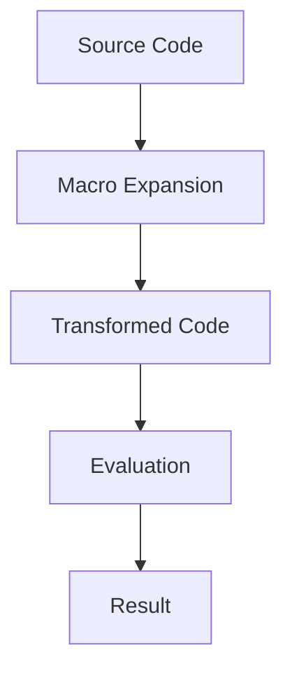

## 9.1.2 The Power of Macros

In the world of programming, the ability to extend a language's syntax and semantics to better fit the problem domain is a powerful tool. Clojure, a modern Lisp dialect, offers this capability through macros, which allow developers to manipulate code as data, creating new syntactic constructs and embedding domain-specific languages (DSLs). For Java developers transitioning to Clojure, understanding macros can unlock a new level of expressiveness and efficiency in your code.

### Understanding Macros: A Brief Overview

Macros in Clojure are a form of metaprogramming that allow you to write code that writes code. This is achieved by manipulating the abstract syntax tree (AST) of your program. Unlike functions, which operate on values, macros operate on code itself, transforming it before it is evaluated.

#### Key Differences Between Macros and Functions

- **Evaluation Timing**: Functions evaluate their arguments before execution, while macros receive their arguments as unevaluated code, allowing them to transform the code before it runs.
- **Code Generation**: Macros can generate and return new code structures, enabling the creation of new language constructs.
- **Syntax Extension**: Macros can introduce new syntactic forms, effectively extending the language.

### The Expressive Power of Macros

The real power of macros lies in their ability to abstract patterns and reduce boilerplate code, create new control structures, and embed DSLs. Let's explore these capabilities in detail.

#### Reducing Boilerplate Code

In many programming languages, repetitive code patterns can lead to increased maintenance costs and potential errors. Macros can abstract these patterns, reducing redundancy and improving code maintainability.

**Example: Logging Macro**

Consider a scenario where you need to log the entry and exit of functions. In Java, this might involve repetitive logging statements:

```java
public void someMethod() {
    System.out.println("Entering someMethod");
    // method logic
    System.out.println("Exiting someMethod");
}
```

In Clojure, a macro can encapsulate this pattern:

```clojure
(defmacro with-logging [name & body]
  `(do
     (println "Entering" ~name)
     ~@body
     (println "Exiting" ~name)))

;; Usage
(with-logging "someMethod"
  ;; method logic
  (println "Executing someMethod logic"))
```

**Explanation**: The `with-logging` macro takes a method name and body, wrapping the body with logging statements. The `~` and `~@` are used for unquoting and splicing, respectively, allowing the macro to inject the code dynamically.

#### Creating New Control Structures

Macros can introduce new control structures that are not natively supported by the language, providing more expressive power.

**Example: Unless Macro**

Clojure does not have an `unless` construct like some other languages. However, we can create one using a macro:

```clojure
(defmacro unless [condition & body]
  `(if (not ~condition)
     (do ~@body)))

;; Usage
(unless false
  (println "This will print because the condition is false"))
```

**Explanation**: The `unless` macro inverts the condition and executes the body if the condition is false, effectively creating a new control structure.

#### Embedding Domain-Specific Languages (DSLs)

Macros can be used to create DSLs, which are specialized mini-languages tailored to specific problem domains. This can make code more readable and expressive.

**Example: SQL-like DSL**

Imagine creating a DSL for building SQL queries:

```clojure
(defmacro select [fields table & conditions]
  `(str "SELECT " ~fields " FROM " ~table
        (when ~conditions
          (str " WHERE " (clojure.string/join " AND " ~conditions)))))

;; Usage
(select "name, age" "users" ["age > 30" "active = true"])
;; => "SELECT name, age FROM users WHERE age > 30 AND active = true"
```

**Explanation**: The `select` macro constructs a SQL query string, demonstrating how macros can be used to create a DSL that simplifies complex operations.

### Macros vs. Java's Reflection API

Java developers might compare Clojure macros to Java's reflection capabilities. While both allow for dynamic behavior, they serve different purposes:

- **Reflection**: Allows inspection and modification of classes and objects at runtime, but can be verbose and error-prone.
- **Macros**: Operate at compile-time, transforming code before execution, leading to more concise and efficient code.

### Best Practices for Writing Macros

While macros are powerful, they should be used judiciously. Here are some best practices:

- **Keep Macros Simple**: Complex macros can be difficult to debug and understand. Aim for simplicity and clarity.
- **Use Functions Where Possible**: If a task can be accomplished with a function, prefer that over a macro.
- **Avoid Overuse**: Overusing macros can lead to code that is hard to read and maintain. Use them only when they provide clear benefits.

### Try It Yourself

Experiment with the examples provided. Try modifying the `with-logging` macro to include a timestamp in the log messages, or extend the `select` macro to support additional SQL clauses like `ORDER BY`.

### Diagrams and Visualizations

Below is a diagram illustrating the flow of data through a macro transformation process:



**Diagram Explanation**: This flowchart represents how source code is transformed by a macro into new code, which is then evaluated to produce a result.

### Further Reading

For more in-depth information on macros and their capabilities, consider exploring the following resources:

- [Official Clojure Documentation on Macros](https://clojure.org/reference/macros)
- [ClojureDocs: Macros](https://clojuredocs.org/quickref#macros)
- [Clojure Programming by Chas Emerick, Brian Carper, and Christophe Grand](https://www.oreilly.com/library/view/clojure-programming/9781449310387/)

### Exercises

1. **Create a Macro**: Write a macro that repeats a block of code a specified number of times.
2. **Extend a DSL**: Modify the SQL-like DSL to support `JOIN` operations.
3. **Refactor Java Code**: Identify a repetitive pattern in your Java codebase and refactor it using a Clojure macro.

### Key Takeaways

- **Macros Extend Language**: They allow you to create new syntactic constructs and DSLs, enhancing expressiveness.
- **Reduce Boilerplate**: Macros can abstract repetitive patterns, reducing code duplication.
- **Use Judiciously**: While powerful, macros should be used carefully to maintain code readability and maintainability.

By understanding and leveraging the power of macros, you can write more expressive, concise, and maintainable Clojure code. Embrace this capability to transform your approach to problem-solving in Clojure.

## Quiz Time!



### What is a primary advantage of using macros in Clojure?

- [x] They allow for the creation of new syntactic constructs.
- [ ] They improve runtime performance.
- [ ] They simplify memory management.
- [ ] They provide direct access to hardware.

> **Explanation:** Macros allow developers to create new syntactic constructs, extending the language's capabilities.

### How do macros differ from functions in Clojure?

- [x] Macros operate on code before evaluation.
- [ ] Macros are faster than functions.
- [ ] Macros are evaluated at runtime.
- [ ] Macros can only be used for logging.

> **Explanation:** Macros operate on code before it is evaluated, allowing them to transform the code structure.

### What is a potential risk of overusing macros?

- [x] Code becomes difficult to read and maintain.
- [ ] Code execution becomes slower.
- [ ] It increases memory usage.
- [ ] It limits the use of functions.

> **Explanation:** Overusing macros can lead to code that is hard to read and maintain due to increased complexity.

### Which of the following is NOT a use case for macros?

- [ ] Reducing boilerplate code
- [ ] Creating new control structures
- [x] Managing memory allocation
- [ ] Embedding domain-specific languages

> **Explanation:** Macros are not used for managing memory allocation; they are used for code transformation.

### What is the role of `~` in a macro definition?

- [x] It is used for unquoting expressions.
- [ ] It comments out code.
- [ ] It defines a function.
- [ ] It initializes a variable.

> **Explanation:** The `~` symbol is used for unquoting expressions within a macro, allowing for code injection.

### How can macros help in creating DSLs?

- [x] By allowing the creation of specialized syntax for specific domains.
- [ ] By improving the performance of the language.
- [ ] By simplifying error handling.
- [ ] By managing concurrency.

> **Explanation:** Macros can create specialized syntax, making it easier to express domain-specific logic.

### What is a key difference between Clojure macros and Java's reflection?

- [x] Macros operate at compile-time, while reflection operates at runtime.
- [ ] Macros are faster than reflection.
- [ ] Macros require more memory than reflection.
- [ ] Macros are easier to debug than reflection.

> **Explanation:** Macros operate at compile-time, transforming code before execution, unlike Java's reflection, which operates at runtime.

### Which symbol is used for splicing in a macro?

- [x] `~@`
- [ ] `@`
- [ ] `#`
- [ ] `&`

> **Explanation:** The `~@` symbol is used for splicing lists within a macro, allowing for dynamic code generation.

### What is a best practice when writing macros?

- [x] Keep them simple and clear.
- [ ] Use them for all repetitive code.
- [ ] Avoid using functions.
- [ ] Always use them for performance optimization.

> **Explanation:** Keeping macros simple and clear ensures they are maintainable and understandable.

### True or False: Macros can be used to directly manipulate memory in Clojure.

- [ ] True
- [x] False

> **Explanation:** Macros are used for code transformation, not for direct memory manipulation.


