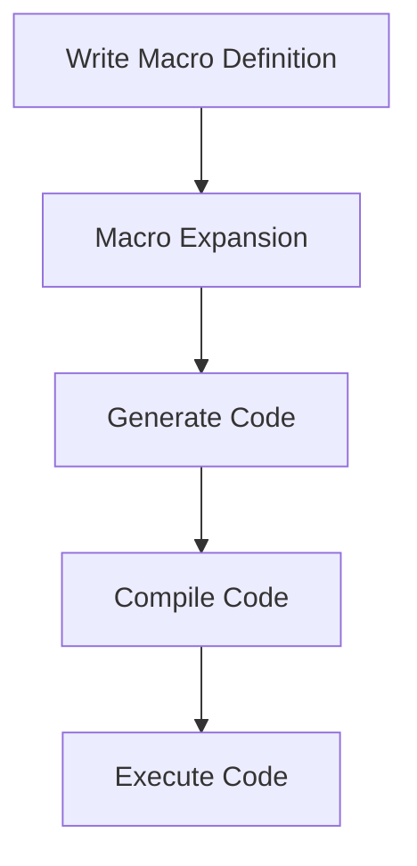

## 9.1.3 When to Consider Using Macros

As experienced Java developers transitioning to Clojure, understanding when and how to use macros can significantly enhance your ability to write expressive and efficient code. Macros in Clojure allow you to manipulate code as data, providing powerful metaprogramming capabilities that can simplify complex patterns and enable code transformations that are not possible with functions alone. However, with great power comes great responsibility; macros can introduce complexity and obscure code if not used judiciously. In this section, we will explore scenarios where macros are beneficial, compare them with Java's capabilities, and provide guidance on best practices for their use.

### Understanding Macros in Clojure

Before diving into when to use macros, let's briefly revisit what macros are. In Clojure, a macro is a construct that allows you to generate and transform code at compile time. Unlike functions, which operate on values, macros operate on the code itself, enabling you to create new syntactic constructs and control structures.

#### Key Characteristics of Macros

- **Code as Data**: Macros leverage Clojure's homoiconicity, where code is represented as data structures (lists, vectors, maps). This allows macros to manipulate code before it is evaluated.
- **Compile-Time Execution**: Macros are expanded at compile time, meaning they can generate code that is then compiled and executed. This can lead to performance optimizations by eliminating runtime overhead.
- **Syntax Extension**: Macros can introduce new syntax or control structures, making code more expressive and concise.

### When to Use Macros

Macros are not a tool for everyday use but are invaluable in specific scenarios. Here are some situations where macros can be particularly beneficial:

#### 1. **Eliminating Boilerplate Code**

One of the most common uses of macros is to eliminate repetitive boilerplate code. If you find yourself writing the same pattern repeatedly, a macro can encapsulate this pattern, reducing duplication and potential errors.

**Example: Logging**

Consider a scenario where you need to log the entry and exit of multiple functions. In Java, you might use a logging framework and manually add logging statements to each method. In Clojure, a macro can automate this process:

```clojure
(defmacro with-logging [fn-name & body]
  `(do
     (println "Entering" '~fn-name)
     (let [result# (do ~@body)]
       (println "Exiting" '~fn-name)
       result#)))

;; Usage
(with-logging my-function
  (println "Function body")
  (+ 1 2))
```

In this example, the `with-logging` macro wraps the function body with logging statements, reducing the need for manual logging.

#### 2. **Creating Domain-Specific Languages (DSLs)**

Macros are ideal for creating DSLs, which are specialized mini-languages tailored to a specific problem domain. DSLs can make code more readable and expressive by allowing you to write code that closely resembles the problem domain.

**Example: Testing DSL**

Imagine a testing framework where you want to define tests in a more natural language. A macro can help create a DSL for this purpose:

```clojure
(defmacro deftest [name & body]
  `(println "Running test:" '~name)
  (try
    ~@body
    (println "Test passed:" '~name)
    (catch Exception e#
      (println "Test failed:" '~name "with error:" (.getMessage e#)))))

;; Usage
(deftest my-test
  (assert (= 4 (+ 2 2))))
```

This macro simplifies the process of defining tests, making the code more intuitive and aligned with the testing domain.

#### 3. **Code Generation and Transformation**

Macros can generate and transform code, enabling optimizations and customizations that are difficult to achieve with functions alone. This is particularly useful when you need to adapt code based on compile-time conditions.

**Example: Conditional Compilation**

In scenarios where certain code should only be included under specific conditions, macros can help manage these variations:

```clojure
(defmacro when-debug [debug & body]
  (when debug
    `(do ~@body)))

;; Usage
(when-debug true
  (println "Debugging is enabled"))
```

This macro conditionally includes code based on the `debug` flag, allowing for flexible code generation.

#### 4. **Implementing New Control Structures**

Macros can introduce new control structures that are not natively supported by the language. This can lead to more expressive and concise code.

**Example: Custom Looping Constructs**

Suppose you want a custom looping construct that iterates over a collection and applies a function to each element. A macro can define this new control structure:

```clojure
(defmacro my-for [bindings & body]
  `(doseq ~bindings
     ~@body))

;; Usage
(my-for [x [1 2 3]]
  (println x))
```

This macro creates a custom looping construct similar to `doseq`, demonstrating how macros can extend the language's capabilities.

### Caution: The Complexity of Macros

While macros offer powerful capabilities, they also introduce complexity and potential pitfalls:

- **Readability**: Macros can obscure the flow of code, making it harder to understand and maintain. It's essential to document macros thoroughly and use them judiciously.
- **Debugging**: Debugging macro-generated code can be challenging, as errors may occur during macro expansion rather than execution.
- **Overuse**: Overusing macros can lead to code that is difficult to reason about and maintain. Always consider whether a function or higher-order function could achieve the same result before resorting to macros.

### Comparing Macros with Java

In Java, similar functionality is often achieved through design patterns, reflection, or code generation tools. However, these approaches can be more verbose and less flexible than Clojure's macros.

- **Design Patterns**: Java relies heavily on design patterns to achieve code reuse and flexibility. While effective, these patterns can introduce boilerplate code that macros can eliminate.
- **Reflection**: Java's reflection API allows for dynamic code manipulation but can be cumbersome and less performant than macros.
- **Code Generation**: Tools like Lombok provide compile-time code generation in Java, similar to macros, but require additional dependencies and configuration.

### Best Practices for Using Macros

To effectively leverage macros in your Clojure projects, consider the following best practices:

- **Use Macros Sparingly**: Only use macros when necessary, and prefer functions or higher-order functions when possible.
- **Document Thoroughly**: Provide clear documentation and examples for each macro to aid understanding and maintenance.
- **Test Extensively**: Ensure macros are well-tested, as errors can be subtle and difficult to diagnose.
- **Encapsulate Complexity**: Use macros to encapsulate complex logic, but avoid introducing unnecessary complexity into the macro itself.

### Try It Yourself: Experimenting with Macros

To deepen your understanding of macros, try modifying the examples provided:

- **Modify the `with-logging` macro** to include timestamps in the log messages.
- **Create a new DSL** for a simple task, such as defining configuration settings or building HTML templates.
- **Experiment with conditional compilation** by adding more complex conditions to the `when-debug` macro.

### Visualizing Macro Usage

To better understand how macros transform code, let's visualize the process using a flowchart:



**Diagram Description**: This flowchart illustrates the process of using macros in Clojure, from writing the macro definition to executing the generated code.

### Further Reading

For more information on macros and metaprogramming in Clojure, consider exploring the following resources:

- [Official Clojure Documentation on Macros](https://clojure.org/reference/macros)
- [ClojureDocs: Macros](https://clojuredocs.org/clojure.core/defmacro)
- [Clojure Programming by Chas Emerick, Brian Carper, and Christophe Grand](https://www.oreilly.com/library/view/clojure-programming/9781449310387/)

### Exercises

1. **Create a Macro**: Write a macro that simplifies error handling by wrapping a block of code with try-catch logic.
2. **Refactor Code**: Identify a repetitive pattern in your existing Clojure code and refactor it using a macro.
3. **Build a DSL**: Design a simple DSL for a specific domain, such as task scheduling or data validation.

### Key Takeaways

- Macros in Clojure provide powerful metaprogramming capabilities, enabling code transformation and syntax extension.
- Use macros to eliminate boilerplate code, create DSLs, and implement new control structures.
- Exercise caution with macros, as they can introduce complexity and obscure code.
- Compare macros with Java's design patterns, reflection, and code generation to appreciate their flexibility and expressiveness.

By understanding when and how to use macros, you can harness their power to write more expressive and efficient Clojure code, enhancing your ability to tackle complex programming challenges.

## Quiz: Mastering Macros in Clojure



### When should you consider using macros in Clojure?

- [x] To eliminate repetitive boilerplate code
- [ ] To perform simple arithmetic operations
- [x] To create domain-specific languages (DSLs)
- [ ] To handle basic string manipulations

> **Explanation:** Macros are best used for eliminating repetitive patterns and creating DSLs, not for simple operations that functions can handle.

### What is a key characteristic of macros in Clojure?

- [x] They operate on code as data
- [ ] They execute at runtime
- [ ] They are used for variable declarations
- [ ] They are limited to arithmetic operations

> **Explanation:** Macros operate on code as data and are expanded at compile time, allowing for code transformation.

### How do macros differ from functions in Clojure?

- [x] Macros transform code at compile time
- [ ] Macros execute faster than functions
- [ ] Macros are used for arithmetic operations
- [ ] Macros are a type of function

> **Explanation:** Macros transform code at compile time, unlike functions which operate on values at runtime.

### What is a potential downside of using macros?

- [x] They can obscure code readability
- [ ] They are slower than functions
- [ ] They cannot be tested
- [ ] They are only available in Clojure

> **Explanation:** Macros can make code harder to read and maintain, which is a potential downside.

### Which of the following is a valid use case for macros?

- [x] Implementing new control structures
- [ ] Performing basic arithmetic
- [x] Code generation and transformation
- [ ] Declaring variables

> **Explanation:** Macros are suitable for implementing control structures and code transformation, not for basic operations.

### How can macros help in creating DSLs?

- [x] By allowing syntax extension
- [ ] By performing arithmetic operations
- [ ] By declaring variables
- [ ] By handling string manipulations

> **Explanation:** Macros enable syntax extension, which is essential for creating domain-specific languages.

### What should you do before using a macro?

- [x] Consider if a function can achieve the same result
- [ ] Ensure it performs arithmetic operations
- [ ] Use it for variable declarations
- [ ] Avoid testing it

> **Explanation:** Always consider if a function or higher-order function can achieve the desired result before using a macro.

### What is a common pitfall when using macros?

- [x] Overusing them, leading to complex code
- [ ] Using them for arithmetic operations
- [ ] Avoiding them in all scenarios
- [ ] Using them for variable declarations

> **Explanation:** Overusing macros can lead to complex and hard-to-maintain code.

### How do macros compare to Java's reflection API?

- [x] Macros are more flexible and less verbose
- [ ] Macros are slower than reflection
- [ ] Macros are used for arithmetic operations
- [ ] Macros are a type of reflection

> **Explanation:** Macros offer more flexibility and less verbosity compared to Java's reflection API.

### True or False: Macros in Clojure are executed at runtime.

- [ ] True
- [x] False

> **Explanation:** Macros are expanded at compile time, not executed at runtime.


