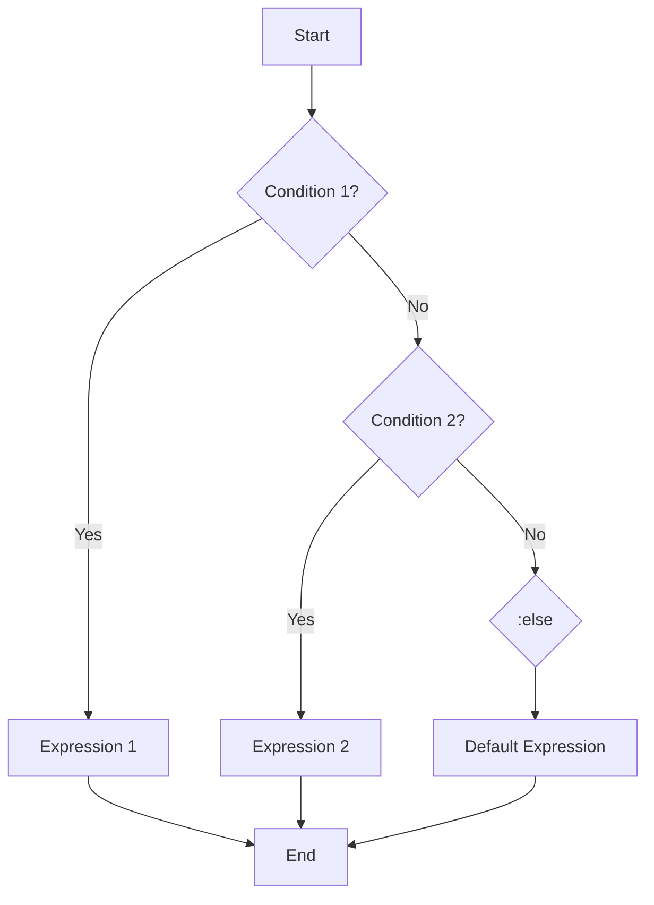

## 9.1.3 Multiple Conditions with `cond`

In the realm of functional programming, handling multiple conditions efficiently is crucial for writing clean and maintainable code. Clojure, a modern Lisp dialect, offers a powerful construct called `cond` that allows developers to express complex conditional logic succinctly. This section delves into the intricacies of using `cond` in Clojure, providing Java developers with a comprehensive understanding of its syntax, usage, and best practices.

### Understanding the `cond` Construct

The `cond` construct in Clojure is akin to a series of `if-else` statements found in imperative languages like Java. However, `cond` provides a more elegant and readable way to handle multiple conditional branches. The basic syntax of `cond` is as follows:

```clojure
(cond
  condition1 expr1
  condition2 expr2
  :else default-expr)
```

In this structure, `cond` evaluates each condition in sequence. If a condition evaluates to true, the corresponding expression is executed, and the rest of the conditions are ignored. The `:else` keyword acts as a catch-all for any cases that do not match the preceding conditions, ensuring that there is always a default action.

### Key Features of `cond`

1. **Sequential Evaluation**: `cond` evaluates conditions in the order they are listed. This sequential approach allows for precise control over the flow of logic.

2. **Short-Circuiting**: Once a true condition is found, `cond` executes the associated expression and skips evaluating the remaining conditions. This behavior is similar to short-circuit evaluation in logical operators.

3. **Expressiveness**: By using `cond`, developers can express complex conditional logic without deeply nested `if` statements, enhancing code readability.

4. **Flexibility**: The `:else` keyword provides a flexible mechanism to handle cases that do not match any specific condition, ensuring robustness in the logic.

### Practical Examples

To illustrate the power of `cond`, let's explore some practical examples that demonstrate its usage in real-world scenarios.

#### Example 1: Basic Temperature Conversion

Consider a simple program that categorizes temperature readings into different states:

```clojure
(defn categorize-temperature [temp]
  (cond
    (< temp 0) "Freezing"
    (< temp 10) "Cold"
    (< temp 20) "Cool"
    (< temp 30) "Warm"
    :else "Hot"))

(categorize-temperature 25) ;=> "Warm"
```

In this example, `cond` is used to evaluate the temperature and return a corresponding category. The conditions are checked sequentially, and the first true condition determines the result.

#### Example 2: Grading System

Let's create a grading system that assigns letter grades based on numerical scores:

```clojure
(defn assign-grade [score]
  (cond
    (>= score 90) "A"
    (>= score 80) "B"
    (>= score 70) "C"
    (>= score 60) "D"
    :else "F"))

(assign-grade 85) ;=> "B"
```

Here, `cond` efficiently maps score ranges to letter grades. The use of `:else` ensures that any score below 60 results in an "F".

#### Example 3: Handling User Input

Consider a scenario where you need to handle different types of user input:

```clojure
(defn process-input [input]
  (cond
    (number? input) (str "Number: " input)
    (string? input) (str "String: " input)
    (keyword? input) (str "Keyword: " input)
    :else "Unknown type"))

(process-input 42) ;=> "Number: 42"
(process-input "Hello") ;=> "String: Hello"
(process-input :key) ;=> "Keyword: :key"
```

This example showcases how `cond` can be used to handle various data types, providing a clear and concise way to manage different input scenarios.

### Best Practices for Using `cond`

1. **Order Matters**: Since `cond` evaluates conditions sequentially, the order of conditions is crucial. Place the most specific conditions first to ensure correct logic flow.

2. **Use `:else` Wisely**: Always include an `:else` clause to handle unexpected cases. This practice prevents runtime errors and enhances the robustness of your code.

3. **Avoid Overly Complex Conditions**: While `cond` can handle complex logic, avoid making conditions too intricate. Break down complex logic into smaller functions for better readability and maintainability.

4. **Leverage Destructuring**: When dealing with complex data structures, use Clojure's destructuring capabilities within `cond` to simplify condition expressions.

### Common Pitfalls and Optimization Tips

- **Missing `:else` Clause**: Omitting the `:else` clause can lead to unexpected behavior if none of the conditions match. Always provide a default case to ensure comprehensive coverage.

- **Inefficient Condition Order**: Placing less likely conditions before more common ones can lead to unnecessary evaluations. Optimize the order of conditions based on expected input patterns.

- **Complex Expressions**: Avoid placing complex expressions directly in `cond` conditions. Instead, use helper functions to encapsulate logic, improving readability and testability.

### Advanced Usage: Combining `cond` with Other Constructs

Clojure's `cond` can be combined with other functional constructs to create powerful and expressive code. Let's explore some advanced techniques.

#### Combining with `let`

Use `let` to bind intermediate results within a `cond` expression:

```clojure
(defn process-data [data]
  (let [result (compute-result data)]
    (cond
      (nil? result) "No result"
      (zero? result) "Zero result"
      :else (str "Result: " result))))

(process-data 10) ;=> "Result: 100"
```

In this example, `let` is used to bind the result of a computation, which is then evaluated within the `cond` expression.

#### Using `cond->` for Conditional Threading

Clojure provides `cond->` for conditional threading, allowing you to apply transformations based on conditions:

```clojure
(defn transform-data [data]
  (cond-> data
    (even? data) (* 2)
    (pos? data) (+ 10)))

(transform-data 4) ;=> 18
```

Here, `cond->` applies transformations to `data` based on the specified conditions, demonstrating a more functional approach to conditional logic.

### Visualizing `cond` Logic

To further enhance understanding, let's visualize the flow of a `cond` expression using a flowchart:



This flowchart illustrates the sequential evaluation of conditions in a `cond` expression, highlighting the short-circuiting behavior and the role of the `:else` clause.

### Conclusion

Mastering the `cond` construct in Clojure is essential for Java developers transitioning to functional programming. By leveraging `cond`, you can write more expressive and maintainable code, handling complex conditional logic with ease. Remember to follow best practices, optimize condition order, and utilize advanced techniques to fully harness the power of `cond`.

As you continue your journey in Clojure, experiment with `cond` in various contexts to deepen your understanding and enhance your functional programming skills.

## Quiz Time!



### What is the primary purpose of the `cond` construct in Clojure?

- [x] To handle multiple conditional branches in a readable manner
- [ ] To perform arithmetic operations
- [ ] To define functions
- [ ] To manage state

> **Explanation:** The `cond` construct is used to handle multiple conditional branches, providing a more readable alternative to nested `if` statements.

### What happens when a true condition is found in a `cond` expression?

- [x] The corresponding expression is executed, and the rest are ignored
- [ ] All conditions are evaluated regardless
- [ ] The program throws an error
- [ ] The first condition is always executed

> **Explanation:** `cond` short-circuits once a true condition is found, executing the corresponding expression and ignoring the rest.

### What role does the `:else` keyword play in a `cond` expression?

- [x] It acts as a catch-all for unmatched conditions
- [ ] It is used to terminate the program
- [ ] It defines a new function
- [ ] It performs a loop operation

> **Explanation:** The `:else` keyword catches all cases that do not match any preceding conditions, ensuring a default action is taken.

### How should conditions be ordered in a `cond` expression?

- [x] From most specific to least specific
- [ ] Alphabetically
- [ ] By length of the condition
- [ ] Randomly

> **Explanation:** Conditions should be ordered from most specific to least specific to ensure the correct logic flow.

### What is a common pitfall when using `cond`?

- [x] Omitting the `:else` clause
- [ ] Using too many conditions
- [ ] Placing conditions in alphabetical order
- [ ] Using `cond` for arithmetic operations

> **Explanation:** Omitting the `:else` clause can lead to unexpected behavior if none of the conditions match.

### Which construct can be combined with `cond` for conditional threading?

- [x] `cond->`
- [ ] `let`
- [ ] `loop`
- [ ] `recur`

> **Explanation:** `cond->` is used for conditional threading, allowing transformations based on conditions.

### What is a benefit of using `cond` over nested `if` statements?

- [x] Improved readability and maintainability
- [ ] Faster execution
- [ ] More complex logic
- [ ] Less memory usage

> **Explanation:** `cond` provides improved readability and maintainability compared to nested `if` statements.

### How can `let` be used within a `cond` expression?

- [x] To bind intermediate results for evaluation
- [ ] To terminate the `cond` expression
- [ ] To define a new function
- [ ] To perform arithmetic operations

> **Explanation:** `let` can bind intermediate results within a `cond` expression, simplifying condition expressions.

### What is the effect of placing less likely conditions before more common ones in a `cond` expression?

- [x] It can lead to unnecessary evaluations
- [ ] It improves performance
- [ ] It simplifies the code
- [ ] It reduces memory usage

> **Explanation:** Placing less likely conditions before more common ones can lead to unnecessary evaluations, reducing efficiency.

### True or False: The `cond` construct in Clojure is similar to a switch-case statement in Java.

- [x] True
- [ ] False

> **Explanation:** True. The `cond` construct is similar to a switch-case statement but provides more flexibility and expressiveness.


