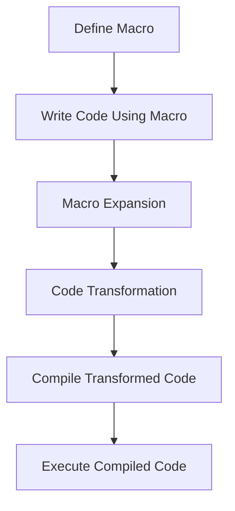

## 9.10 Exercises: Creating Useful Macros

Welcome to the world of macros in Clojure! In this section, we will dive into practical exercises designed to help you master the art of writing macros. Macros are a powerful feature of Clojure that allow you to extend the language and create new syntactic constructs. For experienced Java developers, understanding macros can open up new possibilities in functional programming and metaprogramming.

### Understanding Macros in Clojure

Before we jump into the exercises, let's briefly revisit what macros are and why they are important. In Clojure, macros are a way to perform code transformations at compile time. They allow you to write code that writes code, enabling you to create new language constructs and abstractions.

Macros are similar to Java's annotations and reflection but offer more flexibility and power. They operate on the abstract syntax tree (AST) of your code, allowing you to manipulate it before it is compiled. This can lead to more concise and expressive code.

### Exercise 1: Simplifying Exception Handling

In Java, exception handling is often verbose, requiring multiple lines of code to catch and handle exceptions. In Clojure, we can use macros to simplify this process. Let's create a macro that wraps a block of code with a try-catch construct.

#### Step-by-Step Implementation

1. **Define the Macro**: We'll start by defining a macro called `with-exception-handling` that takes a block of code and a handler function.

```clojure
(defmacro with-exception-handling [body handler]
  `(try
     ~body
     (catch Exception e
       (~handler e))))
```

- **Explanation**: The macro uses `try` to execute the `body` and `catch` to handle exceptions using the provided `handler`.

2. **Usage Example**: Let's see how this macro can be used in practice.

```clojure
(with-exception-handling
  (do
    (println "Executing risky operation...")
    (/ 1 0)) ; This will cause a division by zero exception
  (fn [e] (println "Caught exception:" (.getMessage e))))
```

- **Output**: The macro will catch the exception and print the message "Caught exception: / by zero".

3. **Try It Yourself**: Modify the macro to handle multiple exception types or log exceptions to a file.

### Exercise 2: Generating Data Validation Code

Data validation is a common task in software development. In Clojure, we can use macros to generate validation code dynamically. Let's create a macro that validates a map against a set of rules.

#### Step-by-Step Implementation

1. **Define the Macro**: We'll create a macro called `validate` that takes a map and a set of validation rules.

```clojure
(defmacro validate [data rules]
  `(let [errors# (atom [])]
     (doseq [[k# v#] ~rules]
       (when-not (v# (~k# ~data))
         (swap! errors# conj (str "Validation failed for " (name k#)))))
     @errors#))
```

- **Explanation**: The macro iterates over the rules and applies each validation function to the corresponding key in the data map. If a validation fails, it adds an error message to the `errors` atom.

2. **Usage Example**: Let's validate a map of user data.

```clojure
(def user-data {:name "Alice" :age 25})

(def rules {:name string?
            :age #(> % 18)})

(validate user-data rules)
```

- **Output**: The macro will return an empty list if all validations pass or a list of error messages if any validation fails.

3. **Try It Yourself**: Extend the macro to support nested maps or custom error messages.

### Exercise 3: Introducing New Syntactic Sugar

Clojure's syntax is already quite expressive, but there are times when you might want to introduce new syntactic sugar for common patterns. Let's create a macro that simplifies the creation of getter functions for maps.

#### Step-by-Step Implementation

1. **Define the Macro**: We'll create a macro called `def-getters` that generates getter functions for each key in a map.

```clojure
(defmacro def-getters [map-name & keys]
  `(do
     ~@(for [k keys]
         `(def ~(symbol (str "get-" (name k)))
            (fn [m#] (~k m#))))))
```

- **Explanation**: The macro uses a loop to generate a function for each key, naming it `get-key`.

2. **Usage Example**: Let's generate getter functions for a map of user data.

```clojure
(def user {:name "Alice" :age 25})

(def-getters user :name :age)

(println (get-name user)) ; Outputs "Alice"
(println (get-age user))  ; Outputs 25
```

3. **Try It Yourself**: Modify the macro to support default values or nested keys.

### Visualizing Macro Transformations

To better understand how macros transform code, let's visualize the process using a flowchart. This diagram illustrates the steps involved in macro expansion and execution.



**Diagram Caption**: This flowchart shows the process of defining a macro, using it in code, expanding it into transformed code, compiling, and executing the result.

### Key Takeaways

- **Macros in Clojure**: Macros allow you to extend the language by transforming code at compile time.
- **Simplifying Code**: Use macros to reduce boilerplate and create more expressive code.
- **Practical Applications**: Macros can simplify exception handling, generate validation code, and introduce new syntactic sugar.
- **Experimentation**: Try modifying the provided macros to suit your specific needs and explore their potential.

### Exercises and Practice Problems

1. **Exercise 1**: Modify the `with-exception-handling` macro to handle multiple exception types and log exceptions to a file.
2. **Exercise 2**: Extend the `validate` macro to support nested maps and custom error messages.
3. **Exercise 3**: Enhance the `def-getters` macro to support default values and nested keys.
4. **Challenge**: Create a macro that generates a DSL for defining RESTful API endpoints.
5. **Challenge**: Write a macro that automatically generates unit tests for a set of functions.

### Further Reading

- [Official Clojure Documentation on Macros](https://clojure.org/reference/macros)
- [ClojureDocs: Macro Examples](https://clojuredocs.org/quickref#macros)
- [GitHub: Clojure Macro Libraries](https://github.com/clojure)

Now that we've explored how to create useful macros in Clojure, let's apply these concepts to enhance your codebase and streamline your development process. Happy coding!

## Quiz: Mastering Clojure Macros



### What is the primary purpose of macros in Clojure?

- [x] To perform code transformations at compile time
- [ ] To execute code at runtime
- [ ] To handle exceptions
- [ ] To manage state

> **Explanation:** Macros in Clojure are used to perform code transformations at compile time, allowing developers to create new language constructs.

### How does the `with-exception-handling` macro simplify exception handling?

- [x] By wrapping code in a try-catch block
- [ ] By logging exceptions to a file
- [ ] By ignoring exceptions
- [ ] By rethrowing exceptions

> **Explanation:** The `with-exception-handling` macro simplifies exception handling by wrapping code in a try-catch block and using a handler function to process exceptions.

### What does the `validate` macro do?

- [x] Validates a map against a set of rules
- [ ] Generates random data
- [ ] Logs validation errors
- [ ] Transforms data into JSON

> **Explanation:** The `validate` macro checks a map against a set of validation rules and returns a list of errors if any validations fail.

### What is the purpose of the `def-getters` macro?

- [x] To generate getter functions for map keys
- [ ] To create setter functions for map keys
- [ ] To validate map data
- [ ] To log map access

> **Explanation:** The `def-getters` macro generates getter functions for each specified key in a map, allowing easy access to map values.

### Which of the following is a benefit of using macros in Clojure?

- [x] Reducing boilerplate code
- [x] Creating new language constructs
- [ ] Increasing runtime performance
- [ ] Simplifying syntax errors

> **Explanation:** Macros reduce boilerplate code and allow the creation of new language constructs, enhancing code expressiveness.

### What is a potential risk of using macros?

- [x] Code complexity
- [ ] Improved readability
- [ ] Enhanced performance
- [ ] Simplified debugging

> **Explanation:** Macros can increase code complexity, making it harder to understand and debug.

### How can macros be compared to Java's reflection?

- [x] Both allow code manipulation
- [ ] Both improve runtime performance
- [ ] Both simplify syntax
- [ ] Both handle exceptions

> **Explanation:** Macros and Java's reflection both allow code manipulation, but macros operate at compile time, while reflection occurs at runtime.

### What is the output of the following code using the `def-getters` macro?

```clojure
(def user {:name "Alice" :age 25})
(def-getters user :name :age)
(get-name user)
```

- [x] "Alice"
- [ ] 25
- [ ] "name"
- [ ] "age"

> **Explanation:** The `get-name` function generated by the `def-getters` macro returns the value associated with the `:name` key, which is "Alice".

### What is the role of `macroexpand` in Clojure?

- [x] To visualize macro transformations
- [ ] To execute macros
- [ ] To log macro usage
- [ ] To validate macro syntax

> **Explanation:** `macroexpand` is used to visualize and understand how macros transform code before compilation.

### True or False: Macros in Clojure can be used to introduce new syntax to the language.

- [x] True
- [ ] False

> **Explanation:** True. Macros can introduce new syntax and language constructs by transforming code at compile time.


