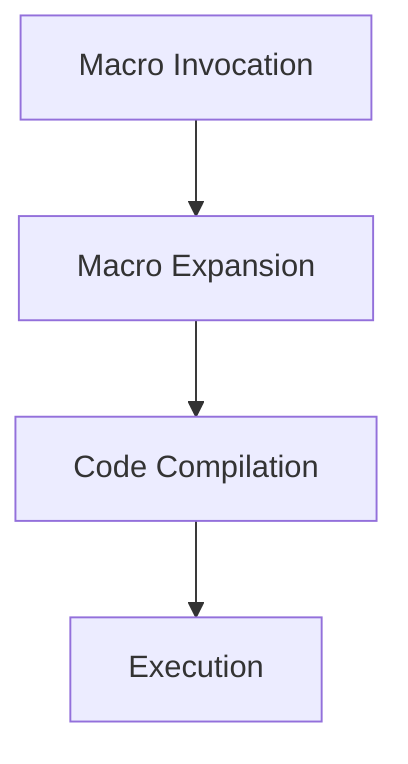

## 9.2.1 Defining Macros with `defmacro`

In this section, we delve into the fascinating world of macros in Clojure, focusing on the `defmacro` form. Macros are a powerful feature of Lisp languages, including Clojure, that allow you to perform metaprogramming—writing code that writes code. This capability can lead to more expressive and concise programs, enabling you to extend the language to better fit your problem domain.

### Understanding Macros in Clojure

Macros in Clojure are a way to transform code before it is evaluated. Unlike functions, which operate on values, macros operate on the code itself. This means that macro arguments are not evaluated before being passed to the macro. This characteristic allows macros to manipulate the code structure, enabling powerful abstractions and domain-specific languages (DSLs).

#### Key Differences Between Macros and Functions

- **Evaluation**: In functions, arguments are evaluated before the function is called. In macros, arguments are passed as raw code (unevaluated).
- **Purpose**: Functions are used to encapsulate logic and operations on data, while macros are used to transform code.
- **Use Cases**: Use macros when you need to control evaluation or introduce new syntactic constructs.

### Defining Macros with `defmacro`

The `defmacro` form is used to define macros in Clojure. Let's explore its syntax and how it works.

#### Syntax of `defmacro`

```clojure
(defmacro macro-name
  "Optional documentation string"
  [parameters]
  body)
```

- **macro-name**: The name of the macro.
- **parameters**: A vector of parameters that the macro accepts.
- **body**: The code that defines the transformation. This is the code that will be executed when the macro is invoked.

#### Example: A Simple Macro

Let's start with a simple example to illustrate how macros work. We'll define a macro called `unless`, which behaves like an inverted `if`.

```clojure
(defmacro unless
  "Evaluates expr if test is false."
  [test expr]
  `(if (not ~test)
     ~expr))
```

- **Backquote (`)**: Used to quote the entire expression, allowing for unquoting within it.
- **Unquote (~)**: Used to evaluate the expression within the backquoted form.

Here's how you can use the `unless` macro:

```clojure
(unless false
  (println "This will be printed!"))
```

In this example, `unless` checks if the test is false, and if so, evaluates the expression.

### How Macros Work: A Deeper Dive

Macros in Clojure are expanded at compile time, meaning the macro's body is executed to produce new code, which is then compiled. This process is known as macro expansion.

#### Macro Expansion Process

1. **Invocation**: The macro is called with unevaluated arguments.
2. **Expansion**: The macro body is executed, transforming the code.
3. **Compilation**: The expanded code is compiled and executed.

Let's visualize the macro expansion process with a simple diagram:



**Diagram Caption**: The flow of macro expansion in Clojure, from invocation to execution.

### Practical Examples of Macros

To further illustrate the power of macros, let's explore some practical examples.

#### Example: A Debugging Macro

Imagine you want to log the value of an expression along with its result. You can define a macro called `dbg` to achieve this:

```clojure
(defmacro dbg
  "Logs the expression and its result."
  [expr]
  `(let [result# ~expr]
     (println "Debug:" '~expr "=" result#)
     result#))
```

- **Auto-gensym (`#`)**: Ensures unique symbol names to avoid variable capture.

Usage:

```clojure
(dbg (+ 1 2))
```

This will print: `Debug: (+ 1 2) = 3` and return `3`.

#### Example: A Timing Macro

Let's create a macro to measure the execution time of an expression:

```clojure
(defmacro time-it
  "Measures the execution time of an expression."
  [expr]
  `(let [start# (System/nanoTime)
         result# ~expr
         end# (System/nanoTime)]
     (println "Execution time:" (/ (- end# start#) 1e6) "ms")
     result#))
```

Usage:

```clojure
(time-it (Thread/sleep 1000))
```

This will print the execution time in milliseconds.

### Comparing Macros with Java Code

In Java, achieving similar functionality often requires more boilerplate code. For instance, logging the execution time of a method might involve manually recording start and end times, and printing the difference. Macros in Clojure allow for more concise and expressive code.

#### Java Example: Timing a Method

```java
public static void timeIt(Runnable task) {
    long start = System.nanoTime();
    task.run();
    long end = System.nanoTime();
    System.out.println("Execution time: " + (end - start) / 1e6 + " ms");
}

// Usage
timeIt(() -> {
    try {
        Thread.sleep(1000);
    } catch (InterruptedException e) {
        e.printStackTrace();
    }
});
```

### Best Practices for Writing Macros

- **Use Macros Sparingly**: Overuse can lead to code that's hard to understand and maintain.
- **Ensure Clarity**: Macros should be well-documented and intuitive to use.
- **Avoid Side Effects**: Macros should focus on code transformation, not on performing side effects.

### Try It Yourself

Experiment with the `unless`, `dbg`, and `time-it` macros. Try modifying them to add additional functionality or create your own macros to solve specific problems.

### Exercises

1. **Create a `when-not` Macro**: Define a macro that behaves like `when`, but only executes the body if the condition is false.
2. **Enhance the `dbg` Macro**: Modify the `dbg` macro to include a timestamp in the log output.
3. **Write a `repeat-until` Macro**: Create a macro that repeatedly evaluates an expression until a condition is met.

### Key Takeaways

- **Macros Transform Code**: Macros allow you to manipulate code structure, enabling powerful abstractions.
- **Unevaluated Arguments**: Macro arguments are passed as raw code, allowing for flexible transformations.
- **Use with Caution**: While powerful, macros should be used judiciously to maintain code clarity and maintainability.

### Further Reading

For more information on macros and metaprogramming in Clojure, check out the [Official Clojure Documentation](https://clojure.org/reference/macros) and [ClojureDocs](https://clojuredocs.org/).

---

## Quiz: Mastering Macros in Clojure



### What is the primary purpose of macros in Clojure?

- [x] To transform code before it is evaluated
- [ ] To perform operations on data
- [ ] To manage state changes
- [ ] To handle concurrency

> **Explanation:** Macros in Clojure are used to transform code before it is evaluated, allowing for powerful metaprogramming capabilities.

### How are macro arguments treated differently from function arguments in Clojure?

- [x] Macro arguments are not evaluated before being passed
- [ ] Macro arguments are evaluated before being passed
- [ ] Macro arguments are always strings
- [ ] Macro arguments are always numbers

> **Explanation:** Unlike function arguments, macro arguments are passed as raw code, allowing macros to manipulate the code structure.

### What is the role of the backquote (`) in macro definitions?

- [x] To quote the entire expression, allowing for unquoting within it
- [ ] To evaluate the entire expression
- [ ] To comment out the expression
- [ ] To concatenate strings

> **Explanation:** The backquote is used to quote the entire expression in a macro, enabling selective unquoting within it.

### What does the `#` symbol represent in macro definitions?

- [x] Auto-gensym, ensuring unique symbol names
- [ ] A comment
- [ ] A string delimiter
- [ ] A numeric literal

> **Explanation:** The `#` symbol is used for auto-gensym, which ensures unique symbol names to avoid variable capture in macros.

### Which of the following is a best practice when writing macros?

- [x] Use macros sparingly to maintain code clarity
- [ ] Use macros for all code transformations
- [ ] Avoid documenting macros
- [ ] Perform side effects within macros

> **Explanation:** Macros should be used sparingly to maintain code clarity and should focus on code transformation rather than side effects.

### What is the purpose of the `unless` macro in the provided example?

- [x] To evaluate an expression if a test is false
- [ ] To evaluate an expression if a test is true
- [ ] To log the execution time of an expression
- [ ] To handle exceptions

> **Explanation:** The `unless` macro evaluates an expression if the test condition is false, acting as an inverted `if`.

### How does the `time-it` macro measure execution time?

- [x] By recording start and end times using `System/nanoTime`
- [ ] By counting the number of iterations
- [ ] By logging the current date and time
- [ ] By using a stopwatch object

> **Explanation:** The `time-it` macro measures execution time by recording start and end times using `System/nanoTime`.

### What is a potential downside of overusing macros?

- [x] Code becomes hard to understand and maintain
- [ ] Code becomes too concise
- [ ] Code execution becomes slower
- [ ] Code becomes too verbose

> **Explanation:** Overusing macros can lead to code that is difficult to understand and maintain, as macros can obscure the code's intent.

### Which of the following is a valid use case for macros?

- [x] Introducing new syntactic constructs
- [ ] Performing arithmetic operations
- [ ] Managing application state
- [ ] Handling file I/O

> **Explanation:** Macros are ideal for introducing new syntactic constructs and transforming code, rather than performing operations on data.

### True or False: Macros in Clojure can have side effects.

- [x] True
- [ ] False

> **Explanation:** While macros can technically have side effects, it is generally discouraged as it goes against the primary purpose of macros, which is code transformation.


