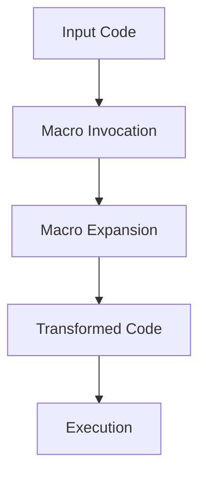

## 9.2.2 A Simple Macro Example

In this section, we will delve into the fascinating world of Clojure macros by creating a simple macro. Macros are a powerful feature of Lisp languages, including Clojure, that allow you to extend the language by writing code that generates code. This capability can be particularly useful for Java developers looking to leverage Clojure's metaprogramming capabilities to simplify complex code patterns.

### Understanding Macros in Clojure

Before we dive into creating a macro, let's briefly understand what a macro is. In Clojure, a macro is a special kind of function that operates on the code itself rather than on the values the code produces. Macros are executed at compile time, allowing you to transform the code before it is evaluated.

**Key Characteristics of Macros:**

- **Code Transformation:** Macros take code as input and produce transformed code as output.
- **Compile-Time Execution:** Macros are expanded at compile time, not runtime.
- **Syntax Manipulation:** They allow manipulation of Clojure's syntax to create new language constructs.

### Creating a Simple `when` Macro

Let's create a simple macro that mimics the behavior of the `when` construct in Clojure. The `when` macro evaluates a condition and executes a block of code if the condition is true. If the condition is false, it does nothing.

#### Step-by-Step Macro Creation

1. **Define the Macro:**

   We'll start by defining a macro using the `defmacro` keyword. This macro will take a condition and a body of code to execute if the condition is true.

   ```clojure
   (defmacro my-when [condition & body]
     `(if ~condition
        (do ~@body)))
   ```

   **Explanation:**
   - `defmacro`: Defines a macro.
   - `my-when`: The name of our macro.
   - `[condition & body]`: The macro takes a condition and a variadic list of expressions (`body`).
   - `` `(if ~condition (do ~@body)) ``: The macro expands into an `if` expression. The backtick (`) is used for syntax quoting, `~` is used to unquote the condition, and `~@` is used to splice the body expressions into the `do` form.

2. **Using the Macro:**

   Let's see how we can use this macro in practice.

   ```clojure
   (my-when (> 5 3)
     (println "5 is greater than 3")
     (println "This will only print if the condition is true"))
   ```

   **Explanation:**
   - The macro checks if `5` is greater than `3`. If true, it executes the `println` statements.

3. **Macro Expansion:**

   To understand how the macro transforms the code, we can use the `macroexpand` function.

   ```clojure
   (macroexpand '(my-when (> 5 3)
                   (println "5 is greater than 3")
                   (println "This will only print if the condition is true")))
   ```

   **Output:**
   ```clojure
   (if (> 5 3)
     (do
       (println "5 is greater than 3")
       (println "This will only print if the condition is true")))
   ```

   **Explanation:**
   - The macro expands into an `if` expression with a `do` block containing the body expressions.

### Comparing with Java

In Java, achieving similar behavior would typically involve using an `if` statement. Here's a Java equivalent:

```java
if (5 > 3) {
    System.out.println("5 is greater than 3");
    System.out.println("This will only print if the condition is true");
}
```

**Comparison:**
- **Syntax:** Java uses explicit `if` statements, whereas Clojure's macro abstracts this into a reusable construct.
- **Flexibility:** Clojure macros allow for more flexible and concise code by enabling custom control structures.

### Advantages of Using Macros

- **Code Reusability:** Macros enable the creation of reusable code patterns, reducing boilerplate.
- **Domain-Specific Languages (DSLs):** They allow the creation of DSLs tailored to specific problem domains.
- **Compile-Time Optimization:** Since macros are expanded at compile time, they can optimize code before execution.

### Try It Yourself

Experiment with the `my-when` macro by modifying the condition and body expressions. Try adding more complex logic within the body to see how the macro handles it.

### Visualizing Macro Expansion

To better understand how macros transform code, let's visualize the process using a flowchart.



**Diagram Explanation:**
- **Input Code:** The original code with the macro invocation.
- **Macro Invocation:** The point where the macro is called.
- **Macro Expansion:** The macro transforms the code.
- **Transformed Code:** The resulting code after macro expansion.
- **Execution:** The final execution of the transformed code.

### Best Practices for Writing Macros

- **Keep It Simple:** Start with simple macros to avoid complexity.
- **Use Macros Sparingly:** Overuse can lead to hard-to-read code.
- **Test Macro Expansions:** Use `macroexpand` to verify macro behavior.

### Exercises

1. **Modify the Macro:** Extend the `my-when` macro to include an `else` clause.
2. **Create a New Macro:** Write a macro `my-unless` that executes code only if a condition is false.
3. **Explore Macro Expansion:** Use `macroexpand` to explore how different macros transform code.

### Key Takeaways

- **Macros Transform Code:** They allow you to manipulate and transform code at compile time.
- **Powerful Abstraction:** Macros enable powerful abstractions and custom language constructs.
- **Use with Caution:** While powerful, macros should be used judiciously to maintain code readability.

### Further Reading

- [Official Clojure Documentation on Macros](https://clojure.org/reference/macros)
- [ClojureDocs: Macro Examples](https://clojuredocs.org/quickref#macros)
- [GitHub: Clojure Macro Examples](https://github.com/clojure-examples/macro-examples)

Now that we've explored a simple macro example, you're equipped to start experimenting with macros in your Clojure projects. Embrace the power of macros to create expressive and concise code, and continue to explore the vast possibilities they offer.

## Quiz: Test Your Understanding of Clojure Macros



### What is the primary purpose of a macro in Clojure?

- [x] To transform code at compile time
- [ ] To execute code at runtime
- [ ] To handle exceptions
- [ ] To manage memory

> **Explanation:** Macros in Clojure are used to transform code at compile time, allowing for code manipulation before execution.

### How does the `my-when` macro transform the input code?

- [x] It expands into an `if` expression with a `do` block
- [ ] It directly executes the input code
- [ ] It converts the code into a Java equivalent
- [ ] It logs the input code

> **Explanation:** The `my-when` macro expands into an `if` expression with a `do` block containing the body expressions.

### What keyword is used to define a macro in Clojure?

- [x] `defmacro`
- [ ] `defn`
- [ ] `let`
- [ ] `fn`

> **Explanation:** The `defmacro` keyword is used to define a macro in Clojure.

### What is the role of the backtick (`) in a macro definition?

- [x] It is used for syntax quoting
- [ ] It is used for commenting
- [ ] It is used for string interpolation
- [ ] It is used for variable assignment

> **Explanation:** The backtick (`) is used for syntax quoting in macro definitions, allowing for code transformation.

### Which of the following is a benefit of using macros?

- [x] Code reusability
- [ ] Increased runtime performance
- [ ] Simplified memory management
- [ ] Enhanced exception handling

> **Explanation:** Macros enable code reusability by allowing the creation of reusable code patterns.

### What function can be used to view the expanded form of a macro?

- [x] `macroexpand`
- [ ] `eval`
- [ ] `println`
- [ ] `reduce`

> **Explanation:** The `macroexpand` function is used to view the expanded form of a macro.

### What is a potential risk of overusing macros?

- [x] Reduced code readability
- [ ] Increased memory usage
- [ ] Slower execution speed
- [ ] More complex exception handling

> **Explanation:** Overusing macros can lead to reduced code readability, making the codebase harder to maintain.

### How can you modify the `my-when` macro to include an `else` clause?

- [x] By adding an additional `else` expression in the macro definition
- [ ] By using a different macro keyword
- [ ] By changing the syntax quoting
- [ ] By removing the `do` block

> **Explanation:** You can modify the `my-when` macro to include an `else` clause by adding an additional `else` expression in the macro definition.

### What is the difference between a macro and a function in Clojure?

- [x] Macros operate on code, while functions operate on values
- [ ] Functions are faster than macros
- [ ] Macros are used for memory management
- [ ] Functions can only be used in the REPL

> **Explanation:** Macros operate on code and transform it, while functions operate on values and produce results.

### True or False: Macros are executed at runtime in Clojure.

- [ ] True
- [x] False

> **Explanation:** Macros are executed at compile time in Clojure, not at runtime.


