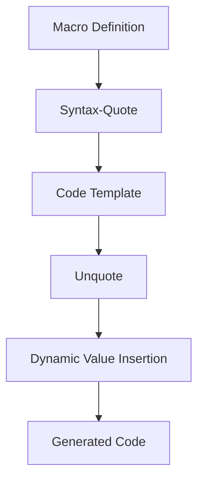

## 9.2.3 Understanding Quoting and Unquoting

In this section, we delve into the powerful concepts of quoting and unquoting in Clojure, essential tools for writing macros and engaging in metaprogramming. These concepts allow you to construct code templates and dynamically insert values into code, providing a level of flexibility and power that is unique to Lisp languages like Clojure.

### Introduction to Quoting and Unquoting

Quoting and unquoting are fundamental to understanding how Clojure macros work. They allow you to manipulate code as data, a concept known as homoiconicity, which is a hallmark of Lisp languages. In Clojure, quoting is used to prevent the evaluation of a form, while unquoting is used to evaluate a form within a quoted context.

#### Quoting in Clojure

In Clojure, quoting is achieved using the single quote (`'`) or the syntax-quote (backtick `` ` ``). When you quote a form, Clojure treats it as data rather than code to be executed. This is particularly useful in macros, where you want to construct code that will be executed later.

```clojure
;; Simple quoting example
(def my-list '(1 2 3)) ; my-list is a list of numbers, not evaluated
```

In the example above, `my-list` is assigned a list of numbers. The quote prevents the list from being evaluated as a function call.

#### Syntax-Quote (Backtick)

The syntax-quote (backtick `` ` ``) is a more powerful form of quoting that not only prevents evaluation but also resolves symbols to their fully qualified names. This is crucial in macros to avoid symbol clashes and ensure that the generated code refers to the correct variables and functions.

```clojure
;; Syntax-quote example
(defn example-fn []
  `(println "Hello, World!"))
```

In this example, the syntax-quote ensures that `println` is resolved to `clojure.core/println`, avoiding any potential conflicts with other `println` definitions.

### Unquoting in Clojure

Unquoting is used within a quoted form to evaluate a specific part of the form. This is done using the unquote (`~`) operator. It allows you to insert dynamic values into a quoted template, which is essential for generating code that adapts to different inputs.

```clojure
;; Unquote example
(defn greet [name]
  `(println "Hello," ~name))
```

Here, `~name` is unquoted, meaning that its value is evaluated and inserted into the quoted form. This allows the `greet` function to generate a `println` statement that includes the provided name.

### Unquote-Splicing

Unquote-splicing (`~@`) is a variant of unquote that is used to insert multiple values into a quoted form. It is particularly useful when you want to splice a sequence of values into a list or vector within a macro.

```clojure
;; Unquote-splicing example
(defn create-list [items]
  `(list ~@items))
```

In this example, `~@items` splices the elements of `items` into the list, allowing you to dynamically construct lists with varying numbers of elements.

### Practical Examples and Code Templates

Let's explore some practical examples to see how quoting and unquoting can be used to construct dynamic code templates in macros.

#### Example 1: Creating a Simple Macro

We'll start by creating a simple macro that generates a function definition. This macro will take a function name and a body, and produce a complete function definition.

```clojure
(defmacro defsimple [name body]
  `(defn ~name []
     ~body))

;; Usage
(defsimple greet (println "Hello, World!"))
(greet) ; Outputs: Hello, World!
```

In this macro, we use syntax-quote to construct the function definition, and unquote to insert the `name` and `body` into the template.

#### Example 2: Building a Conditional Macro

Next, we'll create a macro that generates a conditional expression. This macro will take a condition, a true branch, and a false branch, and produce an `if` expression.

```clojure
(defmacro my-if [condition true-branch false-branch]
  `(if ~condition
     ~true-branch
     ~false-branch))

;; Usage
(my-if true
  (println "Condition is true")
  (println "Condition is false"))
```

Here, we use unquote to insert the condition and branches into the `if` expression, allowing the macro to generate different code based on the inputs.

### Comparing with Java

In Java, similar functionality can be achieved using reflection or code generation libraries, but these approaches are often more cumbersome and less flexible than Clojure's macros. Clojure's quoting and unquoting provide a concise and powerful way to manipulate code as data, enabling dynamic code generation with minimal boilerplate.

### Diagrams and Visualizations

To better understand the flow of data and the construction of code templates, let's look at a diagram that illustrates the process of quoting and unquoting in a macro.



**Diagram Description**: This flowchart illustrates the process of constructing a code template using quoting and unquoting in a macro. The macro definition uses syntax-quote to create a code template, and unquote to insert dynamic values, resulting in the generated code.

### Try It Yourself

To deepen your understanding, try modifying the examples above. For instance, extend the `defsimple` macro to accept parameters for the generated function, or create a macro that generates a loop structure.

### Exercises

1. Create a macro that generates a `let` binding with a specified variable and value.
2. Write a macro that constructs a `cond` expression from a sequence of condition-action pairs.
3. Implement a macro that generates a `case` statement with a default branch.

### Key Takeaways

- **Quoting** is used to treat code as data, preventing evaluation.
- **Syntax-Quote** resolves symbols to their fully qualified names, avoiding conflicts.
- **Unquote** allows dynamic value insertion into quoted templates.
- **Unquote-Splicing** is used to insert multiple values into a quoted form.
- Clojure's quoting and unquoting provide a powerful way to construct dynamic code templates, offering flexibility and conciseness not easily achieved in Java.

By mastering quoting and unquoting, you can harness the full power of Clojure macros, enabling you to write more expressive and flexible code.

For further reading, explore the [Official Clojure Documentation on Macros](https://clojure.org/reference/macros) and [ClojureDocs](https://clojuredocs.org/).

## Quiz: Mastering Quoting and Unquoting in Clojure Macros



### What is the primary purpose of quoting in Clojure?

- [x] To treat code as data and prevent evaluation
- [ ] To evaluate code immediately
- [ ] To resolve symbols to their fully qualified names
- [ ] To insert dynamic values into code

> **Explanation:** Quoting in Clojure is used to treat code as data, preventing its evaluation.

### How does syntax-quote differ from a regular quote?

- [x] It resolves symbols to their fully qualified names
- [ ] It prevents evaluation of code
- [ ] It evaluates code immediately
- [ ] It allows dynamic value insertion

> **Explanation:** Syntax-quote resolves symbols to their fully qualified names, unlike a regular quote.

### What operator is used for unquoting in Clojure?

- [x] `~`
- [ ] `@`
- [ ] `#`
- [ ] `!`

> **Explanation:** The unquote operator in Clojure is `~`.

### Which operator is used for unquote-splicing?

- [x] `~@`
- [ ] `@`
- [ ] `~`
- [ ] `#`

> **Explanation:** Unquote-splicing is done using the `~@` operator.

### What is the advantage of using syntax-quote in macros?

- [x] It avoids symbol clashes by resolving fully qualified names
- [ ] It evaluates code immediately
- [ ] It simplifies code by removing the need for unquoting
- [ ] It prevents code execution

> **Explanation:** Syntax-quote resolves symbols to their fully qualified names, avoiding symbol clashes.

### In the macro `(defmacro my-if [condition true-branch false-branch] ...)`, what does `~condition` do?

- [x] Inserts the evaluated value of `condition` into the code
- [ ] Prevents `condition` from being evaluated
- [ ] Resolves `condition` to a fully qualified name
- [ ] Splices multiple values into the code

> **Explanation:** `~condition` evaluates and inserts the value of `condition` into the code.

### What is a common use case for unquote-splicing?

- [x] Inserting multiple values into a list or vector
- [ ] Preventing evaluation of a form
- [ ] Resolving symbols to fully qualified names
- [ ] Evaluating code immediately

> **Explanation:** Unquote-splicing is used to insert multiple values into a list or vector.

### How can quoting and unquoting improve code generation in Clojure?

- [x] By allowing dynamic construction of code templates
- [ ] By simplifying syntax
- [ ] By removing the need for macros
- [ ] By evaluating code immediately

> **Explanation:** Quoting and unquoting allow for dynamic construction of code templates, enhancing code generation.

### True or False: Unquote-splicing can be used to insert a single value into a quoted form.

- [ ] True
- [x] False

> **Explanation:** Unquote-splicing is specifically used for inserting multiple values, not a single value.

### Which of the following is a benefit of using macros in Clojure?

- [x] They allow for code manipulation as data
- [ ] They simplify syntax by removing the need for functions
- [ ] They automatically optimize code for performance
- [ ] They prevent any runtime errors

> **Explanation:** Macros in Clojure allow for code manipulation as data, providing flexibility and power.


