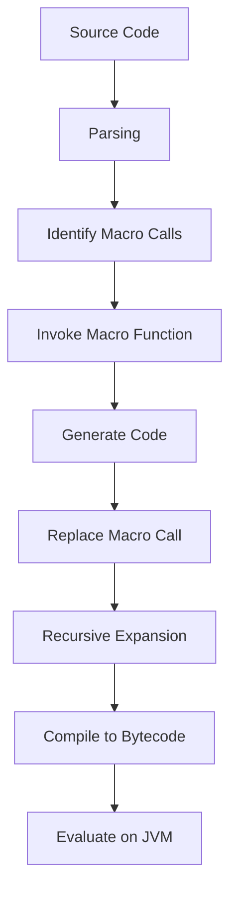

## 9.3.1 The Macro Expansion Process

In the world of Clojure, macros are a powerful tool that allows developers to perform code transformations before the code is evaluated. This capability is rooted in Clojure's Lisp heritage, where code is treated as data, enabling the manipulation of code structures at compile time. For Java developers transitioning to Clojure, understanding the macro expansion process is crucial for leveraging the full potential of Clojure's metaprogramming capabilities.

### Understanding Macros in Clojure

Before diving into the macro expansion process, let's briefly revisit what macros are in Clojure. Unlike functions, which are evaluated at runtime, macros are expanded at compile time. This means that macros can generate and transform code before it is executed, allowing for powerful abstractions and optimizations.

#### Key Differences Between Macros and Functions

- **Evaluation Time**: Functions are evaluated at runtime, while macros are expanded at compile time.
- **Code Transformation**: Macros can manipulate and generate code, whereas functions operate on data.
- **Syntax**: Macros use the `defmacro` keyword, while functions use `defn`.

### The Macro Expansion Process

The macro expansion process in Clojure involves several steps, each crucial for transforming macro calls into executable code. Let's explore these steps in detail:

#### 1. **Parsing the Code**

When you write Clojure code, the first step is parsing. The Clojure compiler reads the source code and converts it into an abstract syntax tree (AST). This tree represents the structure of the code, with each node corresponding to a syntactic construct.

#### 2. **Identifying Macro Calls**

During parsing, the compiler identifies macro calls by looking for symbols defined with `defmacro`. When a macro call is detected, the compiler prepares to expand it.

#### 3. **Macro Expansion**

The core of the macro expansion process is the actual expansion of macro calls. Here's how it works:

- **Macro Invocation**: The compiler invokes the macro function, passing the unevaluated arguments as data structures (usually lists).
- **Code Generation**: The macro function returns a new piece of code, which can be a transformed version of the input or entirely new code.
- **Replacement**: The original macro call is replaced with the generated code in the AST.

#### 4. **Recursive Expansion**

Macro expansion is recursive. If the generated code contains further macro calls, those are expanded in turn. This recursive process continues until no macro calls remain.

#### 5. **Compilation and Evaluation**

Once all macro calls are expanded, the resulting code is compiled into bytecode and evaluated by the JVM. This is similar to how Java code is compiled and executed, but with the added step of macro expansion.

### Code Example: A Simple Macro

Let's look at a simple macro example to illustrate the macro expansion process:

```clojure
(defmacro unless [condition & body]
  `(if (not ~condition)
     (do ~@body)))

;; Usage
(unless false
  (println "This will print because the condition is false."))
```

**Explanation**:

- The `unless` macro takes a condition and a body of expressions.
- It expands into an `if` expression that negates the condition.
- The `do` form is used to execute multiple expressions.

**Macro Expansion**:

When the `unless` macro is called, it expands into the following code:

```clojure
(if (not false)
  (do (println "This will print because the condition is false.")))
```

### Comparing with Java

In Java, achieving similar code transformations would require using reflection or bytecode manipulation, which are more complex and less flexible than Clojure's macro system. Macros provide a concise and powerful way to extend the language's syntax and semantics.

### Diagram: Macro Expansion Process

Below is a diagram illustrating the macro expansion process in Clojure:



**Diagram Description**: This flowchart outlines the steps involved in the macro expansion process, from parsing the source code to evaluating the expanded code on the JVM.

### Advanced Macro Techniques

Macros can be used for more than simple code transformations. Here are some advanced techniques:

#### 1. **Hygienic Macros**

Hygienic macros avoid variable capture by ensuring that variables introduced by the macro do not interfere with variables in the surrounding code. Clojure achieves this through careful use of symbols and namespaces.

#### 2. **Macro Composition**

Macros can be composed to create complex code transformations. By combining simple macros, you can build powerful abstractions that simplify your codebase.

#### 3. **Error Handling in Macros**

Macros can include error handling logic to provide meaningful error messages during macro expansion. This is crucial for debugging and maintaining complex macros.

### Try It Yourself

Experiment with the `unless` macro by modifying the condition and body. Try creating a macro that logs the execution time of a block of code. Here's a starting point:

```clojure
(defmacro time-it [& body]
  `(let [start# (System/nanoTime)
         result# (do ~@body)
         end# (System/nanoTime)]
     (println "Execution time:" (- end# start#) "ns")
     result#))

;; Usage
(time-it
  (Thread/sleep 1000)
  (println "Slept for 1 second."))
```

### Exercises

1. **Create a Macro**: Write a macro that repeats a block of code a specified number of times.
2. **Macro Debugging**: Use `macroexpand` to debug a complex macro and understand its expansion.
3. **Hygienic Macro**: Implement a hygienic macro that avoids variable capture.

### Key Takeaways

- **Macros in Clojure**: Macros allow for code transformations at compile time, providing powerful metaprogramming capabilities.
- **Macro Expansion Process**: The process involves parsing, identifying macro calls, expanding them, and compiling the resulting code.
- **Comparison with Java**: Clojure's macros offer a more flexible and concise way to perform code transformations compared to Java's reflection or bytecode manipulation.

By mastering the macro expansion process, you can harness the full potential of Clojure's metaprogramming capabilities, creating more expressive and efficient code.

### Further Reading

- [Official Clojure Documentation on Macros](https://clojure.org/reference/macros)
- [ClojureDocs: Macros](https://clojuredocs.org/quickref#macros)
- [GitHub: Clojure Macros Examples](https://github.com/clojure-examples/macros)

## Quiz: Understanding Macro Expansion in Clojure



### What is the primary purpose of macros in Clojure?

- [x] To perform code transformations at compile time
- [ ] To execute code at runtime
- [ ] To manage memory allocation
- [ ] To handle exceptions

> **Explanation:** Macros in Clojure are used to transform code at compile time, allowing for powerful metaprogramming capabilities.


### How does Clojure ensure that macros do not interfere with surrounding code variables?

- [x] By using hygienic macros
- [ ] By using reflection
- [ ] By using bytecode manipulation
- [ ] By using global variables

> **Explanation:** Hygienic macros in Clojure ensure that variables introduced by the macro do not interfere with variables in the surrounding code.


### What is the first step in the macro expansion process?

- [x] Parsing the code
- [ ] Identifying macro calls
- [ ] Invoking the macro function
- [ ] Compiling to bytecode

> **Explanation:** The first step in the macro expansion process is parsing the code to convert it into an abstract syntax tree.


### What happens after a macro is expanded in Clojure?

- [x] The expanded code is compiled into bytecode
- [ ] The macro is executed at runtime
- [ ] The macro is stored in memory
- [ ] The macro is discarded

> **Explanation:** After a macro is expanded, the resulting code is compiled into bytecode and evaluated by the JVM.


### Which keyword is used to define a macro in Clojure?

- [x] `defmacro`
- [ ] `defn`
- [ ] `let`
- [ ] `fn`

> **Explanation:** The `defmacro` keyword is used to define macros in Clojure.


### What is the role of `macroexpand` in Clojure?

- [x] To debug and understand macro expansions
- [ ] To execute macros at runtime
- [ ] To manage memory allocation
- [ ] To handle exceptions

> **Explanation:** `macroexpand` is used to debug and understand how macros are expanded in Clojure.


### How does Clojure handle recursive macro expansion?

- [x] By expanding nested macro calls recursively
- [ ] By executing macros at runtime
- [ ] By using bytecode manipulation
- [ ] By using global variables

> **Explanation:** Clojure handles recursive macro expansion by expanding nested macro calls recursively until no macro calls remain.


### What is a key advantage of using macros in Clojure compared to Java's reflection?

- [x] Macros provide a more concise and flexible way to perform code transformations
- [ ] Macros are faster at runtime
- [ ] Macros use less memory
- [ ] Macros are easier to debug

> **Explanation:** Macros in Clojure provide a more concise and flexible way to perform code transformations compared to Java's reflection.


### What is the purpose of the `do` form in the `unless` macro example?

- [x] To execute multiple expressions
- [ ] To define a new macro
- [ ] To handle exceptions
- [ ] To manage memory allocation

> **Explanation:** The `do` form is used to execute multiple expressions within the `unless` macro.


### True or False: Macros in Clojure are evaluated at runtime.

- [ ] True
- [x] False

> **Explanation:** Macros in Clojure are expanded at compile time, not evaluated at runtime.


