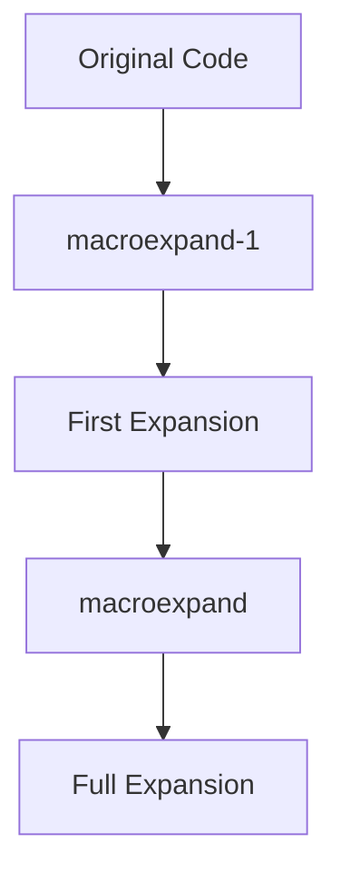

## 9.3.2 Using `macroexpand` and `macroexpand-1`

In this section, we delve into the powerful tools of `macroexpand` and `macroexpand-1` in Clojure, which allow us to explore the expanded code generated by macros. Understanding macro expansion is crucial for debugging and comprehending the behavior of macros, especially for developers transitioning from Java, where metaprogramming is less prevalent.

### Introduction to Macro Expansion

Macros in Clojure, as in other Lisp dialects, are a way to perform metaprogramming by transforming code before it is evaluated. This transformation process is known as macro expansion. Unlike functions, which operate on values, macros operate on code itself, allowing you to extend the language with new syntactic constructs.

#### Why Macro Expansion Matters

Macro expansion is essential for several reasons:

- **Debugging**: It helps identify how macros transform input code, which is crucial for debugging complex macros.
- **Understanding**: It provides insight into how macros work, aiding in learning and comprehension.
- **Optimization**: It allows you to see the final form of code, helping optimize macro usage.

### The Role of `macroexpand` and `macroexpand-1`

Clojure provides two primary functions for examining macro expansions:

- **`macroexpand-1`**: Expands the macro once, showing the immediate transformation.
- **`macroexpand`**: Recursively expands the macro until it is fully expanded into core Clojure forms.

These tools are invaluable for developers, especially those familiar with Java, who are used to more static code structures.

### Using `macroexpand-1`

Let's start by exploring `macroexpand-1`. This function is useful for seeing the first step of macro transformation. Consider the following simple macro:

```clojure
(defmacro unless [condition body]
  `(if (not ~condition) ~body))
```

This macro acts like an `if` statement but executes the body only if the condition is false. To understand how this macro transforms code, we can use `macroexpand-1`:

```clojure
(macroexpand-1 '(unless false (println "This will print")))
```

**Output:**

```clojure
(if (not false) (println "This will print"))
```

Here, `macroexpand-1` shows us that the `unless` macro transforms into an `if` statement with a negated condition.

#### Try It Yourself

Modify the `unless` macro to include an `else` clause. Use `macroexpand-1` to see how the transformation changes.

### Using `macroexpand`

While `macroexpand-1` is useful for single-step expansion, `macroexpand` fully expands the macro, revealing the final code that will be executed. This is particularly helpful for complex macros that involve nested expansions.

Consider a more complex example:

```clojure
(defmacro when-not [condition & body]
  `(if (not ~condition)
     (do ~@body)))
```

Using `macroexpand`:

```clojure
(macroexpand '(when-not false (println "This will print")))
```

**Output:**

```clojure
(if (not false) (do (println "This will print")))
```

In this case, `macroexpand` shows the complete transformation, including the `do` block that wraps the body.

### Comparing with Java

In Java, metaprogramming is typically achieved through reflection or annotation processing, which operates at a different level compared to Clojure's macros. Java's reflection allows runtime inspection and modification of classes, methods, and fields, but it lacks the compile-time code transformation capabilities of macros.

#### Java Example

Consider a Java annotation processor that generates boilerplate code:

```java
@Retention(RetentionPolicy.SOURCE)
@Target(ElementType.TYPE)
public @interface AutoValue {
    // Annotation to generate value class
}
```

This annotation might be processed to generate a class with getters, equals, hashCode, etc. However, this process is more cumbersome and less flexible than Clojure's macros, which can generate and transform code directly.

### Practical Examples

Let's explore some practical examples of using `macroexpand` and `macroexpand-1` to debug and understand macros.

#### Example 1: Debugging a Macro

Suppose we have a macro that logs expressions:

```clojure
(defmacro log [expr]
  `(let [result# ~expr]
     (println "Log:" '~expr "=" result#)
     result#))
```

To debug this macro, we can use `macroexpand-1`:

```clojure
(macroexpand-1 '(log (+ 1 2)))
```

**Output:**

```clojure
(let [result__1234__auto__ (+ 1 2)]
  (println "Log:" '(+ 1 2) "=" result__1234__auto__)
  result__1234__auto__)
```

This output shows how the macro introduces a temporary variable to store the result of the expression.

#### Example 2: Understanding Nested Macros

Consider a nested macro scenario:

```clojure
(defmacro and-then [expr1 expr2]
  `(if ~expr1 ~expr2))

(defmacro or-else [expr1 expr2]
  `(if ~expr1 true ~expr2))
```

Using `macroexpand`:

```clojure
(macroexpand '(and-then (or-else false true) (println "This runs")))
```

**Output:**

```clojure
(if (if false true true) (println "This runs"))
```

Here, `macroexpand` shows the complete transformation, revealing how `and-then` and `or-else` interact.

### Diagrams and Visualizations

To better understand macro expansion, let's visualize the process using a flowchart.



**Diagram Caption**: This flowchart illustrates the process of macro expansion, starting from the original code, through `macroexpand-1`, and finally to the full expansion with `macroexpand`.

### Best Practices for Using `macroexpand` and `macroexpand-1`

- **Start with `macroexpand-1`**: Use it to understand the immediate transformation of your macro.
- **Use `macroexpand` for full context**: When dealing with nested or complex macros, `macroexpand` provides the complete picture.
- **Debug incrementally**: Expand macros step-by-step to isolate issues.
- **Compare with expected output**: Ensure the expanded code matches your expectations.

### Exercises

1. **Modify the `unless` macro** to include an `else` clause and use `macroexpand-1` to verify the transformation.
2. **Create a macro** that conditionally logs messages based on a verbosity level. Use `macroexpand` to ensure it behaves correctly.
3. **Experiment with nested macros**: Write a macro that uses another macro internally and use `macroexpand` to understand the interaction.

### Key Takeaways

- **Macro expansion** is a powerful tool for understanding and debugging macros in Clojure.
- **`macroexpand-1` and `macroexpand`** provide different levels of insight into macro transformations.
- **Clojure's macros** offer more flexibility and power compared to Java's metaprogramming capabilities.
- **Practice and experimentation** are key to mastering macro expansion.

By leveraging `macroexpand` and `macroexpand-1`, we can gain a deeper understanding of how macros work, enabling us to write more robust and efficient Clojure code.

## Quiz: Mastering Macro Expansion in Clojure



### What is the primary purpose of `macroexpand-1` in Clojure?

- [x] To expand a macro once and show the immediate transformation
- [ ] To fully expand a macro recursively
- [ ] To execute a macro
- [ ] To compile a macro into bytecode

> **Explanation:** `macroexpand-1` is used to expand a macro once, showing the immediate transformation without further recursive expansion.

### How does `macroexpand` differ from `macroexpand-1`?

- [x] `macroexpand` fully expands a macro recursively
- [ ] `macroexpand` only expands the first level of a macro
- [ ] `macroexpand` compiles the macro into bytecode
- [ ] `macroexpand` executes the macro

> **Explanation:** `macroexpand` recursively expands a macro until it is fully expanded, unlike `macroexpand-1`, which only performs a single expansion step.

### Which of the following is a benefit of using macro expansion?

- [x] Debugging complex macros
- [x] Understanding macro transformations
- [ ] Compiling macros into machine code
- [ ] Executing macros directly

> **Explanation:** Macro expansion helps in debugging and understanding how macros transform code, which is crucial for developing and maintaining complex macros.

### In Clojure, what does the `log` macro do in the provided example?

- [x] Logs the expression and its result
- [ ] Compiles the expression into bytecode
- [ ] Executes the expression without logging
- [ ] Transforms the expression into a function

> **Explanation:** The `log` macro logs the expression and its result by introducing a temporary variable to store the result.

### What is the output of `(macroexpand '(when-not false (println "This will print")))`?

- [x] `(if (not false) (do (println "This will print")))`
- [ ] `(if false (do (println "This will print")))`
- [ ] `(println "This will print")`
- [ ] `(do (println "This will print"))`

> **Explanation:** The `when-not` macro expands into an `if` statement with a `do` block, as shown in the output.

### What is a key advantage of Clojure's macros over Java's reflection?

- [x] Compile-time code transformation
- [ ] Runtime code execution
- [ ] Direct access to bytecode
- [ ] Easier debugging

> **Explanation:** Clojure's macros allow for compile-time code transformation, which is more flexible and powerful than Java's runtime reflection capabilities.

### Which function would you use to see the full expansion of a nested macro?

- [x] `macroexpand`
- [ ] `macroexpand-1`
- [ ] `eval`
- [ ] `compile`

> **Explanation:** `macroexpand` is used to see the full expansion of a macro, including nested transformations.

### What is the purpose of the `do` block in the `when-not` macro?

- [x] To group multiple expressions
- [ ] To execute a single expression
- [ ] To compile expressions into bytecode
- [ ] To transform expressions into functions

> **Explanation:** The `do` block is used to group multiple expressions so they can be executed sequentially within a single conditional branch.

### How can `macroexpand-1` help in debugging macros?

- [x] By showing the immediate transformation of a macro
- [ ] By executing the macro
- [ ] By compiling the macro into bytecode
- [ ] By optimizing the macro

> **Explanation:** `macroexpand-1` helps in debugging by showing the immediate transformation of a macro, allowing developers to understand how the macro changes the code.

### True or False: `macroexpand` can be used to execute a macro.

- [ ] True
- [x] False

> **Explanation:** `macroexpand` is used to expand a macro, not to execute it. Execution occurs after the macro has been fully expanded and evaluated.


