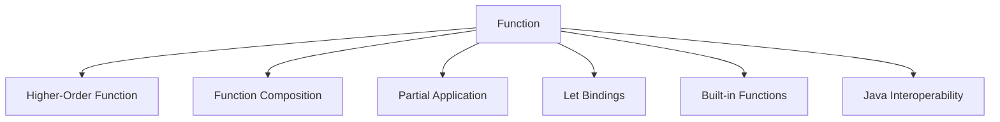

## 9.4.2 Alternatives to Macros

In Clojure, macros are a powerful tool that allows developers to extend the language by manipulating code as data. However, they should be used judiciously. As experienced Java developers transitioning to Clojure, it's crucial to understand that **functions** should be your first choice for code reuse and abstraction. Macros should only be considered when functions cannot achieve the desired result due to evaluation timing or syntactic requirements. In this section, we'll explore the alternatives to macros, focusing on functions and other Clojure features that can often serve your needs without resorting to macros.

### Understanding the Role of Functions

Functions in Clojure are first-class citizens, meaning they can be passed as arguments, returned from other functions, and assigned to variables. This flexibility allows for powerful abstractions and code reuse without the complexity that macros introduce.

#### Functions vs. Macros

Let's start by comparing functions and macros to understand when each is appropriate:

- **Functions**: Evaluate their arguments before executing the function body. They are ideal for most code reuse and abstraction tasks.
- **Macros**: Operate on unevaluated code, allowing you to manipulate the syntax and control evaluation. They are necessary when you need to change the order of evaluation or introduce new syntactic constructs.

**Example: Function vs. Macro**

```clojure
;; Function example
(defn add [a b]
  (+ a b))

;; Macro example
(defmacro unless [condition body]
  `(if (not ~condition) ~body))
```

In the example above, `add` is a simple function that adds two numbers, while `unless` is a macro that inverts a condition before executing the body. The macro is necessary here because it manipulates the evaluation order.

### Leveraging Higher-Order Functions

Higher-order functions (HOFs) are functions that take other functions as arguments or return them as results. They are a cornerstone of functional programming and can often replace macros for abstraction.

#### Common Higher-Order Functions

Clojure provides several built-in higher-order functions that can replace many macro use cases:

- **`map`**: Applies a function to each element of a collection.
- **`filter`**: Selects elements from a collection based on a predicate.
- **`reduce`**: Accumulates a result by applying a function to elements of a collection.

**Example: Using `map` Instead of a Macro**

```clojure
;; Using map to transform a collection
(defn square-all [numbers]
  (map #(* % %) numbers))

;; Usage
(square-all [1 2 3 4]) ; => (1 4 9 16)
```

In this example, `map` is used to apply a squaring function to each element of a collection, demonstrating how HOFs can achieve code reuse without macros.

### Function Composition and Partial Application

Function composition and partial application are powerful techniques for building complex behavior from simple functions.

#### Function Composition

Function composition allows you to combine multiple functions into a single function. In Clojure, this is done using the `comp` function.

**Example: Function Composition**

```clojure
(defn add-one [x] (+ x 1))
(defn square [x] (* x x))

(def add-one-and-square (comp square add-one))

;; Usage
(add-one-and-square 2) ; => 9
```

Here, `add-one-and-square` is a composed function that first adds one to its argument and then squares the result.

#### Partial Application

Partial application involves fixing a few arguments of a function, producing another function of smaller arity. This is achieved using the `partial` function in Clojure.

**Example: Partial Application**

```clojure
(defn multiply [a b] (* a b))

(def double (partial multiply 2))

;; Usage
(double 5) ; => 10
```

In this example, `double` is a partially applied function that multiplies its argument by 2.

### Using Let Bindings for Local Abstractions

The `let` form in Clojure allows you to create local bindings, which can be used to simplify complex expressions without the need for macros.

**Example: Using `let` for Local Abstraction**

```clojure
(defn calculate-area [length width]
  (let [area (* length width)]
    (str "The area is " area)))

;; Usage
(calculate-area 5 10) ; => "The area is 50"
```

In this example, `let` is used to bind the result of the multiplication to `area`, making the code more readable.

### Leveraging Clojure's Built-in Functions

Clojure's rich standard library provides many functions that can replace macros for common tasks. Familiarizing yourself with these functions can help you avoid unnecessary macro usage.

#### Example: Using `when` Instead of a Macro

Instead of writing a custom macro for conditional execution, you can use Clojure's built-in `when` function:

```clojure
;; Using when for conditional execution
(defn print-if-even [n]
  (when (even? n)
    (println n)))

;; Usage
(print-if-even 4) ; => Prints "4"
(print-if-even 3) ; => Does nothing
```

### Exploring Java Interoperability

Clojure's seamless interoperability with Java allows you to leverage existing Java libraries and frameworks, reducing the need for macros to extend functionality.

#### Example: Using Java Libraries

```clojure
;; Using Java's Math library
(defn calculate-sqrt [x]
  (Math/sqrt x))

;; Usage
(calculate-sqrt 16) ; => 4.0
```

In this example, we use Java's `Math` library to calculate the square root, demonstrating how Java interoperability can provide functionality without macros.

### Try It Yourself

To deepen your understanding, try modifying the examples above:

- Change the `square-all` function to cube each number instead.
- Compose a new function that subtracts one and then doubles the result.
- Use `let` to create a local binding for a more complex calculation.

### Diagrams and Visual Aids

To visualize these concepts, let's use a few diagrams:



**Diagram 1: Alternatives to Macros in Clojure**

This diagram illustrates the various alternatives to macros in Clojure, emphasizing the central role of functions.

### Exercises

1. **Exercise 1**: Rewrite a simple macro using a combination of functions and higher-order functions.
2. **Exercise 2**: Use `let` to refactor a complex function into simpler, more readable code.
3. **Exercise 3**: Implement a small library using Clojure's built-in functions and Java interoperability, avoiding macros.

### Key Takeaways

- **Functions First**: Always consider functions as your primary tool for code reuse and abstraction.
- **Higher-Order Functions**: Leverage Clojure's rich set of higher-order functions to manipulate collections and build complex behavior.
- **Function Composition**: Use composition and partial application to create new functions from existing ones.
- **Local Abstractions**: Utilize `let` bindings to simplify complex expressions.
- **Built-in Functions**: Familiarize yourself with Clojure's standard library to avoid reinventing the wheel.
- **Java Interoperability**: Take advantage of Clojure's seamless integration with Java to extend functionality without macros.

By focusing on these alternatives, you can write clean, maintainable, and idiomatic Clojure code without the complexity of macros. Now that we've explored these alternatives, let's apply these concepts to enhance your Clojure applications.

For further reading, consider exploring the [Official Clojure Documentation](https://clojure.org/reference/documentation) and [ClojureDocs](https://clojuredocs.org/).

## Quiz: Understanding Alternatives to Macros in Clojure



### Which of the following is a higher-order function in Clojure?

- [x] map
- [ ] def
- [ ] let
- [ ] println

> **Explanation:** `map` is a higher-order function that applies a function to each element of a collection.

### What is the primary advantage of using functions over macros in Clojure?

- [x] Simplicity and maintainability
- [ ] Ability to manipulate syntax
- [ ] Control over evaluation order
- [ ] Creating new syntactic constructs

> **Explanation:** Functions are simpler and more maintainable than macros, which can introduce complexity.

### How does function composition work in Clojure?

- [x] By combining multiple functions into a single function
- [ ] By creating new syntactic constructs
- [ ] By manipulating unevaluated code
- [ ] By controlling evaluation order

> **Explanation:** Function composition combines multiple functions into a single function using the `comp` function.

### What is the purpose of the `let` form in Clojure?

- [x] To create local bindings for variables
- [ ] To define new functions
- [ ] To manipulate syntax
- [ ] To control evaluation order

> **Explanation:** `let` creates local bindings for variables, simplifying complex expressions.

### Which of the following is an example of partial application in Clojure?

- [x] (partial + 2)
- [ ] (defn add [a b] (+ a b))
- [ ] (let [x 5] (* x x))
- [ ] (println "Hello, World!")

> **Explanation:** `(partial + 2)` is an example of partial application, fixing one argument of the `+` function.

### How can Java interoperability be used as an alternative to macros in Clojure?

- [x] By leveraging existing Java libraries and frameworks
- [ ] By creating new syntactic constructs
- [ ] By manipulating unevaluated code
- [ ] By controlling evaluation order

> **Explanation:** Java interoperability allows you to use existing Java libraries and frameworks, reducing the need for macros.

### What is the role of built-in functions in avoiding macros?

- [x] They provide common functionality without the need for custom macros
- [ ] They allow manipulation of unevaluated code
- [ ] They control evaluation order
- [ ] They create new syntactic constructs

> **Explanation:** Built-in functions provide common functionality, reducing the need for custom macros.

### Which of the following is a benefit of using higher-order functions?

- [x] Code reuse and abstraction
- [ ] Creating new syntactic constructs
- [ ] Manipulating unevaluated code
- [ ] Controlling evaluation order

> **Explanation:** Higher-order functions enable code reuse and abstraction by taking functions as arguments or returning them.

### What is the primary use case for macros in Clojure?

- [x] When functions cannot achieve the desired result due to evaluation timing or syntactic requirements
- [ ] To simplify code and improve maintainability
- [ ] To create local bindings for variables
- [ ] To leverage existing Java libraries

> **Explanation:** Macros are used when functions cannot achieve the desired result due to evaluation timing or syntactic requirements.

### True or False: Functions in Clojure can be passed as arguments, returned from other functions, and assigned to variables.

- [x] True
- [ ] False

> **Explanation:** Functions in Clojure are first-class citizens, meaning they can be passed as arguments, returned from other functions, and assigned to variables.


