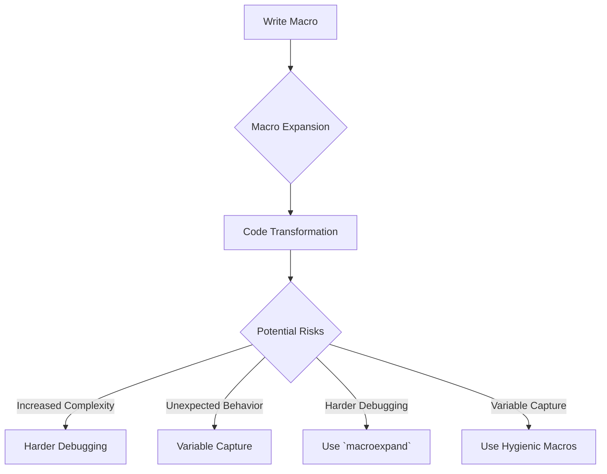

## 9.4.3 Potential Risks of Macros

Macros in Clojure are a powerful tool that allows developers to extend the language and create domain-specific languages (DSLs). However, with great power comes great responsibility. While macros can significantly enhance the expressiveness and flexibility of your code, they also introduce potential risks that need to be carefully managed. In this section, we will explore these risks, compare them to Java's reflection API, and provide best practices for using macros effectively.

### Understanding Macros in Clojure

Before diving into the risks, let's briefly revisit what macros are in Clojure. Macros are a feature of Lisp languages that allow you to manipulate code as data. They enable you to write code that generates other code, which is then compiled and executed. This metaprogramming capability allows for powerful abstractions and code transformations.

#### Example of a Simple Macro

```clojure
(defmacro unless [condition & body]
  `(if (not ~condition)
     (do ~@body)))

;; Usage
(unless false
  (println "This will print because the condition is false."))
```

In this example, the `unless` macro inverts the logic of an `if` statement, executing the body only if the condition is false.

### Potential Risks of Using Macros

While macros can be incredibly useful, they come with several potential risks that developers must be aware of:

#### 1. Increased Code Complexity

Macros can make code harder to read and understand, especially for those who are not familiar with the macro's implementation. This complexity arises because macros can transform code in non-obvious ways, making it difficult to predict the final output.

##### Java Comparison

In Java, similar complexity can arise when using the reflection API to dynamically manipulate classes and methods. Both macros and reflection can obscure the flow of the program, making it harder to follow.

```java
// Java Reflection Example
import java.lang.reflect.Method;

public class ReflectionExample {
    public static void main(String[] args) throws Exception {
        Method method = String.class.getMethod("toUpperCase");
        String result = (String) method.invoke("hello");
        System.out.println(result); // Outputs: HELLO
    }
}
```

In this Java example, reflection is used to invoke a method dynamically, which can be difficult to trace and debug.

#### 2. Harder Debugging

Macros can complicate debugging because the code that is executed is not the code that is written. This can lead to confusion when trying to trace the source of a bug.

##### Debugging Challenges

- **Macro Expansion**: Understanding how a macro expands is crucial. Use `macroexpand` to see the expanded code.
- **Error Messages**: Errors in macro-generated code can be cryptic and may not point directly to the source of the problem.

```clojure
;; Debugging Macro Expansion
(macroexpand '(unless false (println "Debugging macro expansion.")))
```

#### 3. Potential for Unexpected Behavior

Macros can introduce unexpected behavior if not carefully designed. This is because they operate at the syntactic level, and any changes to the syntax can have far-reaching effects.

##### Example of Unexpected Behavior

```clojure
(defmacro my-macro [x]
  `(println "The value is:" ~x))

;; Unexpected behavior if x is a complex expression
(my-macro (+ 1 2)) ;; Outputs: The value is: 3
```

If `x` is a complex expression, the macro may not behave as expected if it doesn't handle the expression correctly.

#### 4. Risk of Variable Capture

Variable capture occurs when a macro inadvertently captures variables from its surrounding context, leading to subtle bugs.

##### Avoiding Variable Capture

- **Hygienic Macros**: Use techniques to ensure that macros do not capture variables unintentionally.
- **Explicit Naming**: Use unique names within macros to avoid conflicts.

```clojure
(defmacro safe-macro [x]
  `(let [result# ~x]
     (println "Result is:" result#)))
```

In this example, `result#` is a unique name generated by the macro to avoid capturing variables from the surrounding context.

### Best Practices for Using Macros

To mitigate the risks associated with macros, consider the following best practices:

#### 1. Use Macros Sparingly

Only use macros when necessary. Prefer functions for most tasks, as they are easier to understand and debug.

#### 2. Thoroughly Test Macros

Write comprehensive tests for macros to ensure they behave as expected in all scenarios.

#### 3. Document Macro Behavior

Provide clear documentation for macros, including examples of usage and explanations of how they work.

#### 4. Use `macroexpand` for Debugging

Regularly use `macroexpand` to understand how your macros transform code and to catch potential issues early.

#### 5. Consider Alternatives

Before writing a macro, consider if a function or a higher-order function could achieve the same result.

### Visualizing Macro Risks

To better understand the flow and potential pitfalls of macros, let's visualize the process using a flowchart.



**Diagram Caption**: This flowchart illustrates the process of writing a macro, expanding it, transforming code, and the potential risks involved, such as increased complexity, harder debugging, unexpected behavior, and variable capture.

### Try It Yourself

To gain hands-on experience with macros, try modifying the examples provided:

- **Experiment with Macro Expansion**: Use `macroexpand` to see how different macros expand and transform code.
- **Create a Hygienic Macro**: Write a macro that avoids variable capture by using unique names.
- **Test for Edge Cases**: Write tests for your macros to handle edge cases and unexpected inputs.

### Exercises

1. **Write a Macro**: Create a macro that logs the execution time of a block of code. Ensure it handles edge cases and provides meaningful output.
2. **Debug a Macro**: Given a macro with a known bug, use `macroexpand` to identify and fix the issue.
3. **Compare with Java**: Write a Java program using reflection to achieve similar functionality as a Clojure macro. Compare the complexity and readability of both approaches.

### Key Takeaways

- **Macros are powerful but risky**: They can increase code complexity and introduce unexpected behavior if not used carefully.
- **Debugging macros requires understanding expansion**: Use tools like `macroexpand` to aid in debugging.
- **Best practices can mitigate risks**: Use macros sparingly, document them well, and thoroughly test their behavior.

By understanding the potential risks of macros and following best practices, you can harness their power while minimizing their drawbacks. Now that we've explored the risks and best practices for using macros, let's apply these concepts to create robust and maintainable Clojure applications.

### Further Reading

- [Official Clojure Documentation on Macros](https://clojure.org/reference/macros)
- [ClojureDocs: Macros](https://clojuredocs.org/quickref#Macros)
- [Clojure for the Brave and True: Macros](https://www.braveclojure.com/macros/)

## Quiz: Understanding the Risks of Macros in Clojure



### What is a primary risk associated with using macros in Clojure?

- [x] Increased code complexity
- [ ] Improved performance
- [ ] Simplified debugging
- [ ] Enhanced readability

> **Explanation:** Macros can increase code complexity by transforming code in non-obvious ways, making it harder to understand.

### How can you visualize the expanded form of a macro in Clojure?

- [x] Use `macroexpand`
- [ ] Use `println`
- [ ] Use `eval`
- [ ] Use `defmacro`

> **Explanation:** The `macroexpand` function is used to see how a macro expands and transforms code.

### What is variable capture in the context of macros?

- [x] When a macro inadvertently captures variables from its surrounding context
- [ ] When a macro fails to compile
- [ ] When a macro improves performance
- [ ] When a macro simplifies code

> **Explanation:** Variable capture occurs when a macro unintentionally uses variables from its surrounding context, leading to potential bugs.

### Which of the following is a best practice for using macros?

- [x] Use macros sparingly
- [ ] Use macros for all tasks
- [ ] Avoid testing macros
- [ ] Ignore macro expansion

> **Explanation:** Macros should be used sparingly and only when necessary, as they can complicate code.

### What tool can help you understand how a macro transforms code?

- [x] `macroexpand`
- [ ] `println`
- [x] `macroexpand-1`
- [ ] `defmacro`

> **Explanation:** Both `macroexpand` and `macroexpand-1` can be used to understand macro transformations.

### What is a potential consequence of using macros without thorough testing?

- [x] Unexpected behavior
- [ ] Improved readability
- [ ] Simplified debugging
- [ ] Enhanced performance

> **Explanation:** Without thorough testing, macros can introduce unexpected behavior due to their code transformations.

### How can you avoid variable capture in macros?

- [x] Use hygienic macros
- [ ] Use `println`
- [x] Use unique names within macros
- [ ] Avoid using macros

> **Explanation:** Hygienic macros and unique naming help avoid variable capture.

### What is a common challenge when debugging macros?

- [x] Understanding macro expansion
- [ ] Improved performance
- [ ] Simplified code
- [ ] Enhanced readability

> **Explanation:** Debugging macros can be challenging due to the need to understand how they expand and transform code.

### What is a key takeaway when using macros in Clojure?

- [x] Macros are powerful but risky
- [ ] Macros simplify all code
- [ ] Macros improve performance
- [ ] Macros enhance readability

> **Explanation:** While powerful, macros can introduce risks such as increased complexity and unexpected behavior.

### True or False: Macros should be used for all tasks in Clojure.

- [ ] True
- [x] False

> **Explanation:** Macros should be used sparingly and only when necessary, as they can complicate code and introduce risks.


