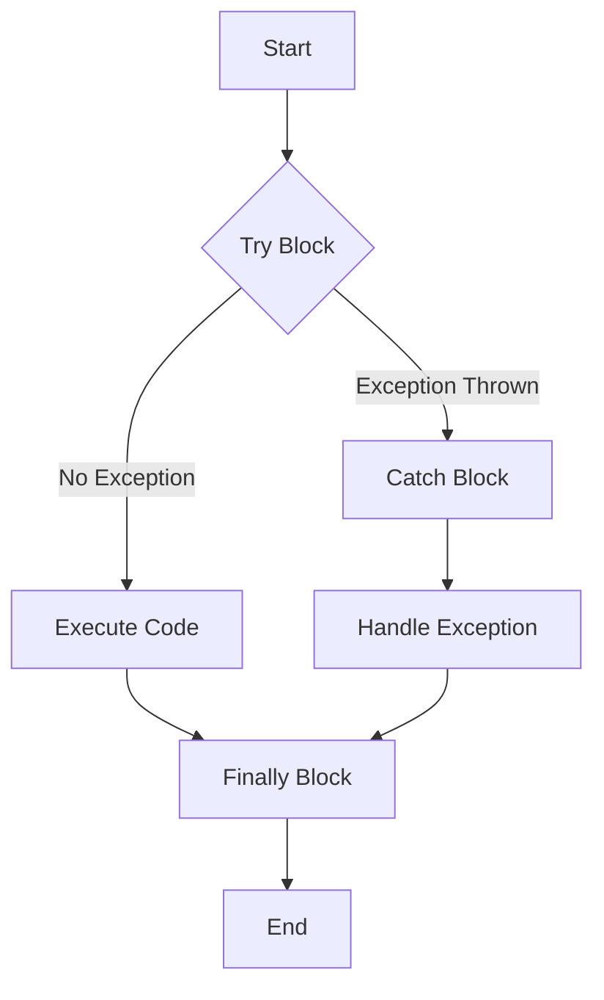

## 9.5.1 Using `try`, `catch`, `finally`

Exception handling is a critical aspect of building robust applications, and Clojure, a language that runs on the Java Virtual Machine (JVM), provides a familiar mechanism for managing exceptions through the `try`, `catch`, and `finally` constructs. This section will delve into the nuances of these constructs, offering insights and practical examples to equip you with the skills needed to handle exceptions effectively in your Clojure applications.

### Understanding Exception Handling in Clojure

Clojure's approach to exception handling is influenced by its JVM heritage, allowing developers to leverage the same robust mechanisms available in Java. The `try`, `catch`, and `finally` constructs in Clojure are used to manage exceptions that may arise during the execution of a program, ensuring that errors are handled gracefully and resources are cleaned up appropriately.

#### The `try` Block

The `try` block in Clojure is used to enclose code that may potentially throw an exception. It acts as a safeguard, allowing the program to attempt execution while providing a mechanism to catch and handle any exceptions that occur.

```clojure
(try
  ;; Code that might throw an exception
  (/ 10 0)  ; Division by zero
  (catch ArithmeticException e
    (println "Caught an arithmetic exception:" (.getMessage e)))
  (finally
    (println "Cleanup actions")))
```

In the example above, the division by zero operation is enclosed within a `try` block. If an exception occurs, control is transferred to the corresponding `catch` block.

#### The `catch` Block

The `catch` block is used to handle specific exceptions that are thrown within the `try` block. It allows developers to specify the type of exception they are interested in catching and provides a handler to execute when such an exception is encountered.

```clojure
(catch ArithmeticException e
  (println "Caught an arithmetic exception:" (.getMessage e)))
```

In this snippet, the `catch` block is designed to handle `ArithmeticException`, which is thrown when a division by zero is attempted. The exception object `e` is available within the `catch` block, allowing access to the exception's details.

#### The `finally` Block

The `finally` block contains code that is executed regardless of whether an exception is thrown or not. It is typically used for cleanup activities, such as closing resources or releasing locks.

```clojure
(finally
  (println "Cleanup actions"))
```

In the example, the `finally` block ensures that the message "Cleanup actions" is printed, regardless of the outcome of the `try` block. This guarantees that necessary cleanup operations are performed.

### Practical Code Examples

Let's explore more comprehensive examples to illustrate the use of `try`, `catch`, and `finally` in real-world scenarios.

#### Example 1: File Handling

Consider a scenario where you need to read data from a file. File operations are prone to exceptions, such as file not found or read errors. Using `try`, `catch`, and `finally`, you can handle these exceptions gracefully.

```clojure
(import '[java.io BufferedReader FileReader IOException])

(defn read-file [filename]
  (try
    (with-open [reader (BufferedReader. (FileReader. filename))]
      (loop [line (.readLine reader)]
        (when line
          (println line)
          (recur (.readLine reader)))))
    (catch IOException e
      (println "An error occurred while reading the file:" (.getMessage e)))
    (finally
      (println "Finished attempting to read the file."))))
```

In this example, the `read-file` function attempts to read a file line by line. If an `IOException` occurs, it is caught and handled, and a message is printed. The `finally` block ensures that a completion message is always printed, indicating the end of the file reading attempt.

#### Example 2: Network Operations

Network operations, such as making HTTP requests, can also benefit from exception handling. Let's consider an example where we make an HTTP GET request and handle potential exceptions.

```clojure
(import '[java.net URL HttpURLConnection])

(defn fetch-url [url]
  (try
    (let [connection (.openConnection (URL. url))]
      (.setRequestMethod connection "GET")
      (.connect connection)
      (let [status (.getResponseCode connection)]
        (if (= status 200)
          (println "Successfully fetched URL:" url)
          (println "Failed to fetch URL with status:" status))))
    (catch Exception e
      (println "An error occurred while fetching the URL:" (.getMessage e)))
    (finally
      (println "Network operation completed."))))
```

Here, the `fetch-url` function attempts to connect to a URL and retrieve its status. If any exception occurs during the operation, it is caught and handled, and a message is printed. The `finally` block ensures that a completion message is printed, regardless of the operation's success or failure.

### Best Practices for Exception Handling

When using `try`, `catch`, and `finally` in Clojure, consider the following best practices to ensure effective and efficient exception handling:

1. **Catch Specific Exceptions**: Always catch the most specific exceptions possible. This allows for more precise error handling and avoids catching unintended exceptions.

2. **Avoid Catching `Throwable`**: Catching `Throwable` is generally discouraged as it can catch errors that should not be handled, such as `OutOfMemoryError`.

3. **Use `finally` for Cleanup**: Reserve the `finally` block for cleanup actions that must be executed regardless of whether an exception occurs.

4. **Log Exceptions**: Always log exceptions to aid in debugging and provide insights into the application's behavior during failures.

5. **Re-throw Exceptions When Necessary**: In some cases, it may be appropriate to re-throw an exception after logging or performing specific actions. This allows higher-level code to handle the exception if needed.

6. **Avoid Silent Failures**: Ensure that exceptions are not silently ignored. Always provide meaningful feedback or logging to indicate that an error has occurred.

### Common Pitfalls and Optimization Tips

While exception handling is a powerful tool, there are common pitfalls to avoid and optimization tips to consider:

- **Overusing `try` Blocks**: Avoid wrapping large sections of code in a single `try` block. Instead, isolate specific operations that may throw exceptions.

- **Ignoring Exceptions**: Never ignore exceptions without providing some form of handling or logging. Ignored exceptions can lead to unexpected behavior and difficult-to-diagnose issues.

- **Performance Considerations**: Exception handling can introduce overhead, especially in performance-critical sections of code. Use exception handling judiciously and avoid using it for control flow.

- **Testing Exception Scenarios**: Ensure that your tests cover exception scenarios to verify that your exception handling logic behaves as expected.

### Diagrams and Flowcharts

To further illustrate the flow of exception handling in Clojure, consider the following flowchart that depicts the execution flow of a `try`, `catch`, and `finally` construct:



This flowchart demonstrates the sequence of execution when an exception is thrown and handled within a `try`, `catch`, and `finally` construct.

### Conclusion

Mastering exception handling in Clojure is essential for building robust and reliable applications. By leveraging the `try`, `catch`, and `finally` constructs, you can effectively manage errors, ensure resource cleanup, and provide meaningful feedback to users and developers. Remember to follow best practices, avoid common pitfalls, and continuously test your exception handling logic to ensure it meets the needs of your application.

By understanding and applying these concepts, you will be well-equipped to handle exceptions in your Clojure applications, ensuring they are resilient and maintainable.

## Quiz Time!



### What is the purpose of the `try` block in Clojure?

- [x] To enclose code that might throw an exception
- [ ] To handle specific exceptions
- [ ] To execute code regardless of exceptions
- [ ] To log exceptions

> **Explanation:** The `try` block is used to enclose code that might throw an exception, allowing the program to attempt execution while providing a mechanism to catch and handle any exceptions that occur.

### What does the `catch` block do in a `try`-`catch`-`finally` construct?

- [ ] Executes code regardless of exceptions
- [x] Handles specific exceptions
- [ ] Encloses code that might throw an exception
- [ ] Logs exceptions

> **Explanation:** The `catch` block is used to handle specific exceptions that are thrown within the `try` block, allowing developers to specify the type of exception they are interested in catching and providing a handler to execute when such an exception is encountered.

### What is the role of the `finally` block in exception handling?

- [ ] To handle specific exceptions
- [ ] To enclose code that might throw an exception
- [x] To execute code regardless of exceptions
- [ ] To log exceptions

> **Explanation:** The `finally` block contains code that is executed regardless of whether an exception is thrown or not, typically used for cleanup activities such as closing resources or releasing locks.

### Which of the following is a best practice when catching exceptions?

- [ ] Catching `Throwable`
- [x] Catching specific exceptions
- [ ] Ignoring exceptions
- [ ] Using exceptions for control flow

> **Explanation:** Catching specific exceptions allows for more precise error handling and avoids catching unintended exceptions, which is considered a best practice.

### What should you avoid doing in a `catch` block?

- [ ] Logging exceptions
- [ ] Re-throwing exceptions
- [x] Ignoring exceptions
- [ ] Handling specific exceptions

> **Explanation:** Ignoring exceptions without providing some form of handling or logging can lead to unexpected behavior and difficult-to-diagnose issues, so it should be avoided.

### Why is it discouraged to catch `Throwable` in Clojure?

- [ ] It is not supported in Clojure
- [x] It can catch errors that should not be handled
- [ ] It is inefficient
- [ ] It is a common practice

> **Explanation:** Catching `Throwable` can catch errors that should not be handled, such as `OutOfMemoryError`, which is generally discouraged.

### What is a common pitfall when using `try` blocks?

- [ ] Logging exceptions
- [x] Overusing `try` blocks
- [ ] Catching specific exceptions
- [ ] Using `finally` for cleanup

> **Explanation:** Overusing `try` blocks by wrapping large sections of code can lead to inefficient exception handling. It is better to isolate specific operations that may throw exceptions.

### When should you use the `finally` block?

- [x] For cleanup actions that must be executed regardless of exceptions
- [ ] To handle specific exceptions
- [ ] To enclose code that might throw an exception
- [ ] To log exceptions

> **Explanation:** The `finally` block should be used for cleanup actions that must be executed regardless of whether an exception occurs, ensuring necessary operations are performed.

### What is a benefit of logging exceptions?

- [x] Aids in debugging and provides insights into application behavior
- [ ] Increases code complexity
- [ ] Makes code execution faster
- [ ] Hides errors from users

> **Explanation:** Logging exceptions aids in debugging and provides insights into the application's behavior during failures, making it a beneficial practice.

### True or False: The `finally` block is optional in a `try`-`catch`-`finally` construct.

- [x] True
- [ ] False

> **Explanation:** The `finally` block is optional in a `try`-`catch`-`finally` construct. It is used for cleanup actions but is not required if no such actions are needed.


