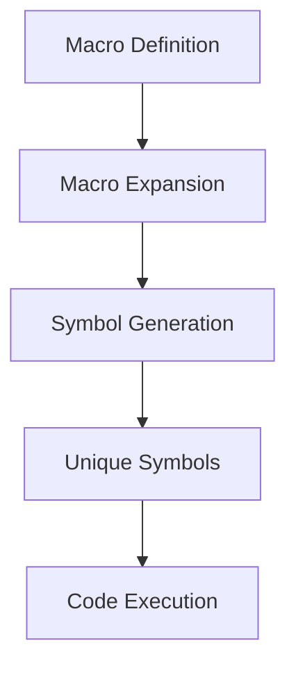

## 9.5.1 Writing Hygienic Macros

In the world of programming, macros are powerful tools that allow developers to extend the language by writing code that writes code. However, with great power comes great responsibility. One of the critical challenges in macro writing is ensuring that macros are *hygienic*. This means that macros should not unintentionally capture or interfere with symbols in the code where they are expanded. In this section, we will delve into the concept of hygiene in macros, introduce the use of `gensym` and the auto-gensym syntax (`x#`), and provide practical examples to illustrate these concepts.

### Understanding Macro Hygiene

**Macro hygiene** refers to the practice of ensuring that macros do not inadvertently capture variables from the surrounding code or introduce naming conflicts. This is crucial because macros operate at the syntactic level, transforming code before it is evaluated. Without hygiene, macros can lead to subtle bugs that are difficult to diagnose.

#### The Problem of Symbol Capture

When a macro expands, it can introduce new symbols into the code. If these symbols clash with existing ones, it can lead to unexpected behavior. Consider the following example:

```clojure
(defmacro capture-example [x]
  `(let [y 10]
     (+ ~x y)))

(let [y 5]
  (capture-example y))
```

In this example, the macro `capture-example` introduces a local binding for `y`. However, when the macro is expanded within the `let` form, it inadvertently captures the `y` from the surrounding context, leading to unexpected results.

#### Ensuring Hygiene with `gensym`

To prevent such issues, Clojure provides the `gensym` function, which generates unique symbols. By using `gensym`, we can ensure that the symbols introduced by a macro do not clash with those in the surrounding code.

```clojure
(defmacro hygienic-example [x]
  (let [y (gensym "y")]
    `(let [~y 10]
       (+ ~x ~y))))

(let [y 5]
  (hygienic-example y))
```

In this revised example, `gensym` is used to create a unique symbol for `y`, ensuring that the macro does not capture the `y` from the surrounding context.

### The Auto-Gensym Syntax

Clojure also provides a more concise way to generate unique symbols using the auto-gensym syntax. By appending `#` to a symbol, Clojure automatically generates a unique version of that symbol.

```clojure
(defmacro auto-gensym-example [x]
  `(let [y# 10]
     (+ ~x y#)))

(let [y 5]
  (auto-gensym-example y))
```

In this example, `y#` is automatically converted into a unique symbol, achieving the same effect as using `gensym`.

### Practical Examples of Hygienic Macros

Let's explore some practical examples to solidify our understanding of writing hygienic macros.

#### Example 1: A Safe `when-let` Macro

The `when-let` construct is useful for conditionally binding a value and executing a block of code. However, if not written hygienically, it can lead to symbol capture issues.

```clojure
(defmacro safe-when-let [bindings & body]
  (let [temp-sym (gensym "temp")]
    `(let [~temp-sym ~bindings]
       (when ~temp-sym
         ~@body))))

(let [x nil]
  (safe-when-let [x 42]
    (println "x is" x)))
```

In this example, `gensym` is used to create a temporary symbol for the binding, ensuring that the macro does not interfere with any existing `x` in the surrounding context.

#### Example 2: A Logging Macro

Consider a macro that logs the execution of a block of code. Without hygiene, it could capture symbols from the surrounding code.

```clojure
(defmacro log-execution [& body]
  (let [start-time (gensym "start-time")]
    `(let [~start-time (System/currentTimeMillis)]
       (println "Execution started at:" ~start-time)
       ~@body
       (println "Execution finished at:" (System/currentTimeMillis)))))

(log-execution
  (Thread/sleep 1000)
  (println "Hello, World!"))
```

Here, `gensym` ensures that the `start-time` symbol is unique, preventing any potential conflicts with existing symbols.

### Comparing with Java

In Java, macros do not exist in the same way they do in Clojure. Instead, Java relies on annotations and reflection for metaprogramming tasks. While annotations can modify behavior at runtime, they do not offer the same level of syntactic transformation as macros. This makes Clojure macros a powerful tool for code generation and transformation, albeit with the added responsibility of ensuring hygiene.

### Try It Yourself

To deepen your understanding, try modifying the examples above. Experiment with different symbols and observe how `gensym` and auto-gensym prevent symbol capture. Consider writing your own macros and test their behavior in various contexts.

### Diagrams and Visualizations

To better understand the flow of macro expansion and symbol generation, consider the following diagram:



**Diagram Caption**: This flowchart illustrates the process of macro expansion, symbol generation using `gensym`, and the execution of the expanded code.

### Exercises

1. **Exercise 1**: Write a macro that safely swaps two variables without capturing any symbols from the surrounding context.
2. **Exercise 2**: Create a macro that logs the execution time of a function, ensuring that no symbols are captured.
3. **Exercise 3**: Implement a macro that conditionally executes code based on a predicate, using `gensym` to maintain hygiene.

### Key Takeaways

- **Macro hygiene** is crucial for preventing symbol capture and ensuring reliable macro behavior.
- **`gensym`** and **auto-gensym syntax** are essential tools for creating unique symbols in macros.
- Clojure macros offer powerful metaprogramming capabilities, distinct from Java's reflection and annotations.
- Experimenting with macros can deepen your understanding of Clojure's metaprogramming features.

By mastering hygienic macros, you can harness the full power of Clojure's metaprogramming capabilities while avoiding common pitfalls. Now that we've explored how to write hygienic macros, let's apply these concepts to create robust and reliable Clojure applications.

## Quiz: Test Your Knowledge on Hygienic Macros



### What is the primary purpose of macro hygiene in Clojure?

- [x] To prevent symbol capture and naming conflicts
- [ ] To improve macro performance
- [ ] To simplify macro syntax
- [ ] To enable macro debugging

> **Explanation:** Macro hygiene ensures that macros do not unintentionally capture or interfere with symbols in the code where they are expanded.

### How does `gensym` help in writing hygienic macros?

- [x] It generates unique symbols to avoid naming conflicts
- [ ] It simplifies macro syntax
- [ ] It improves macro performance
- [ ] It provides debugging information

> **Explanation:** `gensym` generates unique symbols, preventing naming conflicts and ensuring macro hygiene.

### What is the auto-gensym syntax in Clojure?

- [x] Appending `#` to a symbol to generate a unique version
- [ ] Using `gensym` to create a unique symbol
- [ ] Defining a macro with `defmacro`
- [ ] Using `let` to bind a symbol

> **Explanation:** The auto-gensym syntax involves appending `#` to a symbol, automatically generating a unique version.

### Which of the following is a benefit of hygienic macros?

- [x] They prevent symbol capture from the surrounding context
- [ ] They improve runtime performance
- [ ] They simplify code readability
- [ ] They enable dynamic code generation

> **Explanation:** Hygienic macros prevent symbol capture, ensuring that macros do not interfere with the surrounding code.

### What is a common issue that arises from non-hygienic macros?

- [x] Symbol capture and naming conflicts
- [ ] Increased code complexity
- [ ] Reduced code readability
- [ ] Slower execution time

> **Explanation:** Non-hygienic macros can lead to symbol capture and naming conflicts, causing unexpected behavior.

### How can you ensure a macro does not capture symbols from the surrounding code?

- [x] Use `gensym` to generate unique symbols
- [ ] Use `defmacro` to define the macro
- [ ] Use `let` to bind symbols
- [ ] Use `println` to debug the macro

> **Explanation:** Using `gensym` generates unique symbols, preventing symbol capture from the surrounding code.

### What is the role of `gensym` in macro hygiene?

- [x] To create unique symbols for macro expansion
- [ ] To define macros
- [ ] To bind symbols in a `let` form
- [ ] To log macro execution

> **Explanation:** `gensym` creates unique symbols, ensuring that macros do not capture symbols from the surrounding context.

### Which syntax automatically generates a unique symbol in Clojure?

- [x] Appending `#` to a symbol
- [ ] Using `gensym`
- [ ] Using `defmacro`
- [ ] Using `let`

> **Explanation:** Appending `#` to a symbol automatically generates a unique version, ensuring macro hygiene.

### What is a key difference between Clojure macros and Java annotations?

- [x] Clojure macros transform code at the syntactic level, while Java annotations modify behavior at runtime
- [ ] Clojure macros improve runtime performance, while Java annotations do not
- [ ] Clojure macros simplify code readability, while Java annotations do not
- [ ] Clojure macros enable dynamic code generation, while Java annotations do not

> **Explanation:** Clojure macros transform code at the syntactic level, whereas Java annotations modify behavior at runtime.

### True or False: Hygienic macros can prevent symbol capture and naming conflicts.

- [x] True
- [ ] False

> **Explanation:** Hygienic macros are designed to prevent symbol capture and naming conflicts, ensuring reliable macro behavior.


