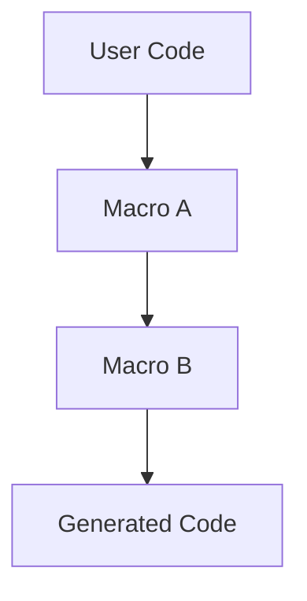
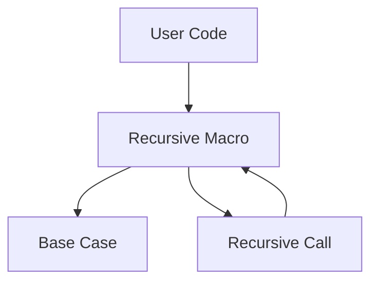

## 9.5.2 Macro Composition and Recursion

As experienced Java developers, you are likely familiar with the concept of code reuse and modularity through classes and methods. In Clojure, macros offer a powerful way to achieve similar goals by allowing you to write code that writes code. This section delves into the advanced techniques of macro composition and recursion, enabling you to create complex macros by building upon simpler ones.

### Understanding Macro Composition

Macro composition in Clojure involves creating macros that leverage other macros. This is akin to method chaining in Java, where one method calls another to achieve a more complex operation. By composing macros, you can create reusable building blocks that simplify the development of intricate functionalities.

#### Basic Macro Composition

Let's start with a simple example to illustrate macro composition. Consider two basic macros: `when-not` and `unless`. The `when-not` macro executes a block of code only if a condition is false, while `unless` is a more intuitive alias for `when-not`.

```clojure
(defmacro when-not [condition & body]
  `(if (not ~condition)
     (do ~@body)))

(defmacro unless [condition & body]
  `(when-not ~condition ~@body))
```

In this example, the `unless` macro is composed using the `when-not` macro. This demonstrates how you can build more intuitive or domain-specific macros by composing existing ones.

#### Composing Complex Macros

Let's explore a more complex example where we compose macros to create a domain-specific language (DSL) for logging. We'll define macros for different log levels and compose them into a single `log` macro.

```clojure
(defmacro log-debug [& body]
  `(println "DEBUG:" ~@body))

(defmacro log-info [& body]
  `(println "INFO:" ~@body))

(defmacro log-error [& body]
  `(println "ERROR:" ~@body))

(defmacro log [level & body]
  `(case ~level
     :debug (log-debug ~@body)
     :info (log-info ~@body)
     :error (log-error ~@body)))
```

Here, the `log` macro composes the `log-debug`, `log-info`, and `log-error` macros to provide a unified logging interface. This approach allows you to extend the logging functionality easily by adding new log levels without modifying the existing code.

### Exploring Macro Recursion

Macro recursion involves defining macros that call themselves, similar to recursive functions in Java. This technique is useful for generating repetitive code patterns or traversing nested data structures.

#### Recursive Macro Example

Consider a scenario where you need to generate a nested HTML structure. A recursive macro can simplify this task by automatically handling nested tags.

```clojure
(defmacro html [tag & content]
  (if (coll? (first content))
    `(str "<" ~tag ">" ~(apply html content) "</" ~tag ">")
    `(str "<" ~tag ">" ~@content "</" ~tag ">")))

;; Usage
(html "div"
  (html "h1" "Welcome")
  (html "p" "This is a paragraph."))
```

In this example, the `html` macro recursively constructs HTML tags. It checks if the content is a collection and applies itself to handle nested tags. This recursive approach simplifies the creation of complex HTML structures.

#### Recursive Macros for Code Generation

Recursive macros can also be used for code generation tasks, such as creating repetitive function definitions. Let's create a macro that generates getter and setter functions for a list of fields.

```clojure
(defmacro def-getters-setters [fields]
  (if (empty? fields)
    nil
    (let [field (first fields)
          rest-fields (rest fields)]
      `(do
         (defn ~(symbol (str "get-" field)) [obj] (get obj ~(keyword field)))
         (defn ~(symbol (str "set-" field)) [obj val] (assoc obj ~(keyword field) val))
         ~(def-getters-setters rest-fields)))))

;; Usage
(def-getters-setters [name age email])
```

This macro generates getter and setter functions for each field in the list. It recursively processes the list of fields, creating functions for each one.

### Comparing with Java

In Java, similar functionality would require boilerplate code for each getter and setter, often generated using IDE tools or annotations. Clojure's macros provide a more concise and flexible way to achieve the same result, reducing the potential for errors and improving maintainability.

### Try It Yourself

Experiment with the following exercises to deepen your understanding of macro composition and recursion:

1. **Extend the Logging DSL**: Add a `log-warning` level to the logging DSL and update the `log` macro to support it.
2. **Create a Recursive Macro**: Write a recursive macro that generates a nested list structure, similar to the HTML example.
3. **Compose Macros for Validation**: Create a set of macros for validating data (e.g., `validate-not-null`, `validate-range`) and compose them into a `validate` macro.

### Visualizing Macro Composition and Recursion

To better understand the flow of data and control in macro composition and recursion, let's visualize the process using Mermaid.js diagrams.

#### Macro Composition Flow



**Caption**: This diagram illustrates the flow of macro composition, where user code invokes `Macro A`, which in turn composes `Macro B`, resulting in the final generated code.

#### Recursive Macro Flow



**Caption**: This diagram shows the flow of a recursive macro, where the macro checks for a base case and makes a recursive call if necessary, eventually resolving to the base case.

### Key Takeaways

- **Macro Composition**: Allows you to build complex macros from simpler ones, promoting code reuse and modularity.
- **Macro Recursion**: Enables the generation of repetitive code patterns and the traversal of nested structures.
- **Clojure vs. Java**: Clojure's macros offer a more concise and flexible approach to code generation compared to Java's boilerplate-heavy methods.
- **Practical Applications**: Use macro composition and recursion to create DSLs, generate repetitive code, and simplify complex tasks.

### Further Reading

- [Official Clojure Documentation on Macros](https://clojure.org/reference/macros)
- [ClojureDocs: Macro Examples](https://clojuredocs.org/quickref#Macros)
- [GitHub: Clojure Macros Examples](https://github.com/clojure-examples/macros)

### Exercises

1. **Extend the Logging DSL**: Add a `log-warning` level to the logging DSL and update the `log` macro to support it.
2. **Create a Recursive Macro**: Write a recursive macro that generates a nested list structure, similar to the HTML example.
3. **Compose Macros for Validation**: Create a set of macros for validating data (e.g., `validate-not-null`, `validate-range`) and compose them into a `validate` macro.

## Quiz: Mastering Macro Composition and Recursion in Clojure



### What is macro composition in Clojure?

- [x] Creating macros that leverage other macros
- [ ] Writing macros that do not use other macros
- [ ] Using macros to replace functions
- [ ] Composing functions instead of macros

> **Explanation:** Macro composition involves creating macros that build upon other macros to achieve more complex functionalities.

### How does macro recursion differ from function recursion?

- [x] Macro recursion generates code, while function recursion executes code
- [ ] Macro recursion executes code, while function recursion generates code
- [ ] Both generate and execute code
- [ ] Neither generates nor executes code

> **Explanation:** Macro recursion is used to generate code patterns, whereas function recursion is used to execute logic.

### Which of the following is a benefit of using macro composition?

- [x] Code reuse and modularity
- [ ] Increased code complexity
- [ ] Reduced code readability
- [ ] Limited functionality

> **Explanation:** Macro composition promotes code reuse and modularity by building complex macros from simpler ones.

### What is the purpose of the `do` form in Clojure macros?

- [x] To group multiple expressions into a single block
- [ ] To define a new macro
- [ ] To create a loop
- [ ] To execute a single expression

> **Explanation:** The `do` form is used to group multiple expressions into a single block, allowing them to be executed sequentially.

### How can macro recursion be used in code generation?

- [x] By generating repetitive code patterns
- [ ] By executing code immediately
- [ ] By avoiding code generation
- [ ] By simplifying code execution

> **Explanation:** Macro recursion is useful for generating repetitive code patterns, such as nested structures or repeated function definitions.

### What is a common use case for macro composition?

- [x] Creating domain-specific languages (DSLs)
- [ ] Writing low-level system code
- [ ] Implementing basic arithmetic operations
- [ ] Avoiding code reuse

> **Explanation:** Macro composition is often used to create DSLs, which provide a more intuitive interface for specific domains.

### Which of the following is true about recursive macros?

- [x] They can traverse nested data structures
- [ ] They cannot call themselves
- [ ] They are limited to a single level of recursion
- [ ] They execute code immediately

> **Explanation:** Recursive macros can traverse nested data structures by calling themselves to handle each level of nesting.

### What is the role of the `case` form in the logging DSL example?

- [x] To select the appropriate log level macro
- [ ] To define a new macro
- [ ] To create a loop
- [ ] To execute a single expression

> **Explanation:** The `case` form is used to select the appropriate log level macro based on the provided log level.

### How does Clojure's approach to code generation compare to Java's?

- [x] Clojure's macros offer a more concise and flexible approach
- [ ] Java's annotations are more concise
- [ ] Clojure requires more boilerplate code
- [ ] Java's code generation is more flexible

> **Explanation:** Clojure's macros provide a more concise and flexible approach to code generation compared to Java's boilerplate-heavy methods.

### True or False: Macro composition can only be used for logging.

- [ ] True
- [x] False

> **Explanation:** Macro composition can be used for a wide range of applications, including logging, DSL creation, and code generation.



Now that we've explored macro composition and recursion, you're equipped to leverage these powerful techniques in your Clojure projects. Embrace the flexibility and expressiveness of macros to simplify complex tasks and enhance your codebase.
