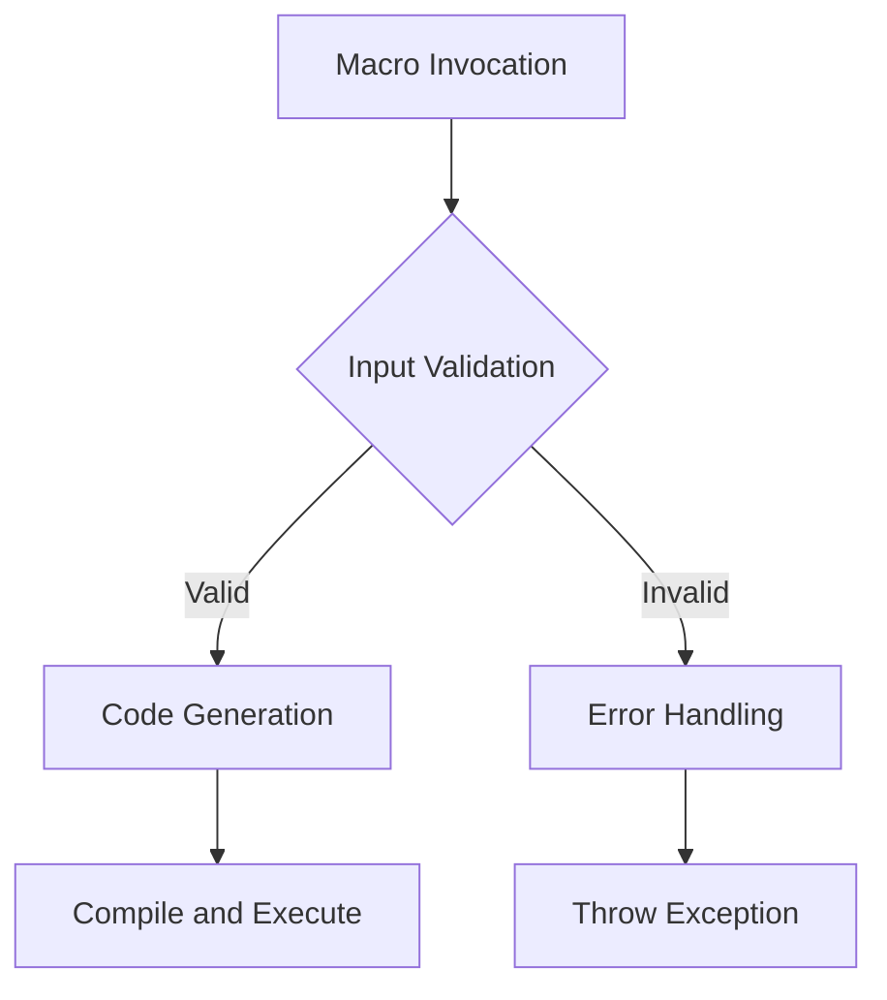

## 9.5.3 Error Handling in Macros

In this section, we delve into the intricacies of error handling within Clojure macros. As experienced Java developers, you are familiar with the importance of robust error handling to ensure code reliability and maintainability. In Clojure, macros provide powerful metaprogramming capabilities, but they also introduce unique challenges in error handling. This guide will equip you with the skills to generate meaningful error messages from macros, using `assert` and `throw` to handle incorrect usage effectively.

### Understanding Macros in Clojure

Before we dive into error handling, let's briefly revisit what macros are in Clojure. Macros are a powerful feature that allows you to extend the language by writing code that generates code. They operate at compile time, transforming Clojure code before it is evaluated. This capability enables you to create domain-specific languages (DSLs) and implement complex logic with concise syntax.

Macros are similar to Java's annotations and reflection, but they offer more flexibility and control over code transformation. However, with great power comes great responsibility. Macros can obscure code logic and make debugging challenging if not used carefully.

### The Importance of Error Handling in Macros

Error handling in macros is crucial for several reasons:

1. **User Guidance**: Macros often abstract complex logic, and users may not be aware of the underlying implementation. Clear error messages guide users in using macros correctly.

2. **Debugging Aid**: When a macro fails, it can be challenging to trace the error back to the source. Meaningful error messages help identify the root cause quickly.

3. **Code Robustness**: Proper error handling ensures that macros fail gracefully, preventing unexpected behavior in your application.

### Generating Meaningful Error Messages

To generate meaningful error messages in macros, we can use Clojure's `assert` and `throw` mechanisms. Let's explore how to implement these techniques effectively.

#### Using `assert` in Macros

The `assert` function in Clojure is used to verify assumptions in your code. When an assertion fails, it throws an `AssertionError` with a customizable error message. This is particularly useful in macros to validate input and provide informative feedback.

**Example:**

```clojure
(defmacro safe-divide [numerator denominator]
  `(do
     (assert (not= ~denominator 0) "Denominator cannot be zero.")
     (/ ~numerator ~denominator)))

;; Usage
(safe-divide 10 2)  ;; Returns 5
(safe-divide 10 0)  ;; Throws AssertionError: Denominator cannot be zero.
```

In this example, the `safe-divide` macro checks if the denominator is zero before performing division. If the assertion fails, it provides a clear error message.

#### Using `throw` in Macros

The `throw` function allows you to raise exceptions explicitly. This is useful when you need more control over error handling or want to throw custom exceptions.

**Example:**

```clojure
(defmacro validate-args [arg]
  `(do
     (when (nil? ~arg)
       (throw (IllegalArgumentException. "Argument cannot be nil.")))
     ~arg))

;; Usage
(validate-args 42)  ;; Returns 42
(validate-args nil) ;; Throws IllegalArgumentException: Argument cannot be nil.
```

Here, the `validate-args` macro throws an `IllegalArgumentException` if the argument is `nil`, providing a specific error message.

### Comparing Error Handling in Java and Clojure Macros

In Java, error handling is typically done using `try-catch` blocks and custom exceptions. While Clojure supports similar constructs, macros offer a different approach by allowing compile-time checks and transformations.

**Java Example:**

```java
public class SafeDivide {
    public static double divide(double numerator, double denominator) {
        if (denominator == 0) {
            throw new IllegalArgumentException("Denominator cannot be zero.");
        }
        return numerator / denominator;
    }
}
```

**Clojure Macro Equivalent:**

```clojure
(defmacro safe-divide [numerator denominator]
  `(do
     (assert (not= ~denominator 0) "Denominator cannot be zero.")
     (/ ~numerator ~denominator)))
```

Both examples achieve the same goal, but the Clojure macro provides a more concise and expressive way to handle errors at compile time.

### Best Practices for Error Handling in Macros

To ensure robust error handling in your macros, consider the following best practices:

1. **Validate Inputs**: Always validate macro inputs to prevent invalid usage and provide clear error messages.

2. **Use Descriptive Messages**: Error messages should be descriptive and guide users in resolving the issue.

3. **Avoid Side Effects**: Macros should focus on code transformation and avoid side effects that can complicate error handling.

4. **Test Thoroughly**: Test macros with various inputs to ensure they handle errors gracefully and provide meaningful feedback.

5. **Document Usage**: Provide documentation and examples for your macros, highlighting potential errors and how to avoid them.

### Advanced Error Handling Techniques

For more complex macros, you may need to implement advanced error handling techniques, such as:

- **Custom Exception Types**: Define custom exception types to categorize errors and provide more context.

- **Conditional Compilation**: Use conditional logic within macros to handle different scenarios and provide tailored error messages.

- **Macro Expansion Debugging**: Use `macroexpand` to debug macro expansions and ensure they generate the expected code.

### Try It Yourself

Experiment with the following exercises to reinforce your understanding of error handling in macros:

1. **Exercise 1**: Modify the `safe-divide` macro to handle negative denominators by throwing a custom exception.

2. **Exercise 2**: Create a macro that validates a map's keys and throws an error if any required keys are missing.

3. **Exercise 3**: Implement a macro that checks for valid data types and throws an error for unsupported types.

### Visualizing Macro Error Handling

To better understand the flow of error handling in macros, consider the following diagram:



**Diagram Description**: This flowchart illustrates the process of macro error handling, starting from macro invocation, input validation, code generation, and error handling if inputs are invalid.

### Additional Resources

For further reading on macros and error handling in Clojure, consider the following resources:

- [Official Clojure Documentation](https://clojure.org/reference/macros)
- [ClojureDocs: Macros](https://clojuredocs.org/quickref#macros)
- [Clojure Programming by Chas Emerick, Brian Carper, and Christophe Grand](https://www.oreilly.com/library/view/clojure-programming/9781449310387/)

### Summary and Key Takeaways

In this section, we've explored the importance of error handling in Clojure macros and how to implement it using `assert` and `throw`. By generating meaningful error messages, you can guide users, aid debugging, and ensure code robustness. Remember to validate inputs, use descriptive messages, and test thoroughly to create reliable macros.

Now that we've mastered error handling in macros, let's apply these techniques to enhance the reliability and usability of your Clojure applications.

---

## Quiz: Mastering Error Handling in Clojure Macros



### What is the primary purpose of error handling in Clojure macros?

- [x] To provide meaningful feedback and guide users in using macros correctly
- [ ] To increase the execution speed of macros
- [ ] To reduce the size of the generated code
- [ ] To make macros more complex

> **Explanation:** Error handling in macros is crucial for providing meaningful feedback and guiding users in using macros correctly, ensuring code reliability and maintainability.

### How does the `assert` function help in error handling within macros?

- [x] It verifies assumptions and throws an `AssertionError` with a customizable message if the assertion fails
- [ ] It catches exceptions and logs them without stopping execution
- [ ] It automatically retries the macro execution on failure
- [ ] It optimizes the macro for better performance

> **Explanation:** The `assert` function verifies assumptions in your code and throws an `AssertionError` with a customizable message if the assertion fails, aiding in error handling.

### Which function is used to raise exceptions explicitly in Clojure macros?

- [x] `throw`
- [ ] `catch`
- [ ] `try`
- [ ] `finally`

> **Explanation:** The `throw` function is used to raise exceptions explicitly in Clojure macros, providing more control over error handling.

### What is a key difference between error handling in Java and Clojure macros?

- [x] Clojure macros allow compile-time checks and transformations, while Java uses runtime `try-catch` blocks
- [ ] Java provides more concise error handling syntax than Clojure
- [ ] Clojure macros do not support error handling
- [ ] Java does not support custom exceptions

> **Explanation:** Clojure macros allow compile-time checks and transformations, providing a different approach to error handling compared to Java's runtime `try-catch` blocks.

### What is a best practice for error handling in macros?

- [x] Validate inputs and provide clear error messages
- [ ] Avoid using error handling to keep macros simple
- [ ] Use side effects to handle errors
- [ ] Ignore errors to improve performance

> **Explanation:** A best practice for error handling in macros is to validate inputs and provide clear error messages, ensuring robust and user-friendly macros.

### Which of the following is an advanced error handling technique for macros?

- [x] Defining custom exception types
- [ ] Using macros without error handling
- [ ] Relying on external libraries for error handling
- [ ] Ignoring invalid inputs

> **Explanation:** Defining custom exception types is an advanced error handling technique for macros, allowing for more specific and informative error messages.

### What is the purpose of the `macroexpand` function in debugging macros?

- [x] To debug macro expansions and ensure they generate the expected code
- [ ] To execute macros at runtime
- [ ] To optimize macros for better performance
- [ ] To catch exceptions during macro execution

> **Explanation:** The `macroexpand` function is used to debug macro expansions and ensure they generate the expected code, aiding in macro development and error handling.

### What should you do if a macro input is invalid?

- [x] Throw an exception with a descriptive error message
- [ ] Ignore the input and continue execution
- [ ] Log the error and retry the macro
- [ ] Optimize the macro for better performance

> **Explanation:** If a macro input is invalid, you should throw an exception with a descriptive error message to guide users in correcting the issue.

### How can you ensure robust error handling in macros?

- [x] By validating inputs, using descriptive messages, and testing thoroughly
- [ ] By avoiding error handling to keep macros simple
- [ ] By relying on external libraries for error handling
- [ ] By ignoring errors to improve performance

> **Explanation:** Ensuring robust error handling in macros involves validating inputs, using descriptive messages, and testing thoroughly to create reliable and user-friendly macros.

### True or False: Macros should focus on code transformation and avoid side effects.

- [x] True
- [ ] False

> **Explanation:** True. Macros should focus on code transformation and avoid side effects to maintain clarity and reliability in error handling.


