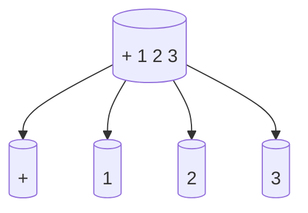

## 9.6.1 Code as Data Principle

### Introduction

In the realm of programming languages, Lisp and its dialects, including Clojure, stand out for their unique approach to code representation. The **Code as Data Principle**, also known as **homoiconicity**, is a foundational concept in Lisp languages that treats code as a manipulable data structure. This principle not only simplifies the language syntax but also empowers developers with advanced metaprogramming capabilities. In this section, we will delve into the Code as Data Principle, explore its implications for Clojure, and compare it with Java to highlight its advantages.

### Understanding Code as Data

In Clojure, code is represented as data structures, primarily lists. This means that the same constructs used to represent data can also represent code. This duality is what makes Clojure homoiconic. Let's break down this concept further:

- **Homoiconicity**: This term refers to the property of a language where the primary representation of programs is also a data structure in a primitive type of the language. In Clojure, this is typically a list.
- **S-Expressions**: Clojure code is written in the form of S-expressions (Symbolic Expressions), which are lists that can be nested. These expressions are both the code and the data.

#### Example of Code as Data

Consider a simple arithmetic operation in Clojure:

```clojure
(+ 1 2 3)
```

This expression is a list where the first element is the function `+`, and the subsequent elements are arguments. This list can be manipulated like any other data structure in Clojure.

#### Comparing with Java

In Java, code is not directly represented as data. Java code is compiled into bytecode, which is not easily manipulable at runtime. While Java provides reflection and the ability to manipulate bytecode, these are not as seamless or integrated as Clojure's approach.

### The Power of Homoiconicity

The ability to treat code as data opens up a world of possibilities in metaprogramming. Here are some key advantages:

- **Macros**: Clojure macros allow developers to write code that generates code. This is possible because code is data, and macros can manipulate this data to produce new code.
- **Code Transformation**: Developers can transform code at compile-time, enabling optimizations and custom syntactic constructs.
- **DSLs (Domain-Specific Languages)**: Clojure's homoiconicity makes it an excellent choice for creating internal DSLs, where the language syntax can be tailored to specific problem domains.

### Code as Data in Practice

Let's explore how the Code as Data Principle is applied in Clojure through practical examples.

#### Writing a Simple Macro

A macro in Clojure is a function that takes code as input and returns transformed code. Here's a simple macro that logs the execution of a function:

```clojure
(defmacro log-execution [fn-call]
  `(let [result# ~fn-call]
     (println "Executing:" '~fn-call "Result:" result#)
     result#))

;; Usage
(log-execution (+ 1 2 3))
```

**Explanation**:
- The macro `log-execution` takes a function call as an argument.
- It uses backticks (`` ` ``) to quote the expression, allowing for code transformation.
- The `~` operator is used to unquote and evaluate the expression within the macro.
- The `result#` is a unique symbol generated to hold the result of the function call.

#### Comparing with Java

In Java, achieving similar functionality would require more boilerplate code and possibly the use of reflection or aspect-oriented programming (AOP) frameworks. Clojure's macros provide a more elegant and integrated solution.

### Visualizing Code as Data

To better understand how code is represented as data in Clojure, let's visualize a simple expression:



**Diagram Description**: This diagram represents the expression `(+ 1 2 3)` as a tree structure, where the root node is the function `+`, and the child nodes are the arguments.

### Advanced Metaprogramming with Code as Data

The Code as Data Principle enables more advanced metaprogramming techniques. Let's explore some of these techniques and their applications.

#### Creating a DSL

Suppose we want to create a DSL for defining simple workflows. We can leverage Clojure's homoiconicity to achieve this:

```clojure
(defmacro workflow [& steps]
  `(fn []
     (println "Starting workflow...")
     ~@(map (fn [step] `(println "Executing step:" '~step) ~step) steps)
     (println "Workflow completed.")))

;; Usage
(def my-workflow (workflow
                   (println "Step 1")
                   (println "Step 2")
                   (println "Step 3")))

(my-workflow)
```

**Explanation**:
- The `workflow` macro takes a series of steps as arguments.
- It generates a function that prints messages before and after executing each step.
- The `~@` operator is used to splice the list of transformed steps into the function body.

#### Comparing with Java

In Java, creating a DSL often involves defining a complex class hierarchy or using external libraries. Clojure's macros simplify this process by allowing direct manipulation of code structures.

### Challenges and Considerations

While the Code as Data Principle offers significant advantages, it also presents challenges:

- **Complexity**: Writing macros and manipulating code as data can be complex and error-prone. It requires a deep understanding of Clojure's evaluation model.
- **Debugging**: Debugging macros can be challenging due to the additional layer of code transformation.
- **Readability**: Overuse of macros can lead to code that is difficult to read and understand.

### Best Practices

To effectively leverage the Code as Data Principle in Clojure, consider the following best practices:

- **Use Macros Sparingly**: Only use macros when necessary. Prefer functions for most tasks.
- **Keep Macros Simple**: Write simple and focused macros to maintain readability and ease of debugging.
- **Document Macros**: Provide clear documentation and examples for macros to aid understanding.

### Try It Yourself

To deepen your understanding of the Code as Data Principle, try modifying the examples provided:

- **Modify the `log-execution` Macro**: Add additional logging information, such as the execution time of the function call.
- **Extend the `workflow` DSL**: Add support for conditional steps or loops within the workflow.

### Further Reading

For more information on the Code as Data Principle and its applications in Clojure, consider exploring the following resources:

- [Official Clojure Documentation](https://clojure.org/reference/macros)
- [ClojureDocs](https://clojuredocs.org/)
- [Clojure Programming by Chas Emerick, Brian Carper, and Christophe Grand](https://www.oreilly.com/library/view/clojure-programming/9781449310387/)

### Exercises

1. **Create a Macro**: Write a macro that takes a list of numbers and returns a list of their squares.
2. **Build a Simple DSL**: Design a DSL for defining mathematical expressions and evaluate them using Clojure's code as data capabilities.

### Key Takeaways

- The Code as Data Principle is a core concept in Clojure that enables powerful metaprogramming capabilities.
- Clojure's homoiconicity allows code to be represented and manipulated as data structures, facilitating the creation of macros and DSLs.
- While powerful, the use of macros should be approached with caution to maintain code readability and simplicity.

Now that we've explored the Code as Data Principle in Clojure, let's apply these concepts to enhance your metaprogramming skills and create more expressive and flexible code.

## Quiz: Understanding the Code as Data Principle in Clojure



### What is the Code as Data Principle in Clojure?

- [x] The representation of code as data structures, allowing manipulation and transformation.
- [ ] The use of Java bytecode for executing Clojure programs.
- [ ] The ability to compile Clojure code into native machine code.
- [ ] The use of reflection for runtime code analysis.

> **Explanation:** The Code as Data Principle refers to the representation of code as data structures, enabling powerful metaprogramming capabilities in Clojure.

### How does Clojure represent code?

- [x] As lists and other data structures.
- [ ] As compiled bytecode.
- [ ] As XML documents.
- [ ] As JSON objects.

> **Explanation:** Clojure represents code as lists and other data structures, allowing for manipulation and transformation.

### What is a macro in Clojure?

- [x] A construct that allows code transformation at compile-time.
- [ ] A function that executes code at runtime.
- [ ] A class that encapsulates data and behavior.
- [ ] A library for handling concurrency.

> **Explanation:** A macro in Clojure is a construct that allows code transformation at compile-time, leveraging the Code as Data Principle.

### What is the primary advantage of Clojure's homoiconicity?

- [x] It enables powerful metaprogramming capabilities.
- [ ] It improves runtime performance.
- [ ] It simplifies memory management.
- [ ] It enhances type safety.

> **Explanation:** Clojure's homoiconicity enables powerful metaprogramming capabilities by allowing code to be represented and manipulated as data.

### How can macros be used in Clojure?

- [x] To generate code dynamically.
- [ ] To manage memory allocation.
- [ ] To enforce type constraints.
- [ ] To handle network communication.

> **Explanation:** Macros in Clojure can be used to generate code dynamically, leveraging the Code as Data Principle.

### What is a potential challenge of using macros?

- [x] Debugging can be complex due to code transformation.
- [ ] They require extensive memory resources.
- [ ] They are incompatible with Java libraries.
- [ ] They cannot be used in production code.

> **Explanation:** Debugging macros can be complex due to the additional layer of code transformation involved.

### What is an S-expression in Clojure?

- [x] A symbolic expression representing code or data.
- [ ] A compiled Java class.
- [ ] A serialized data format.
- [ ] A network protocol.

> **Explanation:** An S-expression in Clojure is a symbolic expression representing code or data, fundamental to the Code as Data Principle.

### How does Clojure's approach to code representation differ from Java's?

- [x] Clojure represents code as data structures, while Java compiles code into bytecode.
- [ ] Clojure uses XML for code representation, while Java uses JSON.
- [ ] Clojure compiles code into native machine code, while Java uses bytecode.
- [ ] Clojure uses reflection for code analysis, while Java does not.

> **Explanation:** Clojure represents code as data structures, allowing for manipulation and transformation, while Java compiles code into bytecode.

### What is a DSL in the context of Clojure?

- [x] A Domain-Specific Language tailored for specific problem domains.
- [ ] A Distributed System Language for network programming.
- [ ] A Data Serialization Language for data interchange.
- [ ] A Debugging and Scripting Language for testing.

> **Explanation:** A DSL in Clojure is a Domain-Specific Language tailored for specific problem domains, enabled by the Code as Data Principle.

### True or False: Clojure's macros are executed at runtime.

- [ ] True
- [x] False

> **Explanation:** Clojure's macros are executed at compile-time, transforming code before it is evaluated.


