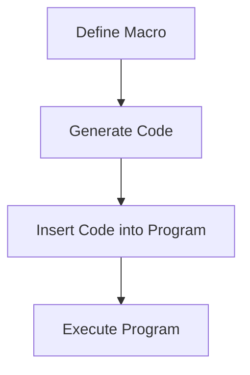
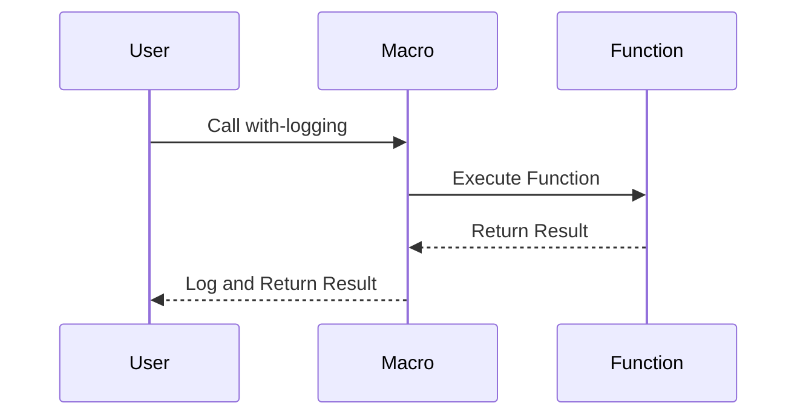

## 9.6.3 Examples of Metaprogramming

Metaprogramming in Clojure allows developers to write code that writes code, offering powerful tools for abstraction and code generation. In this section, we will explore practical examples of metaprogramming in Clojure, focusing on generating repetitive code, implementing aspect-oriented programming (AOP) features, and building domain-specific languages (DSLs). These examples will help you leverage Clojure's macro system to create more expressive and concise code.

### Generating Repetitive Code

One of the most common uses of metaprogramming is to eliminate repetitive code patterns. In Java, you might use reflection or code generation libraries to achieve similar results, but Clojure's macros provide a more integrated and seamless approach.

#### Example: Generating Getter and Setter Functions

Consider a scenario where you need to create getter and setter functions for a set of fields. In Java, this might involve writing boilerplate code for each field. In Clojure, we can use macros to automate this process.

```clojure
(defmacro def-getters-setters
  [type & fields]
  `(do
     ~@(map (fn [field]
              `(do
                 (defn ~(symbol (str "get-" field)) [~'obj]
                   (get ~'obj ~(keyword field)))
                 (defn ~(symbol (str "set-" field)) [~'obj ~'value]
                   (assoc ~'obj ~(keyword field) ~'value))))
            fields)))

(def-getters-setters Person :name :age :email)

;; Usage
(let [person {:name "Alice" :age 30 :email "alice@example.com"}]
  (println (get-name person))  ; Output: Alice
  (println (set-age person 31))) ; Output: {:name "Alice", :age 31, :email "alice@example.com"}
```

**Explanation:**  
- The `def-getters-setters` macro takes a type and a list of fields.
- It generates getter and setter functions for each field using `defn`.
- The `~@` syntax is used to splice the generated code into the surrounding `do` block.

**Try It Yourself:**  
Modify the macro to include a default value for each field if it is not present in the object.

### Implementing Aspect-Oriented Programming Features

Aspect-Oriented Programming (AOP) allows you to separate cross-cutting concerns, such as logging or security, from the main business logic. In Clojure, you can use macros to implement AOP-like features.

#### Example: Logging Function Calls

Let's create a macro that logs function calls and their arguments.

```clojure
(defmacro with-logging
  [fn-name & args]
  `(let [result# (~fn-name ~@args)]
     (println "Calling" '~fn-name "with arguments:" ~@args)
     (println "Result:" result#)
     result#))

(defn add [x y]
  (+ x y))

;; Usage
(with-logging add 3 5)
;; Output:
;; Calling add with arguments: 3 5
;; Result: 8
```

**Explanation:**  
- The `with-logging` macro wraps a function call, logging the function name and arguments.
- The `~` and `~@` syntax is used to insert the function name and arguments into the generated code.
- The `result#` symbol is used to capture the function's result, ensuring it is logged and returned.

**Try It Yourself:**  
Extend the macro to log the execution time of the function call.

### Building Domain-Specific Languages (DSLs)

DSLs allow you to create a language tailored to a specific problem domain, making your code more expressive and easier to understand. Clojure's macros are well-suited for building internal DSLs.

#### Example: A Simple Query DSL

Let's build a simple DSL for querying a collection of maps.

```clojure
(defmacro query
  [& clauses]
  `(fn [data]
     (filter
      (fn [item#]
        (and
         ~@(map (fn [[op field value]]
                  `(= (~op (get item# ~field)) ~value))
                (partition 3 clauses))))
      data)))

(def data
  [{:name "Alice" :age 30}
   {:name "Bob" :age 25}
   {:name "Charlie" :age 35}])

;; Usage
(def query-age-30 (query = :age 30))
(println (query-age-30 data)) ; Output: ({:name "Alice", :age 30})
```

**Explanation:**  
- The `query` macro generates a filtering function based on the provided clauses.
- Each clause is a triplet of an operator, a field, and a value.
- The macro constructs a filter predicate using these clauses.

**Try It Yourself:**  
Enhance the DSL to support more complex queries, such as combining conditions with `or`.

### Diagrams and Visualizations

To better understand how these examples work, let's visualize the flow of data and code transformation using Mermaid.js diagrams.

#### Diagram: Code Generation with Macros



*Caption:* This diagram illustrates the process of defining a macro, generating code, inserting it into the program, and executing it.

#### Diagram: Aspect-Oriented Programming with Macros



*Caption:* This sequence diagram shows how the `with-logging` macro intercepts a function call, logs it, and returns the result.

### Further Reading

For more information on Clojure macros and metaprogramming, consider exploring the following resources:

- [Official Clojure Documentation on Macros](https://clojure.org/reference/macros)
- [ClojureDocs: Macros](https://clojuredocs.org/quickref#macros)
- [GitHub: Clojure Examples and Libraries](https://github.com/clojure)

### Exercises

1. **Exercise 1:** Modify the `def-getters-setters` macro to generate functions that validate the input value before setting it.
2. **Exercise 2:** Extend the `with-logging` macro to include error handling, logging any exceptions that occur during the function call.
3. **Exercise 3:** Enhance the query DSL to support sorting the results based on a specified field.

### Key Takeaways

- **Macros in Clojure** provide a powerful way to generate code, reducing boilerplate and enhancing expressiveness.
- **Aspect-Oriented Programming** can be implemented using macros to separate cross-cutting concerns from business logic.
- **Domain-Specific Languages** allow you to create expressive, problem-specific syntax, making your code more readable and maintainable.

By mastering these metaprogramming techniques, you can write more concise, maintainable, and expressive Clojure code, leveraging the full power of the language's macro system.

## Quiz: Test Your Knowledge on Clojure Metaprogramming



### What is a primary benefit of using macros in Clojure?

- [x] They allow for code generation and abstraction.
- [ ] They improve runtime performance.
- [ ] They simplify syntax errors.
- [ ] They eliminate the need for functions.

> **Explanation:** Macros in Clojure are primarily used for code generation and abstraction, allowing developers to write more expressive and concise code.

### How does the `with-logging` macro enhance function calls?

- [x] By logging the function name and arguments.
- [ ] By optimizing the function's execution.
- [ ] By caching the function's result.
- [ ] By rewriting the function's logic.

> **Explanation:** The `with-logging` macro logs the function name and arguments, providing insight into function calls without altering the function's logic.

### What is a DSL in the context of Clojure?

- [x] A domain-specific language tailored to a specific task.
- [ ] A debugging tool for Clojure applications.
- [ ] A library for handling concurrency.
- [ ] A syntax error checker.

> **Explanation:** A DSL (Domain-Specific Language) in Clojure is a language tailored to a specific task, making code more expressive and easier to understand.

### Which of the following is an example of aspect-oriented programming in Clojure?

- [x] Using macros to log function calls.
- [ ] Using functions to sort data.
- [ ] Using loops for iteration.
- [ ] Using maps for data storage.

> **Explanation:** Aspect-oriented programming in Clojure can be implemented using macros to log function calls, separating cross-cutting concerns from business logic.

### What does the `query` macro do in the provided example?

- [x] It generates a filtering function based on clauses.
- [ ] It sorts a collection of maps.
- [ ] It calculates the sum of values in a map.
- [ ] It converts maps to JSON.

> **Explanation:** The `query` macro generates a filtering function based on the provided clauses, allowing for expressive data querying.

### How can you modify the `def-getters-setters` macro to include default values?

- [x] By adding a default value parameter to the macro.
- [ ] By using a global variable for defaults.
- [ ] By hardcoding default values in the macro.
- [ ] By using a separate function for defaults.

> **Explanation:** You can modify the `def-getters-setters` macro to include default values by adding a default value parameter and incorporating it into the generated code.

### What is the purpose of the `result#` symbol in the `with-logging` macro?

- [x] To capture and log the function's result.
- [ ] To optimize the function's execution.
- [ ] To store the function's arguments.
- [ ] To rewrite the function's logic.

> **Explanation:** The `result#` symbol in the `with-logging` macro captures and logs the function's result, ensuring it is returned after logging.

### What is a key advantage of using macros for DSL creation?

- [x] They allow for expressive, problem-specific syntax.
- [ ] They improve runtime performance.
- [ ] They simplify syntax errors.
- [ ] They eliminate the need for functions.

> **Explanation:** Macros allow for expressive, problem-specific syntax, making DSLs more readable and maintainable.

### How does the `query` macro handle multiple clauses?

- [x] By constructing a filter predicate using the clauses.
- [ ] By sorting the clauses alphabetically.
- [ ] By converting clauses to JSON.
- [ ] By ignoring all but the first clause.

> **Explanation:** The `query` macro constructs a filter predicate using the clauses, allowing for expressive data querying.

### True or False: Macros in Clojure can be used to improve runtime performance.

- [ ] True
- [x] False

> **Explanation:** Macros in Clojure are primarily used for code generation and abstraction, not for improving runtime performance.


