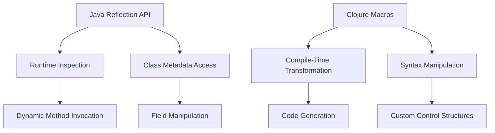

## 9.7.1 Reflection in Java

Reflection is a powerful feature in Java that allows programs to inspect and manipulate the runtime behavior of applications. This capability is part of the Java Reflection API, which provides the means to examine or modify the runtime behavior of applications running in the Java Virtual Machine (JVM). In this section, we'll explore the Java Reflection API, its common use cases, limitations, and how it compares to Clojure's macros and metaprogramming capabilities.

### Understanding Java's Reflection API

Java's Reflection API is part of the `java.lang.reflect` package and provides the ability to inspect classes, interfaces, fields, and methods at runtime, without knowing the names of the classes, methods, etc., at compile time. This can be particularly useful for applications that require dynamic behavior, such as frameworks, libraries, and tools that need to work with classes that are not known until runtime.

#### Key Components of the Reflection API

1. **Class**: The `Class` class in Java provides methods to get metadata about a class, such as its name, superclass, interfaces, and modifiers.
2. **Field**: The `Field` class represents a field of a class or interface. It provides methods to get and set field values dynamically.
3. **Method**: The `Method` class represents a method of a class or interface. It allows invoking methods dynamically.
4. **Constructor**: The `Constructor` class represents a constructor of a class. It allows creating new instances of a class dynamically.

### Common Use Cases for Reflection

Reflection is often used in scenarios where dynamic behavior is required. Here are some common use cases:

- **Frameworks and Libraries**: Many frameworks, such as Spring and Hibernate, use reflection to dynamically create objects, inject dependencies, and configure components.
- **Testing Tools**: Reflection is used in testing frameworks like JUnit to discover and invoke test methods at runtime.
- **Serialization and Deserialization**: Libraries like Jackson and Gson use reflection to dynamically access fields and methods for serializing and deserializing objects.
- **Dynamic Proxies**: Java's dynamic proxy mechanism uses reflection to create proxy instances that can intercept method calls.

### Limitations of Reflection

While reflection is a powerful tool, it comes with several limitations and drawbacks:

- **Performance Overhead**: Reflection operations are slower than direct method calls because they involve type checking and dynamic method resolution.
- **Security Restrictions**: Reflection can bypass access control checks, which can lead to security vulnerabilities if not used carefully.
- **Complexity and Maintenance**: Code that uses reflection is often more complex and harder to maintain, as it can obscure the flow of the program.
- **Compile-Time Safety**: Reflection bypasses compile-time checks, which can lead to runtime errors if not handled properly.

### Reflection in Action: Code Examples

Let's look at some examples of how reflection can be used in Java.

#### Inspecting a Class

```java
import java.lang.reflect.*;

public class ReflectionExample {
    public static void main(String[] args) {
        try {
            // Obtain the Class object for a given class
            Class<?> clazz = Class.forName("java.util.ArrayList");

            // Print class name
            System.out.println("Class Name: " + clazz.getName());

            // Print all declared methods
            Method[] methods = clazz.getDeclaredMethods();
            for (Method method : methods) {
                System.out.println("Method: " + method.getName());
            }

            // Print all declared fields
            Field[] fields = clazz.getDeclaredFields();
            for (Field field : fields) {
                System.out.println("Field: " + field.getName());
            }
        } catch (ClassNotFoundException e) {
            e.printStackTrace();
        }
    }
}
```

**Explanation**: This example demonstrates how to use reflection to inspect the `ArrayList` class. We obtain the `Class` object for `ArrayList`, then retrieve and print its methods and fields.

#### Invoking Methods Dynamically

```java
import java.lang.reflect.*;

public class DynamicInvocation {
    public static void main(String[] args) {
        try {
            // Create an instance of the class
            Class<?> clazz = Class.forName("java.util.ArrayList");
            Object instance = clazz.getDeclaredConstructor().newInstance();

            // Get the add method
            Method addMethod = clazz.getMethod("add", Object.class);

            // Invoke the add method
            addMethod.invoke(instance, "Hello, Reflection!");

            // Get the size method
            Method sizeMethod = clazz.getMethod("size");

            // Invoke the size method
            int size = (int) sizeMethod.invoke(instance);
            System.out.println("Size: " + size);
        } catch (Exception e) {
            e.printStackTrace();
        }
    }
}
```

**Explanation**: This example shows how to dynamically invoke methods using reflection. We create an instance of `ArrayList`, then use reflection to invoke the `add` and `size` methods.

### Comparing Reflection with Clojure's Macros

While Java's Reflection API provides powerful capabilities for runtime inspection and manipulation, Clojure offers a different approach through macros and metaprogramming. Let's compare these two approaches:

- **Compile-Time vs. Runtime**: Reflection operates at runtime, allowing dynamic behavior based on runtime conditions. In contrast, Clojure's macros operate at compile-time, transforming code before it is executed.
- **Performance**: Reflection can introduce performance overhead due to dynamic method resolution. Macros, being compile-time constructs, do not have this overhead.
- **Safety and Complexity**: Reflection can bypass access control checks, leading to potential security risks. Macros, on the other hand, are part of the language's syntax and are subject to compile-time checks, making them safer and often simpler to use.

### Clojure Code Example: Using Macros

Let's see how Clojure's macros can be used to achieve similar dynamic behavior without the overhead of reflection.

```clojure
(defmacro with-logging [expr]
  `(let [result# ~expr]
     (println "Executing:" '~expr "Result:" result#)
     result#))

;; Usage
(with-logging (+ 1 2 3))
```

**Explanation**: This macro, `with-logging`, takes an expression, evaluates it, and logs the expression and its result. Unlike reflection, this transformation happens at compile-time, making it efficient and safe.

### Try It Yourself

Experiment with the Java reflection examples by modifying the class being inspected or the methods being invoked. Try using reflection to access private fields or methods and observe the security implications.

For Clojure, try creating your own macros to automate repetitive tasks or add logging to various parts of your code. Consider how macros can simplify your codebase compared to using reflection in Java.

### Diagrams and Visuals

Below is a diagram illustrating the flow of data through Java's Reflection API and Clojure's macros.



**Diagram Description**: This flowchart compares the Java Reflection API and Clojure's macros, highlighting the runtime nature of reflection and the compile-time nature of macros.

### Further Reading

For more information on Java's Reflection API, consider exploring the following resources:

- [Official Java Documentation on Reflection](https://docs.oracle.com/javase/tutorial/reflect/)
- [Java Reflection API Guide](https://www.baeldung.com/java-reflection)
- [Clojure Macros Documentation](https://clojure.org/reference/macros)

### Exercises and Practice Problems

1. **Reflection Exercise**: Write a Java program using reflection to list all methods and fields of a class of your choice. Try invoking a method dynamically and handling exceptions gracefully.

2. **Macro Exercise**: Create a Clojure macro that logs the execution time of an expression. Use this macro to measure the performance of various functions in your code.

3. **Comparison Challenge**: Compare the performance of a Java program using reflection with a similar Clojure program using macros. Analyze the results and discuss the trade-offs.

### Key Takeaways

- Java's Reflection API provides powerful capabilities for runtime inspection and manipulation but comes with performance and security considerations.
- Clojure's macros offer a compile-time alternative, enabling code transformation and generation without runtime overhead.
- Understanding both reflection and macros can help you choose the right tool for dynamic behavior in your applications.

By exploring these concepts, you can leverage the strengths of both Java and Clojure to build flexible and efficient applications.

---

## Quiz: Mastering Java Reflection and Clojure Macros



### What is the primary purpose of Java's Reflection API?

- [x] To inspect and manipulate classes, methods, and fields at runtime
- [ ] To compile Java code into bytecode
- [ ] To manage memory allocation
- [ ] To handle exceptions in Java

> **Explanation:** Java's Reflection API allows inspection and manipulation of classes, methods, and fields at runtime, enabling dynamic behavior in applications.

### Which of the following is a limitation of using reflection in Java?

- [x] Performance overhead
- [ ] Compile-time safety
- [ ] Enhanced readability
- [ ] Increased security

> **Explanation:** Reflection can introduce performance overhead due to dynamic method resolution and type checking, making it slower than direct method calls.

### How do Clojure macros differ from Java's Reflection API?

- [x] Macros operate at compile-time, while reflection operates at runtime
- [ ] Macros are slower than reflection
- [ ] Macros are used for memory management
- [ ] Macros are part of Java's standard library

> **Explanation:** Clojure macros transform code at compile-time, whereas Java's Reflection API operates at runtime, allowing dynamic behavior.

### What is a common use case for Java's Reflection API?

- [x] Dynamic proxies
- [ ] Memory management
- [ ] Compile-time code generation
- [ ] Static analysis

> **Explanation:** Java's Reflection API is commonly used for dynamic proxies, allowing method calls to be intercepted and handled dynamically.

### Which of the following is a benefit of using Clojure macros over Java's reflection?

- [x] Compile-time transformation
- [ ] Runtime inspection
- [ ] Increased complexity
- [ ] Security vulnerabilities

> **Explanation:** Clojure macros provide compile-time transformation, enabling efficient code generation without runtime overhead.

### What is the role of the `Class` class in Java's Reflection API?

- [x] It provides methods to get metadata about a class
- [ ] It manages memory allocation for objects
- [ ] It handles exceptions in Java
- [ ] It compiles Java code into bytecode

> **Explanation:** The `Class` class in Java's Reflection API provides methods to get metadata about a class, such as its name, superclass, and interfaces.

### How can reflection affect the security of a Java application?

- [x] It can bypass access control checks
- [ ] It enhances compile-time safety
- [ ] It improves memory management
- [ ] It provides static analysis capabilities

> **Explanation:** Reflection can bypass access control checks, potentially leading to security vulnerabilities if not used carefully.

### What is a key advantage of using macros in Clojure?

- [x] They allow compile-time code transformation
- [ ] They provide runtime inspection capabilities
- [ ] They manage memory allocation
- [ ] They handle exceptions in Clojure

> **Explanation:** Macros in Clojure allow compile-time code transformation, enabling efficient and safe code generation.

### Which Java class is used to represent a method in the Reflection API?

- [x] Method
- [ ] Field
- [ ] Constructor
- [ ] Class

> **Explanation:** The `Method` class in Java's Reflection API represents a method of a class or interface, allowing dynamic invocation.

### True or False: Clojure macros can introduce runtime performance overhead similar to Java's reflection.

- [ ] True
- [x] False

> **Explanation:** Clojure macros operate at compile-time, transforming code before execution, thus avoiding runtime performance overhead.


