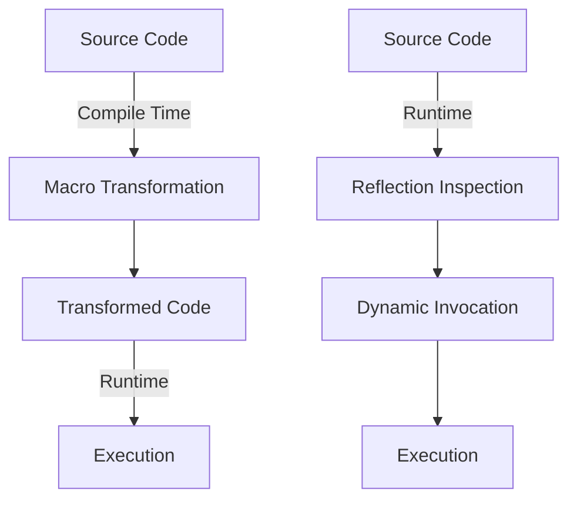

## 9.7.2 Comparing Macros to Reflection

In the realm of programming, both **macros** and **reflection** offer powerful ways to manipulate code, but they do so in fundamentally different ways. As experienced Java developers transitioning to Clojure, understanding these differences is crucial for leveraging Clojure's strengths in metaprogramming. In this section, we'll explore how Clojure's macros provide compile-time code transformation, contrasting with Java's runtime reflection. We'll also discuss how macros can avoid the overhead and security concerns associated with reflection.

### Understanding Macros in Clojure

**Macros** in Clojure are a form of metaprogramming that allows developers to transform code at compile time. They enable the creation of new syntactic constructs in a way that is both powerful and efficient. Macros operate by taking code as input, manipulating it, and producing new code as output. This process occurs before the code is executed, allowing for optimizations and transformations that are not possible at runtime.

#### Key Features of Macros

- **Compile-Time Transformation**: Macros operate during the compilation phase, allowing for code generation and transformation before execution.
- **Code as Data**: Clojure's homoiconicity means that code is represented as data structures, making it easy to manipulate with macros.
- **Performance Optimization**: By transforming code at compile time, macros can eliminate runtime overhead associated with certain operations.
- **Custom Syntax**: Macros can introduce new syntactic constructs, making code more expressive and concise.

### Understanding Reflection in Java

**Reflection** in Java is a mechanism that allows programs to inspect and modify their own structure and behavior at runtime. It provides the ability to examine classes, interfaces, fields, and methods, and to dynamically invoke methods or access fields. While powerful, reflection comes with certain trade-offs.

#### Key Features of Reflection

- **Runtime Inspection**: Reflection allows for the examination of classes and objects at runtime, providing flexibility in dynamic environments.
- **Dynamic Invocation**: Methods can be invoked dynamically, and fields can be accessed or modified without compile-time knowledge.
- **Flexibility and Adaptability**: Reflection enables the creation of flexible and adaptable code, useful in frameworks and libraries that require dynamic behavior.

### Comparing Macros and Reflection

Let's delve into the differences between macros and reflection, focusing on their use cases, advantages, and limitations.

#### Compile-Time vs. Runtime

- **Macros**: Operate at compile time, transforming code before it is executed. This allows for optimizations and the elimination of unnecessary runtime checks.
- **Reflection**: Operates at runtime, providing flexibility to inspect and modify code dynamically. This can introduce performance overhead and potential security risks.

#### Performance Considerations

- **Macros**: By performing transformations at compile time, macros can produce highly optimized code that runs efficiently without additional runtime overhead.
- **Reflection**: The dynamic nature of reflection can introduce significant performance overhead, as it requires additional checks and operations at runtime.

#### Security Implications

- **Macros**: Since macros operate at compile time, they do not introduce the same security risks as reflection. The code is fully known and verified before execution.
- **Reflection**: Reflection can pose security risks, as it allows for the modification of private fields and methods, potentially bypassing encapsulation and access controls.

#### Use Cases

- **Macros**: Ideal for creating domain-specific languages (DSLs), implementing custom control structures, and optimizing performance-critical code.
- **Reflection**: Useful in scenarios where runtime flexibility is essential, such as in frameworks that need to adapt to different environments or configurations.

### Code Examples: Macros vs. Reflection

To illustrate the differences, let's look at some code examples in both Clojure and Java.

#### Clojure Macros Example

Consider a simple macro that defines a custom control structure for logging:

```clojure
(defmacro with-logging [expr]
  `(do
     (println "Executing:" '~expr)
     (let [result# ~expr]
       (println "Result:" result#)
       result#)))

;; Usage
(with-logging (+ 1 2))
```

In this example, the `with-logging` macro takes an expression, logs its execution, and then evaluates it. The transformation occurs at compile time, ensuring efficient execution.

#### Java Reflection Example

Now, let's look at a Java example using reflection to invoke a method dynamically:

```java
import java.lang.reflect.Method;

public class ReflectionExample {
    public static void main(String[] args) {
        try {
            Class<?> clazz = Class.forName("java.util.ArrayList");
            Method method = clazz.getMethod("add", Object.class);
            Object instance = clazz.newInstance();
            method.invoke(instance, "Hello");

            System.out.println(instance);
        } catch (Exception e) {
            e.printStackTrace();
        }
    }
}
```

In this Java example, reflection is used to dynamically invoke the `add` method on an `ArrayList` instance. This flexibility comes at the cost of performance and potential security risks.

### Diagrams: Macros vs. Reflection

To further illustrate the differences, let's use a diagram to compare the flow of data and control in macros and reflection.



**Diagram Description**: This diagram illustrates the flow of data and control in macros and reflection. Macros transform code at compile time, while reflection operates at runtime.

### Advantages of Macros Over Reflection

- **Performance**: Macros eliminate runtime overhead by transforming code at compile time.
- **Security**: Macros do not introduce the same security risks as reflection, as the code is fully known and verified before execution.
- **Expressiveness**: Macros enable the creation of custom syntactic constructs, enhancing code readability and maintainability.

### Challenges and Considerations

While macros offer significant advantages, they also come with challenges:

- **Complexity**: Writing macros can be complex, requiring a deep understanding of Clojure's syntax and semantics.
- **Debugging**: Debugging macro-generated code can be challenging, as the transformed code may differ significantly from the original source.
- **Readability**: Overuse of macros can lead to code that is difficult to read and understand, especially for developers unfamiliar with the macro's implementation.

### Try It Yourself: Experimenting with Macros

To deepen your understanding, try modifying the `with-logging` macro to include additional information, such as the execution time of the expression. Experiment with different expressions and observe the output.

### Further Reading and Resources

For more information on macros and reflection, consider exploring the following resources:

- [Clojure Official Documentation on Macros](https://clojure.org/reference/macros)
- [Java Reflection API Documentation](https://docs.oracle.com/javase/tutorial/reflect/)
- [ClojureDocs: Macros](https://clojuredocs.org/quickref#macros)

### Exercises and Practice Problems

1. **Exercise**: Create a macro that implements a simple retry mechanism for a given expression. The macro should attempt to execute the expression a specified number of times before giving up.

2. **Challenge**: Write a macro that generates a function to calculate the factorial of a number. Compare its performance with a recursive function implementation.

3. **Reflection Exercise**: Use Java reflection to dynamically create an instance of a class and invoke its methods. Consider the performance implications and potential security risks.

### Key Takeaways

- **Macros** provide compile-time code transformation, offering performance and security advantages over reflection.
- **Reflection** offers runtime flexibility but comes with performance overhead and security risks.
- Understanding the strengths and limitations of both macros and reflection is essential for effective metaprogramming in Clojure and Java.

Now that we've explored the differences between macros and reflection, let's apply these concepts to enhance your Clojure applications with efficient and secure code transformations.

## SEO optimized quiz title



### What is a key advantage of macros over reflection?

- [x] Compile-time code transformation
- [ ] Runtime flexibility
- [ ] Dynamic method invocation
- [ ] Access to private fields

> **Explanation:** Macros transform code at compile time, eliminating runtime overhead and enhancing performance.

### How do macros enhance security compared to reflection?

- [x] By verifying code before execution
- [ ] By allowing dynamic code inspection
- [ ] By enabling runtime modifications
- [ ] By accessing private fields

> **Explanation:** Macros operate at compile time, ensuring that code is fully known and verified before execution, reducing security risks.

### What is a potential drawback of using macros?

- [x] Complexity in writing and debugging
- [ ] Increased runtime overhead
- [ ] Limited flexibility
- [ ] Inability to access private fields

> **Explanation:** Writing and debugging macros can be complex, requiring a deep understanding of Clojure's syntax and semantics.

### What is a common use case for reflection in Java?

- [x] Dynamic method invocation
- [ ] Compile-time code transformation
- [ ] Creating custom syntax
- [ ] Eliminating runtime checks

> **Explanation:** Reflection is commonly used for dynamic method invocation, allowing methods to be called without compile-time knowledge.

### How does reflection impact performance?

- [x] It introduces runtime overhead
- [ ] It optimizes code execution
- [ ] It eliminates runtime checks
- [ ] It enhances compile-time transformations

> **Explanation:** Reflection introduces runtime overhead due to additional checks and operations required for dynamic behavior.

### What is a benefit of macros in Clojure?

- [x] Creating custom syntactic constructs
- [ ] Dynamic code inspection
- [ ] Runtime method invocation
- [ ] Accessing private fields

> **Explanation:** Macros allow for the creation of custom syntactic constructs, enhancing code expressiveness and readability.

### Which of the following is a challenge when using macros?

- [x] Debugging macro-generated code
- [ ] Limited runtime flexibility
- [ ] Increased security risks
- [ ] Inability to create custom syntax

> **Explanation:** Debugging macro-generated code can be challenging, as the transformed code may differ from the original source.

### What is a key feature of reflection?

- [x] Runtime inspection and modification
- [ ] Compile-time code transformation
- [ ] Eliminating runtime overhead
- [ ] Creating custom syntax

> **Explanation:** Reflection allows for runtime inspection and modification of code, providing flexibility in dynamic environments.

### How can macros improve performance?

- [x] By eliminating runtime overhead
- [ ] By enabling dynamic method invocation
- [ ] By allowing runtime code inspection
- [ ] By accessing private fields

> **Explanation:** Macros improve performance by transforming code at compile time, eliminating unnecessary runtime overhead.

### True or False: Macros can introduce security risks similar to reflection.

- [ ] True
- [x] False

> **Explanation:** Macros do not introduce the same security risks as reflection, as they operate at compile time and ensure code is verified before execution.


