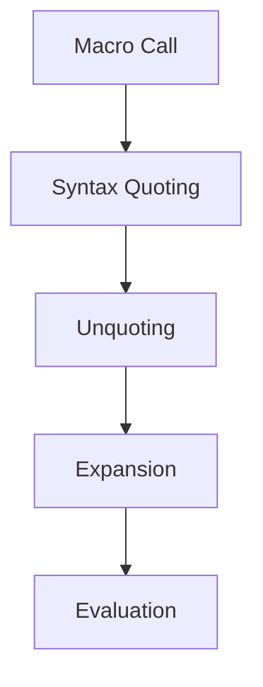

## 9.8.1 Macro Expansion and Evaluation Order

In this section, we delve into the fascinating world of **macro expansion and evaluation order** in Clojure. As experienced Java developers, you are familiar with the concept of code execution order and method invocation. However, Clojure's macros introduce a new layer of complexity and power by allowing you to manipulate code before it is evaluated. Understanding how and when code within a macro is evaluated is crucial to harnessing the full potential of Clojure's metaprogramming capabilities.

### Understanding Macro Expansion

Macros in Clojure are a powerful feature that allows you to extend the language by writing code that writes code. This is akin to Java's reflection but occurs at compile time, providing a more efficient and flexible way to manipulate code.

#### What is Macro Expansion?

Macro expansion is the process by which Clojure transforms macro calls into executable code. When you define a macro, you are essentially creating a template for code generation. During macro expansion, this template is filled in with the actual arguments provided in the macro call, producing a new piece of code that is then evaluated.

**Example: Basic Macro Definition**

```clojure
(defmacro simple-macro [x]
  `(+ ~x 10))

;; Usage
(simple-macro 5) ; Expands to (+ 5 10)
```

In this example, `simple-macro` is a macro that takes a single argument `x` and generates code that adds 10 to `x`. The backtick (`) is used for syntax quoting, and the tilde (`~`) is used to unquote `x`, allowing its value to be inserted into the generated code.

#### Macro Expansion Process

The macro expansion process involves several steps:

1. **Syntax Quoting**: The macro body is quoted to prevent immediate evaluation.
2. **Unquoting**: Specific parts of the quoted code are unquoted to allow dynamic insertion of values.
3. **Expansion**: The macro call is replaced with the expanded code.
4. **Evaluation**: The expanded code is evaluated as if it were written directly in the source.

### Evaluation Order and Common Pitfalls

One of the most common pitfalls when working with macros is misunderstanding the evaluation order of macro arguments. Unlike functions, macro arguments are not evaluated before being passed to the macro. This can lead to unexpected behavior if not handled correctly.

#### Multiple Evaluations of Arguments

A common issue arises when macro arguments are evaluated multiple times, leading to performance inefficiencies or unintended side effects.

**Example: Multiple Evaluations**

```clojure
(defmacro print-twice [expr]
  `(do
     (println ~expr)
     (println ~expr)))

;; Usage
(print-twice (println "Hello")) ; "Hello" is printed three times
```

In this example, the expression `(println "Hello")` is evaluated twice, once for each `println` in the macro body. This results in "Hello" being printed three times instead of two.

#### Preventing Multiple Evaluations

To prevent multiple evaluations, you can use `let` bindings within the macro to store the result of the expression.

**Example: Using `let` to Prevent Multiple Evaluations**

```clojure
(defmacro print-once [expr]
  `(let [result# ~expr]
     (println result#)
     (println result#)))

;; Usage
(print-once (println "Hello")) ; "Hello" is printed once, followed by the result twice
```

Here, the `let` binding ensures that `expr` is evaluated only once, and its result is stored in `result#`. The `#` suffix is used to generate a unique symbol, preventing naming conflicts.

### Comparing with Java

In Java, method arguments are always evaluated before the method is invoked. This is a key difference from Clojure macros, where arguments are passed as unevaluated code. Understanding this distinction is crucial for Java developers transitioning to Clojure.

**Java Example: Method Invocation**

```java
public class Example {
    public static void printTwice(String message) {
        System.out.println(message);
        System.out.println(message);
    }

    public static void main(String[] args) {
        printTwice("Hello");
    }
}
```

In this Java example, the string "Hello" is evaluated and passed to the `printTwice` method, which prints it twice. There is no risk of multiple evaluations because the argument is evaluated before the method call.

### Macro Hygiene and Variable Capture

Another important aspect of macro expansion is **macro hygiene**, which refers to the prevention of variable capture. Variable capture occurs when a macro inadvertently uses a variable name that conflicts with names in the surrounding code.

#### Ensuring Macro Hygiene

Clojure provides tools to ensure macro hygiene, such as using unique symbols with `gensym` or the `#` suffix.

**Example: Avoiding Variable Capture**

```clojure
(defmacro safe-macro [x]
  (let [temp# (gensym "temp")]
    `(let [~temp# ~x]
       (println ~temp#))))

;; Usage
(safe-macro 42) ; Prints 42 without capturing external variables
```

In this example, `gensym` generates a unique symbol for `temp#`, ensuring that it does not conflict with any variables in the surrounding code.

### Try It Yourself

To deepen your understanding of macro expansion and evaluation order, try modifying the examples above:

- Change the macro body to include additional operations and observe how the evaluation order affects the result.
- Experiment with different expressions as macro arguments to see how they are expanded and evaluated.
- Create a macro that accepts multiple arguments and ensures they are evaluated only once.

### Visualizing Macro Expansion

To better understand the macro expansion process, let's visualize it using a flowchart:



**Diagram Description**: This flowchart illustrates the macro expansion process in Clojure, from the initial macro call to the final evaluation of the expanded code.

### Further Reading

For more information on macros and metaprogramming in Clojure, consider exploring the following resources:

- [Official Clojure Documentation on Macros](https://clojure.org/reference/macros)
- [ClojureDocs: Macros](https://clojuredocs.org/quickref#Macros)
- [Clojure Programming by Chas Emerick, Brian Carper, and Christophe Grand](https://www.oreilly.com/library/view/clojure-programming/9781449310387/)

### Exercises

1. **Create a Macro**: Write a macro that takes a list of expressions and evaluates them in sequence, ensuring each is evaluated only once.
2. **Macro Hygiene**: Modify an existing macro to use `gensym` for all internal variables, preventing any potential variable capture.
3. **Complex Macro**: Design a macro that generates a loop construct, similar to Java's `for` loop, using Clojure's `loop` and `recur`.

### Key Takeaways

- **Macro Expansion**: Understand the process of transforming macro calls into executable code through syntax quoting, unquoting, expansion, and evaluation.
- **Evaluation Order**: Recognize the importance of controlling evaluation order to prevent multiple evaluations and unintended side effects.
- **Macro Hygiene**: Use tools like `gensym` to prevent variable capture and ensure your macros are safe and reliable.
- **Comparison with Java**: Appreciate the differences between Clojure macros and Java method invocation, particularly regarding argument evaluation.

By mastering these concepts, you'll be well-equipped to leverage Clojure's powerful metaprogramming capabilities in your projects. Let's continue to explore the unique features of Clojure and apply them to create more efficient and expressive code.

## Quiz: Mastering Macro Expansion and Evaluation Order



### What is macro expansion in Clojure?

- [x] The process of transforming macro calls into executable code
- [ ] The evaluation of macro arguments before the macro is called
- [ ] The compilation of Clojure code into Java bytecode
- [ ] The execution of macros at runtime

> **Explanation:** Macro expansion is the process by which Clojure transforms macro calls into executable code, allowing for code manipulation before evaluation.

### How can you prevent multiple evaluations of macro arguments?

- [x] Use `let` bindings within the macro
- [ ] Use `def` to define variables outside the macro
- [ ] Avoid using macros altogether
- [ ] Use Java's `synchronized` keyword

> **Explanation:** Using `let` bindings within the macro ensures that arguments are evaluated only once, preventing multiple evaluations and side effects.

### What is macro hygiene?

- [x] The prevention of variable capture in macros
- [ ] The process of cleaning up unused macros
- [ ] The optimization of macro performance
- [ ] The use of macros in a clean and organized manner

> **Explanation:** Macro hygiene refers to the prevention of variable capture, ensuring that macros do not inadvertently use variable names that conflict with surrounding code.

### Which tool can be used to ensure macro hygiene in Clojure?

- [x] `gensym`
- [ ] `defmacro`
- [ ] `defn`
- [ ] `let`

> **Explanation:** `gensym` generates unique symbols, preventing variable capture and ensuring macro hygiene.

### In Clojure, when are macro arguments evaluated?

- [x] After macro expansion
- [ ] Before macro expansion
- [ ] During macro definition
- [ ] At runtime

> **Explanation:** Macro arguments are not evaluated until after macro expansion, allowing for code manipulation before evaluation.

### What is the purpose of syntax quoting in macros?

- [x] To prevent immediate evaluation of the macro body
- [ ] To optimize the performance of macros
- [ ] To ensure macros are thread-safe
- [ ] To allow macros to be used in multiple namespaces

> **Explanation:** Syntax quoting prevents immediate evaluation of the macro body, allowing for code manipulation during macro expansion.

### How does Clojure's macro system differ from Java's reflection?

- [x] Macros operate at compile time, while reflection operates at runtime
- [ ] Macros are slower than reflection
- [ ] Macros are less flexible than reflection
- [ ] Macros cannot manipulate code

> **Explanation:** Clojure's macros operate at compile time, providing a more efficient and flexible way to manipulate code compared to Java's runtime reflection.

### What is the role of unquoting in macro expansion?

- [x] To allow dynamic insertion of values into the macro body
- [ ] To prevent variable capture
- [ ] To optimize macro performance
- [ ] To ensure macros are thread-safe

> **Explanation:** Unquoting allows for dynamic insertion of values into the macro body, enabling flexible code generation during macro expansion.

### Which of the following is a common pitfall when using macros?

- [x] Multiple evaluations of macro arguments
- [ ] Lack of performance optimization
- [ ] Inability to use macros in Java
- [ ] Difficulty in writing macros

> **Explanation:** A common pitfall when using macros is the multiple evaluations of macro arguments, which can lead to performance inefficiencies and unintended side effects.

### True or False: In Clojure, macro arguments are evaluated before being passed to the macro.

- [ ] True
- [x] False

> **Explanation:** False. In Clojure, macro arguments are not evaluated before being passed to the macro, allowing for code manipulation before evaluation.


