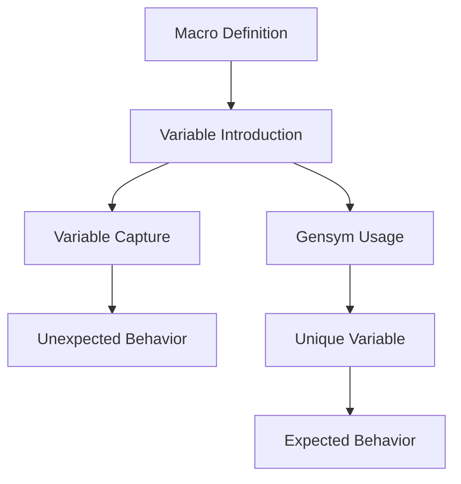

## 9.8.2 Variable Capture and Hygiene

As we delve deeper into the world of Clojure macros, it's crucial to understand the concept of **variable capture** and how to maintain **hygiene** in your macro definitions. For Java developers transitioning to Clojure, this section will provide insights into how macros can inadvertently capture variables, leading to unexpected behavior, and how to prevent this using techniques like gensyms.

### Understanding Variable Capture

Variable capture occurs when a macro unintentionally binds a variable that is already in use in the surrounding code. This can lead to bugs that are difficult to trace because the macro's behavior changes based on the context in which it is used.

#### Example of Variable Capture

Consider the following macro that attempts to create a simple `let` binding:

```clojure
(defmacro my-let [binding expr]
  `(let [~binding 42]
     ~expr))

;; Usage
(let [x 10]
  (my-let x (+ x 1)))
```

In this example, the macro `my-let` captures the variable `x` from the surrounding context. Instead of using the `x` defined in the `let` binding, it uses the `x` from the macro, leading to unexpected results.

#### Why Variable Capture is Problematic

Variable capture can lead to:

- **Unpredictable Behavior**: The macro may behave differently depending on the context in which it is used.
- **Hard-to-Debug Errors**: Errors caused by variable capture can be subtle and difficult to trace back to the macro.
- **Code Maintenance Issues**: As the codebase grows, maintaining macros with variable capture issues becomes increasingly challenging.

### Ensuring Hygiene with Gensyms

To avoid variable capture, Clojure provides a mechanism called **gensyms** (generated symbols). Gensyms are unique symbols that ensure the variables within a macro do not interfere with those in the surrounding code.

#### Using Gensyms to Prevent Variable Capture

Let's rewrite the previous macro using gensyms:

```clojure
(defmacro my-let [binding expr]
  (let [unique-binding (gensym "binding")]
    `(let [~unique-binding 42]
       (let [~binding ~unique-binding]
         ~expr))))

;; Usage
(let [x 10]
  (my-let x (+ x 1)))
```

In this version, `gensym` generates a unique symbol for the binding, ensuring that it does not clash with any existing variables in the surrounding context.

### How Gensyms Work

Gensyms generate a unique symbol each time they are called. This uniqueness is crucial for maintaining hygiene in macros. Here's a simple demonstration:

```clojure
(def unique-symbol (gensym "temp"))
(println unique-symbol) ; => temp1234 (example output)
```

Each call to `gensym` produces a new, unique symbol, preventing variable capture.

### Comparing with Java

In Java, variable scoping is more explicit, and the language does not have a direct equivalent to macros. However, Java developers can relate to the concept of variable capture through the use of closures and anonymous classes, where variable scope can lead to similar issues.

### Best Practices for Macro Hygiene

1. **Use Gensyms**: Always use gensyms for variables that are introduced within macros to avoid capture.
2. **Limit Macro Complexity**: Keep macros simple to reduce the risk of variable capture and other issues.
3. **Test Macros Thoroughly**: Ensure that macros behave as expected in various contexts by writing comprehensive tests.
4. **Document Macro Behavior**: Clearly document the expected behavior and limitations of macros to aid future maintenance.

### Try It Yourself

Experiment with the following code to see how variable capture can affect macro behavior:

```clojure
(defmacro capture-test [var]
  `(let [~var 100]
     ~var))

;; Test with different variable names
(let [x 5]
  (capture-test x)) ; What do you expect the output to be?
```

Try modifying the macro to use gensyms and observe the changes in behavior.

### Diagrams and Visualizations

To better understand the concept of variable capture and hygiene, let's visualize the flow of data and variable scope in macros.



**Diagram Explanation**: This flowchart illustrates how variable capture can lead to unexpected behavior and how using gensyms can ensure unique variables, leading to expected behavior.

### Further Reading

For more information on macros and variable capture, consider exploring the following resources:

- [Official Clojure Documentation on Macros](https://clojure.org/reference/macros)
- [ClojureDocs: Macros](https://clojuredocs.org/quickref#macros)
- [Clojure Programming by Chas Emerick](https://www.oreilly.com/library/view/clojure-programming/9781449310387/)

### Exercises

1. **Rewrite a Macro**: Take a macro from your codebase that may have variable capture issues and refactor it using gensyms.
2. **Create a New Macro**: Design a new macro that introduces variables and ensure it is hygienic.
3. **Test Your Macros**: Write tests for your macros to verify their behavior in different contexts.

### Key Takeaways

- **Variable Capture**: A common issue in macros where variables are unintentionally bound to existing ones in the surrounding context.
- **Gensyms**: A tool in Clojure to generate unique symbols, preventing variable capture and ensuring macro hygiene.
- **Macro Hygiene**: Essential for writing robust and maintainable macros, avoiding unpredictable behavior and hard-to-debug errors.

By understanding and applying these concepts, you can write more reliable and maintainable macros in Clojure, leveraging the full power of metaprogramming while avoiding common pitfalls.

## Quiz: Mastering Variable Capture and Hygiene in Clojure Macros



### What is variable capture in the context of Clojure macros?

- [x] When a macro unintentionally binds a variable that is already in use in the surrounding code.
- [ ] When a macro intentionally binds a new variable.
- [ ] When a macro fails to compile due to syntax errors.
- [ ] When a macro introduces a new variable without using gensyms.

> **Explanation:** Variable capture occurs when a macro unintentionally binds a variable that is already in use in the surrounding code, leading to unexpected behavior.

### How can you prevent variable capture in Clojure macros?

- [x] By using gensyms to generate unique symbols.
- [ ] By avoiding the use of macros altogether.
- [ ] By using Java-style annotations.
- [ ] By writing macros in a separate namespace.

> **Explanation:** Gensyms generate unique symbols, preventing variable capture by ensuring that variables introduced within a macro do not clash with existing ones.

### What is the purpose of gensyms in Clojure?

- [x] To generate unique symbols for use in macros.
- [ ] To optimize the performance of Clojure programs.
- [ ] To provide type safety in Clojure code.
- [ ] To enable Java interoperability.

> **Explanation:** Gensyms are used to generate unique symbols, ensuring that variables within macros do not interfere with those in the surrounding code.

### Which of the following is a symptom of variable capture?

- [x] Unpredictable behavior of macros in different contexts.
- [ ] Improved performance of macro-generated code.
- [ ] Increased readability of macro definitions.
- [ ] Enhanced compatibility with Java libraries.

> **Explanation:** Variable capture can lead to unpredictable behavior of macros, as they may behave differently depending on the context in which they are used.

### What is a best practice for writing hygienic macros?

- [x] Use gensyms for variables introduced within macros.
- [ ] Avoid using macros in any codebase.
- [x] Test macros thoroughly in various contexts.
- [ ] Use Java-style exception handling in macros.

> **Explanation:** Using gensyms and testing macros thoroughly are best practices for writing hygienic macros, preventing variable capture and ensuring expected behavior.

### How does Clojure's approach to macros differ from Java's handling of similar concepts?

- [x] Clojure uses macros for metaprogramming, while Java relies on reflection and annotations.
- [ ] Java provides built-in support for macros, while Clojure does not.
- [ ] Clojure macros are compiled at runtime, while Java macros are compiled at compile-time.
- [ ] Java macros are more efficient than Clojure macros.

> **Explanation:** Clojure uses macros for metaprogramming, allowing code transformation at compile-time, while Java relies on reflection and annotations for similar purposes.

### What is the role of gensyms in ensuring macro hygiene?

- [x] They prevent variable capture by generating unique symbols.
- [ ] They enhance the readability of macro code.
- [ ] They improve the performance of macro-generated code.
- [ ] They enable cross-language compatibility.

> **Explanation:** Gensyms prevent variable capture by generating unique symbols, ensuring that variables within macros do not interfere with those in the surrounding code.

### Which of the following is NOT a consequence of variable capture?

- [ ] Unpredictable behavior of macros.
- [ ] Hard-to-debug errors.
- [x] Improved code readability.
- [ ] Maintenance challenges in large codebases.

> **Explanation:** Variable capture leads to unpredictable behavior, hard-to-debug errors, and maintenance challenges, but not improved code readability.

### What is a common pitfall when writing macros?

- [x] Variable capture due to non-unique symbols.
- [ ] Overuse of Java-style exception handling.
- [ ] Excessive use of type annotations.
- [ ] Lack of support for concurrency.

> **Explanation:** A common pitfall when writing macros is variable capture, which occurs when non-unique symbols are used.

### True or False: Gensyms are only necessary in complex macros.

- [ ] True
- [x] False

> **Explanation:** False. Gensyms are necessary in any macro that introduces variables, regardless of complexity, to prevent variable capture.


