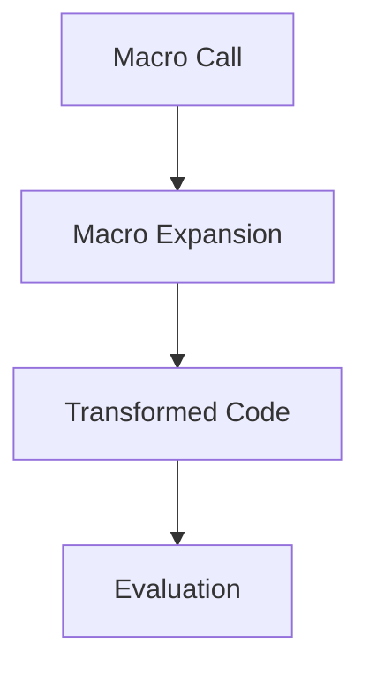

## 9.8.3 Debugging Macros

Debugging macros in Clojure can be a challenging yet rewarding task. Macros, being a powerful feature of Lisp languages, allow developers to extend the language by writing code that generates code. This metaprogramming capability can lead to more expressive and concise programs but also introduces complexity when things go wrong. In this section, we will explore effective strategies for debugging macros, leveraging tools like `macroexpand`, breaking down complex macros, and testing them with diverse inputs. We'll also draw parallels with Java to help you transition smoothly into Clojure's macro world.

### Understanding Macros in Clojure

Before diving into debugging, let's briefly revisit what macros are and why they are used. In Clojure, macros are functions that operate on the code itself, transforming it before it is evaluated. This allows for powerful abstractions and can lead to more concise and expressive code. However, because macros manipulate code at compile time, debugging them requires a different approach compared to regular functions.

#### Key Characteristics of Macros

- **Code Transformation**: Macros take code as input and produce transformed code as output.
- **Compile-Time Execution**: Macros are expanded at compile time, not runtime.
- **Syntax Manipulation**: They can manipulate the syntax tree, allowing for custom language constructs.

### Common Challenges in Debugging Macros

Debugging macros can be tricky due to several factors:

- **Complexity**: Macros can become complex as they often involve manipulating abstract syntax trees (ASTs).
- **Lack of Runtime Information**: Since macros are expanded at compile time, traditional runtime debugging tools are less effective.
- **Unintended Side Effects**: Incorrect macro expansions can lead to unexpected behavior in the generated code.

### Strategies for Debugging Macros

Let's explore some strategies to effectively debug macros in Clojure.

#### 1. Using `macroexpand` to Inspect Expanded Code

One of the most powerful tools for debugging macros is the `macroexpand` function. It allows you to see the code generated by a macro before it is evaluated. This is akin to viewing the bytecode generated by a Java compiler to understand what your Java code translates into.

**Example:**

```clojure
(defmacro my-macro [x]
  `(println "The value is:" ~x))

;; Using macroexpand to see the expanded code
(macroexpand '(my-macro 42))
```

**Output:**

```clojure
(clojure.core/println "The value is:" 42)
```

In this example, `macroexpand` shows us that `my-macro` transforms into a call to `println`. This insight is crucial for understanding what the macro does and diagnosing any issues.

**Try It Yourself:** Modify the macro to include additional operations, such as arithmetic, and use `macroexpand` to observe the changes.

#### 2. Breaking Down Complex Macros into Smaller Parts

Complex macros can be difficult to debug due to their size and intricacy. Breaking them down into smaller, more manageable parts can simplify the debugging process. This is similar to refactoring complex Java methods into smaller, more focused methods.

**Example:**

```clojure
(defmacro complex-macro [x y]
  `(let [sum# (+ ~x ~y)
         diff# (- ~x ~y)]
     (println "Sum:" sum# "Difference:" diff#)))

;; Break down into smaller parts
(defmacro sum-part [x y]
  `(+ ~x ~y))

(defmacro diff-part [x y]
  `(- ~x ~y))

(defmacro refactored-macro [x y]
  `(let [sum# (sum-part ~x ~y)
         diff# (diff-part ~x ~y)]
     (println "Sum:" sum# "Difference:" diff#)))
```

By breaking down `complex-macro` into `sum-part` and `diff-part`, we make it easier to isolate and debug each component.

**Try It Yourself:** Add additional operations, such as multiplication or division, and refactor the macro further.

#### 3. Testing Macros with Diverse Inputs

Testing macros with a variety of inputs can help uncover edge cases and unexpected behavior. This is akin to writing unit tests for Java methods to ensure they handle different scenarios correctly.

**Example:**

```clojure
(defmacro safe-divide [x y]
  `(if (zero? ~y)
     (println "Cannot divide by zero")
     (/ ~x ~y)))

;; Test with diverse inputs
(safe-divide 10 2)  ;; Expected: 5
(safe-divide 10 0)  ;; Expected: "Cannot divide by zero"
```

By testing `safe-divide` with different values of `y`, we ensure that it handles division by zero gracefully.

**Try It Yourself:** Create additional test cases with negative numbers and fractions to further validate the macro.

### Comparing Clojure Macros with Java

In Java, metaprogramming is typically achieved through reflection or code generation libraries. While these approaches offer some flexibility, they lack the seamless integration and syntactic elegance of Clojure macros.

#### Java Reflection Example

```java
import java.lang.reflect.Method;

public class ReflectionExample {
    public static void main(String[] args) throws Exception {
        Method method = String.class.getMethod("toUpperCase");
        String result = (String) method.invoke("hello");
        System.out.println(result);  // Outputs: HELLO
    }
}
```

Reflection allows Java to inspect and manipulate code at runtime, but it can be cumbersome and error-prone compared to Clojure's compile-time macros.

### Visualizing Macro Expansion

To better understand macro expansion, let's visualize the process using a flowchart. This diagram illustrates how a macro is expanded into its final form before evaluation.



**Caption:** This flowchart shows the process of macro expansion, where a macro call is transformed into code before being evaluated.

### Best Practices for Debugging Macros

- **Start Simple**: Begin with simple macros and gradually increase complexity.
- **Use `macroexpand` Frequently**: Regularly inspect expanded code to ensure correctness.
- **Refactor Complex Macros**: Break down large macros into smaller, testable components.
- **Test Extensively**: Write tests for macros with a variety of inputs to catch edge cases.
- **Document Intent**: Clearly document the purpose and expected behavior of macros.

### Exercises and Practice Problems

1. **Exercise 1**: Create a macro that generates a loop construct similar to Java's `for` loop. Use `macroexpand` to verify its correctness.
2. **Exercise 2**: Refactor a complex macro into smaller parts and test each part independently.
3. **Exercise 3**: Write a macro that conditionally logs messages based on a verbosity level. Test it with different verbosity settings.

### Key Takeaways

- **Macros are powerful tools** for code transformation in Clojure, enabling expressive and concise programs.
- **Debugging macros requires different strategies** than debugging regular functions, focusing on compile-time inspection.
- **Tools like `macroexpand` are invaluable** for understanding macro behavior and diagnosing issues.
- **Testing macros with diverse inputs** helps ensure they handle all scenarios correctly.
- **Comparing with Java's reflection** highlights the elegance and integration of Clojure macros.

Now that we've explored strategies for debugging macros, let's apply these techniques to create robust and reliable macros in your Clojure projects. By mastering macro debugging, you'll unlock the full potential of Clojure's metaprogramming capabilities.

## Quiz: Mastering Macro Debugging in Clojure



### What is the primary purpose of the `macroexpand` function in Clojure?

- [x] To inspect the expanded code generated by a macro
- [ ] To execute a macro at runtime
- [ ] To optimize macro performance
- [ ] To convert macros into functions

> **Explanation:** `macroexpand` is used to inspect the expanded code generated by a macro, helping developers understand what the macro transforms into before evaluation.

### How can breaking down complex macros into smaller parts aid in debugging?

- [x] It simplifies the debugging process by isolating issues
- [ ] It increases the complexity of the macro
- [ ] It makes the macro run faster
- [ ] It reduces the need for testing

> **Explanation:** Breaking down complex macros into smaller parts simplifies the debugging process by isolating issues and making each part easier to test and understand.

### What is a key difference between Clojure macros and Java reflection?

- [x] Clojure macros operate at compile time, while Java reflection operates at runtime
- [ ] Java reflection is more powerful than Clojure macros
- [ ] Clojure macros are slower than Java reflection
- [ ] Java reflection is easier to use than Clojure macros

> **Explanation:** Clojure macros operate at compile time, transforming code before it is evaluated, whereas Java reflection operates at runtime, inspecting and manipulating code dynamically.

### Which of the following is a best practice for debugging macros?

- [x] Use `macroexpand` frequently to inspect expanded code
- [ ] Avoid testing macros with diverse inputs
- [ ] Write macros without documentation
- [ ] Combine all macro logic into a single function

> **Explanation:** Using `macroexpand` frequently to inspect expanded code is a best practice for debugging macros, as it helps ensure the macro behaves as expected.

### What is the benefit of testing macros with diverse inputs?

- [x] It helps uncover edge cases and unexpected behavior
- [ ] It reduces the need for `macroexpand`
- [ ] It simplifies the macro code
- [ ] It eliminates the need for documentation

> **Explanation:** Testing macros with diverse inputs helps uncover edge cases and unexpected behavior, ensuring the macro handles all scenarios correctly.

### How does Clojure's macro system compare to Java's code generation libraries?

- [x] Clojure's macros offer seamless integration and syntactic elegance
- [ ] Java's code generation libraries are more concise
- [ ] Clojure's macros are less powerful
- [ ] Java's code generation libraries are easier to debug

> **Explanation:** Clojure's macros offer seamless integration and syntactic elegance, allowing for expressive and concise code transformations compared to Java's code generation libraries.

### What is the role of `macroexpand` in the macro debugging process?

- [x] To visualize the code transformation process
- [ ] To execute the macro at runtime
- [ ] To optimize the macro for performance
- [ ] To convert the macro into a function

> **Explanation:** `macroexpand` plays a crucial role in the macro debugging process by visualizing the code transformation process, allowing developers to see what the macro expands into.

### Why is it important to document the intent of macros?

- [x] To clearly communicate the purpose and expected behavior
- [ ] To increase the complexity of the macro
- [ ] To make the macro run faster
- [ ] To reduce the need for testing

> **Explanation:** Documenting the intent of macros is important to clearly communicate the purpose and expected behavior, aiding in understanding and maintaining the code.

### What is a potential risk of using macros in Clojure?

- [x] Unintended side effects due to incorrect macro expansions
- [ ] Increased runtime performance
- [ ] Simplified code structure
- [ ] Reduced code complexity

> **Explanation:** A potential risk of using macros in Clojure is unintended side effects due to incorrect macro expansions, which can lead to unexpected behavior in the generated code.

### True or False: Macros in Clojure are expanded at runtime.

- [ ] True
- [x] False

> **Explanation:** False. Macros in Clojure are expanded at compile time, not runtime, which is a key characteristic that differentiates them from regular functions.


