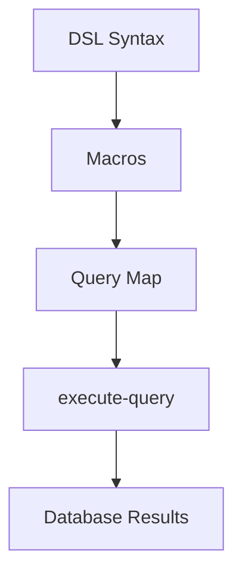

## 9.9.2 Building DSLs

Domain-Specific Languages (DSLs) are specialized mini-languages tailored to a specific application domain. They allow developers to express complex ideas in a concise and readable manner. In Clojure, the power of macros makes it particularly well-suited for building DSLs. This section will guide you through the process of creating a simple DSL using Clojure macros, with comparisons to Java where applicable.

### Understanding DSLs

Before diving into the implementation, let's clarify what a DSL is. A DSL is a language designed to be used for a specific set of tasks. Unlike general-purpose programming languages, DSLs are optimized for a particular domain, which can lead to increased productivity and clarity.

#### Types of DSLs

1. **Internal DSLs**: These are embedded within a host language. Clojure's syntax and macros make it ideal for creating internal DSLs.
2. **External DSLs**: These are standalone languages with their own syntax and parsers.

In this guide, we'll focus on building an internal DSL in Clojure.

### Why Use Clojure for DSLs?

Clojure's Lisp heritage provides a unique advantage for DSL creation:

- **Homoiconicity**: Clojure code is represented as data structures (lists), making it easy to manipulate code with code.
- **Macros**: Allow for powerful compile-time transformations, enabling the creation of expressive DSLs.
- **Conciseness**: Clojure's syntax is minimalistic, reducing boilerplate and enhancing readability.

### Building a Simple Query DSL

Let's build a simple query DSL that allows users to express database queries in a more readable and concise manner. We'll use Clojure macros to transform these DSL expressions into executable Clojure code.

#### Defining the DSL Syntax

Our DSL will support basic operations like `select`, `where`, and `order-by`. Here's an example of what a query might look like in our DSL:

```clojure
(query
  (select :name :age)
  (from :users)
  (where (> :age 18))
  (order-by :name))
```

#### Implementing the DSL

We'll start by defining macros for each part of the DSL. These macros will transform the DSL syntax into Clojure code that can be executed.

##### The `query` Macro

The `query` macro will serve as the entry point for our DSL. It will take a series of expressions and transform them into a function call.

```clojure
(defmacro query [& body]
  `(-> {}
       ~@body))
```

- **Explanation**: The `query` macro uses the threading macro `->` to pass an initial empty map through each expression in the body. Each expression will modify this map to build the final query.

##### The `select` Macro

The `select` macro specifies which fields to retrieve.

```clojure
(defmacro select [& fields]
  `(assoc ~'query :select '~fields))
```

- **Explanation**: The `select` macro adds a `:select` key to the query map, storing the list of fields to retrieve.

##### The `from` Macro

The `from` macro specifies the data source.

```clojure
(defmacro from [table]
  `(assoc ~'query :from '~table))
```

- **Explanation**: The `from` macro adds a `:from` key to the query map, indicating the data source.

##### The `where` Macro

The `where` macro specifies filtering conditions.

```clojure
(defmacro where [condition]
  `(assoc ~'query :where '~condition))
```

- **Explanation**: The `where` macro adds a `:where` key to the query map, storing the filtering condition.

##### The `order-by` Macro

The `order-by` macro specifies the sorting order.

```clojure
(defmacro order-by [field]
  `(assoc ~'query :order-by '~field))
```

- **Explanation**: The `order-by` macro adds an `:order-by` key to the query map, specifying the sorting field.

### Executing the DSL

To execute the DSL, we'll need a function that interprets the query map and performs the actual database query. For simplicity, let's assume we have a function `execute-query` that takes a query map and returns results.

```clojure
(defn execute-query [query]
  ;; Placeholder for query execution logic
  (println "Executing query:" query))
```

- **Explanation**: The `execute-query` function is a placeholder that prints the query map. In a real application, this function would interact with a database.

### Comparing with Java

In Java, building a similar DSL would require a lot of boilerplate code and possibly a custom parser. Here's a simple example of how a query might be expressed in Java using a builder pattern:

```java
Query query = new QueryBuilder()
    .select("name", "age")
    .from("users")
    .where("age > 18")
    .orderBy("name")
    .build();
```

- **Explanation**: The Java example uses a builder pattern to construct the query. While this approach is common in Java, it lacks the flexibility and conciseness of Clojure's macro-based DSL.

### Enhancing the DSL

Now that we have a basic DSL, let's enhance it with additional features:

#### Adding Joins

We can extend the DSL to support joins by adding a `join` macro.

```clojure
(defmacro join [table on]
  `(assoc ~'query :join {:table '~table :on '~on}))
```

- **Explanation**: The `join` macro adds a `:join` key to the query map, specifying the table to join and the join condition.

#### Supporting Aggregations

We can also add support for aggregations like `count` and `sum`.

```clojure
(defmacro aggregate [func field]
  `(assoc ~'query :aggregate {:func '~func :field '~field}))
```

- **Explanation**: The `aggregate` macro adds an `:aggregate` key to the query map, specifying the aggregation function and field.

### Try It Yourself

Experiment with the DSL by adding new features or modifying existing ones. Here are some ideas:

- Add support for `group-by`.
- Implement a `limit` macro to restrict the number of results.
- Enhance the `where` macro to support complex conditions.

### Visualizing the DSL

To better understand the flow of data through our DSL, let's use a diagram to represent the transformation process.



**Diagram Description**: This flowchart illustrates how DSL syntax is transformed by macros into a query map, which is then executed to retrieve database results.

### Key Takeaways

- **Clojure's macros** provide a powerful tool for building expressive DSLs.
- **DSLs** can simplify complex tasks by providing a domain-specific syntax.
- **Macros** enable compile-time transformations, reducing runtime overhead.
- **Clojure's syntax** and homoiconicity make it ideal for creating internal DSLs.

### Further Reading

- [Official Clojure Documentation](https://clojure.org/reference/macros)
- [ClojureDocs](https://clojuredocs.org/)
- [GitHub - Clojure DSL Examples](https://github.com/clojure-examples/dsl)

### Exercises

1. **Extend the DSL**: Add support for `group-by` and `having` clauses.
2. **Implement a Custom Function**: Create a macro that allows users to define custom functions within the DSL.
3. **Optimize the DSL**: Refactor the DSL to improve performance and readability.

Now that we've explored how to build a DSL in Clojure, let's apply these concepts to create more powerful and expressive tools in your applications.

## Quiz: Mastering DSLs in Clojure



### What is a DSL?

- [x] A specialized language for a specific domain
- [ ] A general-purpose programming language
- [ ] A type of database management system
- [ ] A Java library for data processing

> **Explanation:** A DSL, or Domain-Specific Language, is designed for a specific set of tasks within a particular domain.

### What advantage does Clojure have for building DSLs?

- [x] Homoiconicity and macros
- [ ] Object-oriented programming
- [ ] Static typing
- [ ] Extensive standard library

> **Explanation:** Clojure's homoiconicity and macros make it particularly well-suited for building DSLs.

### How does the `query` macro transform DSL syntax?

- [x] It threads an initial map through each expression
- [ ] It compiles the DSL into Java bytecode
- [ ] It converts the DSL into a JSON object
- [ ] It directly executes the DSL syntax

> **Explanation:** The `query` macro uses the threading macro `->` to pass an initial map through each expression, building the final query.

### What is the purpose of the `select` macro in the DSL?

- [x] To specify which fields to retrieve
- [ ] To define the data source
- [ ] To execute the query
- [ ] To sort the results

> **Explanation:** The `select` macro specifies the fields to retrieve in the query.

### How can the DSL be extended to support joins?

- [x] By adding a `join` macro
- [ ] By modifying the `select` macro
- [ ] By using Java's reflection API
- [ ] By creating a new data type

> **Explanation:** A `join` macro can be added to the DSL to support joins by specifying the table and join condition.

### What is the role of the `execute-query` function?

- [x] To interpret and execute the query map
- [ ] To transform DSL syntax into Clojure code
- [ ] To compile the DSL into a binary format
- [ ] To visualize the query results

> **Explanation:** The `execute-query` function interprets the query map and performs the actual database query.

### What is a key difference between Clojure and Java DSLs?

- [x] Clojure uses macros for compile-time transformations
- [ ] Java has a more concise syntax
- [ ] Clojure requires more boilerplate code
- [ ] Java supports homoiconicity

> **Explanation:** Clojure's macros allow for powerful compile-time transformations, unlike Java, which often relies on runtime patterns like builders.

### What does the `aggregate` macro do?

- [x] Specifies aggregation functions and fields
- [ ] Defines the data source
- [ ] Executes the query
- [ ] Sorts the results

> **Explanation:** The `aggregate` macro specifies the aggregation function and field for the query.

### How does Clojure's homoiconicity benefit DSL creation?

- [x] Code is represented as data, making it easy to manipulate
- [ ] It provides a large standard library
- [ ] It enforces strict type checking
- [ ] It supports object-oriented programming

> **Explanation:** Homoiconicity means Clojure code is represented as data structures, facilitating code manipulation and transformation.

### True or False: Clojure's macros can only be used for DSLs.

- [ ] True
- [x] False

> **Explanation:** Clojure's macros are versatile and can be used for various compile-time transformations beyond DSLs.




