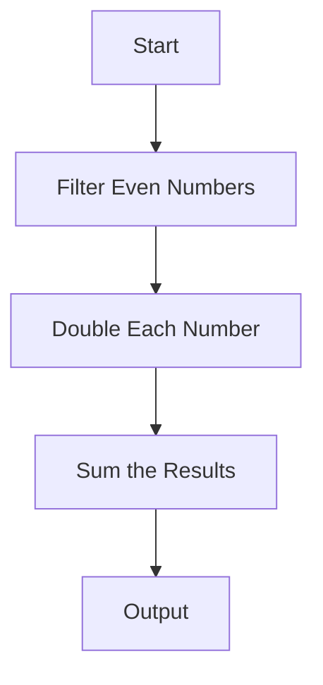

## 1.2 Principles of Functional Programming

Functional programming (FP) represents a paradigm shift from the imperative and object-oriented programming (OOP) styles that many Java professionals are accustomed to. At its core, FP emphasizes the use of functions as the primary building blocks of software, promoting principles such as immutability, pure functions, and statelessness. These principles lead to code that is often more predictable, easier to test, and inherently parallelizable. In this section, we will delve deep into these core principles, contrasting them with imperative and OOP approaches, and explore how they contribute to building robust and maintainable software systems.

### Immutability: The Cornerstone of Functional Programming

Immutability is a fundamental concept in functional programming. It refers to the idea that once a data structure is created, it cannot be changed. Instead of modifying existing data, new data structures are created with the desired changes. This approach contrasts sharply with the mutable state commonly found in imperative and OOP languages like Java.

#### Benefits of Immutability

1. **Predictability and Simplicity**: Immutable data structures eliminate the complexity associated with shared mutable state, making it easier to reason about code behavior. When data cannot change unexpectedly, functions that operate on that data become more predictable.

2. **Concurrency and Parallelism**: Immutability naturally supports concurrent and parallel execution. Since immutable data cannot be altered, there is no risk of race conditions or data corruption when multiple threads access the same data.

3. **Ease of Testing**: Testing becomes more straightforward with immutable data. Functions that operate on immutable data are often pure (a concept we will explore shortly), allowing for isolated and deterministic tests.

#### Immutability in Clojure

Clojure, a functional language that runs on the JVM, embraces immutability through its persistent data structures. These data structures, such as lists, vectors, maps, and sets, are designed to be efficient even when new versions are created with modifications.

```clojure
(def original-vector [1 2 3])
(def new-vector (conj original-vector 4))

;; original-vector remains unchanged
(println original-vector) ;; Output: [1 2 3]
(println new-vector)      ;; Output: [1 2 3 4]
```

In the example above, `conj` returns a new vector with the added element, leaving the original vector unchanged.

### Pure Functions: Ensuring Consistency and Reliability

A pure function is a function where the output value is determined only by its input values, without observable side effects. This means that given the same inputs, a pure function will always produce the same output, and it does not alter any external state.

#### Characteristics of Pure Functions

1. **Deterministic**: Pure functions produce the same result for the same inputs, making them predictable and reliable.

2. **No Side Effects**: Pure functions do not modify any external state or interact with the outside world (e.g., no I/O operations, no modifying global variables).

3. **Referential Transparency**: Pure functions can be replaced with their output value without changing the program's behavior, a property known as referential transparency.

#### Advantages of Pure Functions

- **Ease of Testing and Debugging**: Pure functions are easier to test because they do not depend on external state. Unit tests can be written by simply asserting the expected output for given inputs.
  
- **Parallelization**: Since pure functions do not depend on shared state, they can be executed in parallel without concerns of data races or inconsistencies.

- **Composability**: Pure functions can be easily composed to build more complex operations, enhancing code reuse and modularity.

#### Example of Pure Functions in Clojure

```clojure
(defn add [x y]
  (+ x y))

(defn square [x]
  (* x x))

(defn sum-of-squares [a b]
  (add (square a) (square b)))

(println (sum-of-squares 3 4)) ;; Output: 25
```

In this example, `add`, `square`, and `sum-of-squares` are pure functions. They depend solely on their input parameters and produce consistent results.

### Statelessness: Reducing Complexity

Statelessness in functional programming refers to the practice of designing functions that do not rely on or modify external state. Instead, all necessary data is passed as arguments to functions, and any state changes are returned as new data structures.

#### Benefits of Statelessness

- **Simplified Reasoning**: Stateless functions are easier to reason about because they do not depend on or alter external state. This reduces the mental overhead required to understand how a function behaves.

- **Improved Modularity**: Stateless functions can be easily reused and composed into larger systems, promoting modularity and separation of concerns.

- **Enhanced Testability**: Like pure functions, stateless functions are easier to test because they do not rely on external state, allowing for isolated and deterministic tests.

#### Statelessness in Practice

In functional programming, state is often managed through function composition and data transformation, rather than through mutable objects or global variables.

```clojure
(defn process-data [data]
  (-> data
      (filter even?)
      (map #(* % 2))
      (reduce +)))

(println (process-data [1 2 3 4 5 6])) ;; Output: 24
```

In this example, `process-data` is a stateless function that processes a collection of numbers. It filters, maps, and reduces the data without relying on any external state.

### Contrasting Functional Programming with Imperative and Object-Oriented Approaches

#### Imperative Programming

Imperative programming focuses on describing how a program operates, using statements that change a program's state. This approach often involves mutable variables and explicit control flow, such as loops and conditionals.

- **Stateful**: Imperative code frequently relies on mutable state, which can lead to complex dependencies and side effects.

- **Sequential**: Imperative code often follows a sequential execution model, which can complicate parallelization.

- **Verbose**: Imperative code can be verbose, with explicit instructions for each step of a computation.

#### Object-Oriented Programming

Object-oriented programming organizes code around objects, which encapsulate state and behavior. OOP promotes concepts such as inheritance, polymorphism, and encapsulation.

- **Encapsulation**: OOP encapsulates state within objects, which can simplify state management but also lead to hidden dependencies.

- **Inheritance and Polymorphism**: OOP uses inheritance and polymorphism to promote code reuse, but these features can introduce complexity and tight coupling.

- **Mutable State**: OOP often involves mutable state, which can lead to challenges in concurrency and testing.

### How Functional Principles Lead to More Predictable and Maintainable Code

1. **Reduced Complexity**: By eliminating mutable state and side effects, functional programming reduces the complexity associated with state management and side effects, making code easier to understand and maintain.

2. **Enhanced Modularity**: Functional programming promotes the use of small, reusable functions, which can be easily composed to build complex systems. This enhances modularity and separation of concerns.

3. **Improved Testability**: Pure functions and stateless design make testing more straightforward, as functions can be tested in isolation without dependencies on external state.

4. **Concurrency and Parallelism**: Immutability and statelessness naturally support concurrent and parallel execution, enabling more efficient use of modern multi-core processors.

5. **Predictability and Reliability**: Functional code is often more predictable and reliable due to the absence of side effects and the use of pure functions.

### Practical Code Examples and Snippets

To illustrate these principles, let's explore a practical example of a functional approach to a common problem: processing a collection of data.

#### Example: Processing a Collection of Data

Suppose we have a collection of numbers, and we want to filter out the odd numbers, double the remaining even numbers, and sum the results.

**Imperative Approach (Java)**

```java
import java.util.Arrays;
import java.util.List;

public class ImperativeExample {
    public static void main(String[] args) {
        List<Integer> numbers = Arrays.asList(1, 2, 3, 4, 5, 6);
        int sum = 0;
        for (int number : numbers) {
            if (number % 2 == 0) {
                sum += number * 2;
            }
        }
        System.out.println(sum); // Output: 24
    }
}
```

**Functional Approach (Clojure)**

```clojure
(defn process-data [data]
  (->> data
       (filter even?)
       (map #(* % 2))
       (reduce +)))

(println (process-data [1 2 3 4 5 6])) ;; Output: 24
```

In the functional approach, we use a series of transformations (`filter`, `map`, `reduce`) to process the data. Each transformation is a pure function, and the entire process is stateless and declarative.

### Diagrams and Flowcharts

To further illustrate the flow of data in functional programming, consider the following flowchart that represents the data processing pipeline in the Clojure example:



This flowchart visually represents the sequence of transformations applied to the data, highlighting the declarative nature of functional programming.

### Best Practices, Common Pitfalls, and Optimization Tips

#### Best Practices

- **Embrace Immutability**: Use immutable data structures wherever possible to reduce complexity and enhance predictability.

- **Favor Pure Functions**: Strive to write pure functions that do not produce side effects, as they are easier to test and reason about.

- **Leverage Function Composition**: Use function composition to build complex operations from simple, reusable functions.

- **Use Higher-Order Functions**: Take advantage of higher-order functions to create flexible and reusable code.

#### Common Pitfalls

- **Overusing Global State**: Avoid relying on global state, as it can lead to hidden dependencies and make code difficult to test.

- **Neglecting Performance Considerations**: While immutability and pure functions offer many benefits, they can also introduce performance overhead. Use profiling tools to identify and optimize performance bottlenecks.

- **Ignoring Type Safety**: Clojure is a dynamically typed language, which can lead to runtime errors if types are not carefully managed. Consider using tools like `spec` for runtime type checking.

#### Optimization Tips

- **Use Persistent Data Structures**: Clojure's persistent data structures are designed for efficient immutability. Use them to minimize performance overhead.

- **Optimize Hot Paths**: Identify and optimize performance-critical sections of code, using techniques such as memoization and parallel processing.

- **Profile and Benchmark**: Use profiling and benchmarking tools to identify performance bottlenecks and evaluate the impact of optimizations.

### Conclusion

The principles of functional programming—immutability, pure functions, and statelessness—offer a powerful alternative to the imperative and object-oriented paradigms. By embracing these principles, developers can create code that is more predictable, maintainable, and scalable. As Java professionals explore Clojure and functional programming, they will discover new ways to tackle complex software challenges and build robust, high-performance systems.

## Quiz Time!



### Which of the following is a core principle of functional programming?

- [x] Immutability
- [ ] Inheritance
- [ ] Encapsulation
- [ ] Polymorphism

> **Explanation:** Immutability is a core principle of functional programming, emphasizing that data structures cannot be changed once created.

### What is a pure function?

- [x] A function that always produces the same output for the same input
- [ ] A function that modifies global variables
- [ ] A function that performs I/O operations
- [ ] A function that relies on external state

> **Explanation:** A pure function always produces the same output for the same input and does not have side effects.

### How does immutability benefit concurrent programming?

- [x] It eliminates race conditions by ensuring data cannot be changed
- [ ] It allows for mutable shared state
- [ ] It requires locking mechanisms
- [ ] It increases the complexity of data structures

> **Explanation:** Immutability ensures that data cannot be changed, eliminating race conditions and making concurrent programming safer.

### What is referential transparency?

- [x] The property that allows a function call to be replaced with its output value
- [ ] The ability to modify global state
- [ ] The use of inheritance and polymorphism
- [ ] The encapsulation of state within objects

> **Explanation:** Referential transparency allows a function call to be replaced with its output value without changing the program's behavior.

### Which of the following is a benefit of stateless functions?

- [x] Simplified reasoning and improved modularity
- [ ] Increased reliance on global variables
- [ ] Greater complexity in testing
- [ ] Dependence on mutable state

> **Explanation:** Stateless functions simplify reasoning and improve modularity by not relying on or modifying external state.

### What is the main difference between imperative and functional programming?

- [x] Imperative programming focuses on how to perform tasks, while functional programming focuses on what to compute
- [ ] Imperative programming uses pure functions, while functional programming uses mutable state
- [ ] Imperative programming is stateless, while functional programming relies on global state
- [ ] Imperative programming is declarative, while functional programming is procedural

> **Explanation:** Imperative programming describes how to perform tasks, while functional programming describes what to compute.

### How does functional programming enhance testability?

- [x] By using pure functions that do not depend on external state
- [ ] By relying on mutable global variables
- [ ] By using inheritance and polymorphism
- [ ] By encapsulating state within objects

> **Explanation:** Functional programming enhances testability by using pure functions that do not depend on external state, allowing for isolated and deterministic tests.

### What is a higher-order function?

- [x] A function that takes other functions as arguments or returns a function as a result
- [ ] A function that modifies global variables
- [ ] A function that performs I/O operations
- [ ] A function that relies on external state

> **Explanation:** A higher-order function takes other functions as arguments or returns a function as a result, enabling flexible and reusable code.

### Which Clojure feature supports immutability?

- [x] Persistent data structures
- [ ] Mutable arrays
- [ ] Global variables
- [ ] Inheritance

> **Explanation:** Clojure's persistent data structures support immutability by efficiently creating new versions of data structures with modifications.

### True or False: Functional programming inherently supports parallel execution.

- [x] True
- [ ] False

> **Explanation:** True. Functional programming inherently supports parallel execution due to its emphasis on immutability and statelessness, which eliminate race conditions and data corruption.


