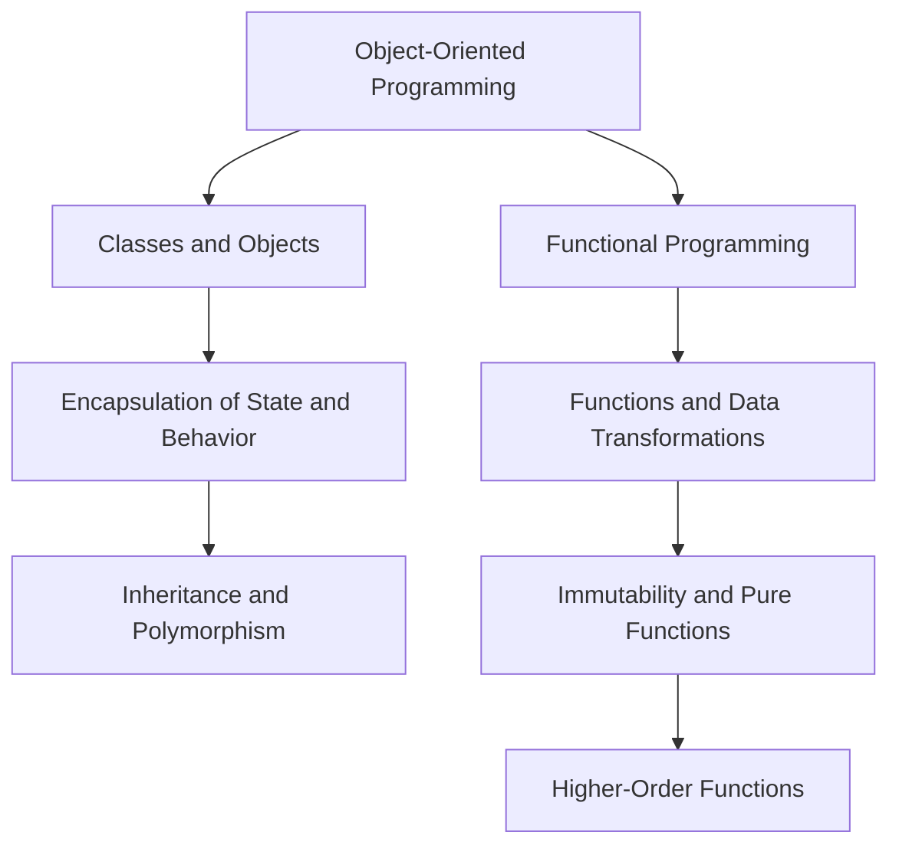

---

linkTitle: "2.3.2 Emphasizing Functions Over Objects"
title: "Emphasizing Functions Over Objects: A Functional Paradigm Shift"
description: "Explore the transition from object-oriented to functional programming, focusing on the use of functions over objects in Clojure. Discover the impact on code organization, modularity, and design patterns."
categories:
- Functional Programming
- Clojure
- Software Design
tags:
- Functional Programming
- Clojure
- Java
- Code Modularity
- Design Patterns
date: 2024-10-25
type: docs
nav_weight: 123200
canonical: "https://clojureforjava.com/10/1/2/3/2"
license: "© 2024 Tokenizer Inc. CC BY-NC-SA 4.0"
---

## 2.3.2 Emphasizing Functions Over Objects

In the realm of software development, the transition from object-oriented programming (OOP) to functional programming (FP) represents a significant paradigm shift. This shift is characterized by a fundamental change in how developers conceptualize and construct software systems. In OOP, the focus is on modeling real-world entities as objects, encapsulating both data and behavior. In contrast, functional programming emphasizes the use of functions as the primary building blocks, with a focus on data transformations and immutability. This section delves into the nuances of this transition, particularly in the context of Clojure, and explores its impact on code organization, modularity, and design patterns.

### The Object-Oriented Paradigm: A Brief Overview

Before diving into the functional paradigm, it's essential to understand the foundation laid by object-oriented programming. OOP is built around the concept of objects, which are instances of classes. These objects encapsulate state (data) and behavior (methods), promoting the principles of encapsulation, inheritance, and polymorphism. This approach aligns closely with how humans perceive the world, making it intuitive for modeling complex systems.

In Java, a quintessential OOP language, developers often structure applications around classes and interfaces. Consider the following simple Java class:

```java
public class Car {
    private String make;
    private String model;
    private int year;

    public Car(String make, String model, int year) {
        this.make = make;
        this.model = model;
        this.year = year;
    }

    public void drive() {
        System.out.println("The car is driving.");
    }

    // Getters and setters omitted for brevity
}
```

Here, the `Car` class encapsulates the properties and behaviors of a car, providing a blueprint for creating car objects.

### The Functional Paradigm: A New Perspective

Functional programming, on the other hand, shifts the focus from objects to functions. In FP, functions are first-class citizens, meaning they can be passed as arguments, returned from other functions, and assigned to variables. This paradigm emphasizes immutability, pure functions (functions without side effects), and higher-order functions (functions that operate on other functions).

In Clojure, a functional language that runs on the Java Virtual Machine (JVM), the emphasis is on data and transformations. Instead of encapsulating data and behavior within objects, Clojure encourages the use of simple data structures (like maps and vectors) and pure functions to manipulate them.

Consider the following Clojure code that represents a car:

```clojure
(def car {:make "Toyota" :model "Corolla" :year 2020})

(defn drive [car]
  (println "The car is driving."))
```

In this example, the `car` is represented as a map, and the `drive` function operates on it. This separation of data and behavior is a hallmark of functional programming.

### The Impact on Code Organization and Modularity

The shift from objects to functions has profound implications for code organization and modularity. In OOP, classes and objects often lead to tightly coupled code, where changes to one part of the system can ripple through the entire codebase. This is due to the inherent statefulness of objects and the reliance on inheritance hierarchies.

Functional programming, by contrast, promotes loose coupling and high cohesion. Functions are small, composable units that operate on immutable data, making them easier to reason about, test, and reuse. This leads to a more modular codebase, where components can be developed and maintained independently.

#### Code Organization in Clojure

In Clojure, code is organized into namespaces, which serve a similar purpose to packages in Java. A namespace groups related functions and data structures, promoting encapsulation and reusability. Here's an example of how a Clojure namespace might be structured:

```clojure
(ns myapp.core
  (:require [clojure.string :as str]))

(defn greet [name]
  (str "Hello, " name "!"))

(defn main []
  (println (greet "World")))
```

This organization encourages developers to think in terms of functions and data transformations, rather than objects and methods.

#### Modularity Through Higher-Order Functions

Higher-order functions are a powerful tool in the functional programmer's toolkit. They enable developers to create flexible, reusable components by abstracting common patterns of computation. For example, the `map` function in Clojure applies a given function to each element of a collection, transforming it into a new collection:

```clojure
(defn square [x] (* x x))

(map square [1 2 3 4 5]) ; => (1 4 9 16 25)
```

By abstracting the iteration logic, `map` allows developers to focus on the transformation itself, enhancing code modularity and readability.

### Functional Design Patterns: A New Approach

The emphasis on functions over objects also influences the design patterns used in functional programming. Many classic OOP patterns, such as Singleton, Factory, and Observer, are either unnecessary or take on a different form in FP.

#### The Singleton Pattern

In OOP, the Singleton pattern ensures that a class has only one instance and provides a global point of access to it. In functional programming, global state is discouraged, and the need for singletons is often eliminated by using pure functions and closures.

#### The Factory Pattern

The Factory pattern in OOP is used to create objects without specifying the exact class of object that will be created. In Clojure, data construction is often handled through simple functions or data literals, reducing the need for complex factory hierarchies.

#### The Observer Pattern

The Observer pattern in OOP involves objects (observers) that watch another object (subject) and are notified of changes. In FP, this pattern can be replaced with functional reactive programming (FRP) techniques, which use streams and transformations to manage state changes and events.

### Practical Code Examples and Snippets

To illustrate these concepts, let's explore a practical example of a simple application that processes a list of transactions. In an OOP approach, you might have a `Transaction` class with methods to process each transaction:

```java
public class Transaction {
    private double amount;
    private String type;

    public Transaction(double amount, String type) {
        this.amount = amount;
        this.type = type;
    }

    public void process() {
        // Process the transaction
    }
}
```

In Clojure, you can achieve the same functionality using functions and data transformations:

```clojure
(def transactions
  [{:amount 100.0 :type "credit"}
   {:amount 50.0 :type "debit"}
   {:amount 200.0 :type "credit"}])

(defn process-transaction [transaction]
  (println "Processing transaction:" transaction))

(doseq [transaction transactions]
  (process-transaction transaction))
```

Here, the `process-transaction` function operates on each transaction map, demonstrating the functional approach to data processing.

### Diagrams and Flowcharts

To further illustrate the differences between OOP and FP, consider the following flowchart that compares the two paradigms:



This flowchart highlights the distinct paths taken by OOP and FP, emphasizing the focus on functions and data in the latter.

### Best Practices, Common Pitfalls, and Optimization Tips

When transitioning from OOP to FP, developers should be mindful of several best practices and potential pitfalls:

- **Embrace Immutability:** Always strive to use immutable data structures. This reduces bugs and makes your code easier to reason about.
- **Favor Pure Functions:** Write functions that have no side effects and always produce the same output for the same input. This enhances testability and reliability.
- **Leverage Higher-Order Functions:** Use higher-order functions to abstract common patterns and create reusable components.
- **Avoid Global State:** Minimize the use of global variables and shared state. Instead, pass state explicitly through function arguments.
- **Optimize for Readability:** Functional code can be concise, but it's important to maintain readability. Use descriptive names and comments where necessary.

### Conclusion

The shift from emphasizing objects to functions represents a fundamental change in how software systems are designed and implemented. By focusing on functions and data transformations, developers can create more modular, maintainable, and scalable applications. Clojure, with its rich set of functional programming features, provides a powerful platform for embracing this paradigm shift. As you continue your journey into functional programming, remember that the key lies in thinking differently about how you model and solve problems, leveraging the strengths of functions and immutability to build robust software solutions.

## Quiz Time!



### What is the primary focus of functional programming?

- [x] Functions and data transformations
- [ ] Objects and classes
- [ ] Inheritance and polymorphism
- [ ] Encapsulation and abstraction

> **Explanation:** Functional programming emphasizes the use of functions and data transformations, rather than objects and classes.

### In Clojure, how is a car typically represented?

- [x] As a map with key-value pairs
- [ ] As a class with methods
- [ ] As an array of properties
- [ ] As a singleton object

> **Explanation:** In Clojure, a car is typically represented as a map, which is a simple data structure with key-value pairs.

### What is a higher-order function?

- [x] A function that operates on other functions
- [ ] A function that returns a single value
- [ ] A function that modifies global state
- [ ] A function that is part of a class

> **Explanation:** A higher-order function is one that takes other functions as arguments or returns them as results.

### Which of the following is a key benefit of immutability?

- [x] Easier reasoning about code
- [ ] Increased complexity
- [ ] More memory usage
- [ ] Slower performance

> **Explanation:** Immutability makes it easier to reason about code, as data does not change unexpectedly.

### How does functional programming handle state changes?

- [x] Through explicit data transformations
- [ ] By modifying global variables
- [ ] By using class methods
- [ ] By creating new objects

> **Explanation:** Functional programming handles state changes through explicit data transformations, avoiding global state modifications.

### What is the role of namespaces in Clojure?

- [x] To organize code and group related functions
- [ ] To define classes and objects
- [ ] To manage memory allocation
- [ ] To handle input/output operations

> **Explanation:** Namespaces in Clojure are used to organize code and group related functions and data structures.

### What is a common pitfall when transitioning from OOP to FP?

- [x] Relying on mutable state
- [ ] Using too many functions
- [ ] Writing too much documentation
- [ ] Overusing inheritance

> **Explanation:** A common pitfall is relying on mutable state, which goes against the principles of functional programming.

### Which design pattern is often unnecessary in functional programming?

- [x] Singleton pattern
- [ ] Strategy pattern
- [ ] Factory pattern
- [ ] Observer pattern

> **Explanation:** The Singleton pattern is often unnecessary in functional programming due to the avoidance of global state.

### What is a pure function?

- [x] A function with no side effects
- [ ] A function that modifies state
- [ ] A function that returns different results for the same input
- [ ] A function that is part of a class

> **Explanation:** A pure function has no side effects and always returns the same result for the same input.

### True or False: Functional programming encourages the use of global state.

- [ ] True
- [x] False

> **Explanation:** False. Functional programming discourages the use of global state, favoring explicit data transformations instead.


