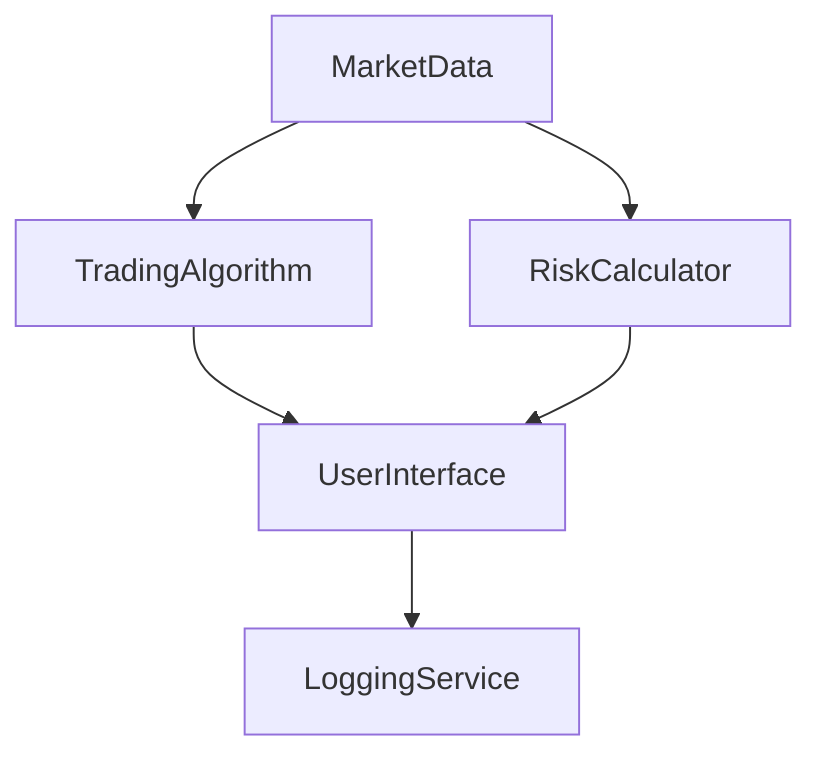

## 5.2.2 Complex Dependencies and Tight Coupling

In the realm of software design, the Observer pattern is a well-known solution for implementing a one-to-many dependency between objects, allowing multiple observers to be notified of changes to a subject. While this pattern is powerful, it can also lead to complex webs of dependencies that are difficult to manage, test, and maintain. This section delves into the intricacies of these issues, particularly focusing on how the Observer pattern can create tight coupling and complex dependencies, and how functional programming, specifically Clojure, offers elegant solutions to these challenges.

### Understanding the Observer Pattern

The Observer pattern is a behavioral design pattern that defines a subscription mechanism to allow multiple objects, known as observers, to listen and react to events or changes in another object, known as the subject. This pattern is prevalent in event-driven systems, GUI toolkits, and real-time data processing applications.

#### Key Components of the Observer Pattern

1. **Subject**: The core entity that maintains a list of observers and notifies them of state changes.
2. **Observer**: An entity that registers with the subject to receive updates.
3. **ConcreteSubject**: A specific implementation of the subject that holds the state of interest.
4. **ConcreteObserver**: A specific implementation of the observer that reacts to changes in the subject.

#### Java Example of the Observer Pattern

In Java, the Observer pattern is typically implemented using interfaces or abstract classes. Here's a simple example:

```java
import java.util.ArrayList;
import java.util.List;

interface Observer {
    void update(String message);
}

class ConcreteObserver implements Observer {
    private String name;

    public ConcreteObserver(String name) {
        this.name = name;
    }

    @Override
    public void update(String message) {
        System.out.println(name + " received: " + message);
    }
}

class Subject {
    private List<Observer> observers = new ArrayList<>();

    public void addObserver(Observer observer) {
        observers.add(observer);
    }

    public void removeObserver(Observer observer) {
        observers.remove(observer);
    }

    public void notifyObservers(String message) {
        for (Observer observer : observers) {
            observer.update(message);
        }
    }
}
```

### Challenges of the Observer Pattern

While the Observer pattern facilitates decoupling in theory, in practice, it can lead to several issues:

1. **Complex Dependencies**: As the number of observers grows, the dependency graph becomes more intricate, making it difficult to track the flow of data and control.
2. **Tight Coupling**: Observers often become tightly coupled to the subject, particularly if they need to access specific data or methods.
3. **Memory Leaks**: If observers are not properly deregistered, they can lead to memory leaks, as the subject retains references to them.
4. **Testing Difficulties**: The indirect communication between subjects and observers complicates unit testing, as it requires setting up complex mock environments.

### Complex Dependencies in the Observer Pattern

Complex dependencies arise when multiple observers depend on the state of a single subject or when subjects themselves are observers of other subjects. This can create a cascading effect where a change in one subject triggers a chain of updates across the system. This web of dependencies can be difficult to visualize and manage, leading to unexpected behaviors and bugs.

#### Example of Complex Dependencies

Consider a financial application where multiple components (e.g., trading algorithms, risk calculators, and user interfaces) observe market data updates. Each component may also observe other components, leading to a complex dependency graph:



In this diagram, a change in `MarketData` affects both `TradingAlgorithm` and `RiskCalculator`, which in turn affect the `UserInterface`. This illustrates how a simple change can propagate through the system, making it difficult to predict the overall impact.

### Tight Coupling in the Observer Pattern

Tight coupling occurs when observers are closely linked to the subject's implementation details. This can happen if observers need to access specific data or methods from the subject, leading to a situation where changes in the subject's implementation require changes in the observers.

#### Example of Tight Coupling

In the Java example above, observers are tightly coupled to the subject's notification mechanism. If the subject's method signature changes, all observers must be updated accordingly. This tight coupling makes the system less flexible and harder to maintain.

### Functional Programming Solutions in Clojure

Functional programming offers a different approach to managing dependencies and coupling, emphasizing immutability, pure functions, and declarative data flow. Clojure, as a functional language, provides several constructs that can help mitigate the issues associated with the Observer pattern.

#### Leveraging Immutability

In Clojure, data structures are immutable by default, which means that once created, they cannot be changed. This immutability simplifies reasoning about state changes and reduces the risk of unintended side effects.

#### Using Pure Functions

Pure functions, which do not have side effects and always produce the same output for the same input, are a cornerstone of functional programming. By structuring your application around pure functions, you can minimize dependencies and make your code more predictable and easier to test.

#### Functional Reactive Programming (FRP)

Functional Reactive Programming (FRP) is a paradigm that combines functional programming with reactive programming principles. It allows you to model dynamic systems as a series of transformations over time, using streams of data.

##### Example of FRP in Clojure

Clojure's `core.async` library provides tools for building FRP systems. Here's a simple example of using channels to decouple components:

```clojure
(require '[clojure.core.async :refer [chan go >! <!]])

(def market-data-chan (chan))
(def trading-algo-chan (chan))
(def risk-calc-chan (chan))

(go
  (while true
    (let [data (<! market-data-chan)]
      (>! trading-algo-chan (process-trading data))
      (>! risk-calc-chan (process-risk data)))))

(go
  (while true
    (let [trading-result (<! trading-algo-chan)]
      (update-ui trading-result))))

(go
  (while true
    (let [risk-result (<! risk-calc-chan)]
      (update-ui risk-result))))
```

In this example, channels are used to decouple the components, allowing them to communicate without being tightly coupled. Each component can be tested independently, and changes to one component do not affect others.

#### Managing State with Atoms and Refs

Clojure provides several mechanisms for managing state, including atoms and refs, which offer controlled ways to manage mutable state without the pitfalls of traditional mutable objects.

##### Example of Using Atoms

Atoms provide a way to manage shared, synchronous state changes:

```clojure
(def market-data (atom {}))

(defn update-market-data [new-data]
  (swap! market-data merge new-data))
```

By using atoms, you can ensure that state changes are atomic and consistent, reducing the risk of race conditions and other concurrency issues.

### Best Practices for Avoiding Complex Dependencies and Tight Coupling

1. **Favor Composition Over Inheritance**: Use composition to build complex behaviors from simple, reusable components.
2. **Use Pure Functions**: Structure your code around pure functions to minimize dependencies and side effects.
3. **Leverage Immutability**: Use immutable data structures to simplify reasoning about state changes.
4. **Decouple Components with Channels**: Use channels to decouple components and manage communication in a flexible, testable way.
5. **Test Independently**: Design your system so that components can be tested independently, without requiring complex setup or teardown.

### Conclusion

The Observer pattern, while useful, can lead to complex dependencies and tight coupling that make systems difficult to manage and test. By adopting functional programming principles and leveraging Clojure's powerful tools, you can build systems that are more modular, flexible, and maintainable. Embracing immutability, pure functions, and FRP can help you avoid the pitfalls of traditional OOP patterns and create robust, scalable applications.

## Quiz Time!



### What is a primary challenge of the Observer pattern?

- [x] Complex dependencies
- [ ] Simplicity in implementation
- [ ] Lack of flexibility
- [ ] Easy testing

> **Explanation:** The Observer pattern can lead to complex dependencies as multiple observers depend on the state of a single subject, creating intricate webs of dependencies.

### How does immutability help in managing state?

- [x] Simplifies reasoning about state changes
- [ ] Increases the complexity of code
- [ ] Makes state changes unpredictable
- [ ] Requires more memory

> **Explanation:** Immutability simplifies reasoning about state changes by ensuring that data structures cannot be changed once created, reducing the risk of unintended side effects.

### What is a benefit of using pure functions?

- [x] Predictable and easier to test
- [ ] Increased side effects
- [ ] Requires more dependencies
- [ ] Harder to understand

> **Explanation:** Pure functions are predictable and easier to test because they do not have side effects and always produce the same output for the same input.

### What is a key feature of Functional Reactive Programming (FRP)?

- [x] Modeling dynamic systems as transformations over time
- [ ] Emphasizing mutable state
- [ ] Using inheritance for behavior
- [ ] Tight coupling of components

> **Explanation:** FRP models dynamic systems as a series of transformations over time, using streams of data, which helps in decoupling components.

### How can channels help in decoupling components in Clojure?

- [x] By allowing communication without tight coupling
- [ ] By increasing dependencies
- [ ] By requiring shared state
- [ ] By enforcing strict synchronization

> **Explanation:** Channels in Clojure allow components to communicate without being tightly coupled, enabling flexible and testable communication patterns.

### What is a common issue with observers not being deregistered?

- [x] Memory leaks
- [ ] Increased performance
- [ ] Simplified code
- [ ] Reduced dependencies

> **Explanation:** If observers are not properly deregistered, they can lead to memory leaks as the subject retains references to them.

### What is an advantage of using atoms in Clojure?

- [x] Ensures atomic and consistent state changes
- [ ] Increases the risk of race conditions
- [ ] Requires complex synchronization
- [ ] Makes state changes unpredictable

> **Explanation:** Atoms in Clojure ensure that state changes are atomic and consistent, reducing the risk of race conditions and concurrency issues.

### What is a best practice for avoiding tight coupling?

- [x] Favor composition over inheritance
- [ ] Use inheritance for all behaviors
- [ ] Share state across components
- [ ] Increase dependencies

> **Explanation:** Favoring composition over inheritance helps in building complex behaviors from simple, reusable components, reducing tight coupling.

### What is a challenge of testing systems with complex dependencies?

- [x] Requires setting up complex mock environments
- [ ] Simplified test cases
- [ ] Reduced need for testing
- [ ] Easier to isolate components

> **Explanation:** Testing systems with complex dependencies requires setting up complex mock environments to simulate the interactions between components.

### True or False: Functional programming principles can help mitigate issues with the Observer pattern.

- [x] True
- [ ] False

> **Explanation:** Functional programming principles, such as immutability and pure functions, can help mitigate issues with the Observer pattern by reducing dependencies and side effects.


