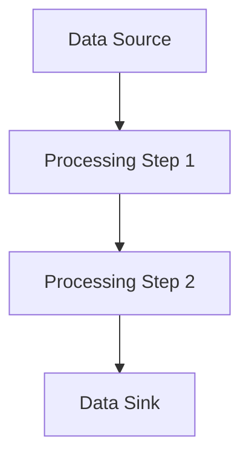

## 7.5 Case Study: Building a Flexible Data Processing Library

In this case study, we will walk through the development of a flexible data processing library in Clojure. This library will leverage the power of functional programming paradigms such as composition, higher-order functions, and protocols to ensure flexibility and reusability. By the end of this chapter, you will have a comprehensive understanding of how to build a robust data processing library that can be easily extended and adapted to various use cases.

### Introduction to Data Processing in Clojure

Data processing is a critical component of many applications, from simple data transformations to complex analytics and machine learning pipelines. Clojure, with its emphasis on immutability and functional programming, provides a unique set of tools and abstractions that make it particularly well-suited for building data processing systems.

#### Key Concepts

Before diving into the implementation, let's briefly review some key concepts that will be central to our library:

- **Composition**: The process of combining simple functions to build more complex ones. In Clojure, composition is facilitated by functions like `comp` and `->>`.
- **Higher-Order Functions**: Functions that take other functions as arguments or return them as results. These are a cornerstone of functional programming and enable powerful abstractions.
- **Protocols**: A mechanism in Clojure for defining a set of methods that can be implemented by different types, providing polymorphism and extensibility.

### Designing the Library

Our goal is to create a library that can handle various data processing tasks, such as filtering, transforming, and aggregating data. The library should be easy to extend with new processing steps and should support both batch and stream processing.

#### Core Components

The library will consist of the following core components:

1. **Data Sources**: Abstractions for reading data from various sources, such as files, databases, or APIs.
2. **Processing Steps**: Individual functions or compositions of functions that perform specific transformations or analyses on the data.
3. **Pipelines**: Compositions of processing steps that define the overall data processing workflow.
4. **Data Sinks**: Abstractions for writing processed data to various destinations.

#### Architectural Overview

The architecture of our library will be modular, with each component being independent and composable. This modularity will allow users to mix and match components to suit their specific needs.



### Implementing the Library

Let's dive into the implementation of each component, starting with data sources.

#### Data Sources

Data sources are responsible for providing data to the processing pipeline. We will define a protocol `DataSource` that specifies a method `read-data` for reading data.

```clojure
(defprotocol DataSource
  (read-data [this] "Read data from the source"))
```

We can implement this protocol for different types of data sources. For example, a file-based data source:

```clojure
(defrecord FileDataSource [file-path]
  DataSource
  (read-data [this]
    (with-open [reader (clojure.java.io/reader (:file-path this))]
      (doall (line-seq reader)))))
```

This implementation reads data from a file line by line and returns it as a sequence.

#### Processing Steps

Processing steps are the heart of our library. They are functions that take data as input and produce transformed data as output. We will use higher-order functions to define these steps.

For example, a simple filtering step:

```clojure
(defn filter-step [predicate]
  (fn [data]
    (filter predicate data)))
```

This function takes a predicate and returns a new function that filters data based on that predicate.

Another example, a transformation step:

```clojure
(defn map-step [transform-fn]
  (fn [data]
    (map transform-fn data)))
```

This function takes a transformation function and returns a new function that applies it to each element in the data.

#### Pipelines

Pipelines are compositions of processing steps. We will use the `comp` function to create pipelines.

```clojure
(defn create-pipeline [& steps]
  (apply comp steps))
```

This function takes a variable number of steps and composes them into a single pipeline function.

#### Data Sinks

Data sinks are responsible for writing processed data to a destination. We will define a protocol `DataSink` with a method `write-data`.

```clojure
(defprotocol DataSink
  (write-data [this data] "Write data to the sink"))
```

An example implementation for writing data to a file:

```clojure
(defrecord FileDataSink [file-path]
  DataSink
  (write-data [this data]
    (with-open [writer (clojure.java.io/writer (:file-path this))]
      (doseq [line data]
        (.write writer (str line "\n"))))))
```

### Building a Sample Data Processing Workflow

Now that we have our core components, let's build a sample data processing workflow. We will read data from a file, filter it, transform it, and write the results to another file.

```clojure
(defn sample-workflow []
  (let [source (->FileDataSource "input.txt")
        sink (->FileDataSink "output.txt")
        pipeline (create-pipeline
                  (filter-step #(> (count %) 3))
                  (map-step clojure.string/upper-case))]
    (->> (read-data source)
         (pipeline)
         (write-data sink))))
```

In this example, we create a pipeline that filters out lines with fewer than four characters and converts the remaining lines to uppercase.

### Extending the Library

One of the key advantages of our design is its extensibility. Users can easily add new data sources, processing steps, or data sinks by implementing the appropriate protocols.

#### Adding a New Data Source

Suppose we want to add a data source that reads from a database. We can implement the `DataSource` protocol for a `DatabaseDataSource`.

```clojure
(defrecord DatabaseDataSource [db-spec query]
  DataSource
  (read-data [this]
    (jdbc/query (:db-spec this) [(:query this)])))
```

#### Adding a New Processing Step

To add a new processing step, simply define a new function. For example, a step that aggregates data:

```clojure
(defn aggregate-step [aggregate-fn]
  (fn [data]
    (reduce aggregate-fn data)))
```

#### Adding a New Data Sink

To add a new data sink, implement the `DataSink` protocol. For example, a sink that writes data to a REST API:

```clojure
(defrecord RestApiDataSink [url]
  DataSink
  (write-data [this data]
    (doseq [item data]
      (http/post (:url this) {:body item}))))
```

### Best Practices and Optimization Tips

Building a flexible data processing library involves more than just writing code. Here are some best practices and optimization tips to consider:

- **Leverage Clojure's Lazy Sequences**: Use lazy sequences to handle large datasets efficiently without loading everything into memory at once.
- **Use Transducers for Efficiency**: Transducers provide a way to compose processing steps without creating intermediate collections, improving performance.
- **Profile and Optimize**: Use tools like [VisualVM](https://visualvm.github.io/) or [YourKit](https://www.yourkit.com/) to profile your application and identify bottlenecks.
- **Write Tests**: Ensure your library is reliable by writing comprehensive tests for each component. Use `clojure.test` for unit tests and `test.check` for property-based testing.
- **Document Extensibility Points**: Clearly document how users can extend the library with new components.

### Conclusion

In this case study, we have developed a flexible data processing library in Clojure, leveraging composition, higher-order functions, and protocols. This library is designed to be modular and extensible, allowing users to easily adapt it to their specific needs. By following best practices and optimization tips, you can build a robust and efficient data processing system that takes full advantage of Clojure's functional programming capabilities.

## Quiz Time!



### What is the primary advantage of using composition in a data processing library?

- [x] It allows combining simple functions to build complex workflows.
- [ ] It reduces the need for documentation.
- [ ] It eliminates the need for error handling.
- [ ] It simplifies the user interface.

> **Explanation:** Composition allows developers to build complex workflows by combining simple functions, enhancing modularity and reusability.

### How do higher-order functions contribute to the flexibility of a library?

- [x] They enable functions to take other functions as arguments or return them as results.
- [ ] They automatically optimize performance.
- [ ] They eliminate the need for protocols.
- [ ] They provide built-in error handling.

> **Explanation:** Higher-order functions allow for powerful abstractions by enabling functions to take other functions as arguments or return them as results, increasing flexibility.

### What is the role of protocols in the library?

- [x] They define a set of methods that can be implemented by different types.
- [ ] They automatically handle concurrency.
- [ ] They provide default implementations for all methods.
- [ ] They replace the need for namespaces.

> **Explanation:** Protocols define a set of methods that can be implemented by different types, providing polymorphism and extensibility.

### Which function is used to create a pipeline of processing steps?

- [x] `comp`
- [ ] `map`
- [ ] `filter`
- [ ] `reduce`

> **Explanation:** The `comp` function is used to create a pipeline by composing multiple functions.

### What is a key benefit of using lazy sequences in Clojure?

- [x] They allow processing large datasets without loading everything into memory.
- [ ] They automatically parallelize computations.
- [ ] They eliminate the need for error handling.
- [ ] They provide built-in logging.

> **Explanation:** Lazy sequences allow processing of large datasets efficiently by not loading everything into memory at once.

### How can transducers improve performance in data processing?

- [x] By composing processing steps without creating intermediate collections.
- [ ] By automatically optimizing database queries.
- [ ] By eliminating the need for protocols.
- [ ] By providing built-in error handling.

> **Explanation:** Transducers improve performance by composing processing steps without creating intermediate collections, reducing overhead.

### What is a recommended tool for profiling a Clojure application?

- [x] VisualVM
- [ ] Git
- [ ] Docker
- [ ] Ring

> **Explanation:** VisualVM is a recommended tool for profiling Java applications, including those written in Clojure.

### Which protocol method is responsible for reading data in the library?

- [x] `read-data`
- [ ] `write-data`
- [ ] `process-data`
- [ ] `transform-data`

> **Explanation:** The `read-data` method is responsible for reading data from a source in the library.

### What is a key consideration when writing tests for the library?

- [x] Ensure comprehensive tests for each component.
- [ ] Avoid testing protocols.
- [ ] Focus only on performance tests.
- [ ] Test only the data sinks.

> **Explanation:** Writing comprehensive tests for each component ensures the reliability and correctness of the library.

### True or False: The library is designed to be modular and extensible.

- [x] True
- [ ] False

> **Explanation:** The library is designed to be modular and extensible, allowing users to easily adapt it to their specific needs.


