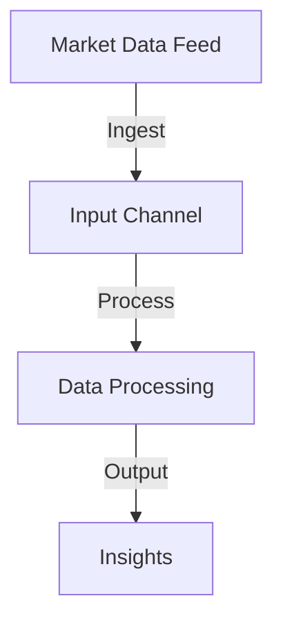

## 15.1.1 Performance and Latency Requirements

In the realm of financial applications, performance and latency are not just technical metrics; they are critical business requirements. The financial industry demands systems that can process vast amounts of data with minimal delay, ensuring timely and accurate decision-making. This section delves into the necessity for low-latency and high-throughput systems in financial applications, explores how Clojure's performance characteristics meet these demands, and discusses techniques for optimizing Clojure code to achieve superior performance.

### The Necessity for Low-Latency and High-Throughput Systems

Financial applications, such as trading platforms, risk management systems, and market data processors, operate in environments where milliseconds can mean the difference between profit and loss. These systems must handle high volumes of transactions and data streams while maintaining low latency to ensure competitive advantage and compliance with regulatory requirements.

#### Key Drivers for Performance and Latency in Financial Systems

1. **Real-Time Data Processing**: Financial markets generate massive amounts of data every second. Systems must ingest, process, and respond to this data in real-time to provide traders and analysts with the most current information.

2. **Algorithmic Trading**: Automated trading strategies rely on executing trades at lightning speed based on market conditions. Latency in executing these trades can lead to missed opportunities and financial losses.

3. **Risk Management**: Accurate and timely risk calculations are essential for maintaining financial stability. Systems must quickly assess market conditions and adjust risk exposure accordingly.

4. **Regulatory Compliance**: Financial institutions must adhere to strict regulations that often require detailed transaction records and timely reporting. High-performance systems ensure compliance without sacrificing speed.

5. **Customer Experience**: In retail banking and investment platforms, user satisfaction is directly tied to system responsiveness. Slow applications can lead to customer dissatisfaction and loss of business.

### Clojure's Performance Characteristics

Clojure, a modern functional programming language that runs on the Java Virtual Machine (JVM), offers several performance characteristics that make it suitable for building high-performance financial applications.

#### Key Performance Features of Clojure

1. **Immutable Data Structures**: Clojure's persistent data structures provide thread-safe operations without the need for locks, reducing contention and improving performance in concurrent environments.

2. **Efficient Memory Management**: Clojure's use of structural sharing minimizes memory overhead, allowing applications to handle large datasets efficiently.

3. **JVM Interoperability**: Running on the JVM, Clojure can leverage the mature and highly optimized JVM ecosystem, including Just-In-Time (JIT) compilation and garbage collection optimizations.

4. **Concurrency Support**: Clojure provides powerful concurrency primitives, such as atoms, refs, and agents, which simplify the development of concurrent applications and improve performance by reducing synchronization overhead.

5. **Laziness and Transducers**: Clojure's lazy sequences and transducers enable efficient data processing by avoiding unnecessary computations and reducing memory usage.

### Techniques for Optimizing Clojure Code

To fully leverage Clojure's performance capabilities, developers must employ various optimization techniques. This section explores strategies for enhancing the performance of Clojure applications, particularly in the context of financial systems.

#### Profiling and Benchmarking

Before optimizing, it's essential to understand where bottlenecks exist. Profiling tools can help identify slow parts of the code, while benchmarking provides insights into the performance characteristics of different approaches.

- **Criterium**: A popular library for benchmarking Clojure code, Criterium provides accurate and reliable performance measurements by accounting for JVM warm-up and garbage collection effects.

```clojure
(require '[criterium.core :as crit])

(crit/quick-bench (reduce + (range 1000000)))
```

#### Optimizing Data Structures

Choosing the right data structures is crucial for performance. Clojure's persistent data structures are efficient, but understanding their characteristics can help optimize performance further.

- **Vectors vs. Lists**: Use vectors for indexed access and lists for sequential access. Vectors provide O(1) access time, while lists offer O(n) access time.

- **Maps and Sets**: Prefer maps and sets for membership tests and key-value associations, as they offer O(log n) performance.

#### Leveraging Transducers

Transducers provide a way to compose data transformations without creating intermediate collections, reducing memory usage and improving performance.

```clojure
(def xf (comp (filter even?) (map #(* % %))))

(transduce xf + (range 1000))
```

#### Concurrency and Parallelism

Clojure's concurrency primitives allow for efficient parallel processing, which is essential in high-throughput systems.

- **Futures and Promises**: Use futures for simple asynchronous computations and promises for coordinating between threads.

```clojure
(def result (future (do-some-heavy-computation)))

@result ; Blocks until the computation is complete
```

- **Core.async**: For more complex concurrency patterns, core.async provides channels and go blocks for asynchronous communication.

```clojure
(require '[clojure.core.async :refer [chan go <! >!]])

(let [c (chan)]
  (go (>! c (do-some-heavy-computation)))
  (println "Result:" (<! c)))
```

#### JVM Tuning

Since Clojure runs on the JVM, tuning the JVM can have a significant impact on performance.

- **Garbage Collection**: Choose the appropriate garbage collector based on the application's needs. The G1 garbage collector is often suitable for low-latency applications.

- **Heap Size**: Adjust the heap size to ensure that the application has enough memory to operate efficiently without frequent garbage collection pauses.

#### Avoiding Reflection

Reflection can introduce significant overhead in Clojure applications. Use type hints to avoid reflection and improve performance.

```clojure
(defn add [^long a ^long b]
  (+ a b))
```

#### Inlining and Direct Linking

Clojure 1.9 introduced direct linking, which reduces the overhead of dynamic dispatch. Use the `:direct-linking` compiler option to enable this feature.

### Practical Code Examples and Snippets

To illustrate these concepts, let's explore a practical example of building a low-latency data processing pipeline in Clojure.

#### Example: Real-Time Market Data Processing

Suppose we need to build a system that ingests market data, processes it in real-time, and provides insights to traders. We'll use Clojure's concurrency features and transducers to achieve this.

```clojure
(require '[clojure.core.async :refer [chan go <! >!! close!]])

(defn process-market-data [data]
  ;; Simulate data processing
  (Thread/sleep 10)
  (println "Processed data:" data))

(defn market-data-pipeline [input-channel]
  (let [output-channel (chan)]
    (go (loop []
          (when-let [data (<! input-channel)]
            (process-market-data data)
            (recur))))
    output-channel))

(def input-channel (chan 100))
(def output-channel (market-data-pipeline input-channel))

;; Simulate market data feed
(dotimes [i 1000]
  (>!! input-channel {:price (+ 100 (rand-int 10)) :volume (rand-int 1000)}))

(close! input-channel)
```

In this example, we create a channel for incoming market data and process each data point asynchronously. The use of channels and go blocks allows us to handle high-throughput data streams efficiently.

### Diagrams and Flowcharts

To visualize the data processing pipeline, we can use a flowchart to illustrate the flow of data from ingestion to processing.



### Best Practices, Common Pitfalls, and Optimization Tips

#### Best Practices

- **Profile Before Optimizing**: Always profile your application to identify bottlenecks before attempting optimizations.

- **Use Persistent Data Structures**: Leverage Clojure's immutable data structures for thread-safe operations and reduced synchronization overhead.

- **Minimize Side Effects**: Write pure functions and minimize side effects to improve performance and maintainability.

#### Common Pitfalls

- **Overusing Laziness**: While laziness can improve performance by deferring computations, excessive use can lead to memory leaks and increased latency.

- **Ignoring JVM Tuning**: Neglecting JVM tuning can result in suboptimal performance, especially in memory-intensive applications.

#### Optimization Tips

- **Use Transducers**: Replace sequences with transducers to eliminate intermediate collections and improve performance.

- **Avoid Reflection**: Use type hints to avoid the overhead of reflection in performance-critical code paths.

- **Leverage Parallelism**: Use Clojure's concurrency primitives to parallelize computations and utilize multiple CPU cores effectively.

### Conclusion

In conclusion, building low-latency and high-throughput systems in financial applications requires a deep understanding of performance requirements and the ability to leverage language features effectively. Clojure, with its functional programming paradigm, immutable data structures, and powerful concurrency support, provides a solid foundation for developing high-performance financial applications. By employing the optimization techniques discussed in this section, developers can ensure that their Clojure applications meet the demanding performance and latency requirements of the financial industry.

## Quiz Time!



### What is a key driver for performance and latency in financial systems?

- [x] Real-Time Data Processing
- [ ] Static Data Analysis
- [ ] Batch Processing
- [ ] Manual Data Entry

> **Explanation:** Real-time data processing is crucial in financial systems to provide timely and accurate information for decision-making.

### Which Clojure feature helps reduce memory overhead?

- [x] Structural Sharing
- [ ] Dynamic Typing
- [ ] Reflection
- [ ] Lazy Evaluation

> **Explanation:** Structural sharing in Clojure's persistent data structures helps reduce memory overhead by reusing existing data.

### What is the purpose of using transducers in Clojure?

- [x] To compose data transformations without intermediate collections
- [ ] To perform reflection-based operations
- [ ] To enable dynamic typing
- [ ] To create mutable data structures

> **Explanation:** Transducers allow for efficient data processing by eliminating intermediate collections and reducing memory usage.

### Which Clojure feature provides concurrency support?

- [x] Atoms, Refs, and Agents
- [ ] Lazy Sequences
- [ ] Reflection
- [ ] Dynamic Typing

> **Explanation:** Atoms, refs, and agents are concurrency primitives in Clojure that simplify concurrent programming.

### What is a common pitfall when using laziness in Clojure?

- [x] Memory Leaks
- [ ] Improved Performance
- [ ] Reduced Latency
- [ ] Increased Throughput

> **Explanation:** Excessive use of laziness can lead to memory leaks if deferred computations accumulate without being realized.

### How can you avoid reflection in Clojure?

- [x] Use Type Hints
- [ ] Use Dynamic Typing
- [ ] Use Lazy Sequences
- [ ] Use Transducers

> **Explanation:** Type hints help avoid reflection by providing the compiler with type information, improving performance.

### What is a benefit of using Clojure's persistent data structures?

- [x] Thread-Safe Operations
- [ ] Mutable State
- [ ] Increased Latency
- [ ] Dynamic Typing

> **Explanation:** Clojure's persistent data structures provide thread-safe operations without the need for locks, enhancing performance.

### Which JVM feature can be tuned to improve Clojure application performance?

- [x] Garbage Collection
- [ ] Dynamic Typing
- [ ] Reflection
- [ ] Lazy Evaluation

> **Explanation:** Tuning the garbage collector can significantly impact the performance of Clojure applications by reducing pause times.

### What is the role of futures in Clojure?

- [x] To perform asynchronous computations
- [ ] To create mutable data structures
- [ ] To enable dynamic typing
- [ ] To perform reflection-based operations

> **Explanation:** Futures are used for simple asynchronous computations, allowing tasks to run in the background.

### True or False: Clojure's immutability leads to increased synchronization overhead.

- [ ] True
- [x] False

> **Explanation:** Clojure's immutability reduces synchronization overhead by eliminating the need for locks, as data cannot be modified concurrently.


