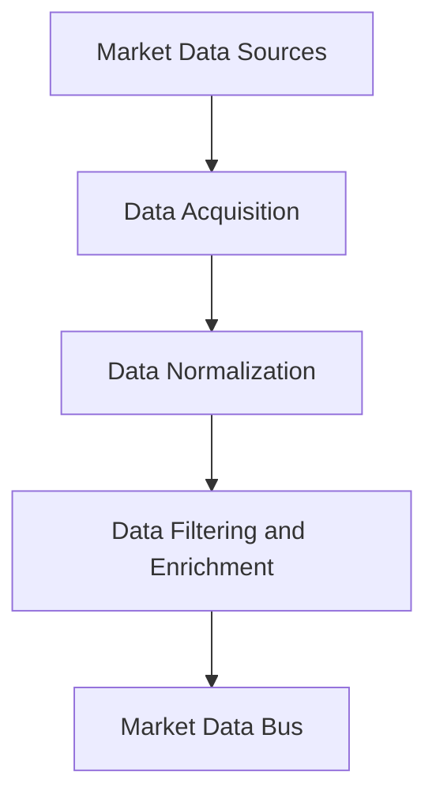
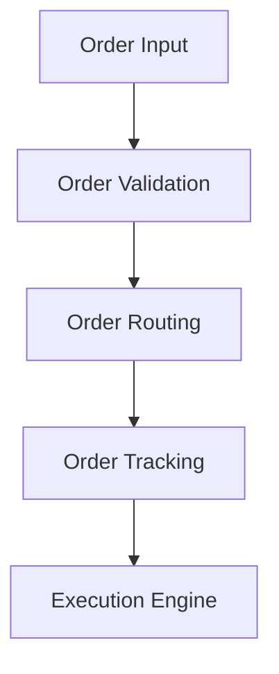
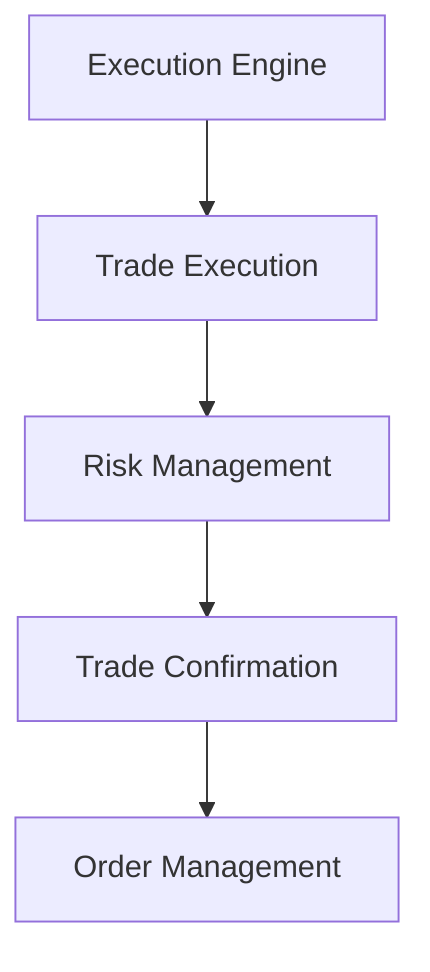
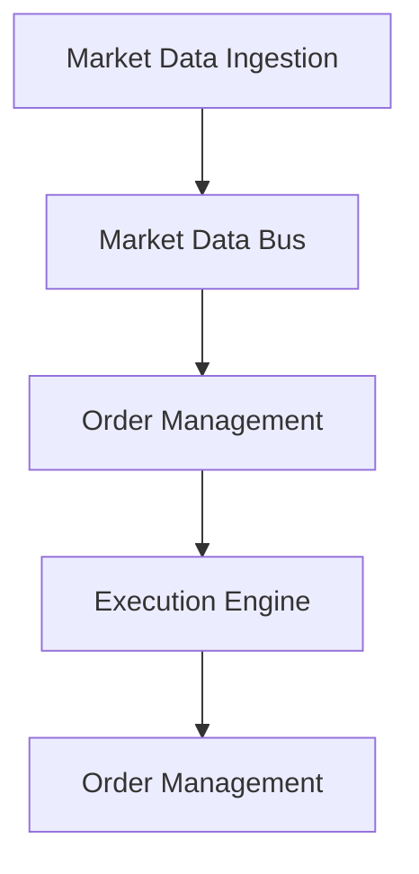

## 15.2.1 Architectural Overview

In the fast-paced world of financial trading, the architecture of a real-time trading system is crucial for ensuring high performance, low latency, and robust decision-making. This section provides a comprehensive overview of the architecture of a real-time trading system, focusing on three core components: market data ingestion, order management, and execution engines. We'll explore how data flows through the system, the decision-making processes involved, and how Clojure's functional programming paradigms can be leveraged to build efficient and scalable trading systems.

### High-Level Architecture

A real-time trading system can be visualized as a series of interconnected components that work together to process market data, manage orders, and execute trades. The architecture is typically divided into three main layers:

1. **Market Data Ingestion Layer**: Responsible for receiving and processing real-time market data from various sources.
2. **Order Management Layer**: Manages the lifecycle of orders, from creation to execution.
3. **Execution Engine Layer**: Executes trades based on predefined strategies and market conditions.

Each of these layers plays a critical role in the overall functionality of the trading system. Let's delve deeper into each component.

### Market Data Ingestion Layer

The market data ingestion layer is the entry point for all external data into the trading system. It is responsible for:

- **Data Acquisition**: Collecting real-time data from multiple sources, such as stock exchanges, financial news feeds, and other market data providers.
- **Data Normalization**: Converting data from various formats into a standardized format that can be easily processed by the system.
- **Data Filtering and Enrichment**: Filtering out irrelevant data and enriching the data with additional information, such as historical context or derived metrics.

#### Data Flow in Market Data Ingestion

The data flow in the market data ingestion layer can be visualized as follows:



- **Market Data Sources**: These are the origins of the data, including exchanges and news feeds.
- **Data Acquisition**: This component uses APIs or direct connections to gather data.
- **Data Normalization**: Here, data is transformed into a consistent format.
- **Data Filtering and Enrichment**: This step involves applying business rules to filter and enhance data.
- **Market Data Bus**: A message bus that distributes the processed data to other components in the system.

#### Implementation in Clojure

Clojure's concurrency capabilities, such as `core.async`, are particularly useful in handling the high throughput and low latency requirements of market data ingestion. Here's a simplified example of how data acquisition might be implemented using `core.async`:

```clojure
(require '[clojure.core.async :as async])

(defn acquire-market-data [source]
  (async/go-loop []
    (let [data (fetch-data-from-source source)]
      (async/>! market-data-channel data))
    (recur)))

(def market-data-channel (async/chan 1000))

(defn start-data-ingestion []
  (doseq [source market-data-sources]
    (acquire-market-data source)))
```

In this example, `acquire-market-data` is a function that continuously fetches data from a given source and puts it onto a channel for further processing.

### Order Management Layer

The order management layer is responsible for handling the lifecycle of orders. This includes:

- **Order Creation**: Accepting new orders from traders or automated trading strategies.
- **Order Validation**: Ensuring that orders meet all necessary criteria before being processed.
- **Order Routing**: Directing orders to the appropriate execution venues based on predefined rules.
- **Order Tracking**: Monitoring the status of orders and updating them as necessary.

#### Data Flow in Order Management

The data flow in the order management layer can be visualized as follows:



- **Order Input**: Orders can be inputted manually by traders or automatically by trading algorithms.
- **Order Validation**: This step checks for compliance with trading rules and regulations.
- **Order Routing**: Orders are directed to the appropriate execution venue.
- **Order Tracking**: The status of each order is monitored and updated.

#### Implementation in Clojure

Clojure's immutable data structures and functional programming paradigms make it well-suited for implementing the order management layer. Here's an example of how order validation might be implemented:

```clojure
(defn validate-order [order]
  (and (valid-symbol? (:symbol order))
       (valid-quantity? (:quantity order))
       (valid-price? (:price order))))

(defn process-order [order]
  (if (validate-order order)
    (route-order order)
    (println "Invalid order:" order)))
```

In this example, `validate-order` is a function that checks whether an order is valid based on its symbol, quantity, and price.

### Execution Engine Layer

The execution engine layer is where trades are executed based on the orders received from the order management layer. This layer is responsible for:

- **Trade Execution**: Executing trades on the appropriate exchanges or trading venues.
- **Risk Management**: Ensuring that trades comply with risk management policies.
- **Trade Confirmation**: Confirming trades and updating the order status.

#### Data Flow in Execution Engine

The data flow in the execution engine layer can be visualized as follows:



- **Execution Engine**: Receives orders from the order management layer.
- **Trade Execution**: Executes trades on the market.
- **Risk Management**: Applies risk checks to ensure compliance.
- **Trade Confirmation**: Confirms trades and updates the system.

#### Implementation in Clojure

The execution engine can leverage Clojure's capabilities for concurrent processing and integration with external systems. Here's a simplified example of trade execution:

```clojure
(defn execute-trade [trade]
  (if (risk-check trade)
    (do
      (send-to-exchange trade)
      (confirm-trade trade))
    (println "Trade failed risk check:" trade)))

(defn handle-orders [orders]
  (doseq [order orders]
    (let [trade (create-trade order)]
      (execute-trade trade))))
```

In this example, `execute-trade` checks the trade against risk policies before sending it to the exchange for execution.

### Integration and Data Flow

The integration of these layers is crucial for the smooth operation of the trading system. Data flows seamlessly from market data ingestion to order management and finally to the execution engine. The system must be designed to handle high volumes of data and orders with minimal latency.

#### Overall Data Flow



- **Market Data Ingestion**: Feeds real-time data into the system.
- **Market Data Bus**: Distributes data to various components.
- **Order Management**: Processes orders based on market data.
- **Execution Engine**: Executes trades and updates order status.

### Decision-Making Processes

Decision-making in a real-time trading system involves evaluating market conditions, assessing risk, and executing trades based on predefined strategies. This requires:

- **Real-Time Analytics**: Continuously analyzing market data to identify trading opportunities.
- **Algorithmic Trading**: Implementing trading strategies that automatically generate and execute orders.
- **Risk Assessment**: Evaluating the risk associated with each trade and ensuring compliance with risk management policies.

#### Real-Time Analytics

Real-time analytics involves processing market data as it arrives and making decisions based on the analysis. This can be implemented using Clojure's data processing capabilities, such as transducers and reducers.

#### Algorithmic Trading

Algorithmic trading strategies can be implemented as pure functions that take market data as input and produce trading signals as output. This approach leverages Clojure's functional programming paradigms to create modular and reusable trading strategies.

#### Risk Assessment

Risk assessment involves evaluating the potential risk of each trade and ensuring that it complies with risk management policies. This can be implemented using Clojure's validation and rule-based systems.

### Conclusion

The architecture of a real-time trading system is complex and requires careful consideration of data flow, decision-making processes, and system integration. By leveraging Clojure's functional programming paradigms, developers can build efficient, scalable, and robust trading systems that meet the demands of modern financial markets. The use of immutable data structures, concurrency primitives, and functional abstractions allows for the creation of systems that are not only performant but also maintainable and adaptable to changing market conditions.

## Quiz Time!



### What is the primary role of the market data ingestion layer in a trading system?

- [x] To receive and process real-time market data
- [ ] To execute trades on the market
- [ ] To manage the lifecycle of orders
- [ ] To confirm trades and update order status

> **Explanation:** The market data ingestion layer is responsible for receiving and processing real-time market data from various sources.

### Which Clojure library is particularly useful for handling high throughput and low latency in market data ingestion?

- [x] core.async
- [ ] clojure.test
- [ ] ring
- [ ] clojure.spec

> **Explanation:** `core.async` is useful for handling concurrency and managing high throughput and low latency requirements in market data ingestion.

### What is the purpose of the order management layer in a trading system?

- [ ] To receive and process real-time market data
- [ ] To execute trades on the market
- [x] To manage the lifecycle of orders
- [ ] To confirm trades and update order status

> **Explanation:** The order management layer is responsible for managing the lifecycle of orders, from creation to execution.

### What does the execution engine layer do in a trading system?

- [ ] Receives and processes real-time market data
- [x] Executes trades on the market
- [ ] Manages the lifecycle of orders
- [ ] Confirms trades and updates order status

> **Explanation:** The execution engine layer is responsible for executing trades on the market based on orders received from the order management layer.

### How does Clojure's functional programming paradigm benefit the implementation of trading strategies?

- [x] By creating modular and reusable trading strategies
- [ ] By increasing the complexity of trading strategies
- [ ] By making trading strategies less efficient
- [ ] By reducing the need for real-time analytics

> **Explanation:** Clojure's functional programming paradigm allows for the creation of modular and reusable trading strategies through the use of pure functions.

### What is the role of risk management in the execution engine layer?

- [ ] To receive and process real-time market data
- [ ] To manage the lifecycle of orders
- [x] To ensure trades comply with risk management policies
- [ ] To normalize and filter market data

> **Explanation:** Risk management ensures that trades comply with risk management policies and are executed safely.

### What is the purpose of data normalization in the market data ingestion layer?

- [x] To convert data from various formats into a standardized format
- [ ] To execute trades on the market
- [ ] To manage the lifecycle of orders
- [ ] To confirm trades and update order status

> **Explanation:** Data normalization converts data from various formats into a standardized format that can be easily processed by the system.

### What is a key benefit of using immutable data structures in a trading system?

- [x] They help ensure data consistency and reduce side effects
- [ ] They increase the complexity of data processing
- [ ] They make the system less efficient
- [ ] They reduce the need for real-time analytics

> **Explanation:** Immutable data structures help ensure data consistency and reduce side effects, which is beneficial in a trading system.

### What is the function of the market data bus in the trading system architecture?

- [ ] To execute trades on the market
- [x] To distribute processed market data to other components
- [ ] To manage the lifecycle of orders
- [ ] To confirm trades and update order status

> **Explanation:** The market data bus distributes processed market data to other components in the trading system.

### True or False: The order management layer is responsible for executing trades on the market.

- [ ] True
- [x] False

> **Explanation:** False. The order management layer manages the lifecycle of orders, but the execution engine layer is responsible for executing trades on the market.


