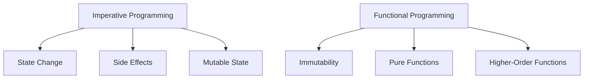

## 1.1 The Evolution of Programming Paradigms

### Historical Overview

The journey of programming paradigms is a fascinating tale of innovation and adaptation. As we explore this evolution, we will trace the path from procedural programming to object-oriented programming, and finally to the functional programming paradigm that Clojure embodies. Understanding this progression not only enriches our knowledge but also equips us to appreciate the strengths and limitations of each paradigm.

#### Procedural Programming

Procedural programming, often synonymous with imperative programming, was one of the earliest paradigms to emerge. It is characterized by a sequence of instructions that change the program's state. Languages like C and Pascal are quintessential examples of procedural programming.

In procedural programming, the focus is on writing procedures or routines that operate on data. This approach is intuitive and closely mirrors how computers execute instructions. However, as software systems grew in complexity, the limitations of procedural programming became apparent.

#### Object-Oriented Programming

The advent of object-oriented programming (OOP) marked a significant shift in how developers approached software design. OOP introduced the concept of encapsulating data and behavior into objects, promoting modularity and reuse. Java, C++, and Python are prominent languages that exemplify the object-oriented paradigm.

OOP addresses some of the limitations of procedural programming by organizing code into classes and objects, making it easier to manage complexity. However, it also introduces its own set of challenges, such as managing mutable state and ensuring proper encapsulation.

### Limitations of Imperative Programming

Despite its widespread adoption, imperative programming, which includes both procedural and object-oriented paradigms, faces several challenges:

- **State Management**: Managing state changes across a program can lead to complex and error-prone code. Mutable state can result in unintended side effects, making it difficult to reason about program behavior.
- **Concurrency**: As applications increasingly require concurrent and parallel processing, imperative programming's reliance on shared mutable state becomes a liability. Synchronization issues and race conditions are common pitfalls.
- **Scalability**: Scaling imperative codebases can be challenging due to tight coupling between components and the difficulty of isolating side effects.

### Rise of Functional Programming

Functional programming (FP) offers a paradigm shift that addresses many of the limitations of imperative programming. At its core, FP emphasizes immutability, pure functions, and higher-order functions. This approach leads to code that is more predictable, easier to test, and inherently parallelizable.

#### Key Concepts of Functional Programming

- **Immutability**: Data is immutable by default, meaning it cannot be changed once created. This eliminates side effects and simplifies reasoning about code.
- **Pure Functions**: Functions in FP are pure, meaning they always produce the same output for the same input and have no side effects. This predictability enhances testability and reliability.
- **Higher-Order Functions**: Functions can be treated as first-class citizens, passed as arguments, and returned from other functions. This enables powerful abstractions and code reuse.

#### Why Functional Programming is Gaining Popularity

The rise of multi-core processors and the need for concurrent and parallel computing have propelled functional programming into the spotlight. FP's emphasis on immutability and pure functions aligns well with these requirements, making it an attractive choice for modern software development.

### Influential Languages

Several languages have played a pivotal role in shaping the functional programming landscape:

- **Lisp**: As one of the earliest functional languages, Lisp introduced many concepts that are foundational to FP, such as first-class functions and symbolic computation.
- **Haskell**: Known for its strong type system and lazy evaluation, Haskell has been a significant influence on the development of modern functional languages.
- **Erlang**: Designed for concurrent and distributed systems, Erlang's lightweight processes and message-passing model have inspired many functional programming features.

### Clojure: A Modern Functional Language

Clojure is a modern, dynamic, and functional dialect of Lisp that runs on the Java Virtual Machine (JVM). It combines the power of functional programming with the rich ecosystem of Java, making it an ideal choice for Java developers looking to explore FP.

#### Key Features of Clojure

- **Immutable Data Structures**: Clojure provides a rich set of immutable data structures, such as lists, vectors, maps, and sets, which simplify state management and concurrency.
- **Concurrency Support**: Clojure offers powerful concurrency primitives, including atoms, refs, and agents, to manage state changes safely in concurrent applications.
- **Java Interoperability**: Clojure seamlessly integrates with Java, allowing developers to leverage existing Java libraries and tools while benefiting from FP principles.

### Code Examples

Let's explore some code examples to illustrate the differences between Java and Clojure.

#### Java Example: Imperative Approach

```java
// Java: Imperative approach to calculate the sum of a list
import java.util.Arrays;
import java.util.List;

public class SumExample {
    public static void main(String[] args) {
        List<Integer> numbers = Arrays.asList(1, 2, 3, 4, 5);
        int sum = 0;
        for (int number : numbers) {
            sum += number;
        }
        System.out.println("Sum: " + sum);
    }
}
```

#### Clojure Example: Functional Approach

```clojure
;; Clojure: Functional approach to calculate the sum of a list
(def numbers [1 2 3 4 5])

(defn calculate-sum [nums]
  (reduce + nums))

(println "Sum:" (calculate-sum numbers))
```

In the Clojure example, we use the `reduce` function to calculate the sum of the list. This approach is concise, expressive, and leverages Clojure's functional capabilities.

### Visual Aids

To further illustrate the evolution of programming paradigms, let's use a diagram to compare the flow of data in imperative and functional programming.



**Diagram Description**: This diagram contrasts the key characteristics of imperative and functional programming. Imperative programming is associated with state changes, side effects, and mutable state, while functional programming emphasizes immutability, pure functions, and higher-order functions.

### References and Links

For further reading on the evolution of programming paradigms and functional programming, consider exploring the following resources:

- [Official Clojure Documentation](https://clojure.org/)
- [ClojureDocs](https://clojuredocs.org/)
- [Haskell Language](https://www.haskell.org/)
- [Erlang Programming Language](https://www.erlang.org/)

### Knowledge Check

To reinforce your understanding of the evolution of programming paradigms, consider the following questions:

1. What are the main differences between procedural and object-oriented programming?
2. How does functional programming address the challenges of state management and concurrency?
3. What are some of the key features of Clojure that make it suitable for functional programming?
4. How does immutability contribute to the predictability and reliability of functional programs?

### Encouraging Tone

Now that we've explored the evolution of programming paradigms, you're well-equipped to appreciate the strengths of functional programming and how Clojure leverages these principles to build scalable applications. As you continue your journey, remember that embracing functional programming can lead to more robust and maintainable code.

### Best Practices for Tags

- "Clojure"
- "Functional Programming"
- "Programming Paradigms"
- "Java Interoperability"
- "Immutability"
- "Concurrency"
- "Higher-Order Functions"
- "Lisp"

## Quiz: Understanding the Evolution of Programming Paradigms



### Which programming paradigm emphasizes immutability and pure functions?

- [ ] Procedural Programming
- [ ] Object-Oriented Programming
- [x] Functional Programming
- [ ] Imperative Programming

> **Explanation:** Functional programming emphasizes immutability and pure functions, which help in creating predictable and reliable code.

### What is a key advantage of functional programming in concurrent applications?

- [x] Immutability reduces synchronization issues
- [ ] It uses mutable state
- [ ] It relies on side effects
- [ ] It is based on object encapsulation

> **Explanation:** Immutability in functional programming reduces synchronization issues, making it well-suited for concurrent applications.

### Which language is known for its strong type system and lazy evaluation?

- [ ] Lisp
- [x] Haskell
- [ ] Erlang
- [ ] Java

> **Explanation:** Haskell is known for its strong type system and lazy evaluation, which are key features of the language.

### What is a common challenge faced by imperative programming?

- [x] Managing mutable state
- [ ] Using pure functions
- [ ] Leveraging immutability
- [ ] Implementing higher-order functions

> **Explanation:** Managing mutable state is a common challenge in imperative programming, leading to potential side effects and errors.

### Which of the following languages is a modern, dynamic, and functional dialect of Lisp?

- [ ] Java
- [ ] Python
- [x] Clojure
- [ ] C++

> **Explanation:** Clojure is a modern, dynamic, and functional dialect of Lisp that runs on the JVM.

### What is a characteristic of object-oriented programming?

- [ ] Immutability
- [x] Encapsulation
- [ ] Pure functions
- [ ] Higher-order functions

> **Explanation:** Encapsulation is a characteristic of object-oriented programming, where data and behavior are bundled into objects.

### How does Clojure handle concurrency?

- [x] Through concurrency primitives like atoms, refs, and agents
- [ ] By using mutable state
- [ ] By relying on side effects
- [ ] Through object encapsulation

> **Explanation:** Clojure handles concurrency through primitives like atoms, refs, and agents, which help manage state changes safely.

### Which paradigm shift does functional programming represent?

- [ ] From procedural to object-oriented
- [x] From imperative to declarative
- [ ] From object-oriented to procedural
- [ ] From declarative to imperative

> **Explanation:** Functional programming represents a paradigm shift from imperative to declarative programming, focusing on what to do rather than how to do it.

### Which of the following is a benefit of using pure functions?

- [x] They are easier to test
- [ ] They rely on mutable state
- [ ] They produce side effects
- [ ] They encapsulate data

> **Explanation:** Pure functions are easier to test because they always produce the same output for the same input and have no side effects.

### True or False: Clojure can seamlessly integrate with Java libraries.

- [x] True
- [ ] False

> **Explanation:** True. Clojure can seamlessly integrate with Java libraries, allowing developers to leverage existing Java tools and libraries.



By understanding the evolution of programming paradigms, you are now better prepared to leverage the strengths of functional programming with Clojure. As you continue your journey, remember to explore and experiment with the concepts and code examples provided. Happy coding!
