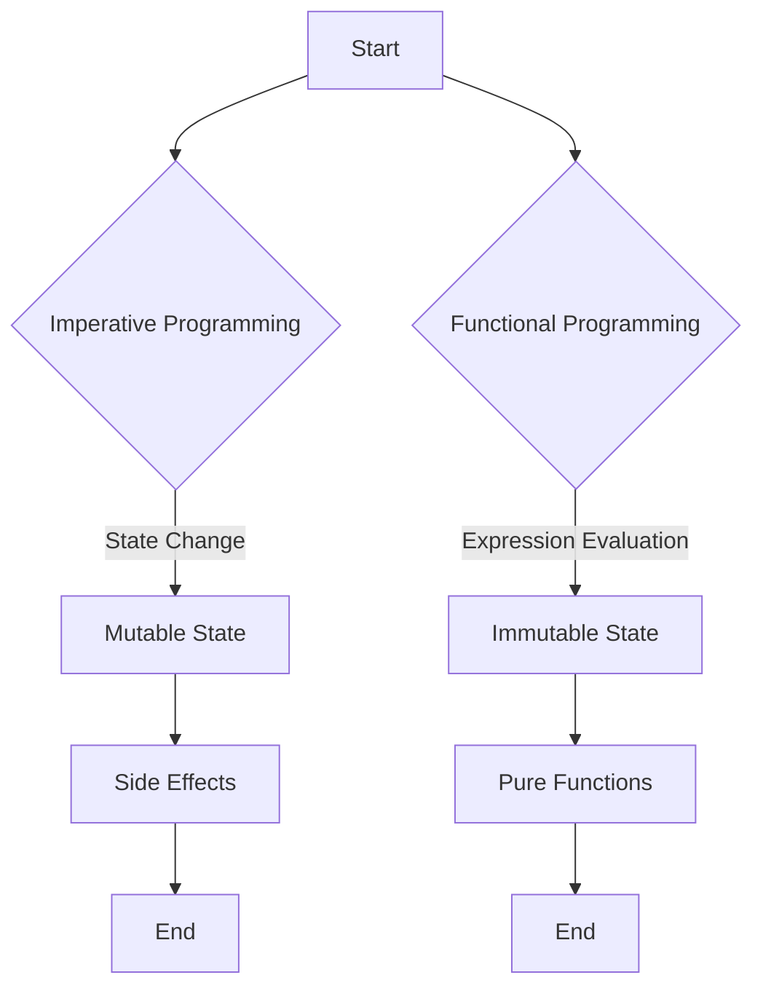

## 1.2 Imperative vs. Functional Programming

As experienced Java developers, you're likely familiar with imperative programming, a paradigm that emphasizes explicit sequences of commands to change a program's state. In contrast, functional programming, as embodied by Clojure, focuses on expressions and immutability, offering a different approach to building scalable and maintainable applications. Let's delve into the conceptual differences, state management techniques, and practical examples to understand these paradigms better.

### Conceptual Differences

#### Imperative Programming

Imperative programming is characterized by a sequence of instructions that change the program's state. This paradigm is prevalent in languages like Java, where you define how a task is performed through loops, conditionals, and variable assignments.

- **State and Control Flow**: In imperative programming, state is mutable and changes over time. Control flow is managed through constructs like loops and conditionals, which dictate the order of execution.
- **Example**: Consider a simple task of summing numbers in a list. In Java, you might use a loop to iterate over the list and accumulate the sum.

```java
// Java: Imperative approach to sum a list of numbers
int sum = 0;
int[] numbers = {1, 2, 3, 4, 5};
for (int number : numbers) {
    sum += number; // Mutating state
}
System.out.println("Sum: " + sum);
```

#### Functional Programming

Functional programming, on the other hand, treats computation as the evaluation of mathematical functions and avoids changing state or mutable data. Clojure, a functional language, emphasizes immutability and pure functions.

- **Expressions and Immutability**: In functional programming, computation is expressed through the evaluation of expressions. Data is immutable, meaning once created, it cannot be changed.
- **Example**: The same task of summing numbers in a list can be expressed functionally in Clojure using higher-order functions like `reduce`.

```clojure
;; Clojure: Functional approach to sum a list of numbers
(def numbers [1 2 3 4 5])
(def sum (reduce + numbers)) ; Using reduce for functional composition
(println "Sum:" sum)
```

### State Management

#### Imperative State Management

In imperative programming, state is often managed through mutable variables. This can lead to side effects, where changes in one part of the program affect others, making debugging and reasoning about code more challenging.

- **Mutable State**: Variables can be reassigned, leading to potential side effects.
- **Concurrency Challenges**: Managing state in concurrent applications can be complex due to race conditions and the need for synchronization.

#### Functional State Management

Functional programming promotes immutability, where data structures are not modified but rather new versions are created with the desired changes. This approach simplifies reasoning about code and enhances concurrency.

- **Immutable State**: Data structures are immutable, reducing side effects and making code easier to reason about.
- **Concurrency Benefits**: Immutability simplifies concurrent programming as there are no race conditions over shared data.

```clojure
;; Clojure: Managing state with immutability
(defn update-state [state value]
  (assoc state :count (+ (:count state) value)))

(def initial-state {:count 0})
(def new-state (update-state initial-state 5))
(println "Initial State:" initial-state) ; {:count 0}
(println "New State:" new-state) ; {:count 5}
```

### Code Examples: Imperative vs. Functional

Let's explore a more complex example to illustrate the differences between imperative and functional approaches. We'll implement a simple program to filter even numbers from a list and then square them.

#### Imperative Approach in Java

```java
// Java: Imperative approach to filter and square even numbers
import java.util.ArrayList;
import java.util.List;

public class ImperativeExample {
    public static void main(String[] args) {
        List<Integer> numbers = List.of(1, 2, 3, 4, 5);
        List<Integer> result = new ArrayList<>();

        for (int number : numbers) {
            if (number % 2 == 0) { // Filtering even numbers
                result.add(number * number); // Squaring and adding to result
            }
        }

        System.out.println("Result: " + result);
    }
}
```

#### Functional Approach in Clojure

```clojure
;; Clojure: Functional approach to filter and square even numbers
(def numbers [1 2 3 4 5])

(defn square [x]
  (* x x))

(def result
  (->> numbers
       (filter even?) ; Filtering even numbers
       (map square))) ; Squaring each number

(println "Result:" result)
```

### Pros and Cons

#### Imperative Programming

**Pros:**

- **Familiarity**: Many developers are accustomed to imperative programming due to its prevalence.
- **Explicit Control**: Offers explicit control over program flow, which can be beneficial for certain tasks.

**Cons:**

- **Complex State Management**: Managing mutable state can lead to complex and error-prone code.
- **Concurrency Challenges**: Requires careful handling of shared state in concurrent applications.

#### Functional Programming

**Pros:**

- **Immutability**: Simplifies reasoning about code and enhances concurrency.
- **Modularity**: Encourages modular code through pure functions and higher-order functions.
- **Testability**: Pure functions are easier to test due to their deterministic nature.

**Cons:**

- **Learning Curve**: May have a steeper learning curve for those new to the paradigm.
- **Performance Overhead**: Immutable data structures can introduce performance overhead in certain scenarios.

### Visual Aids

To further illustrate the differences between imperative and functional programming, let's use a flowchart to visualize the control flow in both paradigms.



**Diagram Description**: This flowchart contrasts the control flow in imperative programming, where mutable state and side effects are common, with functional programming, which emphasizes expression evaluation, immutable state, and pure functions.

### References and Links

For further reading on these topics, consider exploring the following resources:

- [Official Clojure Documentation](https://clojure.org/)
- [ClojureDocs](https://clojuredocs.org/)
- [Java Documentation](https://docs.oracle.com/en/java/)

### Knowledge Check

To reinforce your understanding of imperative and functional programming, consider the following questions:

1. How does functional programming handle state differently than imperative programming?
2. What are the benefits of using immutable data structures in functional programming?
3. How can higher-order functions simplify code in Clojure?
4. What challenges might you face when transitioning from imperative to functional programming?

### Encouraging Tone

Now that we've explored the fundamental differences between imperative and functional programming, you're well-equipped to start leveraging the power of functional programming in Clojure. Embrace the immutability and expressiveness of Clojure to build scalable and maintainable applications. Let's continue our journey into the world of functional programming and discover how these concepts can transform your approach to software development.

## Quiz: Understanding Imperative and Functional Programming



### What is a key characteristic of imperative programming?

- [x] Mutable state
- [ ] Immutable state
- [ ] Pure functions
- [ ] Expression evaluation

> **Explanation:** Imperative programming is characterized by mutable state, where variables can be reassigned and changed over time.

### How does functional programming handle state?

- [ ] Through mutable variables
- [x] Through immutable data structures
- [ ] By using loops and conditionals
- [ ] By changing state directly

> **Explanation:** Functional programming handles state through immutable data structures, avoiding changes to existing data.

### What is a benefit of using pure functions?

- [x] Easier to test
- [ ] Requires more memory
- [ ] Increases side effects
- [ ] Slower execution

> **Explanation:** Pure functions are easier to test because they are deterministic and do not rely on external state.

### Which of the following is a common challenge in imperative programming?

- [ ] Immutability
- [x] Managing mutable state
- [ ] Expression evaluation
- [ ] Using higher-order functions

> **Explanation:** Managing mutable state is a common challenge in imperative programming, leading to potential side effects and complexity.

### What is a key advantage of functional programming in concurrent applications?

- [ ] Mutable state
- [x] Immutability
- [ ] Explicit control flow
- [ ] Side effects

> **Explanation:** Immutability in functional programming simplifies concurrent applications by eliminating race conditions over shared data.

### Which of the following is a feature of functional programming?

- [x] Higher-order functions
- [ ] Mutable variables
- [ ] Explicit loops
- [ ] Side effects

> **Explanation:** Higher-order functions are a feature of functional programming, allowing functions to be passed as arguments and returned as values.

### How does functional programming encourage modularity?

- [ ] By using mutable state
- [x] Through pure functions
- [ ] By relying on side effects
- [ ] By using explicit control flow

> **Explanation:** Functional programming encourages modularity through pure functions, which are self-contained and do not rely on external state.

### What is a potential downside of immutable data structures?

- [ ] Easier concurrency
- [ ] Simplified reasoning
- [x] Performance overhead
- [ ] Reduced side effects

> **Explanation:** Immutable data structures can introduce performance overhead due to the need to create new versions of data rather than modifying existing ones.

### What is a common feature of imperative programming?

- [x] Loops and conditionals
- [ ] Immutable data
- [ ] Pure functions
- [ ] Expression evaluation

> **Explanation:** Loops and conditionals are common features of imperative programming, used to control the flow of execution.

### True or False: Functional programming avoids changing state or mutable data.

- [x] True
- [ ] False

> **Explanation:** True. Functional programming avoids changing state or mutable data, focusing instead on expressions and immutability.


