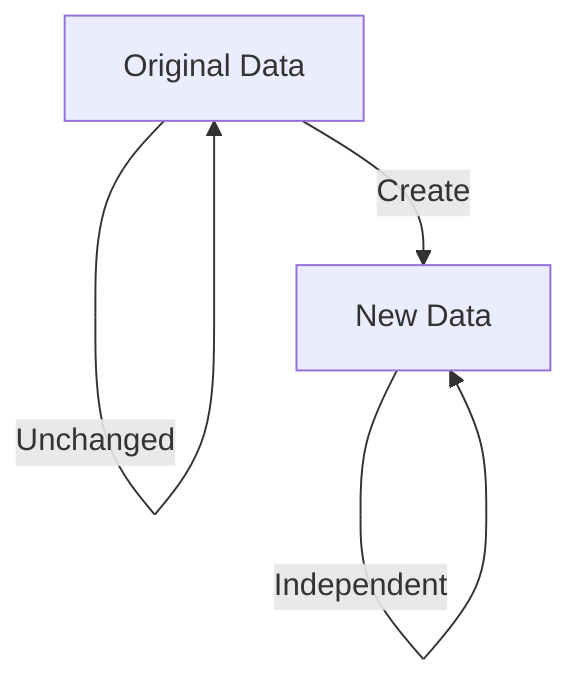
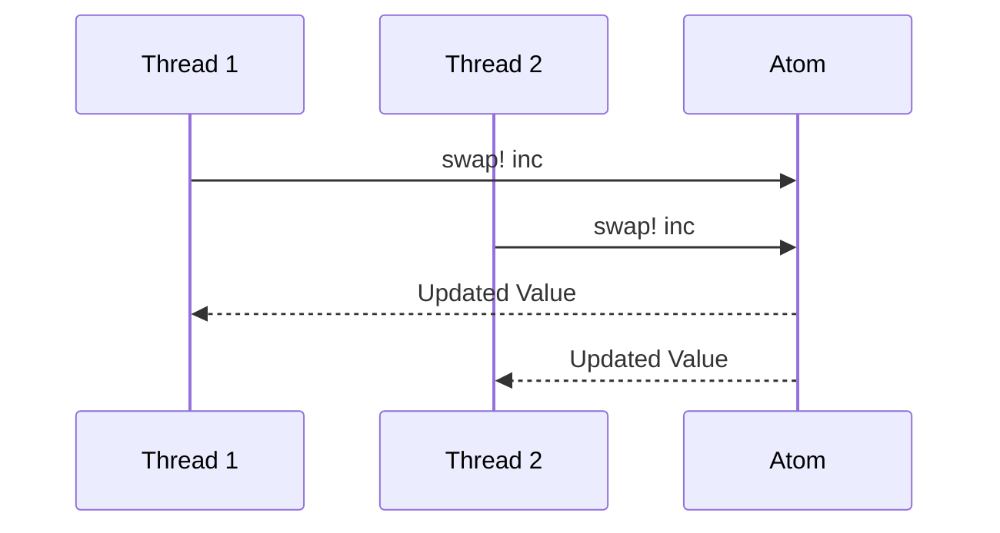

## 1.3 Benefits of Functional Programming

Functional programming (FP) offers a paradigm shift from traditional imperative programming, providing a host of benefits that enhance the development of scalable, efficient, and maintainable applications. In this section, we will explore the key advantages of functional programming, particularly through the lens of Clojure, a modern Lisp dialect that runs on the Java Virtual Machine (JVM). As experienced Java developers, you will find many parallels and contrasts that will help you appreciate the power of functional programming.

### Immutability Advantages

One of the cornerstone principles of functional programming is immutability. In Clojure, data structures are immutable by default, meaning that once a data structure is created, it cannot be changed. This concept might seem restrictive at first, especially if you're accustomed to Java's mutable objects, but it brings significant advantages.

#### Reducing Bugs Related to Shared State

In Java, mutable state can lead to complex bugs, especially in concurrent applications where multiple threads might modify the same object simultaneously. Immutability eliminates this class of bugs because data cannot be altered once created. This leads to more predictable and reliable code.

```java
// Java Example: Mutable State
class Counter {
    private int count = 0;

    public void increment() {
        count++;
    }

    public int getCount() {
        return count;
    }
}
```

```clojure
;; Clojure Example: Immutable State
(defn increment [count]
  (inc count))

;; Usage
(def count 0)
(def new-count (increment count))
```

In the Clojure example, `increment` returns a new value instead of modifying the existing one. This approach prevents side effects and makes the function easier to reason about.

#### Concurrency Made Simple

Immutability also simplifies concurrency. Since data structures cannot be changed, there is no need for locks or synchronization mechanisms to prevent race conditions. This makes it easier to write concurrent programs that are both efficient and correct.

```clojure
;; Clojure Example: Concurrency with Atoms
(def counter (atom 0))

(defn safe-increment []
  (swap! counter inc))

;; Multiple threads can safely call safe-increment without data races.
```

### Referential Transparency

Referential transparency is a property of pure functions where the output is determined solely by the input values, without observable side effects. This makes functions predictable and easier to test.

#### Easier Reasoning About Code

In Java, methods often have side effects, such as modifying a global variable or interacting with I/O. This can make it difficult to understand what a method does without examining the entire program context.

```java
// Java Example: Method with Side Effects
public int addAndPrint(int a, int b) {
    int sum = a + b;
    System.out.println(sum);
    return sum;
}
```

```clojure
;; Clojure Example: Pure Function
(defn add [a b]
  (+ a b))

;; Usage
(add 3 4) ;; Returns 7 without any side effects
```

In Clojure, the `add` function is pure and referentially transparent. You can replace any call to `add` with its result without changing the program's behavior.

#### Facilitating Testing

Testing pure functions is straightforward because you only need to consider the input and output. This reduces the need for complex test setups and makes unit tests more reliable.

```clojure
;; Clojure Example: Testing a Pure Function
(deftest test-add
  (is (= 7 (add 3 4))))
```

### Concurrency and Parallelism

Functional programming naturally supports concurrency and parallelism, making it easier to write scalable applications that leverage modern multi-core processors.

#### Simplifying Concurrent Code

In Java, managing concurrency often involves complex constructs like threads, locks, and synchronized blocks. In contrast, Clojure provides simpler abstractions such as atoms, refs, and agents to manage state changes safely.

```clojure
;; Clojure Example: Using Agents for Asynchronous Updates
(def counter (agent 0))

(defn increment-agent [n]
  (send counter + n))

;; Increment counter asynchronously
(increment-agent 5)
```

#### Leveraging Parallelism

Clojure's functional approach allows you to express parallelism at a higher level. For example, you can use the `pmap` function to apply a function in parallel across a collection.

```clojure
;; Clojure Example: Parallel Map
(defn square [x] (* x x))

;; Apply square function in parallel
(def squares (pmap square (range 1 100)))
```

### Modularity and Reusability

Functional programming emphasizes modularity and reusability through higher-order functions and function composition.

#### Higher-Order Functions

Higher-order functions are functions that take other functions as arguments or return them as results. This allows you to create more abstract and reusable code.

```clojure
;; Clojure Example: Higher-Order Function
(defn apply-twice [f x]
  (f (f x)))

;; Usage
(apply-twice inc 5) ;; Returns 7
```

#### Function Composition

Function composition allows you to build complex operations by combining simpler functions. This leads to more readable and maintainable code.

```clojure
;; Clojure Example: Function Composition
(defn add-one [x] (+ x 1))
(defn double [x] (* x 2))

(def add-one-and-double (comp double add-one))

(add-one-and-double 3) ;; Returns 8
```

### Visual Aids

To better understand these concepts, let's visualize some of the key ideas using diagrams.

#### Immutability and Persistent Data Structures



*Diagram 1: Immutability ensures that the original data remains unchanged, while new data is created independently.*

#### Concurrency with Atoms



*Diagram 2: Multiple threads can safely update an atom without race conditions.*

### References and Links

- [Official Clojure Documentation](https://clojure.org/reference)
- [ClojureDocs](https://clojuredocs.org/)
- [Functional Programming in Java](https://www.oreilly.com/library/view/functional-programming-in/9781449365516/)

### Knowledge Check

- **What is immutability and how does it benefit concurrent programming?**
- **Explain referential transparency and its impact on testing.**
- **How do higher-order functions enhance code reusability?**

### Exercises

1. **Modify the `increment` function** to accept a step value and return a new count.
2. **Create a pure function** that calculates the factorial of a number and test it using `clojure.test`.
3. **Implement a function composition** that combines three simple arithmetic operations and apply it to a list of numbers.

### Summary

In this section, we've explored the benefits of functional programming, focusing on immutability, referential transparency, concurrency, and modularity. By leveraging these concepts, you can write more reliable, scalable, and maintainable applications. As you continue your journey into Clojure, keep experimenting with these ideas to fully embrace the functional programming mindset.

## Quiz: Test Your Understanding of Functional Programming Benefits



### What is a key advantage of immutability in functional programming?

- [x] Reduces bugs related to shared state
- [ ] Increases code complexity
- [ ] Requires more memory
- [ ] Slows down execution

> **Explanation:** Immutability reduces bugs related to shared state because data cannot be altered once created, eliminating race conditions in concurrent environments.

### How does referential transparency benefit testing?

- [x] Makes functions easier to test
- [ ] Increases the need for mocks
- [ ] Requires complex test setups
- [ ] Depends on global state

> **Explanation:** Referential transparency makes functions easier to test because the output is solely determined by the input values, without side effects.

### Which Clojure feature simplifies writing concurrent code?

- [x] Atoms
- [ ] Threads
- [ ] Locks
- [ ] Synchronized blocks

> **Explanation:** Atoms in Clojure provide a simple way to manage state changes safely in concurrent applications.

### What is a higher-order function?

- [x] A function that takes other functions as arguments
- [ ] A function that returns a string
- [ ] A function that modifies global state
- [ ] A function that only performs arithmetic operations

> **Explanation:** A higher-order function is one that takes other functions as arguments or returns them as results, enhancing code reusability.

### How does function composition improve code?

- [x] By combining simpler functions into complex operations
- [ ] By increasing code duplication
- [x] By making code more readable
- [ ] By requiring more lines of code

> **Explanation:** Function composition improves code by allowing complex operations to be built from simpler functions, making it more readable and maintainable.

### What is the role of `pmap` in Clojure?

- [x] To apply a function in parallel across a collection
- [ ] To map a function sequentially
- [ ] To filter elements from a collection
- [ ] To reduce a collection to a single value

> **Explanation:** `pmap` in Clojure applies a function in parallel across a collection, leveraging multi-core processors for efficiency.

### Why is immutability important in functional programming?

- [x] It ensures data cannot be changed once created
- [ ] It allows for mutable state
- [x] It simplifies reasoning about code
- [ ] It increases the need for synchronization

> **Explanation:** Immutability ensures data cannot be changed once created, simplifying reasoning about code and eliminating the need for synchronization in concurrent environments.

### What does referential transparency enable?

- [x] Predictable function behavior
- [ ] Unpredictable side effects
- [ ] Complex global state management
- [ ] Increased code verbosity

> **Explanation:** Referential transparency enables predictable function behavior, as the output is solely determined by the input values.

### How do atoms help in concurrent programming?

- [x] By managing state changes safely
- [ ] By increasing the need for locks
- [ ] By allowing mutable state
- [ ] By complicating state management

> **Explanation:** Atoms help in concurrent programming by managing state changes safely without the need for locks or synchronization.

### True or False: Function composition leads to more maintainable code.

- [x] True
- [ ] False

> **Explanation:** Function composition leads to more maintainable code by allowing complex operations to be built from simpler functions, enhancing readability and reusability.




