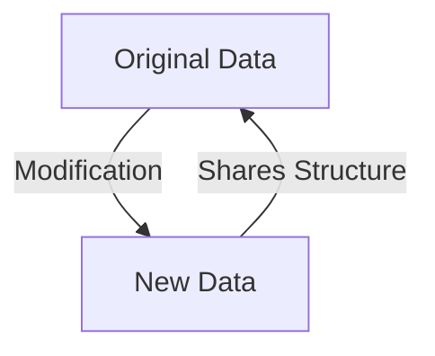
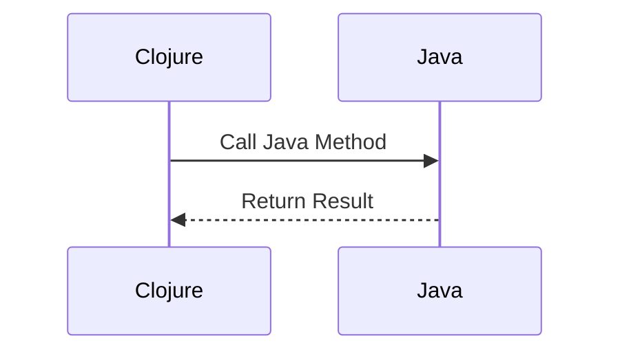

## 1.4 Overview of the Clojure Language

Welcome to the world of Clojure, a dynamic, functional programming language that runs on the Java Virtual Machine (JVM). Created by Rich Hickey, Clojure is a modern Lisp that brings the power of functional programming to the JVM, offering a unique blend of simplicity, power, and practicality. In this section, we'll explore Clojure's origins, its key features, the vibrant ecosystem surrounding it, and walk through a simple "Hello World" example to get you started.

### Clojure's Origins

Clojure was designed by Rich Hickey and released in 2007. Hickey aimed to create a language that could leverage the vast ecosystem of Java while providing the benefits of a functional programming paradigm. Clojure is a Lisp dialect, which means it inherits the rich history and powerful features of Lisp, such as code-as-data (homoiconicity) and a powerful macro system.

#### Key Features of Clojure

Clojure's design emphasizes simplicity and robustness, making it an ideal choice for building scalable applications. Let's delve into some of its key features:

1. **Immutability**: Clojure treats data as immutable by default, which simplifies reasoning about code and enhances concurrency. Immutable data structures are persistent, meaning they share structure and are efficient in both time and space.

2. **First-Class Functions**: Functions in Clojure are first-class citizens, meaning they can be passed as arguments, returned from other functions, and assigned to variables. This feature enables powerful abstractions and code reuse.

3. **Seamless Java Interoperability**: Clojure runs on the JVM and can interoperate with Java seamlessly. You can call Java methods, use Java libraries, and integrate with existing Java codebases effortlessly.

4. **Dynamic Typing**: Clojure is dynamically typed, allowing for rapid prototyping and flexibility. However, it also supports optional type hints and contracts for performance optimization and error checking.

5. **Concurrency Support**: Clojure provides robust concurrency primitives, such as atoms, refs, agents, and software transactional memory (STM), making it easier to write concurrent and parallel programs.

6. **Rich Macro System**: Clojure's macro system allows you to extend the language and create domain-specific languages (DSLs), enabling powerful metaprogramming capabilities.

7. **Interactive Development**: The Read-Eval-Print Loop (REPL) in Clojure supports interactive development, allowing you to test and modify code in real-time, which enhances productivity and feedback loops.

### Clojure Ecosystem

Clojure boasts a vibrant ecosystem with a wide array of libraries, tools, and community resources. Here's a brief overview:

- **Libraries**: Clojure has a rich set of libraries for various domains, including web development (Ring, Compojure), data processing (core.async, manifold), and database interaction (clojure.java.jdbc, next.jdbc).

- **Tooling**: Tools like Leiningen and deps.edn simplify project management, dependency resolution, and build automation. CIDER, an Emacs package, provides a powerful development environment for Clojure.

- **Community Resources**: The Clojure community is active and welcoming, with numerous online forums, user groups, and conferences. ClojureDocs and the official Clojure website are excellent resources for documentation and learning.

### Hello World Example

Let's dive into a simple "Hello World" program in Clojure to familiarize ourselves with its syntax and structure.

#### Clojure Code Example

```clojure
;; Define a namespace
(ns hello-world.core)

;; Define a function to print "Hello, World!"
(defn -main []
  (println "Hello, World!"))

;; Call the main function
(-main)
```

#### Java Code Comparison

For comparison, here's a simple "Hello World" program in Java:

```java
public class HelloWorld {
    public static void main(String[] args) {
        System.out.println("Hello, World!");
    }
}
```

#### Explanation

- **Namespace**: In Clojure, we define a namespace using `ns`, similar to Java's package system. This helps organize code and manage dependencies.

- **Function Definition**: The `defn` keyword is used to define a function. In this case, `-main` is the function that prints "Hello, World!".

- **Printing**: The `println` function is used to print to the console, akin to Java's `System.out.println`.

- **Function Call**: We call the `-main` function to execute the program.

### Try It Yourself

Now that we've walked through a basic example, try modifying the code to print a different message or add additional functions. Experiment with defining new namespaces and functions to deepen your understanding.

### Visual Aids

To better understand Clojure's core concepts, let's visualize some of them using diagrams.

#### Immutability and Persistent Data Structures



*Diagram: Immutability in Clojure ensures that modifications result in new data structures that share structure with the original, enhancing efficiency.*

#### Java Interoperability



*Diagram: Clojure seamlessly interacts with Java, allowing method calls and data exchange.*

### References and Links

- [Official Clojure Documentation](https://clojure.org/)
- [ClojureDocs](https://clojuredocs.org/)
- [Leiningen](https://leiningen.org/)
- [CIDER for Emacs](https://github.com/clojure-emacs/cider)

### Knowledge Check

To reinforce your understanding, consider the following questions:

1. What are the benefits of immutability in Clojure?
2. How does Clojure's macro system enhance metaprogramming?
3. Describe how Clojure achieves seamless Java interoperability.

### Practice Problems

1. Modify the "Hello World" program to accept a name as an argument and print a personalized greeting.
2. Create a new namespace and define a function that calculates the factorial of a number using recursion.

### Summary

In this section, we've explored the origins and key features of Clojure, a modern Lisp for the JVM. We've seen how Clojure's immutability, first-class functions, and Java interoperability make it a powerful tool for building scalable applications. With a vibrant ecosystem and strong community support, Clojure is an excellent choice for developers looking to embrace functional programming.

Now that we've laid the foundation, let's continue our journey into the world of Clojure and functional programming. In the next section, we'll delve deeper into core functional concepts in Clojure, building upon the knowledge we've gained here.

## Clojure Language Overview Quiz



### What is Clojure primarily known for?

- [x] Being a modern Lisp for the JVM
- [ ] Being a statically typed language
- [ ] Being a language without Java interoperability
- [ ] Being a language with mutable data structures

> **Explanation:** Clojure is a modern Lisp that runs on the JVM, known for its functional programming features and Java interoperability.

### Who created Clojure?

- [x] Rich Hickey
- [ ] James Gosling
- [ ] Guido van Rossum
- [ ] Bjarne Stroustrup

> **Explanation:** Clojure was created by Rich Hickey in 2007.

### Which feature of Clojure simplifies reasoning about code and enhances concurrency?

- [x] Immutability
- [ ] Dynamic typing
- [ ] Java interoperability
- [ ] Macro system

> **Explanation:** Immutability simplifies reasoning about code and enhances concurrency by ensuring data cannot be changed once created.

### What allows Clojure to extend the language and create domain-specific languages?

- [x] Macro system
- [ ] Dynamic typing
- [ ] First-class functions
- [ ] Java interoperability

> **Explanation:** Clojure's macro system allows for language extension and the creation of domain-specific languages.

### How does Clojure achieve seamless Java interoperability?

- [x] By running on the JVM and allowing Java method calls
- [ ] By being a statically typed language
- [ ] By using mutable data structures
- [ ] By having a built-in Java compiler

> **Explanation:** Clojure runs on the JVM and allows seamless Java method calls and library usage.

### What is the primary purpose of the `ns` keyword in Clojure?

- [x] To define a namespace
- [ ] To define a function
- [ ] To print to the console
- [ ] To call a Java method

> **Explanation:** The `ns` keyword is used to define a namespace in Clojure, similar to Java's package system.

### Which tool is commonly used for project management and dependency resolution in Clojure?

- [x] Leiningen
- [ ] Maven
- [ ] Gradle
- [ ] Ant

> **Explanation:** Leiningen is a popular tool for project management and dependency resolution in Clojure.

### What is the function of the `println` keyword in Clojure?

- [x] To print to the console
- [ ] To define a function
- [ ] To define a namespace
- [ ] To call a Java method

> **Explanation:** The `println` function is used to print output to the console in Clojure.

### True or False: Clojure supports optional type hints for performance optimization.

- [x] True
- [ ] False

> **Explanation:** Clojure supports optional type hints to optimize performance and error checking.

### What is the primary advantage of Clojure's persistent data structures?

- [x] They share structure and are efficient in time and space.
- [ ] They allow for mutable data manipulation.
- [ ] They are statically typed.
- [ ] They do not support concurrency.

> **Explanation:** Clojure's persistent data structures share structure and are efficient in both time and space, supporting immutability and concurrency.


