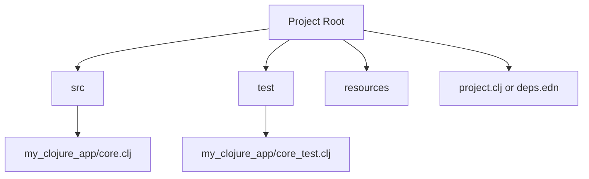
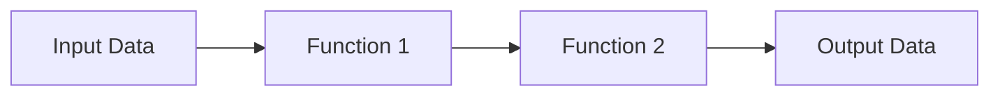

## 1.5 Setting Up the Clojure Development Environment

Setting up a Clojure development environment is a crucial first step for Java developers transitioning to functional programming. This section will guide you through installing Clojure on different operating systems, introduce popular development tools, and explain how to manage projects using Leiningen and deps.edn. Finally, we'll walk through starting your first REPL session to run simple expressions.

### Installing Clojure

Clojure is a JVM language, which means it runs on the Java Virtual Machine. This allows you to leverage your existing Java knowledge and infrastructure. Let's explore how to install Clojure on various operating systems.

#### Installing Clojure on Windows

1. **Install Java**: Ensure you have Java Development Kit (JDK) 8 or higher installed. You can download it from [Oracle's website](https://www.oracle.com/java/technologies/javase-jdk11-downloads.html) or use an open-source alternative like [AdoptOpenJDK](https://adoptopenjdk.net/).

2. **Install Clojure CLI Tools**: Download and run the Windows installer from the [Clojure website](https://clojure.org/guides/getting_started). This will set up the Clojure CLI tools and add them to your system PATH.

3. **Verify Installation**: Open a command prompt and run:
   ```shell
   clj -M -e "(println \"Clojure installed successfully!\")"
   ```
   You should see the message "Clojure installed successfully!" confirming the installation.

#### Installing Clojure on macOS

1. **Install Homebrew**: If you haven't already, install Homebrew by following the instructions on [brew.sh](https://brew.sh/).

2. **Install Clojure**: Use Homebrew to install Clojure:
   ```shell
   brew install clojure/tools/clojure
   ```

3. **Verify Installation**: Open Terminal and run:
   ```shell
   clj -M -e "(println \"Clojure installed successfully!\")"
   ```
   You should see the confirmation message.

#### Installing Clojure on Linux

1. **Install Java**: Make sure you have JDK 8 or higher. You can install it using your package manager, for example:
   ```shell
   sudo apt-get install openjdk-11-jdk
   ```

2. **Install Clojure CLI Tools**: Follow the instructions on the [Clojure website](https://clojure.org/guides/getting_started) to download and install the CLI tools.

3. **Verify Installation**: Open a terminal and run:
   ```shell
   clj -M -e "(println \"Clojure installed successfully!\")"
   ```
   You should see the success message.

### Development Tools

Choosing the right development tools can enhance your productivity and make coding in Clojure more enjoyable. Here are some popular editors and IDEs for Clojure development.

#### Cursive for IntelliJ IDEA

[Cursive](https://cursive-ide.com/) is a powerful Clojure plugin for IntelliJ IDEA, offering features like syntax highlighting, code completion, and REPL integration. Here's how to set it up:

1. **Install IntelliJ IDEA**: Download and install IntelliJ IDEA from [JetBrains](https://www.jetbrains.com/idea/).

2. **Install Cursive Plugin**: Open IntelliJ IDEA, go to `File > Settings > Plugins`, search for "Cursive", and install it.

3. **Create a Clojure Project**: Use the `File > New > Project` menu to create a new Clojure project. Cursive will guide you through setting up Leiningen or deps.edn for project management.

#### Emacs with CIDER

[Emacs](https://www.gnu.org/software/emacs/) is a highly customizable text editor, and [CIDER](https://docs.cider.mx/cider/) is a Clojure Interactive Development Environment that integrates with Emacs.

1. **Install Emacs**: Download and install Emacs from [GNU's website](https://www.gnu.org/software/emacs/download.html).

2. **Install CIDER**: Add the following to your Emacs configuration file (`~/.emacs` or `~/.emacs.d/init.el`):
   ```elisp
   (require 'package)
   (add-to-list 'package-archives '("melpa" . "https://melpa.org/packages/") t)
   (package-initialize)
   (unless (package-installed-p 'cider)
     (package-refresh-contents)
     (package-install 'cider))
   ```

3. **Start a Clojure REPL**: Open a Clojure file and use `M-x cider-jack-in` to start a REPL session.

### Leiningen and deps.edn

Clojure projects are typically managed using either Leiningen or the Clojure CLI tools with deps.edn. Both tools have their strengths, and your choice may depend on your project's needs.

#### Leiningen

[Leiningen](https://leiningen.org/) is a popular build automation tool for Clojure, similar to Maven for Java. It simplifies project setup, dependency management, and running tasks.

1. **Install Leiningen**: Follow the instructions on the [Leiningen website](https://leiningen.org/) to download and install it.

2. **Create a New Project**: Run the following command to create a new project:
   ```shell
   lein new app my-clojure-app
   ```

3. **Run the Project**: Navigate to the project directory and start the REPL:
   ```shell
   cd my-clojure-app
   lein repl
   ```

4. **Project Structure**: Leiningen projects have a `project.clj` file for configuration, similar to a `pom.xml` in Maven.

#### deps.edn and Clojure CLI

The Clojure CLI tools use a `deps.edn` file for dependency management, offering a more lightweight and flexible approach.

1. **Create a deps.edn File**: In your project directory, create a `deps.edn` file with the following content:
   ```clojure
   {:deps {org.clojure/clojure {:mvn/version "1.10.3"}}}
   ```

2. **Run the REPL**: Use the Clojure CLI to start a REPL:
   ```shell
   clj
   ```

3. **Add Dependencies**: Update the `deps.edn` file to include additional libraries as needed.

### First REPL Session

The REPL (Read-Eval-Print Loop) is a powerful tool for interactive development in Clojure. It allows you to evaluate expressions, test code snippets, and explore libraries in real-time.

1. **Start the REPL**: Use either Leiningen or the Clojure CLI to start a REPL session.

2. **Run Simple Expressions**: Try running some basic Clojure expressions:
   ```clojure
   ;; Define a simple function
   (defn greet [name]
     (str "Hello, " name "!"))

   ;; Call the function
   (greet "World")
   ```

3. **Experiment with Data Structures**: Explore Clojure's immutable data structures:
   ```clojure
   ;; Create a vector
   (def my-vector [1 2 3 4 5])

   ;; Access elements
   (nth my-vector 2) ; => 3

   ;; Add an element
   (conj my-vector 6) ; => [1 2 3 4 5 6]
   ```

### Visual Aids

To better understand the flow of data and the structure of Clojure projects, let's look at a few diagrams.

#### Clojure Project Structure



*Figure 1: Typical Clojure Project Structure*

#### Data Flow in a Clojure Function



*Figure 2: Data Flow Through Clojure Functions*

### References and Links

- [Official Clojure Documentation](https://clojure.org/)
- [ClojureDocs](https://clojuredocs.org/)
- [Leiningen](https://leiningen.org/)
- [Cursive for IntelliJ IDEA](https://cursive-ide.com/)
- [Emacs with CIDER](https://docs.cider.mx/cider/)

### Knowledge Check

Let's test your understanding of setting up a Clojure development environment.

1. **What is the primary purpose of the REPL in Clojure?**

2. **How do you add a dependency in a `deps.edn` file?**

3. **What are the benefits of using Leiningen for project management?**

4. **Explain the difference between `project.clj` and `deps.edn`.**

5. **How can you verify that Clojure is installed correctly on your system?**

### Exercises

1. **Create a new Clojure project using Leiningen and write a simple function that calculates the factorial of a number.**

2. **Set up a Clojure project using the Clojure CLI tools and deps.edn, and implement a function that reverses a string.**

3. **Experiment with the REPL by defining a few functions and testing them with different inputs.**

### Summary

In this section, we've covered the essentials of setting up a Clojure development environment. We've explored how to install Clojure on various operating systems, introduced popular development tools, and explained project management with Leiningen and deps.edn. Finally, we've walked through starting your first REPL session to run simple expressions. Now that your environment is ready, you're well-equipped to dive deeper into Clojure's functional programming capabilities.

## Clojure Development Environment Quiz



### What is the primary purpose of the REPL in Clojure?

- [x] To interactively evaluate Clojure expressions
- [ ] To compile Clojure code into Java bytecode
- [ ] To manage project dependencies
- [ ] To deploy Clojure applications

> **Explanation:** The REPL (Read-Eval-Print Loop) allows developers to interactively evaluate Clojure expressions, test code snippets, and explore libraries in real-time.

### How do you add a dependency in a `deps.edn` file?

- [x] By specifying the library and version under the `:deps` key
- [ ] By adding it to the `project.clj` file
- [ ] By using the `lein` command
- [ ] By downloading the library manually

> **Explanation:** In a `deps.edn` file, dependencies are added under the `:deps` key, specifying the library and its version.

### What are the benefits of using Leiningen for project management?

- [x] Simplifies project setup and dependency management
- [x] Provides build automation similar to Maven
- [ ] Requires manual configuration for each project
- [ ] Only works with Clojure CLI tools

> **Explanation:** Leiningen simplifies project setup and dependency management, offering build automation similar to Maven.

### Explain the difference between `project.clj` and `deps.edn`.

- [x] `project.clj` is used by Leiningen, while `deps.edn` is used by Clojure CLI tools
- [ ] Both are used interchangeably for the same purpose
- [ ] `project.clj` is for Java projects, `deps.edn` is for Clojure projects
- [ ] `deps.edn` is deprecated in favor of `project.clj`

> **Explanation:** `project.clj` is used by Leiningen for project configuration, while `deps.edn` is used by Clojure CLI tools for dependency management.

### How can you verify that Clojure is installed correctly on your system?

- [x] Run `clj -M -e "(println \"Clojure installed successfully!\")"`
- [ ] Check the version of Java installed
- [ ] Open a Clojure file in an IDE
- [ ] Use the `lein` command to create a new project

> **Explanation:** Running the command `clj -M -e "(println \"Clojure installed successfully!\")"` verifies that Clojure is installed correctly.

### Which tool is similar to Maven for Clojure project management?

- [x] Leiningen
- [ ] Cursive
- [ ] Emacs
- [ ] CIDER

> **Explanation:** Leiningen is a build automation tool for Clojure, similar to Maven for Java.

### What is the role of `cider-jack-in` in Emacs?

- [x] To start a Clojure REPL session
- [ ] To compile Clojure code
- [ ] To manage project dependencies
- [ ] To deploy Clojure applications

> **Explanation:** `cider-jack-in` is used in Emacs to start a Clojure REPL session.

### Which file is used by Clojure CLI tools for dependency management?

- [x] deps.edn
- [ ] project.clj
- [ ] pom.xml
- [ ] build.gradle

> **Explanation:** The `deps.edn` file is used by Clojure CLI tools for dependency management.

### What is the purpose of the `conj` function in Clojure?

- [x] To add an element to a collection
- [ ] To remove an element from a collection
- [ ] To sort a collection
- [ ] To filter a collection

> **Explanation:** The `conj` function is used to add an element to a collection in Clojure.

### True or False: Clojure runs on the Java Virtual Machine (JVM).

- [x] True
- [ ] False

> **Explanation:** Clojure is a JVM language, meaning it runs on the Java Virtual Machine, allowing interoperability with Java.


