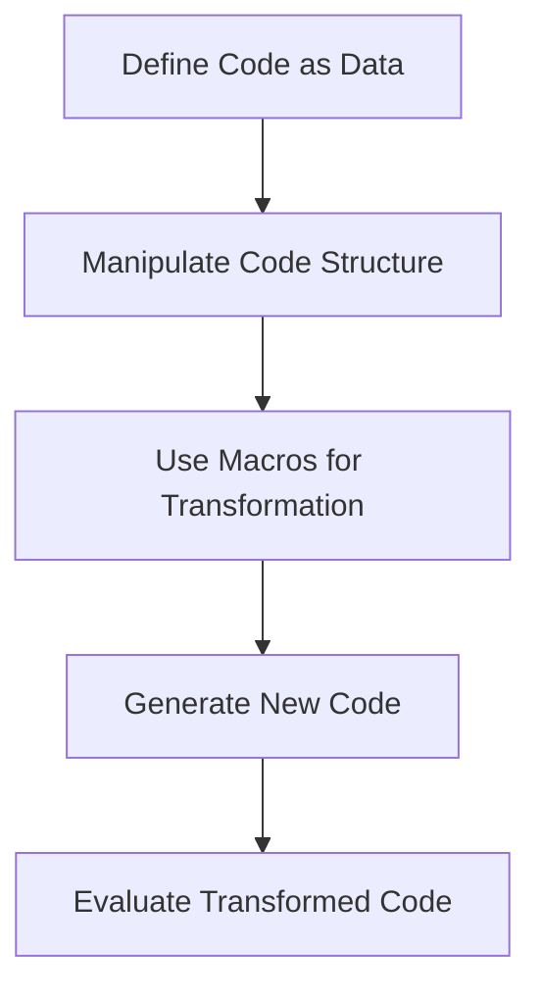

## 1.7 The Code-as-Data Philosophy in Clojure

The code-as-data philosophy is a cornerstone of Clojure and other Lisp languages, offering a unique approach to programming that empowers developers to treat code as manipulable data. This concept, known as **homoiconicity**, is pivotal in enabling powerful metaprogramming capabilities through macros. In this section, we will delve into the intricacies of homoiconicity, explore how Clojure allows manipulation of code structures, and introduce macros as a tool for metaprogramming. We will also discuss practical applications of the code-as-data philosophy, such as creating domain-specific languages (DSLs) and automating code generation.

### Homoiconicity Explained

**Homoiconicity** is a property of some programming languages where the primary representation of programs is also a data structure in a primitive type of the language itself. In simpler terms, it means that code and data share the same structure, allowing code to be manipulated as easily as data. This is a defining feature of Lisp languages, including Clojure.

#### Importance in Lisp Languages

In Lisp languages, code is written in the form of lists, which are the fundamental data structure. This uniformity allows for seamless manipulation of code, enabling developers to write programs that can generate and transform other programs. This capability is not just a theoretical curiosity; it has practical implications for creating more expressive and flexible software.

**Example:**

In Java, code is typically represented as a sequence of statements and expressions, which are not directly manipulable as data. In contrast, Clojure code is inherently data, allowing for dynamic code generation and transformation.

```java
// Java code example
int sum = 0;
for (int i = 0; i < 10; i++) {
    sum += i;
}
```

```clojure
;; Clojure code as data
(def code-as-data '(reduce + (range 10)))
(eval code-as-data) ; Evaluates to 45
```

In the Clojure example, the code itself is a list that can be manipulated, transformed, or evaluated at runtime.

### Manipulating Code Structures

Clojure's syntax is minimalistic and based on S-expressions (symbolic expressions), which are lists that can represent both code and data. This allows developers to manipulate code structures using the same operations they use for data structures.

#### Lists, Vectors, and Maps

Clojure provides several data structures that can be used to represent and manipulate code:

- **Lists**: The fundamental building block for code representation. Lists are used to denote function calls and expressions.
- **Vectors**: Similar to lists but optimized for indexed access. Useful for representing ordered collections.
- **Maps**: Key-value pairs that can represent more complex data structures.

**Example:**

```clojure
;; Define a simple function as a list
(def my-function '(fn [x] (* x x)))

;; Manipulate the function
(def modified-function (conj my-function 2))

;; Evaluate the modified function
(eval modified-function) ; Evaluates to 4
```

In this example, we define a function as a list, modify it by adding an argument, and then evaluate it. This demonstrates the flexibility of treating code as data.

### Macros Introduction

Macros are a powerful feature in Clojure that leverage the code-as-data philosophy to enable metaprogramming. They allow developers to write code that generates other code, providing a way to extend the language and create domain-specific abstractions.

#### How Macros Work

Macros operate at compile time, transforming code before it is evaluated. This allows for optimizations and abstractions that are not possible with regular functions. Macros receive unevaluated code as input, manipulate it, and return new code to be evaluated.

**Example:**

```clojure
;; Define a simple macro
(defmacro unless [condition & body]
  `(if (not ~condition)
     (do ~@body)))

;; Use the macro
(unless false
  (println "This will print because the condition is false"))
```

In this example, the `unless` macro takes a condition and a body of code. It transforms the code into an `if` expression that executes the body if the condition is false. This demonstrates how macros can create new control structures.

### Practical Applications

The code-as-data philosophy and macros open up a wide range of practical applications, from creating domain-specific languages to automating repetitive coding tasks.

#### Domain-Specific Languages (DSLs)

DSLs are specialized languages tailored to a specific application domain. Clojure's macro system makes it easy to create DSLs by defining new syntax and abstractions that simplify complex tasks.

**Example:**

Consider a DSL for defining web routes:

```clojure
(defmacro defroute [path & body]
  `(println "Defining route for" ~path)
  (do ~@body))

(defroute "/home"
  (println "Home page"))
```

In this example, the `defroute` macro simplifies the process of defining web routes, making the code more readable and expressive.

#### Code Generation

Macros can also be used for code generation, automating repetitive tasks and reducing boilerplate code.

**Example:**

```clojure
(defmacro defstruct [name & fields]
  `(def ~name (zipmap '~fields (repeat nil))))

(defstruct person :name :age :email)
```

Here, the `defstruct` macro generates a map with default values for the specified fields, reducing the need for repetitive code.

### Visual Aids

To better understand the flow of data and code manipulation in Clojure, let's visualize the process using a flowchart.



**Caption:** This flowchart illustrates the process of defining code as data, manipulating it, using macros for transformation, generating new code, and evaluating the transformed code.

### References and Links

For further reading and exploration of the code-as-data philosophy in Clojure, consider the following resources:

- [Official Clojure Documentation](https://clojure.org/reference)
- [ClojureDocs](https://clojuredocs.org/)
- [Clojure Macros Guide](https://clojure.org/guides/macros)

### Knowledge Check

To reinforce your understanding of the code-as-data philosophy in Clojure, consider the following questions and exercises:

1. **What is homoiconicity, and why is it important in Clojure?**
2. **How can you manipulate code structures in Clojure? Provide an example.**
3. **Explain how macros differ from functions in Clojure.**
4. **Create a simple macro that logs the execution time of a block of code.**
5. **Discuss a practical application of the code-as-data philosophy in software development.**

### Encouraging Tone

Now that we've explored the code-as-data philosophy in Clojure, you're well-equipped to harness the power of homoiconicity and macros in your projects. Embrace these concepts to create more expressive and flexible software, and don't hesitate to experiment with new abstractions and DSLs. Remember, the possibilities are endless when code is data!

### Conclusion

The code-as-data philosophy in Clojure is a powerful paradigm that unlocks new possibilities for code manipulation and metaprogramming. By understanding and leveraging homoiconicity, you can create more expressive, flexible, and efficient software. Whether you're building DSLs, automating code generation, or exploring new abstractions, the code-as-data philosophy offers a wealth of opportunities for innovation and creativity.

## Quiz: Understanding the Code-as-Data Philosophy in Clojure



### What is homoiconicity?

- [x] A property where code is represented as data structures
- [ ] A feature exclusive to Java
- [ ] A type of concurrency model
- [ ] A method for handling exceptions

> **Explanation:** Homoiconicity is a property of languages like Clojure where code is represented as data structures, allowing for manipulation and transformation.

### How does Clojure represent code?

- [x] As lists and other data structures
- [ ] As bytecode
- [ ] As compiled binaries
- [ ] As XML

> **Explanation:** Clojure represents code as lists and other data structures, enabling the code-as-data philosophy.

### What is the primary purpose of macros in Clojure?

- [x] To transform code at compile time
- [ ] To handle exceptions
- [ ] To manage state
- [ ] To perform I/O operations

> **Explanation:** Macros in Clojure are used to transform code at compile time, allowing for metaprogramming and code generation.

### Which of the following is a practical application of the code-as-data philosophy?

- [x] Creating domain-specific languages
- [ ] Managing memory
- [ ] Handling concurrency
- [ ] Performing network operations

> **Explanation:** The code-as-data philosophy is often used to create domain-specific languages, leveraging macros and code manipulation.

### What is a key difference between macros and functions in Clojure?

- [x] Macros operate at compile time, while functions operate at runtime
- [ ] Functions can transform code, while macros cannot
- [ ] Macros are used for I/O, while functions are not
- [ ] Functions are faster than macros

> **Explanation:** Macros operate at compile time, transforming code before it is evaluated, while functions operate at runtime.

### How can code be manipulated in Clojure?

- [x] By treating it as data structures like lists
- [ ] By converting it to XML
- [ ] By compiling it to bytecode
- [ ] By using reflection

> **Explanation:** In Clojure, code can be manipulated by treating it as data structures like lists, thanks to homoiconicity.

### What is a benefit of using macros in Clojure?

- [x] They allow for code generation and abstraction
- [ ] They improve network performance
- [ ] They simplify memory management
- [ ] They enhance security

> **Explanation:** Macros allow for code generation and abstraction, enabling developers to create new language constructs and DSLs.

### What does the `eval` function do in Clojure?

- [x] Evaluates a code structure as code
- [ ] Compiles code to bytecode
- [ ] Converts code to XML
- [ ] Manages memory

> **Explanation:** The `eval` function in Clojure evaluates a code structure as code, executing it at runtime.

### Which data structure is fundamental for representing code in Clojure?

- [x] Lists
- [ ] Arrays
- [ ] Hash tables
- [ ] Trees

> **Explanation:** Lists are the fundamental data structure for representing code in Clojure, enabling the code-as-data philosophy.

### True or False: In Clojure, code and data are fundamentally different.

- [ ] True
- [x] False

> **Explanation:** False. In Clojure, code and data are fundamentally the same due to homoiconicity, allowing for seamless manipulation.


