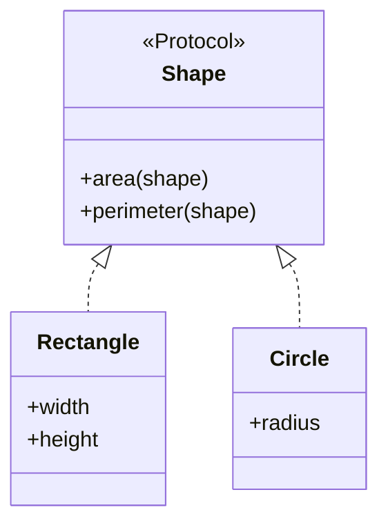

## 10.1 Introduction to Protocols

As experienced Java developers, you're likely familiar with interfaces and abstract classes, which provide a way to define a contract for classes to implement. In Clojure, protocols serve a similar purpose but with a functional twist. They allow you to define a set of functions that can have multiple implementations, enabling polymorphism and abstraction in a functional programming context. This section will guide you through understanding, defining, and using protocols in Clojure, highlighting their benefits and how they compare to Java's interfaces.

### Purpose of Protocols

Protocols in Clojure are a powerful tool for achieving polymorphism and abstraction. They allow you to define a set of functions that can be implemented by different types, similar to interfaces in Java. However, unlike Java interfaces, Clojure protocols are designed to work seamlessly with Clojure's functional programming paradigm, providing a more flexible and dynamic approach to polymorphism.

#### Key Concepts

- **Polymorphism**: Protocols enable polymorphism by allowing multiple types to implement the same set of functions. This is akin to Java's interfaces but with more flexibility.
- **Abstraction**: By defining a protocol, you create an abstraction layer that separates the definition of operations from their implementations.
- **Dynamic Dispatch**: Protocols support dynamic dispatch, allowing the correct implementation of a function to be chosen at runtime based on the type of the arguments.

### Defining Protocols

To define a protocol in Clojure, you use the `defprotocol` macro. This macro allows you to specify a set of function signatures that can be implemented by different types. Let's explore how to define a protocol with a simple example.

#### Example: Defining a Protocol

Consider a scenario where you want to define a protocol for a simple shape with functions to calculate the area and perimeter.

```clojure
(defprotocol Shape
  "A protocol for geometric shapes."
  (area [shape] "Calculate the area of the shape.")
  (perimeter [shape] "Calculate the perimeter of the shape."))
```

In this example, we define a protocol named `Shape` with two functions: `area` and `perimeter`. Each function takes a single argument, `shape`, which represents the instance of the type implementing the protocol.

#### Implementing Protocols

Once a protocol is defined, you can implement it for different types using the `extend-type` or `extend-protocol` macros. Let's see how to implement the `Shape` protocol for a rectangle and a circle.

##### Implementing with `extend-type`

```clojure
(defrecord Rectangle [width height])

(extend-type Rectangle
  Shape
  (area [rect]
    (* (:width rect) (:height rect)))
  (perimeter [rect]
    (* 2 (+ (:width rect) (:height rect)))))
```

Here, we define a `Rectangle` type using `defrecord` and implement the `Shape` protocol using `extend-type`. The `area` and `perimeter` functions are implemented specifically for rectangles.

##### Implementing with `extend-protocol`

```clojure
(defrecord Circle [radius])

(extend-protocol Shape
  Circle
  (area [circle]
    (* Math/PI (:radius circle) (:radius circle)))
  (perimeter [circle]
    (* 2 Math/PI (:radius circle))))
```

In this example, we use `extend-protocol` to implement the `Shape` protocol for the `Circle` type. This approach is useful when you want to implement a protocol for multiple types in a single block.

### Benefits of Using Protocols

Protocols offer several advantages that make them a valuable tool in Clojure development:

- **Abstraction**: Protocols provide a clean way to define an abstraction layer, separating the definition of operations from their implementations.
- **Polymorphism**: They enable polymorphism, allowing different types to implement the same set of functions, similar to interfaces in Java.
- **Dynamic Dispatch**: Protocols support dynamic dispatch, enabling the correct implementation of a function to be chosen at runtime based on the type of the arguments.
- **Extensibility**: You can extend existing types with new functionality without modifying their original definitions, promoting code reuse and modularity.

### Comparing Protocols to Java Interfaces

While protocols in Clojure and interfaces in Java serve similar purposes, there are key differences that highlight the strengths of Clojure's approach:

- **Dynamic vs. Static**: Java interfaces are statically typed, meaning the type of the implementing class is known at compile time. In contrast, Clojure protocols are dynamically dispatched, allowing for more flexible and dynamic behavior.
- **Functional vs. Object-Oriented**: Protocols are designed to work seamlessly with Clojure's functional programming paradigm, whereas Java interfaces are rooted in object-oriented design.
- **Extensibility**: Clojure protocols can be extended to existing types without modifying their original definitions, whereas Java interfaces require the implementing class to be modified or subclassed.

### Code Examples and Exercises

Let's solidify our understanding of protocols with some exercises and code examples.

#### Exercise 1: Implementing a Protocol

Define a protocol named `Drawable` with a function `draw` that takes a shape and returns a string representation of the shape. Implement this protocol for both `Rectangle` and `Circle`.

```clojure
(defprotocol Drawable
  "A protocol for drawable shapes."
  (draw [shape] "Return a string representation of the shape."))

(extend-type Rectangle
  Drawable
  (draw [rect]
    (str "Rectangle with width " (:width rect) " and height " (:height rect))))

(extend-type Circle
  Drawable
  (draw [circle]
    (str "Circle with radius " (:radius circle))))
```

#### Exercise 2: Extending Existing Types

Extend the `Drawable` protocol to the built-in `String` type, where the `draw` function returns the string itself.

```clojure
(extend-type String
  Drawable
  (draw [s]
    s))
```

### Visual Aids

To better understand how protocols work, let's visualize the relationship between protocols and their implementations using a class diagram.



**Diagram Description**: This class diagram illustrates the `Shape` protocol and its implementations by `Rectangle` and `Circle`. The protocol defines the `area` and `perimeter` functions, which are implemented by both types.

### Knowledge Check

Before we conclude this section, let's test your understanding of Clojure protocols with a few questions.

1. What is the primary purpose of protocols in Clojure?
2. How do protocols in Clojure differ from interfaces in Java?
3. What are the benefits of using protocols for abstraction and polymorphism?
4. How can you implement a protocol for multiple types in a single block of code?

### Summary

In this section, we've explored the concept of protocols in Clojure, understanding their purpose, how to define and implement them, and their benefits for abstraction and polymorphism. We've also compared protocols to Java interfaces, highlighting the strengths of Clojure's approach. By mastering protocols, you can create flexible and dynamic applications that leverage the power of functional programming.

### Encouragement and Next Steps

Now that you've learned about protocols, try implementing them in your projects to see how they can enhance your code's flexibility and maintainability. As you continue your journey in mastering Clojure, remember that practice is key to solidifying your understanding of these concepts.

For further reading, consider exploring the [Official Clojure Documentation](https://clojure.org/reference/protocols) and [ClojureDocs](https://clojuredocs.org/), which provide additional insights and examples.

## Quiz: Test Your Knowledge on Clojure Protocols



### What is the primary purpose of protocols in Clojure?

- [x] To define a set of functions that can have multiple implementations
- [ ] To enforce strict type checking
- [ ] To replace Java interfaces
- [ ] To manage state changes

> **Explanation:** Protocols in Clojure are used to define a set of functions that can be implemented by different types, enabling polymorphism and abstraction.

### How do protocols in Clojure differ from interfaces in Java?

- [x] Protocols support dynamic dispatch
- [ ] Protocols are statically typed
- [ ] Protocols require subclassing
- [ ] Protocols are only for object-oriented programming

> **Explanation:** Unlike Java interfaces, Clojure protocols support dynamic dispatch, allowing for more flexible and dynamic behavior.

### What is a benefit of using protocols in Clojure?

- [x] They provide a clean way to define an abstraction layer
- [ ] They enforce compile-time type checking
- [ ] They require less memory
- [ ] They are faster than Java interfaces

> **Explanation:** Protocols provide a clean way to define an abstraction layer, separating the definition of operations from their implementations.

### Which macro is used to define a protocol in Clojure?

- [x] `defprotocol`
- [ ] `definterface`
- [ ] `defclass`
- [ ] `defmethod`

> **Explanation:** The `defprotocol` macro is used to define a protocol in Clojure.

### How can you implement a protocol for multiple types in a single block of code?

- [x] Using `extend-protocol`
- [ ] Using `extend-type`
- [ ] Using `defprotocol`
- [ ] Using `defrecord`

> **Explanation:** The `extend-protocol` macro allows you to implement a protocol for multiple types in a single block of code.

### What is dynamic dispatch in the context of Clojure protocols?

- [x] Choosing the correct implementation of a function at runtime
- [ ] Compiling code dynamically
- [ ] Dispatching messages between threads
- [ ] Managing memory allocation

> **Explanation:** Dynamic dispatch refers to choosing the correct implementation of a function at runtime based on the type of the arguments.

### Can protocols be extended to existing types in Clojure?

- [x] Yes
- [ ] No

> **Explanation:** Protocols can be extended to existing types without modifying their original definitions, promoting code reuse and modularity.

### What is the advantage of using `extend-type` over `extend-protocol`?

- [ ] It allows implementing multiple protocols for a single type
- [x] It allows implementing a single protocol for a specific type
- [ ] It is faster
- [ ] It is more readable

> **Explanation:** `extend-type` is used to implement a single protocol for a specific type, while `extend-protocol` is used for multiple types.

### What is the role of `defrecord` in implementing protocols?

- [x] To define a new type that can implement protocols
- [ ] To define a new protocol
- [ ] To extend existing types
- [ ] To manage state changes

> **Explanation:** `defrecord` is used to define a new type that can implement protocols.

### True or False: Protocols in Clojure are only useful for object-oriented programming.

- [ ] True
- [x] False

> **Explanation:** Protocols in Clojure are designed to work seamlessly with the functional programming paradigm, not just object-oriented programming.


