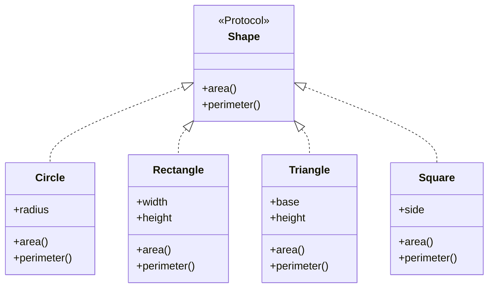

## 10.2 Defining and Implementing Protocols in Clojure

In this section, we will delve into the world of protocols in Clojure, a powerful feature that allows you to define a set of functions that can be implemented by different data types. Protocols provide a way to achieve polymorphism, similar to interfaces in Java, but with more flexibility and simplicity. By the end of this section, you will understand how to define and implement protocols using `defrecord` and `deftype`, and how to leverage these constructs to build scalable and reusable code.

### Understanding Protocols in Clojure

**Protocols** in Clojure are a mechanism for polymorphism, allowing you to define a set of functions that can be implemented by various data types. They are similar to interfaces in Java but are more flexible and dynamic. Protocols enable you to define behavior that can be shared across different types without the need for inheritance.

#### Key Concepts

- **Protocol Definition**: A protocol is defined using the `defprotocol` keyword, which specifies a set of functions that must be implemented by any type that implements the protocol.
- **Protocol Implementation**: Types can implement protocols using `defrecord` or `deftype`, which provide concrete implementations for the protocol's functions.
- **Polymorphism**: Protocols allow different types to implement the same set of functions, enabling polymorphic behavior.

### Defining Protocols

To define a protocol, use the `defprotocol` keyword followed by the protocol name and a list of function signatures. Each function signature includes the function name and its parameters.

```clojure
(defprotocol Shape
  "A protocol for geometric shapes."
  (area [this] "Calculate the area of the shape.")
  (perimeter [this] "Calculate the perimeter of the shape."))
```

In this example, we define a `Shape` protocol with two functions: `area` and `perimeter`. Any type that implements this protocol must provide implementations for these functions.

### Implementing Protocols with `defrecord`

The `defrecord` construct is used to create a new record type that implements one or more protocols. Records are immutable data structures that provide a convenient way to define types with named fields.

```clojure
(defrecord Circle [radius]
  Shape
  (area [this]
    (* Math/PI (* radius radius)))
  (perimeter [this]
    (* 2 Math/PI radius)))
```

Here, we define a `Circle` record that implements the `Shape` protocol. The `area` and `perimeter` functions are implemented to calculate the area and perimeter of a circle, respectively.

### Implementing Protocols with `deftype`

The `deftype` construct is similar to `defrecord` but provides more flexibility and control over the implementation. It allows you to define custom data types with mutable fields and implement protocols.

```clojure
(deftype Rectangle [width height]
  Shape
  (area [this]
    (* width height))
  (perimeter [this]
    (* 2 (+ width height))))
```

In this example, we use `deftype` to define a `Rectangle` type that implements the `Shape` protocol. The `area` and `perimeter` functions are implemented to calculate the area and perimeter of a rectangle.

### Comparing `defrecord` and `deftype`

Both `defrecord` and `deftype` are used to implement protocols, but they have some differences:

- **Immutability**: `defrecord` creates immutable data structures, while `deftype` allows for mutable fields.
- **Convenience**: `defrecord` automatically provides implementations for common functions like `equals`, `hashCode`, and `toString`, making it more convenient for most use cases.
- **Flexibility**: `deftype` offers more flexibility and control, allowing you to define custom behavior and mutable fields.

### Protocol Functions

Protocol functions are defined within the protocol and must be implemented by any type that implements the protocol. These functions define the behavior that is shared across different types.

#### Example: Implementing a Protocol for Multiple Types

Let's implement the `Shape` protocol for multiple types: `Circle`, `Rectangle`, and `Triangle`.

```clojure
(defrecord Triangle [base height]
  Shape
  (area [this]
    (/ (* base height) 2))
  (perimeter [this]
    ;; Assuming an equilateral triangle for simplicity
    (* 3 base)))

(defrecord Square [side]
  Shape
  (area [this]
    (* side side))
  (perimeter [this]
    (* 4 side)))
```

In this example, we implement the `Shape` protocol for `Triangle` and `Square` types. Each type provides its own implementation for the `area` and `perimeter` functions.

### Using Protocols

Once a protocol is defined and implemented, you can use it to perform polymorphic operations on different types. This allows you to write code that is flexible and reusable.

```clojure
(defn print-shape-info [shape]
  (println "Area:" (area shape))
  (println "Perimeter:" (perimeter shape)))

(let [circle (->Circle 5)
      rectangle (->Rectangle 4 6)
      triangle (->Triangle 3 4)
      square (->Square 2)]
  (doseq [s [circle rectangle triangle square]]
    (print-shape-info s)))
```

In this example, we define a `print-shape-info` function that takes a `Shape` and prints its area and perimeter. We then create instances of `Circle`, `Rectangle`, `Triangle`, and `Square` and use the `print-shape-info` function to print their information.

### Visualizing Protocols and Implementations

To better understand how protocols and implementations work in Clojure, let's visualize the relationship between protocols and types using a class diagram.



**Diagram Description**: This class diagram illustrates the `Shape` protocol and its implementations by `Circle`, `Rectangle`, `Triangle`, and `Square`. Each type implements the `area` and `perimeter` functions defined in the `Shape` protocol.

### Best Practices for Using Protocols

- **Use Protocols for Polymorphism**: Protocols are ideal for defining behavior that can be shared across different types. Use them to achieve polymorphism and code reuse.
- **Choose the Right Construct**: Use `defrecord` for immutable data structures and `deftype` for more flexible and custom implementations.
- **Keep Protocols Simple**: Define protocols with a minimal set of functions to keep them simple and focused.
- **Leverage Protocols for Extensibility**: Protocols allow you to extend existing types with new behavior without modifying their original implementation.

### Try It Yourself

To reinforce your understanding of protocols in Clojure, try implementing a new protocol for a different domain. For example, define a `Vehicle` protocol with functions like `start`, `stop`, and `fuel-efficiency`, and implement it for different vehicle types like `Car`, `Bike`, and `Truck`.

### Knowledge Check

Before we wrap up, let's test your understanding of protocols in Clojure with a few questions.

## Test Your Knowledge on Clojure Protocols



### What is the primary purpose of protocols in Clojure?

- [x] To achieve polymorphism and code reuse.
- [ ] To define mutable data structures.
- [ ] To implement inheritance.
- [ ] To manage state changes.

> **Explanation:** Protocols in Clojure are used to achieve polymorphism and code reuse by defining a set of functions that can be implemented by different types.

### Which construct is used to define a protocol in Clojure?

- [x] defprotocol
- [ ] defrecord
- [ ] deftype
- [ ] defn

> **Explanation:** The `defprotocol` construct is used to define a protocol in Clojure, specifying a set of functions that must be implemented by any type that implements the protocol.

### How do you implement a protocol for a new type in Clojure?

- [x] Using defrecord or deftype
- [ ] Using defn
- [ ] Using defprotocol
- [ ] Using defmacro

> **Explanation:** Protocols can be implemented for new types using `defrecord` or `deftype`, which provide concrete implementations for the protocol's functions.

### What is the difference between defrecord and deftype?

- [x] defrecord creates immutable data structures, while deftype allows for mutable fields.
- [ ] defrecord is used for mutable data structures, while deftype is for immutable ones.
- [ ] defrecord is more flexible than deftype.
- [ ] defrecord is used for defining protocols, while deftype is for implementing them.

> **Explanation:** `defrecord` creates immutable data structures and provides automatic implementations for common functions, while `deftype` allows for mutable fields and more flexibility.

### Which of the following is a benefit of using protocols in Clojure?

- [x] They allow for polymorphic behavior across different types.
- [ ] They enforce strict type checking.
- [ ] They simplify state management.
- [ ] They provide built-in concurrency support.

> **Explanation:** Protocols allow for polymorphic behavior across different types, enabling code reuse and flexibility.

### Can protocols be extended to existing types in Clojure?

- [x] Yes
- [ ] No

> **Explanation:** Protocols can be extended to existing types in Clojure, allowing you to add new behavior to types without modifying their original implementation.

### What is a key advantage of using defrecord over deftype?

- [x] defrecord automatically provides implementations for common functions like equals, hashCode, and toString.
- [ ] defrecord allows for mutable fields.
- [ ] defrecord is more flexible than deftype.
- [ ] defrecord is used for defining protocols.

> **Explanation:** `defrecord` automatically provides implementations for common functions like `equals`, `hashCode`, and `toString`, making it more convenient for most use cases.

### Which function is used to create an instance of a record in Clojure?

- [x] ->RecordName
- [ ] new
- [ ] create
- [ ] make

> **Explanation:** The `->RecordName` function is used to create an instance of a record in Clojure, where `RecordName` is the name of the record.

### What is the role of protocol functions in Clojure?

- [x] They define the behavior that is shared across different types.
- [ ] They manage state changes in concurrent applications.
- [ ] They provide built-in error handling.
- [ ] They enforce strict type checking.

> **Explanation:** Protocol functions define the behavior that is shared across different types, allowing for polymorphism and code reuse.

### True or False: Protocols in Clojure are similar to interfaces in Java.

- [x] True
- [ ] False

> **Explanation:** Protocols in Clojure are similar to interfaces in Java as they both define a set of functions that must be implemented by any type that implements them, enabling polymorphism.



Now that we've explored how to define and implement protocols in Clojure, you're equipped to leverage this powerful feature to build scalable and reusable applications. Keep experimenting with different protocols and implementations to deepen your understanding and enhance your functional programming skills.
