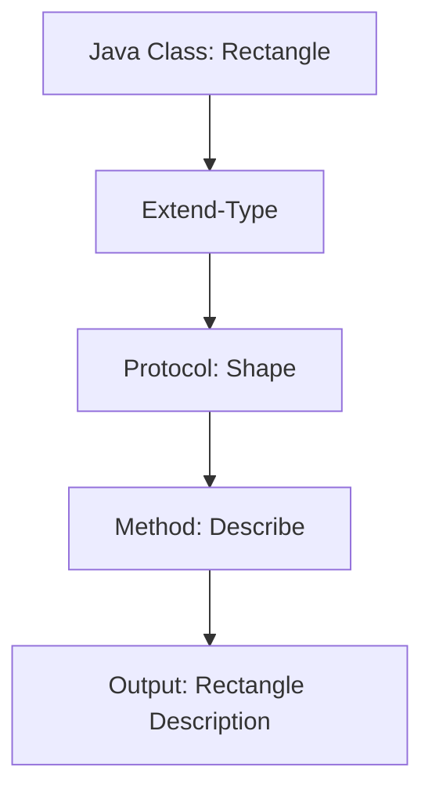

## 10.3 Extending Protocols to Existing Types

In this section, we delve into the powerful feature of Clojure that allows developers to extend protocols to existing types. This capability is particularly beneficial for experienced Java developers transitioning to Clojure, as it provides a flexible mechanism to enhance code reusability and adaptability without altering the original type definitions. By the end of this section, you'll understand how to leverage Clojure's `extend-type` to extend protocols to types you don't own, and you'll be equipped with practical examples to apply these concepts effectively.

### Introduction to Protocols in Clojure

Before we dive into extending protocols, let's briefly revisit what protocols are in Clojure. Protocols in Clojure are akin to interfaces in Java. They define a set of methods that can be implemented by different types. However, unlike Java interfaces, Clojure protocols can be extended to existing types, including Java classes and Clojure core types, without modifying their original definitions.

### Extension Mechanism: Using `extend-type`

The `extend-type` function in Clojure is the primary mechanism for extending protocols to existing types. It allows you to specify how a particular type should implement the methods defined in a protocol. This is particularly useful when you want to add new behavior to types that you do not own or cannot modify directly.

#### Syntax of `extend-type`

The syntax for `extend-type` is straightforward:

```clojure
(extend-type TypeName
  ProtocolName
  (method1 [this arg1 arg2] 
    ;; method implementation
  )
  (method2 [this arg1] 
    ;; method implementation
  ))
```

- **TypeName**: The type you want to extend.
- **ProtocolName**: The protocol you are implementing.
- **method1, method2**: The methods defined in the protocol.

### Reusing Existing Types

One of the significant advantages of extending protocols to existing types is the ability to reuse and enhance existing codebases. This approach promotes code reusability and flexibility, allowing you to adapt existing types to new requirements without altering their original implementations.

#### Benefits of Reusing Existing Types

1. **Code Reusability**: By extending protocols, you can reuse existing types and add new functionalities without duplicating code.
2. **Separation of Concerns**: Extending protocols allows you to separate the implementation of new behaviors from the original type definitions, promoting cleaner and more maintainable code.
3. **Interoperability**: For Java developers, extending protocols to Java classes enables seamless integration between Java and Clojure codebases.

### Practical Examples

Let's explore some practical examples of extending protocols to existing types, focusing on both Java classes and Clojure core types.

#### Example 1: Extending a Java Class

Suppose you have a Java class `Rectangle` with methods to calculate the area and perimeter. You want to extend this class to implement a Clojure protocol `Shape` that includes a method `describe`.

**Java Class: Rectangle**

```java
public class Rectangle {
    private double length;
    private double width;

    public Rectangle(double length, double width) {
        this.length = length;
        this.width = width;
    }

    public double area() {
        return length * width;
    }

    public double perimeter() {
        return 2 * (length + width);
    }
}
```

**Clojure Protocol: Shape**

```clojure
(defprotocol Shape
  (describe [this]))
```

**Extending the Java Class in Clojure**

```clojure
(extend-type Rectangle
  Shape
  (describe [this]
    (str "Rectangle with length " (.length this) 
         " and width " (.width this) 
         ", area: " (.area this) 
         ", perimeter: " (.perimeter this))))
```

**Usage**

```clojure
(let [rect (Rectangle. 5.0 3.0)]
  (println (describe rect)))
```

**Output**

```
Rectangle with length 5.0 and width 3.0, area: 15.0, perimeter: 16.0
```

In this example, we extended the `Rectangle` class to implement the `Shape` protocol, allowing us to describe the rectangle using the `describe` method.

#### Example 2: Extending a Clojure Core Type

Consider extending the `String` type to implement a protocol `Reversible` that includes a method `reverse`.

**Clojure Protocol: Reversible**

```clojure
(defprotocol Reversible
  (reverse [this]))
```

**Extending the String Type**

```clojure
(extend-type String
  Reversible
  (reverse [this]
    (apply str (reverse (seq this)))))
```

**Usage**

```clojure
(println (reverse "Clojure"))
```

**Output**

```
erujolC
```

In this example, we extended the `String` type to implement the `Reversible` protocol, allowing us to reverse a string using the `reverse` method.

### Visual Aids

To better understand the flow of extending protocols, let's visualize the process using a diagram.



**Diagram Description**: This flowchart illustrates the process of extending a Java class `Rectangle` to implement the `Shape` protocol using `extend-type`, resulting in the ability to describe the rectangle.

### Knowledge Check

Let's test your understanding of extending protocols to existing types with a few questions.

1. What is the primary function used in Clojure to extend protocols to existing types?
2. How does extending protocols promote code reusability?
3. Provide an example of extending a Clojure core type with a new protocol.

### Try It Yourself

Encourage experimentation by modifying the code examples provided. Try extending different Java classes or Clojure core types with new protocols and observe the results.

### References and Links

- [Clojure Protocols and Datatypes](https://clojure.org/reference/protocols)
- [ClojureDocs: extend-type](https://clojuredocs.org/clojure.core/extend-type)
- [Java Interoperability in Clojure](https://clojure.org/reference/java_interop)

### Conclusion

Extending protocols to existing types in Clojure is a powerful feature that enhances code flexibility and reusability. By leveraging `extend-type`, you can adapt existing types to new requirements without modifying their original implementations. This capability is particularly beneficial for Java developers transitioning to Clojure, as it facilitates seamless integration between Java and Clojure codebases.

## Quiz: Extending Protocols to Existing Types in Clojure



### What is the primary function used to extend protocols to existing types in Clojure?

- [x] extend-type
- [ ] implement-type
- [ ] add-protocol
- [ ] define-type

> **Explanation:** The `extend-type` function is used to extend protocols to existing types in Clojure.

### How does extending protocols promote code reusability?

- [x] By allowing new functionalities to be added to existing types without duplicating code
- [ ] By requiring modifications to the original type definitions
- [ ] By creating new types for each protocol implementation
- [ ] By limiting the use of existing types

> **Explanation:** Extending protocols allows new functionalities to be added to existing types without altering their original definitions, promoting code reusability.

### Which of the following is a benefit of extending protocols to existing types?

- [x] Separation of concerns
- [ ] Increased code duplication
- [ ] Reduced code flexibility
- [ ] Limited interoperability

> **Explanation:** Extending protocols allows for the separation of new behavior implementations from original type definitions, promoting cleaner code.

### What is the output of the following Clojure code snippet?

```clojure
(extend-type String
  Reversible
  (reverse [this]
    (apply str (reverse (seq this)))))

(println (reverse "Clojure"))
```

- [x] erujolC
- [ ] Clojure
- [ ] erujolc
- [ ] Error

> **Explanation:** The code snippet extends the `String` type to implement the `Reversible` protocol, reversing the string "Clojure" to "erujolC".

### Which of the following types can be extended using protocols in Clojure?

- [x] Java classes
- [x] Clojure core types
- [ ] Only new types
- [ ] Only primitive types

> **Explanation:** Protocols in Clojure can be extended to both Java classes and Clojure core types.

### What is the purpose of the `describe` method in the `Shape` protocol example?

- [x] To provide a textual description of a shape
- [ ] To calculate the area of a shape
- [ ] To modify the dimensions of a shape
- [ ] To create a new shape instance

> **Explanation:** The `describe` method in the `Shape` protocol example provides a textual description of a shape.

### Which Clojure function is used to reverse a sequence?

- [x] reverse
- [ ] seq
- [ ] apply
- [ ] str

> **Explanation:** The `reverse` function is used to reverse a sequence in Clojure.

### What is the benefit of using `extend-type` for Java developers?

- [x] Seamless integration between Java and Clojure codebases
- [ ] Increased complexity in code integration
- [ ] Limited functionality for Java classes
- [ ] Reduced code flexibility

> **Explanation:** Using `extend-type` allows Java developers to seamlessly integrate Java and Clojure codebases by extending Java classes with Clojure protocols.

### True or False: Extending protocols requires modifying the original type definitions.

- [ ] True
- [x] False

> **Explanation:** Extending protocols in Clojure does not require modifying the original type definitions, allowing for flexible code enhancements.

### What is the role of the `extend-type` function in Clojure?

- [x] To specify how a type should implement the methods defined in a protocol
- [ ] To create new types for protocol implementations
- [ ] To remove existing protocol implementations
- [ ] To define new protocols

> **Explanation:** The `extend-type` function in Clojure specifies how a type should implement the methods defined in a protocol.



By mastering the extension of protocols to existing types, you can significantly enhance the adaptability and reusability of your Clojure applications, making them more robust and maintainable.
