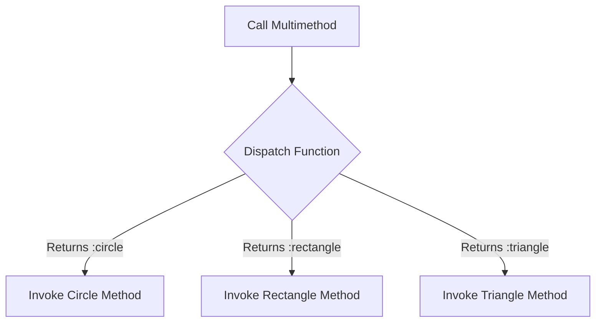

## 10.4 Multimethods and Dispatching

In the realm of functional programming, Clojure provides a powerful mechanism for achieving polymorphic behavior through multimethods. Unlike traditional object-oriented languages like Java, where polymorphism is typically achieved through class hierarchies and interfaces, Clojure's multimethods offer a more flexible approach. They allow you to define behavior based on arbitrary dispatch criteria, making them a versatile tool in your functional programming toolkit.

### Understanding Multimethods

Multimethods in Clojure are a way to define functions that can have multiple implementations, with the specific implementation chosen based on the result of a dispatch function. This allows for a high degree of flexibility in how you structure your code, as the dispatch logic can be based on any criteria you choose.

#### Key Concepts

- **Polymorphism**: The ability to present the same interface for different data types.
- **Dispatch Function**: A function that determines which method implementation to use based on its return value.
- **Method Implementations**: Different versions of a function that handle specific cases as determined by the dispatch function.

### Defining Multimethods

To define a multimethod in Clojure, you use the `defmulti` and `defmethod` constructs. Let's explore these in detail.

#### `defmulti`

The `defmulti` function is used to define a new multimethod. It takes a name and a dispatch function as arguments. The dispatch function is called with the same arguments as the multimethod and its return value is used to select the appropriate method implementation.

```clojure
(defmulti area :shape)
```

In this example, we define a multimethod `area` that dispatches based on the `:shape` key of its argument.

#### `defmethod`

The `defmethod` function is used to define a method implementation for a specific dispatch value. It takes the name of the multimethod, a dispatch value, and a function body.

```clojure
(defmethod area :circle
  [{:keys [radius]}]
  (* Math/PI radius radius))

(defmethod area :rectangle
  [{:keys [length width]}]
  (* length width))
```

Here, we define two method implementations for the `area` multimethod: one for circles and one for rectangles. The dispatch value `:circle` or `:rectangle` determines which implementation is used.

### Dispatch Functions

Dispatch functions are central to the operation of multimethods. They determine which method implementation to use by returning a dispatch value. This value can be anything: a keyword, a string, a number, or even a more complex data structure.

#### Example: Dispatching on Multiple Criteria

Consider a scenario where you want to dispatch based on both the shape and the color of an object. You can achieve this by returning a composite dispatch value from the dispatch function.

```clojure
(defmulti describe (fn [shape] [(get shape :shape) (get shape :color)]))

(defmethod describe [:circle :red]
  [shape]
  "A red circle")

(defmethod describe [:rectangle :blue]
  [shape]
  "A blue rectangle")
```

In this example, the dispatch function returns a vector containing both the shape and the color, allowing for more granular control over method selection.

### Use Cases for Multimethods

Multimethods are particularly useful in scenarios where:

- **Complex Dispatch Logic**: You need to dispatch based on multiple or complex criteria.
- **Open for Extension**: You want to add new cases without modifying existing code.
- **Separation of Concerns**: You want to separate dispatch logic from method implementations.

#### Example: Handling Different File Formats

Suppose you are building a system that processes different file formats. You can use multimethods to handle each format separately.

```clojure
(defmulti process-file :format)

(defmethod process-file :csv
  [file]
  (println "Processing CSV file"))

(defmethod process-file :json
  [file]
  (println "Processing JSON file"))

(defmethod process-file :xml
  [file]
  (println "Processing XML file"))
```

This approach allows you to easily add support for new file formats by simply defining new method implementations.

### Comparing Multimethods and Protocols

While both multimethods and protocols provide polymorphic behavior, they serve different purposes and have different strengths.

- **Protocols**: Best suited for defining a fixed set of operations that can be implemented by different types. They are similar to Java interfaces.
- **Multimethods**: Offer more flexibility in dispatching logic and are not limited to a fixed set of operations.

### Try It Yourself

Experiment with the following code snippets to deepen your understanding of multimethods:

1. Modify the `area` multimethod to handle a new shape, such as a triangle.
2. Create a new multimethod that dispatches based on the type and size of a collection (e.g., list, vector, map).
3. Implement a multimethod that processes different types of user actions (e.g., login, logout, register).

### Visualizing Multimethod Dispatch

To better understand how multimethod dispatch works, consider the following flowchart:



**Figure 1**: Flowchart illustrating the dispatch process for a multimethod based on shape.

### References and Links

For further reading on multimethods and dispatching in Clojure, consider the following resources:

- [Official Clojure Documentation on Multimethods](https://clojure.org/reference/multimethods)
- [ClojureDocs: Multimethods](https://clojuredocs.org/clojure.core/defmulti)
- [Clojure Programming by Chas Emerick, Brian Carper, and Christophe Grand](https://www.oreilly.com/library/view/clojure-programming/9781449310387/)

### Knowledge Check

To reinforce your understanding of multimethods and dispatching, try answering the following questions:

## Mastering Clojure Multimethods and Dispatching Quiz



### What is the primary purpose of a dispatch function in a Clojure multimethod?

- [x] To determine which method implementation to use
- [ ] To define the method body
- [ ] To handle exceptions
- [ ] To initialize the multimethod

> **Explanation:** The dispatch function is used to determine which method implementation to use by returning a dispatch value.

### How do you define a new method implementation for a multimethod in Clojure?

- [x] Using `defmethod`
- [ ] Using `defmulti`
- [ ] Using `defn`
- [ ] Using `defprotocol`

> **Explanation:** `defmethod` is used to define a method implementation for a specific dispatch value in a multimethod.

### Which of the following is a benefit of using multimethods over protocols?

- [x] More flexible dispatch logic
- [ ] Better performance
- [ ] Simpler syntax
- [ ] Stronger type checking

> **Explanation:** Multimethods offer more flexible dispatch logic, allowing for complex and arbitrary dispatch criteria.

### In the context of multimethods, what is a composite dispatch value?

- [x] A dispatch value that combines multiple criteria
- [ ] A dispatch value that is a single keyword
- [ ] A dispatch value that is a number
- [ ] A dispatch value that is a string

> **Explanation:** A composite dispatch value combines multiple criteria, such as a vector containing multiple elements.

### Which of the following scenarios is best suited for using multimethods?

- [x] Handling different file formats
- [ ] Implementing a fixed set of operations
- [ ] Defining a class hierarchy
- [ ] Managing a single type of data

> **Explanation:** Multimethods are well-suited for handling different file formats due to their flexible dispatch logic.

### What is the role of `defmulti` in defining a multimethod?

- [x] To define the multimethod and its dispatch function
- [ ] To define a method implementation
- [ ] To handle errors in the multimethod
- [ ] To optimize the multimethod

> **Explanation:** `defmulti` is used to define a multimethod and its associated dispatch function.

### How can you extend a multimethod to handle a new case?

- [x] By defining a new method implementation with `defmethod`
- [ ] By modifying the dispatch function
- [ ] By creating a new multimethod
- [ ] By using a protocol

> **Explanation:** You can extend a multimethod by defining a new method implementation with `defmethod` for the new case.

### What is the advantage of using a composite dispatch value?

- [x] It allows for more granular control over method selection
- [ ] It simplifies the dispatch logic
- [ ] It improves performance
- [ ] It reduces code duplication

> **Explanation:** A composite dispatch value allows for more granular control over method selection by combining multiple criteria.

### True or False: Multimethods in Clojure can only dispatch based on a single criterion.

- [ ] True
- [x] False

> **Explanation:** False. Multimethods can dispatch based on multiple criteria by using composite dispatch values.

### Which of the following is NOT a typical use case for multimethods?

- [ ] Complex dispatch logic
- [ ] Open for extension
- [ ] Separation of concerns
- [x] Strong type enforcement

> **Explanation:** Multimethods are not typically used for strong type enforcement; they are used for flexible dispatch logic and open extension.



By mastering multimethods and dispatching in Clojure, you can create more flexible and extensible applications. Embrace the power of Clojure's polymorphic capabilities to build scalable and maintainable software solutions.
