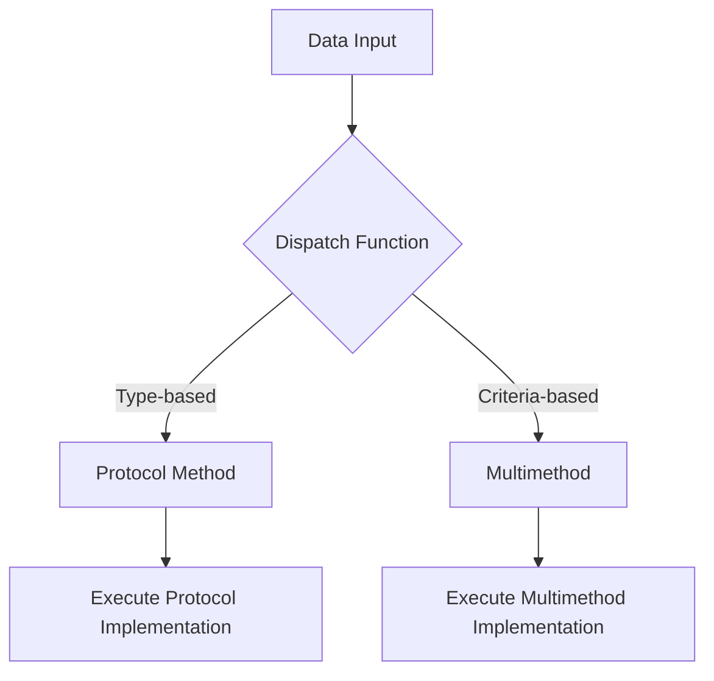

## 10.5 Designing with Polymorphism in Clojure

Polymorphism is a cornerstone of software design, enabling flexibility and extensibility in code. In traditional object-oriented languages like Java, polymorphism is typically achieved through inheritance and interfaces. However, Clojure, being a functional language, approaches polymorphism differently, offering powerful tools such as protocols and multimethods. In this section, we will explore these concepts, compare them with Java's approach, and provide guidelines on when to use each in Clojure.

### Understanding Polymorphism in Clojure

Polymorphism allows entities to be treated as instances of their parent class or interface, enabling a single function to operate on different types. In Clojure, polymorphism is achieved without the need for a class hierarchy, making it more flexible and suitable for open systems design.

#### Key Concepts of Polymorphism

- **Dynamic Dispatch**: The ability to determine which function to execute at runtime based on the type of arguments.
- **Extensibility**: The capability to add new behavior to existing code without modifying it.
- **Decoupling**: Separating the interface from the implementation, allowing for interchangeable components.

### Protocols in Clojure

Protocols in Clojure are similar to interfaces in Java. They define a set of functions that can be implemented by different types. However, unlike Java interfaces, protocols are not tied to a class hierarchy, allowing for more flexible and dynamic designs.

#### Defining and Using Protocols

To define a protocol in Clojure, use the `defprotocol` macro. This creates a contract that can be implemented by any data type.

```clojure
(defprotocol Shape
  (area [this])
  (perimeter [this]))

(defrecord Circle [radius]
  Shape
  (area [this] (* Math/PI (* radius radius)))
  (perimeter [this] (* 2 Math/PI radius)))

(defrecord Rectangle [width height]
  Shape
  (area [this] (* width height))
  (perimeter [this] (* 2 (+ width height))))
```

In this example, `Shape` is a protocol with two functions: `area` and `perimeter`. The `Circle` and `Rectangle` records implement this protocol, providing specific behavior for each shape.

#### Advantages of Protocols

- **Performance**: Protocols are optimized for performance, offering fast method dispatch.
- **Simplicity**: They provide a clear and concise way to define and implement behavior across different types.
- **Interoperability**: Protocols can be extended to existing Java classes, enhancing Clojure's interoperability with Java.

### Multimethods in Clojure

Multimethods provide a more flexible approach to polymorphism by allowing method dispatch based on arbitrary criteria, not just the type of the first argument. This makes them ideal for scenarios where behavior depends on multiple factors.

#### Defining and Using Multimethods

To define a multimethod, use the `defmulti` macro, specifying a dispatch function that determines which method to execute.

```clojure
(defmulti draw-shape :type)

(defmethod draw-shape :circle [shape]
  (println "Drawing a circle with radius" (:radius shape)))

(defmethod draw-shape :rectangle [shape]
  (println "Drawing a rectangle with width" (:width shape) "and height" (:height shape)))

(draw-shape {:type :circle :radius 5})
(draw-shape {:type :rectangle :width 4 :height 3})
```

Here, `draw-shape` is a multimethod that dispatches based on the `:type` key in the shape map. This allows for flexible and extensible behavior without modifying existing code.

#### Advantages of Multimethods

- **Flexibility**: Multimethods can dispatch on any criteria, not just type, making them highly adaptable.
- **Extensibility**: New methods can be added without altering existing code, supporting open system design.
- **Decoupling**: They separate the dispatch logic from the implementation, promoting clean and maintainable code.

### When to Use Protocols vs. Multimethods

Choosing between protocols and multimethods depends on the specific requirements of your application.

- **Use Protocols** when you need fast, type-based dispatch and when the behavior is closely tied to the data structure.
- **Use Multimethods** when you require more complex dispatch logic that involves multiple criteria or when you need to extend behavior without modifying existing types.

### Open Systems Design with Clojure

Clojure's polymorphism mechanisms support open systems design, allowing for the extension and modification of behavior without altering existing code. This is crucial for building scalable and maintainable applications.

#### Benefits of Open Systems Design

- **Scalability**: Easily add new features and functionality as requirements evolve.
- **Maintainability**: Reduce the risk of introducing bugs when extending the system.
- **Interoperability**: Seamlessly integrate with existing systems and libraries, particularly Java.

### Visualizing Polymorphism in Clojure

To better understand how protocols and multimethods work, let's visualize the flow of data and method dispatch in Clojure.



**Diagram Explanation**: This flowchart illustrates how data input is processed through a dispatch function, which determines whether to use a protocol method or a multimethod based on the criteria. The appropriate implementation is then executed.

### Practical Examples and Exercises

Let's apply what we've learned with some practical examples and exercises.

#### Example: Extending Protocols

Extend the `Shape` protocol to include a `draw` method, and implement it for `Circle` and `Rectangle`.

```clojure
(defprotocol Shape
  (area [this])
  (perimeter [this])
  (draw [this]))

(defrecord Circle [radius]
  Shape
  (area [this] (* Math/PI (* radius radius)))
  (perimeter [this] (* 2 Math/PI radius))
  (draw [this] (println "Drawing a circle with radius" radius)))

(defrecord Rectangle [width height]
  Shape
  (area [this] (* width height))
  (perimeter [this] (* 2 (+ width height)))
  (draw [this] (println "Drawing a rectangle with width" width "and height" height)))
```

#### Exercise: Implement a Multimethod

Create a multimethod `calculate` that performs different arithmetic operations based on a `:operation` key.

```clojure
(defmulti calculate :operation)

(defmethod calculate :add [{:keys [a b]}]
  (+ a b))

(defmethod calculate :subtract [{:keys [a b]}]
  (- a b))

(defmethod calculate :multiply [{:keys [a b]}]
  (* a b))

(defmethod calculate :divide [{:keys [a b]}]
  (/ a b))

;; Try It Yourself
(calculate {:operation :add :a 5 :b 3}) ; Should return 8
(calculate {:operation :subtract :a 5 :b 3}) ; Should return 2
```

### Knowledge Check

To reinforce your understanding, let's summarize the key takeaways and pose some questions.

#### Key Takeaways

- **Protocols** are ideal for type-based dispatch and performance-critical applications.
- **Multimethods** offer flexibility with criteria-based dispatch, supporting complex logic.
- **Open Systems Design** is facilitated by Clojure's polymorphism, promoting scalability and maintainability.

#### Questions

1. What are the main differences between protocols and multimethods in Clojure?
2. When would you choose to use a multimethod over a protocol?
3. How do protocols enhance interoperability with Java?
4. What are the benefits of open systems design in software development?

### Conclusion

Designing with polymorphism in Clojure provides a robust framework for building scalable and maintainable applications. By leveraging protocols and multimethods, you can create flexible systems that adapt to changing requirements without sacrificing performance or maintainability. As you continue to explore Clojure, consider how these tools can enhance your software design and development practices.

## Quiz: Mastering Polymorphism in Clojure



### What is a key advantage of using protocols in Clojure?

- [x] Fast, type-based dispatch
- [ ] Complex criteria-based dispatch
- [ ] Built-in support for inheritance
- [ ] Automatic method generation

> **Explanation:** Protocols in Clojure provide fast, type-based dispatch, making them efficient for performance-critical applications.

### When should you prefer multimethods over protocols?

- [x] When dispatch logic involves multiple criteria
- [ ] When you need fast method dispatch
- [ ] When working with a fixed set of types
- [ ] When implementing simple interfaces

> **Explanation:** Multimethods are preferred when dispatch logic involves multiple criteria, offering flexibility beyond type-based dispatch.

### How do protocols support interoperability with Java?

- [x] They can be extended to existing Java classes
- [ ] They automatically convert Java objects to Clojure types
- [ ] They provide a Java-like class hierarchy
- [ ] They require Java interfaces for implementation

> **Explanation:** Protocols can be extended to existing Java classes, enhancing Clojure's interoperability with Java.

### What is a benefit of open systems design?

- [x] Scalability and maintainability
- [ ] Faster execution time
- [ ] Reduced memory usage
- [ ] Automatic code generation

> **Explanation:** Open systems design promotes scalability and maintainability by allowing easy extension and modification of behavior.

### Which of the following is true about multimethods?

- [x] They can dispatch based on any criteria
- [ ] They are limited to type-based dispatch
- [x] They support extensibility without modifying existing code
- [ ] They require a class hierarchy

> **Explanation:** Multimethods can dispatch based on any criteria and support extensibility without modifying existing code.

### What is the primary purpose of the `defprotocol` macro?

- [x] To define a set of functions for implementation
- [ ] To create a new data type
- [ ] To dispatch methods based on criteria
- [ ] To automatically generate Java interfaces

> **Explanation:** The `defprotocol` macro is used to define a set of functions that can be implemented by different types.

### How do multimethods enhance code flexibility?

- [x] By allowing dispatch based on multiple criteria
- [ ] By enforcing strict type checking
- [x] By separating dispatch logic from implementation
- [ ] By providing automatic method generation

> **Explanation:** Multimethods enhance flexibility by allowing dispatch based on multiple criteria and separating dispatch logic from implementation.

### What is a common use case for protocols in Clojure?

- [x] Implementing behavior across different data types
- [ ] Creating complex dispatch logic
- [ ] Managing state changes
- [ ] Handling side effects

> **Explanation:** Protocols are commonly used to implement behavior across different data types, similar to interfaces in Java.

### Which Clojure feature supports open systems design?

- [x] Protocols and multimethods
- [ ] Immutable data structures
- [ ] Lazy evaluation
- [ ] Macros

> **Explanation:** Protocols and multimethods support open systems design by allowing extensible and flexible behavior.

### True or False: Multimethods in Clojure require a class hierarchy.

- [ ] True
- [x] False

> **Explanation:** Multimethods do not require a class hierarchy; they can dispatch based on any criteria, making them highly flexible.


