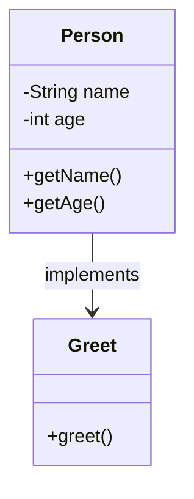

## 10.6 Records and Types in Clojure

In this section, we delve into the world of records and types in Clojure, exploring how they can be used to create efficient, named data structures, implement interfaces, and optimize performance. As experienced Java developers, you will find parallels with Java classes and interfaces, but with the unique twist of Clojure's functional paradigm.

### Defining Records

Clojure's `defrecord` is a powerful construct that allows you to define named data structures with specific fields. Unlike Java classes, records in Clojure are immutable by default, aligning with the functional programming ethos.

#### Creating a Record

To define a record in Clojure, use the `defrecord` macro. Here's a simple example:

```clojure
(defrecord Person [name age])
```

This defines a `Person` record with two fields: `name` and `age`. You can create instances of this record using the constructor function that is automatically generated:

```clojure
(def john (->Person "John Doe" 30))
```

#### Accessing Fields

Fields in a record can be accessed using the keyword associated with the field name:

```clojure
(println (:name john)) ; Output: John Doe
(println (:age john))  ; Output: 30
```

#### Comparing with Java

In Java, you might define a similar structure using a class:

```java
public class Person {
    private final String name;
    private final int age;

    public Person(String name, int age) {
        this.name = name;
        this.age = age;
    }

    public String getName() {
        return name;
    }

    public int getAge() {
        return age;
    }
}
```

While Java classes offer encapsulation and mutability control, Clojure records provide immutability and simplicity, reducing boilerplate code.

### Implementing Interfaces

Records in Clojure can implement both Clojure protocols and Java interfaces, making them versatile for various applications.

#### Implementing Protocols

Protocols in Clojure are similar to interfaces in Java. They define a set of functions that can be implemented by different types. Here's how you can implement a protocol with a record:

```clojure
(defprotocol Greet
  (greet [this]))

(defrecord FriendlyPerson [name]
  Greet
  (greet [this] (str "Hello, my name is " name)))

(def alice (->FriendlyPerson "Alice"))
(println (greet alice)) ; Output: Hello, my name is Alice
```

#### Implementing Java Interfaces

To implement a Java interface, you simply specify the interface in the `defrecord` declaration and provide the necessary method implementations:

```clojure
(defrecord RunnablePerson [name]
  Runnable
  (run [this] (println (str name " is running!"))))

(def bob (->RunnablePerson "Bob"))
(.run bob) ; Output: Bob is running!
```

### Performance Considerations

Records offer performance benefits over maps in certain scenarios due to their fixed structure and efficient field access. They are particularly useful when you need to define a large number of similar data structures with known fields.

#### Performance Comparison

Consider the following comparison between records and maps:

```clojure
(defrecord Car [make model year])
(def my-car (->Car "Toyota" "Camry" 2020))

(def my-car-map {:make "Toyota" :model "Camry" :year 2020})

;; Accessing fields
(println (:make my-car))     ; Record access
(println (:make my-car-map)) ; Map access
```

While both records and maps allow field access using keywords, records provide faster access times due to their fixed schema.

### Examples of Using Records in Application Code

Let's explore some practical examples of using records in application code, highlighting their benefits and use cases.

#### Example 1: Modeling Domain Entities

Records are ideal for modeling domain entities in your application. Consider a simple e-commerce application where you need to represent products:

```clojure
(defrecord Product [id name price])

(defn create-product [id name price]
  (->Product id name price))

(def product (create-product 1 "Laptop" 999.99))
(println (:name product)) ; Output: Laptop
```

#### Example 2: Implementing Business Logic

You can use records to encapsulate business logic by implementing protocols. For instance, let's define a protocol for discountable items:

```clojure
(defprotocol Discountable
  (apply-discount [this percentage]))

(defrecord DiscountedProduct [id name price]
  Discountable
  (apply-discount [this percentage]
    (let [discounted-price (* price (- 1 (/ percentage 100)))]
      (assoc this :price discounted-price))))

(def discounted-product (->DiscountedProduct 2 "Smartphone" 799.99))
(def updated-product (apply-discount discounted-product 10))
(println (:price updated-product)) ; Output: 719.991
```

### Try It Yourself

Now that we've explored records and types in Clojure, try modifying the examples above. For instance, add a new field to the `Person` record and implement a new protocol method. Experiment with creating and using records in your own applications to solidify your understanding.

### Visual Aids

To better understand the flow of data and the structure of records, let's visualize the `Person` record and its interactions with protocols.



*Diagram Description*: This diagram illustrates the `Person` record implementing the `Greet` protocol, showing the relationship between the record and the protocol.

### References and Links

- [Official Clojure Documentation on Records](https://clojure.org/reference/datatypes)
- [ClojureDocs: defrecord](https://clojuredocs.org/clojure.core/defrecord)
- [Clojure Protocols and Records](https://clojure.org/reference/protocols)

### Knowledge Check

Let's reinforce your understanding of records and types in Clojure with some questions and exercises.

1. **What is the primary advantage of using records over maps in Clojure?**
2. **How do you implement a Java interface in a Clojure record?**
3. **Modify the `Product` record to include a `category` field and update the `apply-discount` method to print the category.**

### Summary

In this section, we've explored how to define and use records in Clojure, implement interfaces, and leverage performance benefits. Records provide a structured, efficient way to model data in your applications, offering a functional alternative to Java classes. By understanding and utilizing records, you can build scalable, maintainable Clojure applications.

## Quiz: Mastering Records and Types in Clojure



### What is a primary advantage of using records over maps in Clojure?

- [x] Faster field access due to fixed schema
- [ ] More flexible structure
- [ ] Easier to modify fields
- [ ] Supports dynamic field addition

> **Explanation:** Records provide faster field access because they have a fixed schema, unlike maps which are more flexible but slower for field access.

### How do you define a record in Clojure?

- [x] Using `defrecord`
- [ ] Using `defstruct`
- [ ] Using `defclass`
- [ ] Using `defmap`

> **Explanation:** Records in Clojure are defined using the `defrecord` macro, which creates a named data structure with specified fields.

### Can records in Clojure implement Java interfaces?

- [x] Yes
- [ ] No

> **Explanation:** Records in Clojure can implement Java interfaces, allowing them to interact with Java code and libraries.

### What is the syntax to create an instance of a record in Clojure?

- [x] `(->RecordName field1 field2)`
- [ ] `(new RecordName field1 field2)`
- [ ] `(RecordName. field1 field2)`
- [ ] `(create RecordName field1 field2)`

> **Explanation:** The syntax `(->RecordName field1 field2)` is used to create an instance of a record in Clojure.

### Which of the following is a correct way to access a field in a Clojure record?

- [x] `(:fieldName recordInstance)`
- [ ] `(recordInstance.fieldName)`
- [ ] `(getField recordInstance)`
- [ ] `(recordInstance->fieldName)`

> **Explanation:** Fields in a Clojure record are accessed using the keyword associated with the field name, like `(:fieldName recordInstance)`.

### What is a protocol in Clojure?

- [x] A set of functions that can be implemented by different types
- [ ] A way to define mutable state
- [ ] A mechanism for error handling
- [ ] A tool for data validation

> **Explanation:** A protocol in Clojure is a set of functions that can be implemented by different types, similar to interfaces in Java.

### How do you implement a protocol in a Clojure record?

- [x] By specifying the protocol in the `defrecord` declaration and implementing its functions
- [ ] By using `defprotocol` inside the record
- [ ] By extending the record with the protocol
- [ ] By importing the protocol into the record

> **Explanation:** To implement a protocol in a Clojure record, you specify the protocol in the `defrecord` declaration and provide implementations for its functions.

### What is the benefit of implementing interfaces in Clojure records?

- [x] It allows for interoperability with Java libraries
- [ ] It makes records mutable
- [ ] It simplifies the syntax
- [ ] It increases the flexibility of field definitions

> **Explanation:** Implementing interfaces in Clojure records allows for interoperability with Java libraries, enabling seamless integration with existing Java code.

### Can records in Clojure be used to model domain entities?

- [x] Yes
- [ ] No

> **Explanation:** Records in Clojure are well-suited for modeling domain entities due to their structured and efficient nature.

### True or False: Clojure records are mutable by default.

- [ ] True
- [x] False

> **Explanation:** Clojure records are immutable by default, aligning with the principles of functional programming.


