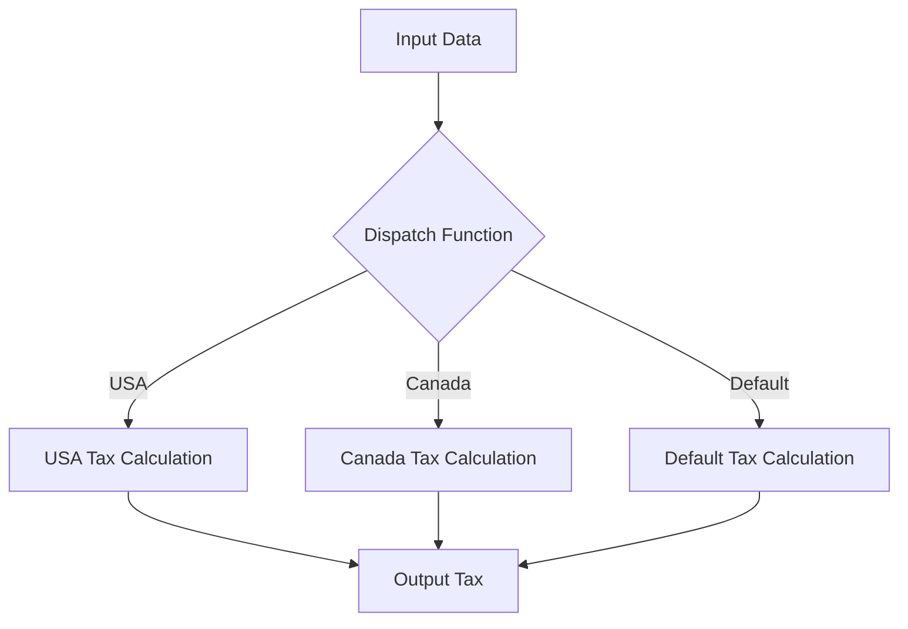

## 10.7 Best Practices for Protocols and Multimethods

In this section, we delve into the best practices for designing and implementing protocols and multimethods in Clojure. These tools are essential for achieving polymorphism and code reuse in functional programming, offering a flexible way to define and extend behavior across different data types. As experienced Java developers, you may find parallels with interfaces and method overloading, but Clojure's approach provides unique advantages in terms of flexibility and dynamism.

### Design Guidelines for Protocols and Multimethods

#### Understanding Protocols

**Protocols** in Clojure are akin to Java interfaces but are more dynamic and flexible. They allow you to define a set of functions that can be implemented by different data types. This is particularly useful for polymorphic behavior, where the same function can operate on different types of data.

- **Define Clear and Concise Protocols**: Start by identifying the core behaviors that need to be abstracted. Ensure that each protocol has a clear purpose and that its functions are cohesive.

- **Limit the Number of Functions**: Avoid overloading protocols with too many functions. This can lead to complex implementations and reduce clarity. Instead, focus on essential behaviors.

- **Use Descriptive Names**: Protocol and function names should be descriptive and self-explanatory. This aids in understanding and maintaining the code.

- **Consider Future Extensions**: Design protocols with potential future extensions in mind. This involves considering how new functions might be added without breaking existing implementations.

#### Implementing Protocols

When implementing protocols, it's crucial to ensure that each implementation is consistent and adheres to the protocol's intended behavior.

- **Consistent Implementations**: Ensure that all implementations of a protocol function behave consistently across different data types. This consistency is key to predictable behavior.

- **Leverage Default Implementations**: Use default implementations in protocols to provide common behavior that can be overridden by specific implementations. This reduces code duplication.

- **Document Implementations**: Clearly document each implementation, especially if it deviates from the default behavior or has specific constraints.

#### Understanding Multimethods

**Multimethods** in Clojure provide a way to define functions that can dispatch on the type or value of their arguments. This is similar to method overloading in Java but offers more flexibility.

- **Choose Appropriate Dispatch Functions**: The dispatch function determines which implementation to use. Choose a dispatch function that accurately reflects the decision criteria for selecting implementations.

- **Avoid Overly Complex Dispatch Logic**: Keep dispatch logic simple and intuitive. Complex logic can lead to maintenance challenges and unexpected behavior.

- **Use Hierarchies for Dispatch**: Clojure supports hierarchies for dispatch, allowing you to define relationships between types. Use this feature to simplify dispatch logic and enhance code clarity.

### Avoiding Common Pitfalls

#### Overusing Protocols and Multimethods

While protocols and multimethods are powerful, overusing them can lead to unnecessary complexity.

- **Assess the Need**: Before defining a protocol or multimethod, assess whether it's truly necessary. Sometimes, simple functions or data structures suffice.

- **Avoid Premature Abstraction**: Don't abstract behavior too early in the development process. Wait until patterns emerge that justify the use of protocols or multimethods.

#### Handling Edge Cases

Edge cases can lead to unexpected behavior if not handled properly.

- **Define Comprehensive Tests**: Ensure that all edge cases are covered by tests. This includes testing with unexpected or invalid input.

- **Provide Fallback Implementations**: For multimethods, consider providing a default implementation that handles unexpected cases gracefully.

### Testing Polymorphic Functions

Testing is crucial to ensure that polymorphic functions behave as expected across different implementations.

#### Strategies for Testing Protocol Implementations

- **Unit Tests for Each Implementation**: Write unit tests for each implementation of a protocol function. This ensures that each implementation behaves correctly in isolation.

- **Use Mock Data**: Use mock data to simulate different scenarios and edge cases. This helps in verifying the robustness of implementations.

- **Test Default Implementations**: If a protocol has default implementations, ensure they are tested thoroughly. This includes testing how they interact with specific implementations.

#### Strategies for Testing Multimethod Dispatch Functions

- **Test Dispatch Logic**: Verify that the dispatch function correctly selects the appropriate implementation based on input. This includes testing with boundary values.

- **Simulate Real-World Scenarios**: Create tests that simulate real-world scenarios to ensure that multimethods behave as expected in practical use cases.

- **Use Hierarchies in Tests**: If using hierarchies for dispatch, ensure that tests cover all relevant relationships and inheritance scenarios.

### Documentation Tips

Documentation is key to maintaining clarity and understanding in codebases that use protocols and multimethods.

#### Documenting Protocols

- **Explain the Purpose**: Clearly explain the purpose of each protocol and its functions. This helps developers understand when and how to use them.

- **Include Examples**: Provide examples of how to implement and use the protocol. This aids in comprehension and practical application.

- **Highlight Default Implementations**: If a protocol includes default implementations, document their behavior and intended use.

#### Documenting Multimethods

- **Describe Dispatch Logic**: Clearly describe the dispatch logic and criteria. This helps developers understand how implementations are selected.

- **Provide Usage Examples**: Include examples of how to use the multimethod in different scenarios. This demonstrates its flexibility and applicability.

- **Highlight Edge Cases**: Document any known edge cases or limitations. This helps developers anticipate and handle potential issues.

### Code Examples

Let's explore some code examples to illustrate these best practices.

#### Protocol Example

```clojure
;; Define a protocol for a simple shape with an area function
(defprotocol Shape
  (area [this] "Calculate the area of the shape"))

;; Implement the protocol for a rectangle
(defrecord Rectangle [width height]
  Shape
  (area [this]
    (* (:width this) (:height this))))

;; Implement the protocol for a circle
(defrecord Circle [radius]
  Shape
  (area [this]
    (* Math/PI (:radius this) (:radius this))))

;; Usage
(def rect (->Rectangle 10 5))
(def circ (->Circle 7))

(println "Rectangle area:" (area rect))  ;; Output: Rectangle area: 50
(println "Circle area:" (area circ))     ;; Output: Circle area: 153.93804002589985
```

#### Multimethod Example

```clojure
;; Define a multimethod for calculating tax based on country
(defmulti calculate-tax (fn [country amount] country))

;; Define implementations for different countries
(defmethod calculate-tax :usa [country amount]
  (* amount 0.07))

(defmethod calculate-tax :canada [country amount]
  (* amount 0.05))

(defmethod calculate-tax :default [country amount]
  (* amount 0.1))

;; Usage
(println "USA Tax:" (calculate-tax :usa 100))     ;; Output: USA Tax: 7.0
(println "Canada Tax:" (calculate-tax :canada 100)) ;; Output: Canada Tax: 5.0
(println "Other Country Tax:" (calculate-tax :mexico 100)) ;; Output: Other Country Tax: 10.0
```

### Visual Aids

To better understand the flow of data and decision-making in protocols and multimethods, let's look at a diagram illustrating the dispatch process in multimethods.



**Diagram Description**: This flowchart illustrates how the dispatch function in a multimethod determines which tax calculation method to use based on the input country.

### References and Links

- [Official Clojure Documentation on Protocols](https://clojure.org/reference/protocols)
- [ClojureDocs: Multimethods](https://clojuredocs.org/clojure.core/defmulti)
- [GitHub Repository: Clojure Examples](https://github.com/clojure-examples)

### Knowledge Check

- **Question**: What is the primary purpose of using protocols in Clojure?
  - **Answer**: To define a set of functions that can be implemented by different data types, enabling polymorphic behavior.

- **Question**: How can you ensure that a multimethod selects the correct implementation?
  - **Answer**: By defining a dispatch function that accurately reflects the criteria for selecting implementations.

### Practice Problems

1. **Implement a Protocol**: Define a protocol for a `Vehicle` with functions `start` and `stop`. Implement this protocol for `Car` and `Bike`.

2. **Create a Multimethod**: Create a multimethod for calculating shipping costs based on the destination country. Implement it for `USA`, `Canada`, and a default case.

### Summary

In this section, we've explored best practices for designing and implementing protocols and multimethods in Clojure. By following these guidelines, you can create maintainable and flexible code that leverages the power of polymorphism in functional programming. Remember to document your code thoroughly and test all implementations to ensure robust behavior.

Now that we've covered the essentials of protocols and multimethods, let's move on to the next topic in our guide: Error Handling and Data Validation.

## Quiz: Mastering Protocols and Multimethods in Clojure



### What is the primary purpose of using protocols in Clojure?

- [x] To define a set of functions that can be implemented by different data types
- [ ] To enforce strict type checking
- [ ] To manage memory allocation
- [ ] To handle exceptions

> **Explanation:** Protocols in Clojure are used to define a set of functions that can be implemented by different data types, enabling polymorphic behavior.

### How can you ensure that a multimethod selects the correct implementation?

- [x] By defining a dispatch function that accurately reflects the criteria for selecting implementations
- [ ] By using default implementations only
- [ ] By avoiding the use of hierarchies
- [ ] By using global variables

> **Explanation:** A dispatch function determines which implementation to use based on the input, ensuring the correct implementation is selected.

### What is a common pitfall when using protocols?

- [x] Overloading protocols with too many functions
- [ ] Using descriptive names for functions
- [ ] Limiting the number of functions
- [ ] Providing default implementations

> **Explanation:** Overloading protocols with too many functions can lead to complex implementations and reduce clarity.

### What should you include in protocol documentation?

- [x] The purpose of the protocol and examples of its use
- [ ] Only the function signatures
- [ ] The internal implementation details
- [ ] The history of changes

> **Explanation:** Protocol documentation should include the purpose of the protocol and examples of its use to aid understanding.

### Which of the following is a strategy for testing multimethod dispatch functions?

- [x] Test dispatch logic with boundary values
- [ ] Avoid testing with real-world scenarios
- [ ] Use only default implementations
- [ ] Ignore edge cases

> **Explanation:** Testing dispatch logic with boundary values ensures that the multimethod selects the correct implementation in all scenarios.

### What is the role of default implementations in protocols?

- [x] To provide common behavior that can be overridden by specific implementations
- [ ] To enforce strict type checking
- [ ] To manage memory allocation
- [ ] To handle exceptions

> **Explanation:** Default implementations provide common behavior that can be overridden by specific implementations, reducing code duplication.

### How can you avoid premature abstraction when using protocols?

- [x] Wait until patterns emerge that justify the use of protocols
- [ ] Define protocols at the start of the project
- [ ] Use protocols for all functions
- [ ] Avoid using protocols altogether

> **Explanation:** Avoiding premature abstraction involves waiting until patterns emerge that justify the use of protocols.

### What is a benefit of using hierarchies in multimethod dispatch?

- [x] Simplifies dispatch logic and enhances code clarity
- [ ] Increases the complexity of the code
- [ ] Limits the flexibility of the code
- [ ] Requires more memory

> **Explanation:** Hierarchies simplify dispatch logic and enhance code clarity by defining relationships between types.

### What is the main advantage of using multimethods over traditional method overloading?

- [x] Offers more flexibility in dispatching based on type or value
- [ ] Enforces strict type checking
- [ ] Reduces the need for documentation
- [ ] Simplifies memory management

> **Explanation:** Multimethods offer more flexibility in dispatching based on type or value compared to traditional method overloading.

### True or False: Protocols in Clojure are similar to Java interfaces but are more dynamic and flexible.

- [x] True
- [ ] False

> **Explanation:** Protocols in Clojure are similar to Java interfaces but offer more dynamic and flexible behavior.



By mastering these best practices, you can effectively leverage protocols and multimethods in your Clojure applications, enhancing both flexibility and maintainability.
