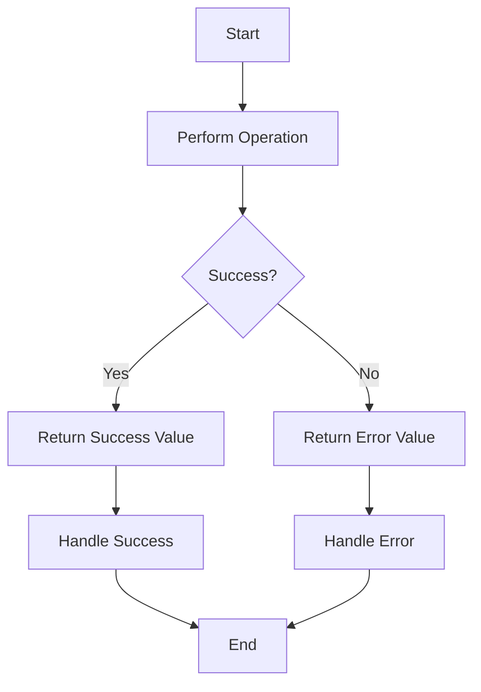

## 11.1 Functional Approaches to Error Handling

In functional programming, error handling is approached with a focus on maintaining the purity of functions and ensuring predictable behavior. This section will guide you through the principles of error handling in functional programming, specifically in Clojure, and how it contrasts with traditional Java error handling techniques.

### Error Handling Principles

Functional programming emphasizes the use of pure functions—functions that always produce the same output for the same input and have no side effects. This predictability is crucial for error handling, as it allows developers to reason about their code more effectively.

#### Returning vs. Throwing Errors

In Java, error handling often involves throwing exceptions, which can disrupt the flow of a program and lead to unpredictable behavior if not managed correctly. In contrast, functional programming encourages returning error values, allowing errors to be handled explicitly and predictably.

**Java Example:**

```java
public int divide(int numerator, int denominator) {
    if (denominator == 0) {
        throw new ArithmeticException("Division by zero");
    }
    return numerator / denominator;
}
```

**Clojure Example:**

```clojure
(defn divide [numerator denominator]
  (if (zero? denominator)
    {:error "Division by zero"}
    {:result (/ numerator denominator)}))
```

In the Clojure example, the function returns a map with either an `:error` or `:result` key, allowing the caller to handle the error explicitly.

### Either/Maybe Monads

Monads are a powerful concept in functional programming that can be used to handle errors gracefully. The `Either` and `Maybe` monads are particularly useful for error handling.

#### Either Monad

The `Either` monad represents a computation that can result in either a success (`Right`) or a failure (`Left`). This allows errors to be handled in a functional way without throwing exceptions.

**Clojure Example Using Either:**

```clojure
(require '[cats.monad.either :as either])

(defn safe-divide [numerator denominator]
  (if (zero? denominator)
    (either/left "Division by zero")
    (either/right (/ numerator denominator))))

(defn process-division [numerator denominator]
  (either/branch (safe-divide numerator denominator)
                 (fn [error] (println "Error:" error))
                 (fn [result] (println "Result:" result))))
```

In this example, `safe-divide` returns an `Either` monad, and `process-division` uses `either/branch` to handle the error or success case.

#### Maybe Monad

The `Maybe` monad is used to represent computations that might fail, returning `Nothing` in case of failure and `Just` in case of success.

**Clojure Example Using Maybe:**

```clojure
(require '[cats.monad.maybe :as maybe])

(defn safe-root [x]
  (if (neg? x)
    (maybe/nothing)
    (maybe/just (Math/sqrt x))))

(defn process-root [x]
  (maybe/maybe (safe-root x)
               (fn [result] (println "Square root:" result))
               (println "Cannot compute square root of a negative number")))
```

Here, `safe-root` returns a `Maybe` monad, and `process-root` handles the `Nothing` or `Just` case.

### Examples of Functional Error Handling

Let's explore some practical examples of how functional error handling can be implemented in Clojure.

#### Example 1: File Reading

Consider a function that reads a file and returns its contents. In a functional approach, we can return an error value if the file cannot be read.

**Clojure Example:**

```clojure
(defn read-file [filename]
  (try
    {:result (slurp filename)}
    (catch Exception e
      {:error (.getMessage e)})))

(defn process-file [filename]
  (let [{:keys [result error]} (read-file filename)]
    (if error
      (println "Error reading file:" error)
      (println "File contents:" result))))
```

In this example, `read-file` returns a map with either `:result` or `:error`, and `process-file` handles the error or success case.

#### Example 2: API Call

Suppose we have a function that makes an API call and returns the response. We can use the `Either` monad to handle potential errors.

**Clojure Example:**

```clojure
(require '[clj-http.client :as client])
(require '[cats.monad.either :as either])

(defn fetch-data [url]
  (try
    (either/right (client/get url))
    (catch Exception e
      (either/left (.getMessage e)))))

(defn process-api-call [url]
  (either/branch (fetch-data url)
                 (fn [error] (println "API call failed:" error))
                 (fn [response] (println "API response:" (:body response)))))
```

Here, `fetch-data` returns an `Either` monad, and `process-api-call` handles the error or success case.

### Visual Aids

To better understand the flow of data through monads, let's visualize the process using a flowchart.



**Figure 1:** Flowchart illustrating the use of monads for error handling.

### References and Links

- [Clojure Documentation](https://clojure.org/reference/documentation)
- [ClojureDocs](https://clojuredocs.org/)
- [Cats Library for Clojure](https://github.com/funcool/cats)

### Knowledge Check

- What is the primary difference between error handling in Java and Clojure?
- How do monads like `Either` and `Maybe` help in error handling?
- Can you modify the `safe-divide` function to handle division by zero differently?

### Exercises

1. Modify the `read-file` function to return a `Maybe` monad instead of a map.
2. Implement a function that uses the `Either` monad to handle errors in a database query.
3. Create a flowchart similar to Figure 1 for a different error handling scenario.

### Key Takeaways

- Functional programming emphasizes returning error values over throwing exceptions.
- Monads like `Either` and `Maybe` provide a structured way to handle errors.
- Clojure's functional approach to error handling leads to more predictable and maintainable code.

### Encouraging Tone

Now that we've explored functional approaches to error handling in Clojure, let's apply these concepts to build more robust and reliable applications. By embracing the principles of functional programming, we can create code that is not only easier to reason about but also more resilient to errors.

## Quiz: Mastering Functional Error Handling in Clojure



### What is a key principle of error handling in functional programming?

- [x] Maintaining function purity
- [ ] Using global exception handlers
- [ ] Relying on mutable state
- [ ] Ignoring errors

> **Explanation:** Functional programming emphasizes maintaining function purity, which involves predictable behavior and no side effects.

### How does the `Either` monad handle errors?

- [x] By representing computations as either success or failure
- [ ] By throwing exceptions
- [ ] By logging errors to a file
- [ ] By ignoring errors

> **Explanation:** The `Either` monad represents computations as either a success (`Right`) or a failure (`Left`), allowing errors to be handled functionally.

### What is the advantage of using the `Maybe` monad?

- [x] It represents computations that might fail without exceptions
- [ ] It automatically retries failed computations
- [ ] It logs errors to a database
- [ ] It requires less code

> **Explanation:** The `Maybe` monad represents computations that might fail, returning `Nothing` for failure and `Just` for success, without using exceptions.

### In Clojure, how can you handle a division by zero error functionally?

- [x] Return an error value in a map
- [ ] Throw an `ArithmeticException`
- [ ] Use a global error handler
- [ ] Ignore the error

> **Explanation:** In Clojure, you can handle a division by zero error by returning an error value in a map, allowing the caller to handle it explicitly.

### Which library provides monads like `Either` and `Maybe` in Clojure?

- [x] Cats
- [ ] Ring
- [ ] Compojure
- [ ] Leiningen

> **Explanation:** The Cats library provides monads like `Either` and `Maybe` for functional programming in Clojure.

### What is a benefit of returning error values instead of throwing exceptions?

- [x] It allows for more predictable error handling
- [ ] It reduces code readability
- [ ] It increases the complexity of error handling
- [ ] It requires more boilerplate code

> **Explanation:** Returning error values allows for more predictable error handling, as errors are handled explicitly rather than disrupting program flow.

### How can you visualize the flow of data through monads?

- [x] Using flowcharts
- [ ] Using pie charts
- [ ] Using bar graphs
- [ ] Using scatter plots

> **Explanation:** Flowcharts are effective for visualizing the flow of data through monads, illustrating success and failure paths.

### What is a common use case for the `Either` monad?

- [x] Handling API call errors
- [ ] Performing mathematical operations
- [ ] Logging messages
- [ ] Formatting strings

> **Explanation:** The `Either` monad is commonly used for handling errors in API calls, representing success or failure outcomes.

### How does functional error handling improve code maintainability?

- [x] By making error handling explicit and predictable
- [ ] By reducing the need for error handling
- [ ] By increasing code complexity
- [ ] By using global error handlers

> **Explanation:** Functional error handling improves code maintainability by making error handling explicit and predictable, allowing developers to reason about their code more effectively.

### True or False: Functional programming encourages throwing exceptions for error handling.

- [ ] True
- [x] False

> **Explanation:** Functional programming discourages throwing exceptions for error handling, instead favoring returning error values or using monads like `Either` and `Maybe`.


