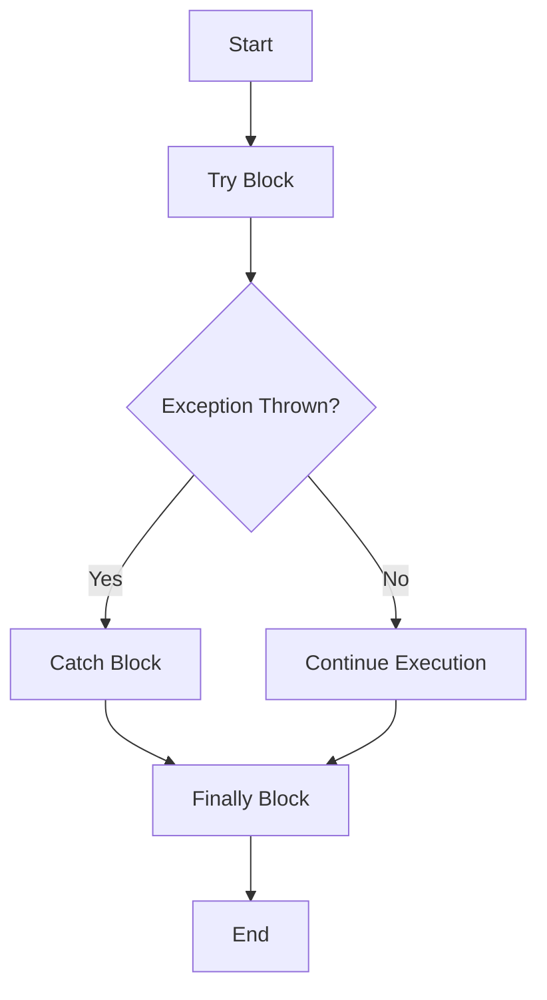

## 11.2 Exception Handling in Clojure

Exception handling is a crucial aspect of building robust applications, and Clojure offers a unique approach that aligns with its functional programming paradigm. In this section, we will explore how to effectively manage exceptions in Clojure, drawing parallels with Java to leverage your existing knowledge. We will cover throwing exceptions, catching them, creating custom exceptions, and best practices for error handling.

### Throwing Exceptions

In Clojure, exceptions are thrown using the `throw` function, which is similar to Java's `throw` statement. The `throw` function requires an instance of `java.lang.Throwable` or any of its subclasses. Here's a simple example:

```clojure
;; Throwing a standard exception in Clojure
(throw (Exception. "An error occurred"))
```

In Java, you might write:

```java
// Throwing a standard exception in Java
throw new Exception("An error occurred");
```

Both snippets achieve the same goal: they interrupt the normal flow of the program by throwing an exception. However, in Clojure, since we are working within a functional paradigm, we often prefer to handle errors in a way that minimizes side effects.

#### Try It Yourself

Try modifying the Clojure example to throw a different type of exception, such as `IllegalArgumentException`, and observe how it behaves.

### Catching Exceptions

Clojure uses the `try`, `catch`, and `finally` constructs to handle exceptions, similar to Java. Here's how you can catch exceptions in Clojure:

```clojure
;; Catching exceptions in Clojure
(try
  (throw (Exception. "An error occurred"))
  (catch Exception e
    (println "Caught exception:" (.getMessage e)))
  (finally
    (println "This will always execute")))
```

In Java, the equivalent code would look like this:

```java
// Catching exceptions in Java
try {
    throw new Exception("An error occurred");
} catch (Exception e) {
    System.out.println("Caught exception: " + e.getMessage());
} finally {
    System.out.println("This will always execute");
}
```

The `try` block contains the code that might throw an exception, the `catch` block handles the exception, and the `finally` block contains code that will always execute, regardless of whether an exception was thrown or not.

#### Key Points

- **Multiple Catch Blocks**: You can have multiple `catch` blocks to handle different types of exceptions.
- **Finally Block**: The `finally` block is optional and is used for cleanup activities.

### Custom Exceptions

Creating custom exceptions in Clojure involves defining a new class that extends `java.lang.Exception` or any of its subclasses. This is similar to how you would define custom exceptions in Java. Here's an example:

```clojure
;; Defining a custom exception in Clojure
(defrecord MyCustomException [message]
  Exception
  (getMessage [this] message))

;; Throwing the custom exception
(throw (->MyCustomException "Custom error occurred"))
```

In Java, you might define a custom exception like this:

```java
// Defining a custom exception in Java
public class MyCustomException extends Exception {
    public MyCustomException(String message) {
        super(message);
    }
}

// Throwing the custom exception
throw new MyCustomException("Custom error occurred");
```

#### Best Practices for Custom Exceptions

- **Use Descriptive Names**: Ensure your custom exceptions have meaningful names that convey the error context.
- **Include Relevant Information**: Pass additional information to the exception constructor if needed.

### Best Practices for Exception Handling

When deciding whether to use exceptions or other error handling strategies, consider the following best practices:

1. **Use Exceptions for Exceptional Conditions**: Exceptions should be reserved for truly exceptional conditions that are not part of the normal flow of the program.

2. **Prefer Pure Functions**: In functional programming, strive to write pure functions that do not throw exceptions. Instead, use return values to indicate success or failure.

3. **Leverage Clojure's Error Handling Constructs**: Use constructs like `either` or `maybe` monads to handle errors without exceptions, promoting a more functional style.

4. **Document Exception Handling**: Clearly document any exceptions that a function might throw, especially if they are part of the function's contract.

5. **Consider Performance Implications**: Throwing and catching exceptions can be costly in terms of performance. Use them judiciously.

6. **Integrate with Java**: When interoperating with Java code, be mindful of Java's exception handling mechanisms and ensure smooth integration.

### Visualizing Exception Handling

To better understand the flow of exception handling in Clojure, let's visualize it using a flowchart:



**Caption**: This flowchart illustrates the flow of control in a Clojure `try-catch-finally` construct.

### References and Links

- [Official Clojure Documentation](https://clojure.org/reference)
- [ClojureDocs](https://clojuredocs.org/)
- [Java Exception Handling](https://docs.oracle.com/javase/tutorial/essential/exceptions/)

### Knowledge Check

- What is the primary function used to throw exceptions in Clojure?
- How does the `finally` block differ from the `catch` block?
- What are some best practices for creating custom exceptions?

### Exercises

1. **Exercise 1**: Modify the provided Clojure code to handle multiple types of exceptions using multiple `catch` blocks.

2. **Exercise 2**: Create a custom exception that includes additional data, such as an error code, and demonstrate how to throw and catch it.

3. **Exercise 3**: Refactor a Java method that uses exceptions into a Clojure function that uses a more functional approach to error handling.

### Summary

In this section, we've explored how to handle exceptions in Clojure, drawing parallels with Java to ease the transition for experienced Java developers. We've covered throwing and catching exceptions, creating custom exceptions, and best practices for effective error management. By understanding these concepts, you can build more robust and resilient Clojure applications.

## Quiz: Mastering Exception Handling in Clojure



### What function is used to throw exceptions in Clojure?

- [x] throw
- [ ] catch
- [ ] try
- [ ] finally

> **Explanation:** The `throw` function is used to throw exceptions in Clojure, similar to Java's `throw` statement.

### Which block is used to handle exceptions in Clojure?

- [ ] throw
- [x] catch
- [ ] try
- [ ] finally

> **Explanation:** The `catch` block is used to handle exceptions that occur within the `try` block.

### What is the purpose of the `finally` block?

- [x] To execute code regardless of whether an exception was thrown
- [ ] To catch exceptions
- [ ] To throw exceptions
- [ ] To define custom exceptions

> **Explanation:** The `finally` block is used to execute code that should run regardless of whether an exception was thrown or not.

### How do you define a custom exception in Clojure?

- [x] By creating a new record that implements the `Exception` interface
- [ ] By using the `throw` function
- [ ] By using the `catch` block
- [ ] By using the `finally` block

> **Explanation:** Custom exceptions in Clojure can be defined by creating a new record that implements the `Exception` interface.

### When should exceptions be used in functional programming?

- [x] For truly exceptional conditions
- [ ] For normal control flow
- [ ] For handling all errors
- [ ] For logging purposes

> **Explanation:** Exceptions should be reserved for truly exceptional conditions that are not part of the normal control flow.

### What is a best practice for documenting exceptions?

- [x] Clearly document any exceptions that a function might throw
- [ ] Avoid documenting exceptions
- [ ] Document only runtime exceptions
- [ ] Use comments sparingly

> **Explanation:** It is a best practice to clearly document any exceptions that a function might throw, especially if they are part of the function's contract.

### How can performance be affected by exceptions?

- [x] Throwing and catching exceptions can be costly
- [ ] Exceptions improve performance
- [ ] Exceptions have no impact on performance
- [ ] Exceptions always slow down the program

> **Explanation:** Throwing and catching exceptions can be costly in terms of performance, so they should be used judiciously.

### What is an alternative to exceptions in functional programming?

- [x] Using constructs like `either` or `maybe` monads
- [ ] Using more exceptions
- [ ] Ignoring errors
- [ ] Using only `finally` blocks

> **Explanation:** In functional programming, constructs like `either` or `maybe` monads can be used to handle errors without exceptions.

### True or False: The `finally` block is optional in Clojure's exception handling.

- [x] True
- [ ] False

> **Explanation:** The `finally` block is optional in Clojure's exception handling and is used for cleanup activities.

### True or False: Clojure's exception handling is identical to Java's.

- [ ] True
- [x] False

> **Explanation:** While Clojure's exception handling is similar to Java's, it is not identical. Clojure's functional paradigm often encourages different error handling strategies.


