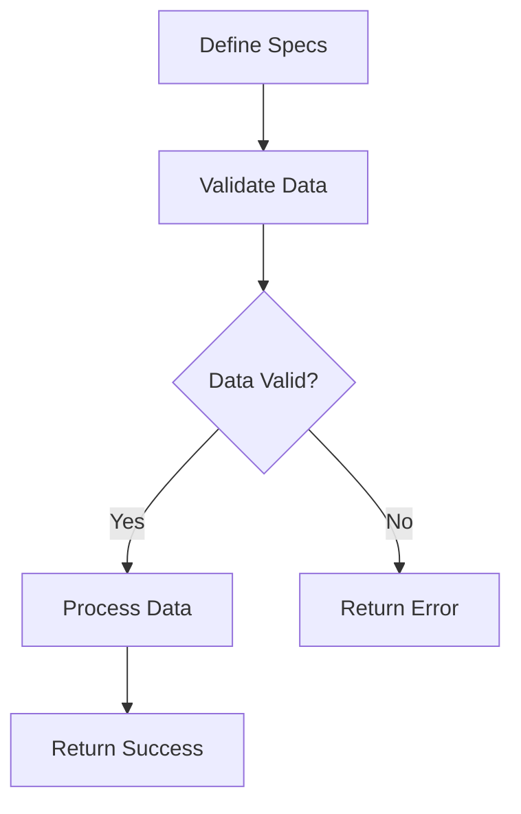

## 11.3 Using `clojure.spec` for Data Validation

In the world of software development, ensuring data integrity is paramount. As experienced Java developers, you are likely familiar with Java's type system and validation frameworks like Hibernate Validator. In Clojure, `clojure.spec` offers a powerful and flexible way to specify the structure of data and functions, providing robust data validation capabilities. In this section, we will explore how to leverage `clojure.spec` to validate data, ensuring your applications are both reliable and maintainable.

### Introduction to `clojure.spec`

`clojure.spec` is a library that allows you to describe the shape of your data and functions. It provides a way to define specifications (specs) for data structures, validate data against these specs, and instrument functions to automatically check their arguments. This approach not only helps in catching errors early but also serves as documentation for the expected data structures and function contracts.

#### Key Features of `clojure.spec`

- **Declarative Data Specifications**: Define the expected structure of data using a concise and expressive syntax.
- **Validation and Conformance**: Validate data against specs and transform data to conform to the specified structure.
- **Function Instrumentation**: Automatically check function arguments against their specs, ensuring they meet the expected criteria.
- **Generative Testing**: Use specs to generate test data, enhancing the robustness of your test suite.

### Writing Specs

To begin using `clojure.spec`, you need to define specs for your data structures. Specs are defined using the `s/def` function, which associates a spec with a keyword.

#### Defining Basic Specs

Let's start by defining a simple spec for a username, which should be a non-empty string.

```clojure
(require '[clojure.spec.alpha :as s])

(s/def ::username (s/and string? not-empty))
```

In this example, `::username` is a namespaced keyword, and the spec ensures that the value is a string and not empty.

#### Specifying Data Structures

For more complex data structures, such as maps, you can use `s/keys` to specify the required and optional keys.

```clojure
(s/def ::user
  (s/keys :req [::username]
          :opt [::email ::age]))
```

Here, we define a `::user` spec that requires a `::username` and optionally includes `::email` and `::age`.

#### Nested Data Structures

Specs can be nested to describe complex data structures. For instance, if a user has an address, you can define a spec for the address and include it in the user spec.

```clojure
(s/def ::street string?)
(s/def ::city string?)
(s/def ::address
  (s/keys :req [::street ::city]))

(s/def ::user
  (s/keys :req [::username ::address]
          :opt [::email ::age]))
```

### Validating Data

Once you have defined your specs, you can validate data against them using `s/valid?` and `s/conform`.

#### Using `s/valid?`

The `s/valid?` function checks if a piece of data conforms to a spec, returning `true` or `false`.

```clojure
(def user-data {:username "jdoe" :address {:street "123 Elm St" :city "Springfield"}})

(s/valid? ::user user-data)
;; => true
```

If the data does not conform, `s/valid?` returns `false`.

```clojure
(def invalid-user-data {:username "" :address {:street "123 Elm St" :city "Springfield"}})

(s/valid? ::user invalid-user-data)
;; => false
```

#### Using `s/conform`

The `s/conform` function not only checks if data conforms to a spec but also returns a conformed version of the data. If the data does not conform, it returns `:clojure.spec.alpha/invalid`.

```clojure
(s/conform ::user user-data)
;; => {:username "jdoe", :address {:street "123 Elm St", :city "Springfield"}}

(s/conform ::user invalid-user-data)
;; => :clojure.spec.alpha/invalid
```

### Instrumenting Functions

Function instrumentation is a powerful feature of `clojure.spec` that allows you to automatically validate function arguments against their specs. This ensures that functions are called with the correct types and structures of data.

#### Defining Function Specs

To instrument a function, you need to define specs for its arguments and return value using `s/fdef`.

```clojure
(s/fdef greet
  :args (s/cat :username ::username)
  :ret string?)

(defn greet [username]
  (str "Hello, " username "!"))
```

#### Enabling Instrumentation

To enable instrumentation, use the `stest/instrument` function from the `clojure.spec.test.alpha` namespace.

```clojure
(require '[clojure.spec.test.alpha :as stest])

(stest/instrument `greet)
```

With instrumentation enabled, calling `greet` with an invalid argument will result in an error.

```clojure
(greet "")
;; Throws an error because the username is not valid
```

### Practical Example: Validating User Data

Let's put everything together in a practical example. Suppose we have a function that registers a user, and we want to ensure that the user data is valid.

```clojure
(s/def ::email (s/and string? #(re-matches #".+@.+\..+" %)))
(s/def ::age (s/and int? #(>= % 18)))

(s/fdef register-user
  :args (s/cat :user ::user)
  :ret string?)

(defn register-user [user]
  (str "User " (::username user) " registered successfully."))

(stest/instrument `register-user)

(def valid-user {:username "jdoe"
                 :email "jdoe@example.com"
                 :age 30
                 :address {:street "123 Elm St" :city "Springfield"}})

(register-user valid-user)
;; => "User jdoe registered successfully."

(def invalid-user {:username ""
                   :email "invalid-email"
                   :age 17
                   :address {:street "123 Elm St" :city "Springfield"}})

(register-user invalid-user)
;; Throws an error due to invalid user data
```

### Visualizing Data Validation Flow

To better understand how data flows through the validation process, let's visualize it using a flowchart.



**Figure 1**: Flowchart illustrating the data validation process using `clojure.spec`.

### References and Further Reading

- [Official Clojure Spec Guide](https://clojure.org/guides/spec)
- [ClojureDocs: Spec](https://clojuredocs.org/clojure.spec.alpha)
- [Clojure Spec GitHub Repository](https://github.com/clojure/spec.alpha)

### Knowledge Check

Let's reinforce what we've learned with some practice questions.

## Clojure Spec Data Validation Quiz



### What is the primary purpose of `clojure.spec`?

- [x] To specify and validate the structure of data and functions
- [ ] To compile Clojure code into Java bytecode
- [ ] To manage dependencies in Clojure projects
- [ ] To provide a GUI framework for Clojure applications

> **Explanation:** `clojure.spec` is used to specify and validate the structure of data and functions, ensuring data integrity.

### How do you define a spec for a map with required and optional keys?

- [x] Using `s/keys` with `:req` and `:opt`
- [ ] Using `s/map` with `:required` and `:optional`
- [ ] Using `s/def` with `:mandatory` and `:optional`
- [ ] Using `s/struct` with `:req` and `:opt`

> **Explanation:** `s/keys` is used to define specs for maps, specifying required keys with `:req` and optional keys with `:opt`.

### Which function checks if data conforms to a spec and returns a conformed version?

- [x] `s/conform`
- [ ] `s/valid?`
- [ ] `s/check`
- [ ] `s/assert`

> **Explanation:** `s/conform` checks if data conforms to a spec and returns a conformed version or `:clojure.spec.alpha/invalid`.

### What does `stest/instrument` do?

- [x] Enables function instrumentation to validate arguments
- [ ] Compiles Clojure code into Java bytecode
- [ ] Generates random data for testing
- [ ] Logs function calls for debugging

> **Explanation:** `stest/instrument` enables function instrumentation, automatically validating function arguments against their specs.

### How can you specify that a username must be a non-empty string?

- [x] `(s/and string? not-empty)`
- [ ] `(s/or string? not-empty)`
- [ ] `(s/def string? not-empty)`
- [ ] `(s/keys :req [string? not-empty])`

> **Explanation:** `(s/and string? not-empty)` ensures that a username is both a string and not empty.

### What happens if data does not conform to a spec when using `s/conform`?

- [x] It returns `:clojure.spec.alpha/invalid`
- [ ] It throws an exception
- [ ] It returns `nil`
- [ ] It logs a warning

> **Explanation:** If data does not conform to a spec, `s/conform` returns `:clojure.spec.alpha/invalid`.

### Which function is used to define a spec for a keyword?

- [x] `s/def`
- [ ] `s/spec`
- [ ] `s/define`
- [ ] `s/create`

> **Explanation:** `s/def` is used to associate a spec with a keyword.

### What is a benefit of using `clojure.spec` for data validation?

- [x] It provides declarative data specifications and automatic validation
- [ ] It reduces the need for unit testing
- [ ] It compiles Clojure code faster
- [ ] It simplifies GUI development

> **Explanation:** `clojure.spec` provides declarative data specifications and automatic validation, enhancing data integrity.

### Which of the following is NOT a feature of `clojure.spec`?

- [ ] Declarative data specifications
- [ ] Function instrumentation
- [ ] Generative testing
- [x] GUI framework

> **Explanation:** `clojure.spec` does not provide a GUI framework; it focuses on data specifications and validation.

### True or False: `clojure.spec` can be used to generate test data.

- [x] True
- [ ] False

> **Explanation:** `clojure.spec` can be used for generative testing, creating test data based on specs.



By mastering `clojure.spec`, you can ensure that your Clojure applications handle data consistently and reliably, reducing bugs and improving maintainability. Now that we've explored `clojure.spec` for data validation, let's continue to build on these concepts to design resilient and robust functions in your applications.
