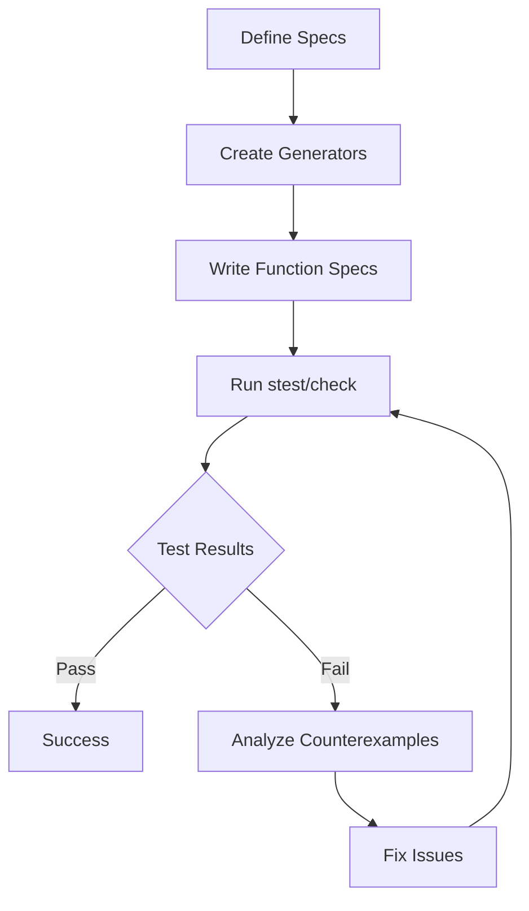

## 11.4 Generative Testing with `clojure.spec`

As experienced Java developers transitioning to Clojure, you are likely familiar with the importance of testing in software development. In Java, you might have used JUnit or TestNG for unit testing, focusing on specific inputs and expected outputs. However, Clojure offers a powerful alternative through **generative testing** with `clojure.spec`, which allows you to test properties of your code over a wide range of automatically generated inputs. This approach can uncover edge cases and bugs that traditional unit tests might miss.

### Property-Based Testing

**Property-based testing** is a testing methodology where you define properties or invariants that your code should satisfy, and then automatically generate a wide range of inputs to test these properties. This is in contrast to example-based testing, where you manually specify individual test cases.

In Clojure, `clojure.spec` provides a robust framework for property-based testing. It allows you to define specifications (specs) for your data and functions, and then use these specs to generate test data. This approach not only helps in validating the correctness of your code but also ensures that your functions handle a variety of inputs gracefully.

#### Key Concepts of Property-Based Testing

1. **Properties**: Define the expected behavior of your functions. For example, a sorting function should return a list where each element is less than or equal to the next.

2. **Generators**: Automatically create a wide range of inputs to test the properties. Generators can produce random data that conforms to your specs.

3. **Counterexamples**: When a property fails, the testing framework provides a counterexample that demonstrates the failure, helping you identify and fix the issue.

### Writing Generators

To leverage generative testing in Clojure, you need to create generators for your specs. Generators are responsible for producing random data that adheres to the specifications you've defined. Let's explore how to create custom generators using `clojure.spec`.

#### Creating a Basic Spec

First, let's define a simple spec for a positive integer:

```clojure
(require '[clojure.spec.alpha :as s])

(s/def ::positive-int (s/and int? pos?))
```

This spec ensures that a value is both an integer and positive. Now, let's create a generator for this spec.

#### Custom Generators

Clojure provides the `clojure.spec.gen.alpha` namespace, which includes functions for creating generators. You can use `s/gen` to create a generator for a spec:

```clojure
(require '[clojure.spec.gen.alpha :as gen])

(def positive-int-gen (s/gen ::positive-int))
```

You can also create custom generators using `gen/fmap`, `gen/return`, and other combinators:

```clojure
(def custom-positive-int-gen
  (gen/fmap #(Math/abs %) (s/gen int?)))
```

In this example, `gen/fmap` is used to transform generated integers into positive integers by applying `Math/abs`.

### Using `stest`

Once you have defined your specs and generators, you can use `clojure.spec.test.alpha` (often aliased as `stest`) to perform generative testing on your functions. The `stest/check` function is particularly useful for this purpose.

#### Example: Testing a Function

Let's say we have a function `add-positive-ints` that adds two positive integers:

```clojure
(defn add-positive-ints [a b]
  (+ a b))
```

We can define a spec for this function and use `stest/check` to test it:

```clojure
(s/fdef add-positive-ints
  :args (s/cat :a ::positive-int :b ::positive-int)
  :ret ::positive-int)

(require '[clojure.spec.test.alpha :as stest])

(stest/check `add-positive-ints)
```

The `s/fdef` macro is used to define a function spec, specifying the argument and return types. The `stest/check` function then tests the function against its spec, generating random inputs to verify that the function behaves as expected.

### Interpreting Results

When you run `stest/check`, it will output the results of the tests, including any failures. If a test fails, `stest` provides a counterexample that caused the failure, allowing you to debug and fix the issue.

#### Analyzing Failures

Consider a scenario where `add-positive-ints` fails for some inputs. The output might look like this:

```
{:spec #object[clojure.spec.alpha$fspec_impl$reify__2438 0x1b6e7b1 "clojure.spec.alpha$fspec_impl$reify__2438@1b6e7b1"],
 :clojure.spec.test.check/ret {:result false,
                               :seed 123456789,
                               :failing-size 0,
                               :num-tests 1000,
                               :fail [[-1 2]],
                               :shrunk {:total-nodes-visited 2,
                                        :depth 1,
                                        :result false,
                                        :smallest [[-1 2]]}},
 :sym user/add-positive-ints}
```

The `:fail` key shows the inputs `[-1 2]` that caused the failure. This indicates that the function does not handle negative inputs correctly, which violates the spec.

### Try It Yourself

To deepen your understanding, try modifying the `add-positive-ints` function to handle negative inputs gracefully. You can also experiment with creating more complex specs and generators for other functions in your codebase.

### Visualizing Generative Testing

To better understand the flow of generative testing, let's visualize the process using a flowchart:



**Caption**: This flowchart illustrates the process of generative testing with `clojure.spec`, from defining specs to analyzing test results.

### References and Links

For further reading and deeper insights into `clojure.spec` and generative testing, consider exploring the following resources:

- [Official Clojure Documentation on `clojure.spec`](https://clojure.org/guides/spec)
- [ClojureDocs: `clojure.spec`](https://clojuredocs.org/clojure.spec.alpha)
- [GitHub Repository: clojure/spec.alpha](https://github.com/clojure/spec.alpha)

### Knowledge Check

Let's reinforce your understanding of generative testing with a few questions and exercises:

1. **What is the primary advantage of property-based testing over example-based testing?**

2. **Create a spec for a function that multiplies two integers and returns a positive integer.**

3. **Modify the `add-positive-ints` function to handle negative inputs and update its spec accordingly.**

4. **Experiment with `gen/sample` to see the kinds of data your generators produce.**

5. **Discuss how generative testing can improve the robustness of your Clojure applications.**

### Summary

In this section, we've explored the powerful concept of generative testing with `clojure.spec`. By defining properties and using generators, you can ensure that your Clojure functions handle a wide range of inputs correctly. This approach not only enhances the reliability of your applications but also uncovers edge cases that traditional testing might miss. As you continue to master Clojure, consider integrating generative testing into your development workflow to build more robust and scalable applications.

## Quiz: Mastering Generative Testing with `clojure.spec`



### What is the main benefit of property-based testing?

- [x] It tests properties over a wide range of inputs.
- [ ] It only tests specific, predefined inputs.
- [ ] It requires less code than example-based testing.
- [ ] It is faster than example-based testing.

> **Explanation:** Property-based testing automatically generates a wide range of inputs to test properties, uncovering edge cases that example-based testing might miss.

### How do you create a generator for a spec in Clojure?

- [x] Use `s/gen` to create a generator.
- [ ] Use `s/def` to create a generator.
- [ ] Use `gen/sample` to create a generator.
- [ ] Use `stest/check` to create a generator.

> **Explanation:** `s/gen` is used to create a generator for a spec, which can then be used to produce random data for testing.

### What does `stest/check` do?

- [x] It performs generative testing on a function.
- [ ] It defines a spec for a function.
- [ ] It creates a generator for a spec.
- [ ] It runs unit tests on a function.

> **Explanation:** `stest/check` is used to perform generative testing on a function, verifying that it adheres to its spec.

### What is a counterexample in generative testing?

- [x] An input that causes a property to fail.
- [ ] A successful test case.
- [ ] A predefined test input.
- [ ] A type of generator.

> **Explanation:** A counterexample is an input that causes a property to fail, helping developers identify and fix issues.

### Which function is used to transform generated data in a custom generator?

- [x] `gen/fmap`
- [ ] `gen/return`
- [ ] `s/def`
- [ ] `stest/check`

> **Explanation:** `gen/fmap` is used to transform generated data, allowing for custom data generation.

### What is the purpose of `s/fdef`?

- [x] To define a function spec.
- [ ] To create a generator.
- [ ] To run tests.
- [ ] To define a data spec.

> **Explanation:** `s/fdef` is used to define a function spec, specifying the argument and return types for generative testing.

### How can you visualize the flow of generative testing?

- [x] Using a flowchart.
- [ ] Using a pie chart.
- [ ] Using a bar graph.
- [ ] Using a line graph.

> **Explanation:** A flowchart can effectively visualize the process of generative testing, from defining specs to analyzing results.

### What is the role of `gen/sample`?

- [x] To see the kinds of data a generator produces.
- [ ] To create a generator.
- [ ] To define a spec.
- [ ] To run tests.

> **Explanation:** `gen/sample` is used to sample data from a generator, allowing developers to see the kinds of data it produces.

### How does generative testing improve application robustness?

- [x] By uncovering edge cases and ensuring functions handle a wide range of inputs.
- [ ] By reducing the number of tests needed.
- [ ] By focusing on specific, predefined inputs.
- [ ] By simplifying the testing process.

> **Explanation:** Generative testing improves robustness by uncovering edge cases and ensuring functions handle a wide range of inputs.

### True or False: Generative testing can replace all other forms of testing.

- [ ] True
- [x] False

> **Explanation:** While generative testing is powerful, it complements rather than replaces other forms of testing, such as unit and integration tests.


