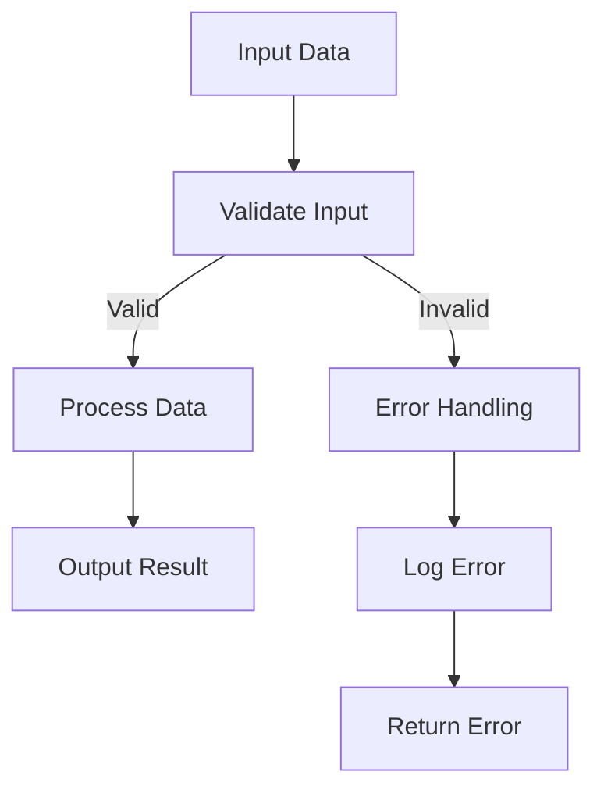

## 11.5 Designing Resilient and Robust Functions

In the realm of functional programming, designing resilient and robust functions is crucial for building scalable and maintainable applications. As experienced Java developers transitioning to Clojure, understanding how to leverage Clojure's functional paradigms to create robust functions will enhance your ability to handle errors gracefully and ensure your applications are reliable. In this section, we will explore defensive programming, input validation, the role of pure functions, and strategies for error propagation.

### Defensive Programming

Defensive programming is a practice that involves writing code that anticipates and handles potential errors or unexpected inputs. In Clojure, this approach is particularly effective due to the language's emphasis on immutability and pure functions.

#### Input Validation

Input validation is the first line of defense in defensive programming. By validating inputs at the boundaries of your system, you can prevent invalid data from propagating through your application. In Clojure, you can use `clojure.spec` to define specifications for your data and functions.

```clojure
(require '[clojure.spec.alpha :as s])

;; Define a spec for a positive integer
(s/def ::positive-int (s/and int? pos?))

;; Function that validates input using the spec
(defn process-number [n]
  (if (s/valid? ::positive-int n)
    (str "Processing number: " n)
    (throw (ex-info "Invalid input" {:number n}))))
```

In this example, we define a specification for a positive integer and use it to validate the input to the `process-number` function. If the input is invalid, an exception is thrown with a descriptive message.

#### Pure Functions

Pure functions are functions that always produce the same output for the same input and have no side effects. They are a cornerstone of functional programming and make error handling simpler and more predictable.

**Benefits of Pure Functions:**

- **Predictability**: Since pure functions do not rely on external state, their behavior is consistent and predictable.
- **Testability**: Pure functions are easier to test because they do not depend on or alter external state.
- **Composability**: Pure functions can be easily composed to build more complex functionality.

```clojure
;; Pure function example
(defn add [a b]
  (+ a b))

;; Composing pure functions
(defn add-and-double [a b]
  (* 2 (add a b)))
```

By designing your functions to be pure, you can reduce the complexity of error handling and improve the reliability of your code.

#### Error Propagation

Error propagation involves passing errors up the call stack in a way that preserves the original context and cause. In Clojure, you can use exceptions or return values to propagate errors.

**Using Exceptions:**

Exceptions can be used to signal errors that cannot be handled locally. Clojure's `ex-info` function allows you to create exceptions with additional context.

```clojure
(defn divide [numerator denominator]
  (if (zero? denominator)
    (throw (ex-info "Division by zero" {:numerator numerator :denominator denominator}))
    (/ numerator denominator)))
```

In this example, an exception is thrown if the denominator is zero, providing context about the error.

**Using Return Values:**

Alternatively, you can use return values to indicate success or failure. This approach is common in functional programming and can be implemented using `Either` or `Result` types.

```clojure
(defn safe-divide [numerator denominator]
  (if (zero? denominator)
    {:error "Division by zero"}
    {:result (/ numerator denominator)}))

;; Handling the result
(let [{:keys [result error]} (safe-divide 10 0)]
  (if error
    (println "Error:" error)
    (println "Result:" result)))
```

By using return values, you can handle errors in a functional style without relying on exceptions.

### Designing Resilient Functions

To design resilient functions, consider the following best practices:

1. **Validate Inputs**: Always validate inputs at the boundaries of your system to prevent invalid data from entering your application.

2. **Use Pure Functions**: Design your functions to be pure whenever possible to simplify error handling and improve testability.

3. **Propagate Errors Effectively**: Choose an error propagation strategy that fits your application's needs, whether it's using exceptions or return values.

4. **Document Error Handling**: Clearly document how your functions handle errors, including any exceptions they may throw or error values they may return.

5. **Test Error Scenarios**: Write tests that cover both expected and unexpected inputs to ensure your functions handle errors gracefully.

### Code Examples and Comparisons

Let's compare how error handling differs between Java and Clojure.

**Java Example:**

```java
public class Calculator {
    public static int divide(int numerator, int denominator) throws ArithmeticException {
        if (denominator == 0) {
            throw new ArithmeticException("Division by zero");
        }
        return numerator / denominator;
    }
}
```

**Clojure Equivalent:**

```clojure
(defn divide [numerator denominator]
  (if (zero? denominator)
    (throw (ex-info "Division by zero" {:numerator numerator :denominator denominator}))
    (/ numerator denominator)))
```

In both examples, an exception is thrown for division by zero. However, Clojure's `ex-info` provides a way to include additional context with the exception.

### Visualizing Error Propagation

To better understand error propagation, let's visualize the flow of data and errors through a series of functions.



**Diagram Description:**

- **Input Data**: The initial data entering the system.
- **Validate Input**: The step where input validation occurs.
- **Process Data**: The main processing logic of the application.
- **Error Handling**: The step where errors are handled if validation fails.
- **Output Result**: The successful output of the process.
- **Log Error**: Logging the error for further analysis.
- **Return Error**: Returning the error to the caller.

### Knowledge Check

To reinforce your understanding, consider the following questions:

- How can input validation prevent errors from propagating through your application?
- What are the benefits of using pure functions in error handling?
- How does Clojure's `ex-info` function enhance exception handling?
- What are the advantages of using return values for error propagation?

### Exercises

1. **Implement Input Validation**: Write a Clojure function that validates a map containing user information (e.g., name, age, email) and throws an exception if any field is invalid.

2. **Refactor to Pure Functions**: Take an existing Java method with side effects and refactor it into a pure Clojure function.

3. **Error Propagation Strategy**: Implement a Clojure function that uses return values to indicate success or failure and demonstrate how to handle the result.

### Conclusion

Designing resilient and robust functions in Clojure involves a combination of defensive programming, input validation, pure functions, and effective error propagation. By following these principles, you can build applications that are not only reliable but also easier to maintain and extend. As you continue to explore Clojure, remember to leverage the language's strengths to create functions that handle errors gracefully and contribute to the overall robustness of your application.

---

## Quiz: Mastering Resilient and Robust Functions in Clojure



### What is the primary purpose of input validation in Clojure?

- [x] To prevent invalid data from entering the system
- [ ] To improve the performance of the application
- [ ] To reduce the size of the codebase
- [ ] To enhance the user interface

> **Explanation:** Input validation ensures that only valid data enters the system, preventing errors from propagating.

### How do pure functions simplify error handling?

- [x] They have no side effects and always produce the same output for the same input
- [ ] They rely on external state to manage errors
- [ ] They use exceptions to handle errors
- [ ] They require complex error handling logic

> **Explanation:** Pure functions are predictable and do not rely on external state, making error handling simpler.

### What is the advantage of using `ex-info` in Clojure?

- [x] It allows adding context to exceptions
- [ ] It automatically logs errors
- [ ] It prevents exceptions from being thrown
- [ ] It simplifies function composition

> **Explanation:** `ex-info` provides a way to include additional context with exceptions, aiding in debugging.

### Which of the following is a benefit of using return values for error propagation?

- [x] It allows handling errors in a functional style
- [ ] It requires less code than using exceptions
- [ ] It automatically retries failed operations
- [ ] It eliminates the need for input validation

> **Explanation:** Using return values aligns with functional programming principles and allows handling errors without exceptions.

### What is a key characteristic of defensive programming?

- [x] Anticipating and handling potential errors
- [ ] Writing code that is difficult to understand
- [ ] Ignoring unexpected inputs
- [ ] Relying on external libraries for error handling

> **Explanation:** Defensive programming involves writing code that anticipates and handles potential errors.

### How can you ensure a function is pure?

- [x] By avoiding side effects and ensuring consistent output for the same input
- [ ] By using global variables
- [ ] By relying on external state
- [ ] By using exceptions for error handling

> **Explanation:** Pure functions avoid side effects and produce consistent output, making them predictable.

### What is a common strategy for error propagation in Clojure?

- [x] Using exceptions or return values
- [ ] Ignoring errors
- [ ] Logging errors without handling them
- [ ] Using global variables to track errors

> **Explanation:** Clojure supports error propagation through exceptions or return values, allowing flexible error handling.

### Why is it important to document error handling in functions?

- [x] To provide clarity on how errors are managed
- [ ] To increase the size of the documentation
- [ ] To make the code more complex
- [ ] To discourage code reuse

> **Explanation:** Documenting error handling provides clarity and helps developers understand how errors are managed.

### What is the role of `clojure.spec` in input validation?

- [x] To define specifications for data and functions
- [ ] To automatically fix invalid data
- [ ] To generate random data
- [ ] To replace unit tests

> **Explanation:** `clojure.spec` is used to define specifications for data and functions, aiding in input validation.

### True or False: Pure functions can have side effects.

- [ ] True
- [x] False

> **Explanation:** Pure functions do not have side effects; they always produce the same output for the same input.



By mastering these concepts, you'll be well-equipped to design resilient and robust functions in Clojure, enhancing the reliability and maintainability of your applications.
